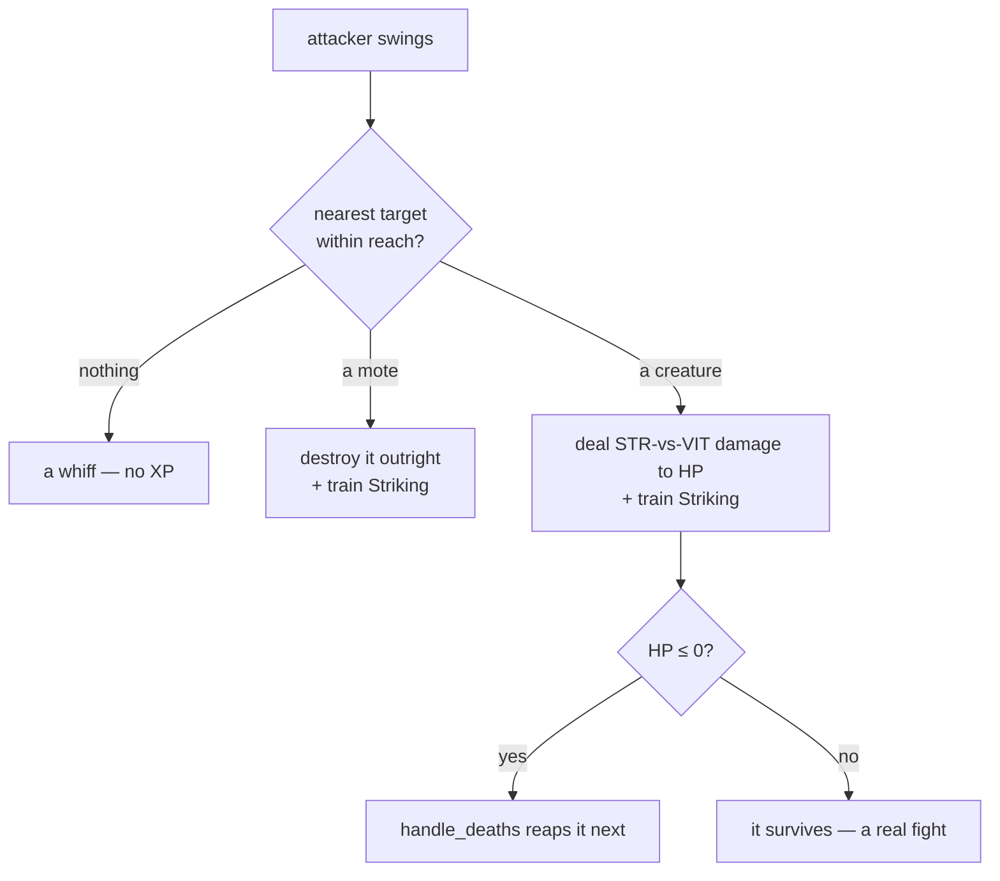

# Combat: fights that reward you

## What it is

The demo grew a real combat loop on top of the [progression](progression.md) system:
**hostile creatures hunt you, you strike back, and winning sustains you.** One shared
resolver decides every swing, damage is a *Strength-vs-VIT* contest, and a kill drops
loot. It's the concrete first slice of the master plan's combat — the same
`activity → skill → attribute → effect` shape, now with a target that fights back.

The moving parts, in one place:

| Piece | What it does |
|---|---|
| **`perform_attack`** | resolves one swing — find nearest target in reach, deal damage, train Striking |
| **`Enemy` creature** | HP + VIT + a swing cooldown; chases and hits the player |
| **`chase_prey`** | steers creatures toward the nearest person, player or NPC (the hostile mirror of `steer_npcs`) |
| **`resolve_creature_contacts`** | a creature's contact blow, softened by your VIT — or dodged by your DEX |
| **`dodge_chance`** | a DEX-driven roll to slip a blow entirely (trains Evasion) |
| **the spawner** | keeps creatures coming, so the fight never runs dry |
| **`Pickup`** | a health orb a slain creature drops — loot that keeps you fighting |
| **`handle_deaths`** | permadeath for creatures/NPCs, respawn for the player |

## Why it matters

Combat is where Strength stops being a number and starts *mattering*: a stronger swing
kills faster, a tougher character shrugs off blows. It closes the loop — you fight to
grow, and growing makes you fight better — and it gives the world stakes. It's also the
seam the fuller design plugs into: today's `perform_attack` is the ancestor of the
multi-aspect action resolver, and today's `Pickup` is the simplest `Item`.

## How it works

### The attack resolver — `perform_attack`

One function resolves *every* swing, whoever throws it — the player's `Attack` command
(`J`) and the `npc_attack` system both call it, so a player and an NPC hit identically.



- **Reach** grows with Strength: `45 + (Strength − 1)·6` world units.
- **Target** is the nearest *attackable* thing in reach — a `Hazard` mote **or** a
  hostile `Enemy`. A mote is fragile (one hit); a creature has HP and takes several.
- Any **connecting** swing trains **Striking → Strength**, whatever it hits.

### The damage contest — Strength vs VIT

A hit against a creature isn't flat — it's a contest between the attacker's **Strength**
(how hard) and the target's **VIT** (how tough), through **ratio mitigation**:

```text
dealt = max( raw² / (raw + def),  0.1 × raw )
  raw = 12 + (Strength − 1)·4     def = (Endurance − 1)·3
```

!!! info "Softens forever, never negates"
    Defence makes each hit smaller but a **10% chip always lands** — so a tank is very
    hard to kill but never *un*-killable, and more Strength always helps. `def = 0`
    gives `raw²/raw = raw` (full damage). This is the master plan's mitigation formula
    in miniature; the same shape will carry magical (INT-vs-WIS) damage later.

### The enemy — a creature that fights back

An `Enemy` is a real fight, not a throwaway mote. Two archetypes (from `make_creature`)
give waves texture:

| Kind | HP | Chase speed | Hit | Feel |
|---|---|---|---|---|
| **Brute** (red) | 40 | 70 | 15 | slow, tanky, hits hard — wear it down, kite it |
| **Swarmer** (orange) | 15 | 130 | 8 | fast, fragile (~one strike), weak — but corners you in numbers |

- **HP** (a `Stats` component) that strikes whittle down; **no regen**, so you can wear
  it down. **VIT** (an `Attributes` component) softens the blows it takes.
- **`chase_prey`** homes its velocity on the **nearest person** each tick — the player
  *or* an NPC — at the creature's own `chase_speed`, so a swarmer runs you down while a
  brute lumbers.
- **`resolve_creature_contacts`** — on a cooldown (~0.8 s), a creature in contact deals
  its `attack_damage` to whoever it caught, *softened by that victim's VIT* (same
  `mitigate`), and trains their Toughness (via `train_on_damage`). Unlike a mote it is
  **not consumed** — it keeps swinging.
- Motes are excluded from creatures (`entt::exclude<Enemy>` in `resolve_contacts`), so
  ambient hazards can't cheaply kill one and bypass its VIT.

!!! note "A real two-sided fight"
    Because `npc_attack` runs the shared `perform_attack`, any creature in an NPC's
    reach gets struck — free *allied* behaviour (opportunistic, not active hunting). And
    because `chase_prey` / `resolve_creature_contacts` treat every person as prey,
    creatures hunt and hurt NPCs too. So the two actually **war**: NPCs and creatures
    skirmish across the field, and an NPC caught in the open can be run down and killed
    for good (permadeath), not just the player. Same machinery for both — that's the
    player == NPC parity guardrail.

### Slipping the blow — Evasion (Dexterity)

VIT softens a hit; **DEX skips it entirely.** Before a creature's blow lands,
`resolve_creature_contacts` rolls a dodge from the player's third attribute,
**Dexterity**: `dodge = min((DEX − 1) · 0.03, 0.50)`. Two deliberate ends:

- **Level 1 = 0%** — no head start, exactly like every other stat. Usefully, a world
  where nobody has trained DEX never *draws* from the RNG, so the seeded stream stays
  identical to before evasion existed until someone actually earns Dexterity.
- **Capped at 50%** — the defensive mirror of `mitigate`'s 10 % chip floor: evasion
  softens the *incoming* stream forever but never guarantees a miss. A stream of hits
  always gets through.

**How DEX grows — the bootstrap.** Dodging is chicken-and-egg (you can't dodge until
you have DEX, and DEX comes from dodging), so *facing* a swing trains **Evasion →
Dexterity** whether or not it lands — the mirror of Toughness training on the hit you
take. Read enough attacks and you start slipping them. The roll is a seeded draw, so a
replay dodges the same blows every time.

!!!note "Defensive only, for now"
    Only the player dodges creature blows today; creatures don't yet evade your strikes
    (that needs the same roll in `perform_attack`). A sensible next slice — the machinery
    (`dodge_chance`, DEX) is already here.

### Keeping the fight alive — the spawner

Killing everything used to leave the world quiet. `spawn_creature_if_due` (end of
`step()`) tops the population up on a timer — every `kCreatureSpawnInterval` (6 s), if
under `kMaxCreatures` (5), it spawns a creature at a random **field edge** (so it
arrives from outside, never on top of you) — mostly swarmers with the occasional
brute, rolled from the seeded RNG. Deterministic.

### Winning pays — loot

A slain creature drops a **`Pickup`** (a cyan health orb) where it fell. Walk over it
(`collect_pickups`) to restore health *and* permanently raise your max HP a little — so
winning both sustains you now and hardens you for good, and *skill* keeps you alive,
not just respawning. An uncollected orb **fades after 20 s** so drops from far-off kills
don't pile up.

### Dying — `handle_deaths`

The game's core rule, made concrete: at 0 HP the **player respawns at the field
centre** with full health; an **NPC or creature is destroyed for good** (permadeath).
It runs *before* `regenerate_vitals`, so a just-killed thing can't heal back above 0
the same tick.

### Where it sits in the tick

Order is the definition of a tick (see [the tick and the systems](skeleton/tick-and-systems.md)):

```
steer_npcs → chase_prey → integrate_motion → npc_attack → … →
resolve_contacts → resolve_creature_contacts → handle_deaths → collect_pickups → … → spawn_creature_if_due
```

Chase/steer set velocities *before* movement; contacts resolve *after* (positions are
current); death is checked *after* damage; loot is dropped by death, then collected.

## What to expect

Run the demo: red creatures close in from the edges and go for whoever's nearest — you
*or* a green NPC — so you'll see NPCs and creatures skirmish across the field (and an
unlucky NPC get run down and killed for good). Press `J` to fight (watch a weak Strength
take several hits, a grown one fewer); your health bar dips under their blows but you
steady it by grabbing the orbs they drop, and the NPCs chip in. Keep moving — you outrun
every creature (your 320 vs a brute's 70, a swarmer's 130), so a swarm is survivable by
kiting. Stand and trade blows and you'll slowly train **Dexterity** — after a while some
hits simply whiff, dodged outright.

## Key files

- `engine/sim/components.hpp` — `Enemy`, `Pickup`; `Hazard`.
- `engine/sim/systems.hpp` / `systems.cpp` — `perform_attack`, `chase_prey`, `resolve_creature_contacts`, `collect_pickups`, and `handle_deaths` (which drops the loot via `spawn_pickup`); the `mitigate` / `defence_of` / `dodge_chance` helpers.
- `engine/sim/world.cpp` — `make_creature` (+ the `make_brute` / `make_swarmer` archetypes), `spawn_creature_if_due`, and the system order in `step()`.
- `engine/sim/command.hpp` / `world.cpp` — the player's `Attack` command (`J`).
- `tests/sim/test_simulation.cpp` — STR-vs-VIT damage, VIT-softened blows, DEX dodge + Evasion training, creature spawn/cap, loot drop + collect + fade.

## Go deeper

- [Progression: skills feed attributes](progression.md) — Striking → Strength, the attribute the fight grows.
- [Deterministic numbers](deterministic-numbers.md) — why the sim's maths is replay-stable.
- [Stats system](stats-system.md) — the HP the fight spends.
