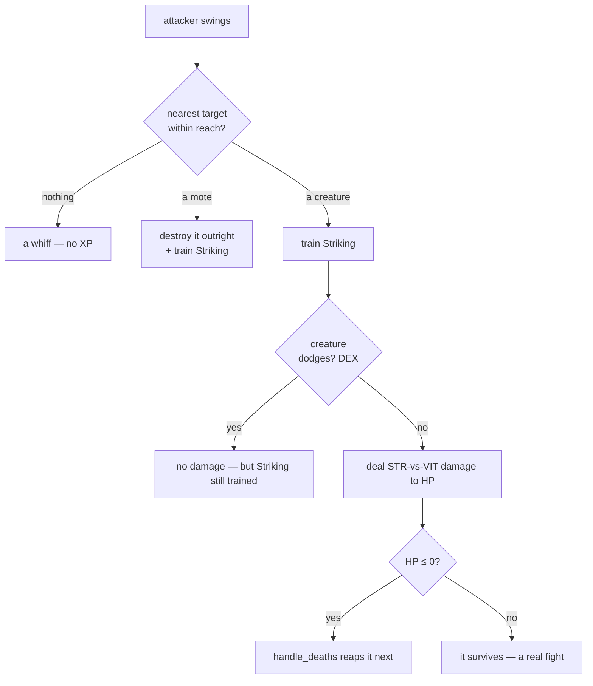

# Combat: fights that reward you

## What it is

The demo grew a real combat loop on top of the [progression](progression.md) system:
**hostile creatures hunt you, you strike back, and winning sustains you.** One shared
resolver decides every swing, damage is a *Strength-vs-VIT* contest, and a kill drops
loot. It's the concrete first slice of the master plan's combat — the same
`activity → skill → attribute → effect` shape, now with a target that fights back.

The moving parts, in one place:

| Piece | What it does |
|---|---|
| **`perform_attack`** | resolves one swing — find nearest target in reach, deal damage, train Striking |
| **`Enemy` creature** | HP + VIT + a swing cooldown; chases and hits the player |
| **`chase_prey`** | steers creatures toward the nearest person, player or NPC (the hostile mirror of `steer_npcs`) |
| **`resolve_creature_contacts`** | a creature's contact blow, softened by your VIT — or dodged by your DEX |
| **`dodge_chance`** | a DEX-driven roll to slip a blow entirely (trains Evasion) |
| **the spawners** | `spawn_creature_if_due` keeps creatures coming; `spawn_npc_if_due` refills the colony |
| **`Pickup`** | a health orb a slain swarmer drops — loot that keeps you fighting |
| **`Weapon` / `Armour` / `Equipped`** | dropped gear worn in two slots: a weapon (E: +Strength, −speed) or armour (E: +defence, −stamina regen); drop the weapon with Q |
| **`handle_deaths`** | permadeath for creatures/NPCs, respawn for the player |

## Why it matters

Combat is where Strength stops being a number and starts *mattering*: a stronger swing
kills faster, a tougher character shrugs off blows. It closes the loop — you fight to
grow, and growing makes you fight better — and it gives the world stakes. It's also the
seam the fuller design plugs into: today's `perform_attack` is the ancestor of the
multi-aspect action resolver, and today's `Pickup` is the simplest `Item`.

## How it works

### The attack resolver — `perform_attack`

One function resolves *every* swing, whoever throws it — the player's `Attack` command
(`J`) and the `npc_attack` system both call it, so a player and an NPC hit identically.



- **Reach** grows with Strength: `45 + (Strength − 1)·6` world units.
- **Target** is the nearest *attackable* thing in reach — a `Hazard` mote **or** a
  hostile `Enemy`. A mote is fragile (one hit); a creature has HP and takes several.
- Any **connecting** swing trains **Striking → Strength**, whatever it hits — *even a
  strike the creature dodges* (you learn from a whiff; only the damage is skipped).

### The damage contest — Strength vs VIT

A hit against a creature isn't flat — it's a contest between the attacker's **Strength**
(how hard) and the target's **VIT** (how tough), through **ratio mitigation**:

```text
dealt = max( raw² / (raw + def),  0.1 × raw )
  raw = 12 + (Strength − 1)·4     def = (Endurance − 1)·3
```

!!! info "Softens forever, never negates"
    Defence makes each hit smaller but a **10% chip always lands** — so a tank is very
    hard to kill but never *un*-killable, and more Strength always helps. `def = 0`
    gives `raw²/raw = raw` (full damage). This is the master plan's mitigation formula
    in miniature; the same shape will carry magical (INT-vs-WIS) damage later.

### Lucky strikes — crits (Luck)

On top of the STR-vs-VIT damage, a strike may **crit** for a burst of extra damage — the
offensive-fortune counterpart to a dodge. After the hit lands, `perform_attack` rolls
`crit_chance(attacker LCK)` — the *same* shape as `dodge_chance`, `min((LCK − 1)·0.03,
0.50)` — and on a crit **doubles** the blow. Level 1 is 0% (no head start, and the
`chance > 0` guard means an untrained attacker never even draws), capped at 50%.

**Luck grows by looting.** The fourth attribute, **LCK**, is fed by a **Scavenging** skill
that trains every time you `collect_pickups` an orb. So the health orbs you already grab
stop being pure sustain and become an *offensive build*: **grab orbs → Scavenging → Luck →
more crits → faster kills → more orbs.** It's the first stat you grow with your feet rather
than your fists. (Creatures never collect loot, so their LCK stays 1 — they never crit,
just as they never train.)

### The enemy — a creature that fights back

An `Enemy` is a real fight, not a throwaway mote. Two archetypes (from `make_creature`)
give waves texture:

| Kind | HP | Chase speed | Hit | Dodge | Feel |
|---|---|---|---|---|---|
| **Brute** (red) | 40 | 70 | 15 | 0% | slow, tanky, hits hard — wear it down, kite it |
| **Swarmer** (orange) | 15 | 130 | 8 | ~21% | fast, fragile (~one strike), weak, *slippery*, and **venomous** — corners you in numbers, and its bite lingers |

The brute is **VIT-tanky** (soaks hits), the swarmer is **DEX-slippery** (slips ~1 strike in
5, its innate Dexterity) *and venomous* — its bite leaves a poison that keeps chipping you after
you break away, so the two archetypes threaten you for opposite reasons: the brute up front, the
swarm on the retreat.

- **HP** (a `Stats` component) that strikes whittle down; **no regen**, so you can wear
  it down. **VIT** (an `Attributes` component) softens the blows it takes.
- **`chase_prey`** homes its velocity on the **nearest person** each tick — the player
  *or* an NPC — at the creature's own `chase_speed`, so a swarmer runs you down while a
  brute lumbers.
- **`resolve_creature_contacts`** — on a cooldown (~0.8 s), a creature in contact deals
  its `attack_damage` to whoever it caught, *softened by that victim's VIT* (same
  `mitigate`), and trains their Toughness (via `train_on_damage`). Unlike a mote it is
  **not consumed** — it keeps swinging.
- **Venom (`Poisoned` + `tick_poison`)** — a landed blow from a venomous archetype (a swarmer's
  `Enemy::poison_per_second > 0`, "procs as data") also applies a `Poisoned` status that keeps
  chipping the victim's `health` for a few seconds *after* the attacker moves on — routed through
  the same `handle_deaths` path, so it can be lethal. Venom **suppresses healing** while it lasts
  (`regenerate_vitals` skips a poisoned entity), so the chip lands in full rather than being
  cancelled by regen; a tougher character resists via its bigger HP **pool** (VIT), not by
  out-healing it. Refreshed on each fresh bite, reaped when it wears off, and cleared by a revive
  (no lethal status survives being hauled up). Any victim, player or NPC (parity); brutes/sentinels
  leave it `0`.
- **Enrage** — worn below `kEnrageThreshold` (30%) of its *own* HP, a creature's blows hit
  `kEnrageDamage` (1.75×) harder: a cornered beast lashes out, so leaving a foe half-dead is
  dangerous and finishing it fast is the safe play. Pure sim (it reads the creature's own health),
  no new state. It mostly bites on the tanky brute/sentinel you wear down — a swarmer usually dies
  before it enrages.
- Motes are excluded from creatures (`entt::exclude<Enemy>` in `resolve_contacts`), so
  ambient hazards can't cheaply kill one and bypass its VIT.

!!! note "A real two-sided fight"
    Because `npc_attack` runs the shared `perform_attack`, any creature in an NPC's
    reach gets struck — free *allied* behaviour (opportunistic, not active hunting). And
    because `chase_prey` / `resolve_creature_contacts` treat every person as prey,
    creatures hunt and hurt NPCs too. So the two actually **war**: NPCs and creatures
    skirmish across the field, and an NPC caught in the open can be run down and killed
    for good (permadeath), not just the player. Same machinery for both — that's the
    player == NPC parity guardrail. The colony refills its losses over time (see
    [the spawners](#keeping-the-fight-alive-the-spawners)), so the war is self-sustaining.

### Slipping the blow — Evasion (Dexterity)

VIT softens a hit; **DEX skips it entirely.** Before a creature's blow lands,
`resolve_creature_contacts` rolls a dodge from the player's third attribute,
**Dexterity**: `dodge = min((DEX − 1) · 0.03, 0.50)`. Two deliberate ends:

- **Level 1 = 0%** — no head start, exactly like every other stat. Usefully, a world
  where nobody has trained DEX never *draws* from the RNG, so the seeded stream stays
  identical to before evasion existed until someone actually earns Dexterity.
- **Capped at 50%** — the defensive mirror of `mitigate`'s 10 % chip floor: evasion
  softens the *incoming* stream forever but never guarantees a miss. A stream of hits
  always gets through.

**How DEX grows — the bootstrap.** Dodging is chicken-and-egg (you can't dodge until
you have DEX, and DEX comes from dodging), so *facing* a swing trains **Evasion →
Dexterity** whether or not it lands — the mirror of Toughness training on the hit you
take. Read enough attacks and you start slipping them. The roll is a seeded draw, so a
replay dodges the same blows every time.

!!!note "Dodge cuts both ways"
    DEX is a two-sided stat. **You** dodge creature blows (above), and **creatures dodge
    your strikes**: `perform_attack` rolls the *same* `dodge_chance` against the target's
    DEX before applying damage, so a slippery swarmer slips ~1 strike in 5 while a brute
    (DEX 1) never does. The swing still trains your Striking — you learn from a whiff —
    only the damage is skipped. Creatures don't grow, so their DEX is a fixed archetype
    trait, not something they train.

### Raising a guard — active block (K)

Dodge and armour are *passive* (a roll, a stat); **guard is a choice you make in the moment.**
Hold **K** and you're `Blocking`: incoming creature blows are cut to `kBlockDamageFactor` (40%),
enough to *tank* a swarm or hold through an enraged brute. The catch — and the reason it isn't free
upside — is that a raised guard **roots you** to `kGuardMoveScale` (35%) of your speed: you trade
mobility for mitigation. **Plant and tank, or move and dodge — not both.** It rides the per-tick
`MovePlayer` command (a held key, not an edge event), so the stance lasts exactly as long as you hold
it, and the softening system reads `Blocking` on *any* entity — so an NPC-guard behaviour would fall
out for free (today only the player, being input-driven, ever guards).

### Keeping the fight alive — the spawners

Killing everything used to leave the world quiet. `spawn_creature_if_due` (end of
`step()`) tops the population up on a timer — every `kCreatureSpawnInterval` (6 s), if
under `kMaxCreatures` (5), it spawns a creature at a random **field edge** (so it
arrives from outside, never on top of you) — mostly swarmers with the occasional
brute, rolled from the seeded RNG. Deterministic.

Its mirror keeps the *colony* alive: `spawn_npc_if_due` wanders a fresh colonist in from
an edge on a **slower** timer (`kNpcSpawnInterval` 12 s, up to `kMaxNpcs` 6). Because
creatures now hunt NPCs too, without this the field would slowly empty of the very people
whose skirmishes make the world feel alive — so the two-sided war stays self-sustaining
(you come back to a populated field, not a graveyard). It's deliberately slower than the
creature timer, so the world stays net-hostile — reinforcements, not safety.

!!! note "A separate RNG stream"
    The NPC spawner draws from its **own** seeded generator (`npc_spawn_rng_`), not the one
    the creatures use. That keeps the spawner's *own* rolls (when/where a colonist arrives)
    off the creature stream, so they never directly shift the creature waves. (The NPCs it
    creates do still touch `rng_` later — their dodge rolls in combat — so raising the colony
    cap *does* change the creature sequence; the point is the spawner's placement/timing rolls
    don't.) Determinism holds regardless: a given seed always replays bit-identically.

### Winning pays — loot (each archetype drops its own reward)

A slain **swarmer** drops a **`Pickup`** (a cyan health orb) where it fell. Walk over it
(`collect_pickups`) to restore health, permanently raise your max HP a little, **and train
Scavenging → Luck** (see [crits](#lucky-strikes-crits-luck)) — so winning sustains you now,
hardens you for good, *and* makes you deadlier, and *skill* keeps you alive, not just
respawning. An uncollected orb **fades after 20 s** so drops from far-off kills don't pile
up.

The loot economy is **symmetric across three drops** — sustain, offence, and defence:

- a **swarmer** yields a **`Pickup`** (sustain, above);
- a **brute** yields a **`Weapon`** (a steel-grey dot) — the harder kill pays out *offence*;
- a **sentinel** — the slow, heavily-plated slate-blue tank — yields a piece of **`Armour`**
  (a bronze dot) — *defence*. This is armour's **renewable battlefield source**: before, armour
  only appeared as two static pieces in the opening scene, so it left the run once grabbed.

Which enemy you kill is a loot decision (offence vs defence vs sustain), and every drop feeds
the same equip loop — you or a foraging colonist ([`npc_equip`](npc-behaviour.md)) can wear it.
The split is keyed on the archetype (`Enemy::drop`, a `DropKind` enum set in
`make_brute`/`make_sentinel`), so it's deterministic — no roll on the seeded stream — and the
exhaustive `switch` in `handle_deaths` (no `default`) makes a fourth drop kind a compile error
until it's handled. The spawner mixes the three from one seeded draw (a rare sentinel, the
occasional brute, mostly swarmers).

### Gear — the first weapon (equip, with a bane)

Press **`E`** near a dropped weapon to **wield** it (the `Equip` command → `apply_command`).
Its bonuses fold once into a cached **`Equipped`** component on you (the design's *EquipMods*,
computed on equip, not per tick), and the item is consumed. `perform_attack` reads an
**effective Strength** = your trained level **+** the weapon's `strength_bonus`, feeding
*both* reach and damage — so a blade reaches further and hits harder. Bare-handed (no
`Equipped`) that's just your level, so nothing changes for anyone unarmed.

But **every item carries a bane** — the design's *"nothing rolls pure-upside"* pillar: the
weapon's `move_penalty` cuts your move speed (`MovePlayer` applies it, stacking with the
exhaustion crawl). Since kiting is how you survive a swarm, wielding the heavy sword is a
real choice — killing power vs. the speed you escape with. And it's not player-only: the
buff is read in the *shared* `perform_attack`, and **NPCs arm themselves too** — an unarmed
colonist steers to a dropped weapon ([`steer_npcs`](npc-behaviour.md)) and wields it
(`npc_equip`), hitting harder but moving slower, exactly as you do (the bane bites both).
So the player and NPCs now *race* for a fallen brute's blade.

And the choice is **reversible**: press **`Q`** to **drop** what you're wielding (the `Drop`
command, the inverse of `Equip`). It reconstructs the weapon on the ground where you stand —
via the same `spawn_weapon` a brute uses, so a dropped blade is indistinguishable from a
looted one — and removes your `Equipped`, so you reclaim full speed instantly. Wield to trade
blows, ditch to sprint clear of a swarm, then circle back and re-grab it (or let a colonist
beat you to it). Equip↔Drop is a closed loop: the heft bane is a decision you can un-make, not
a trap you're stuck in. A downed or bare-handed player can't drop (nothing to shed).

**A second slot — armour.** Gear is now a real offense-vs-defense *choice*, not just a weapon
on/off. A dull-bronze **`Armour`** piece wears in its own slot alongside the weapon: it adds
flat **defence** (folded into `defence_of`, so it softens *every* blow at both damage sites for
free) but carries a **distinct bane** — plate tires you, slowing your **stamina recovery** (a
weaker second wind, not the weapon's move-heft; banes must differ, never clone). So you can be a
fast glass fighter (weapon), a slow tank (armour), or grind to carry both. The two slots are
**independent**: `Equipped` is a flat pair-of-pairs and `equip_nearest_gear` writes only the
grabbed slot, so donning armour never disturbs a wielded weapon. `Drop` (`Q`) is the symmetric
twin — it sheds only the *weapon* pair and leaves your armour on (a blanket removal would strip
it); with only armour worn, `Q` is a no-op. NPCs grab armour through the same shared fold
(parity), though they only take the first piece they reach for now.

!!! note "The minimal slice of P5, growing"
    Two slots as flat field-pairs (no `Slot` enum until a third slot earns it), two hardcoded
    defs (a weapon, an armour), `+Attribute`/`+defence` + one distinct bane each. The rest of
    the design's Equipment — armour as *creature loot* (an `armour_drops` mirror of the brute's
    `weapon_drops`), NPC armour-*seeking*, `Item{def, quality, durability, traits[]}`, the
    `+skill/+aspect` bonuses (which ride the [SkillDef](progression.md) seam), and wear/repair —
    layer on top without reworking this plumbing.

### Dying — `handle_deaths` (Downed, then rescue or respawn)

The game's core rule, made concrete — and split by who died. An **NPC or creature at 0 HP
is destroyed for good** (permadeath). The **player does not die outright**: they go
**Downed** — crumpled *where they fell*, helpless (movement input ignored, self-heal
suspended), a `Downed{timer}` marker counting down. Two ways back up:

- **Rescue** — a living, non-downed person (an ally NPC, or another player in co-op) who
  comes within reach hauls you up *in place*, so you keep the ground you were fighting on.
- **Expiry** — no rescuer in time, and the timer runs out: you respawn whole at the field
  **centre** (the humane fallback so a solo player isn't stuck down).

This is the design's faithful death beat — *"player → Downed: ally-rescuable / expiry
respawns / (hardcore) permadeath"* — replacing the old instant teleport-to-safety-plus-heal,
which rewarded getting swarmed with a free escape. Either way back you return **whole** (all
vitals refilled, so a starved player doesn't revive still starving). And the rescue is
**deliberate**, not incidental: a safe colonist who spots a fallen ally within range
*sprints over* to haul them up ([`steer_npcs`](npc-behaviour.md) runs them there faster than
the timer expires) — the first NPC behaviour about another *person* rather than food or fear,
and the concrete seed of the design's PROTECT stance.

`handle_deaths` runs *before* `regenerate_vitals` (and a Downed player is excluded from
regen), so a just-killed thing can't heal back above 0 the same tick.

!!! note "A Downed body is inert — one invariant across every people-facing system"
    Once you're `Downed` you're not a participant, in *any* direction: you don't self-heal
    (`regenerate_vitals`), you can't grab loot (`collect_pickups`) or act on input
    (`MovePlayer`), an ally rescues you rather than the reverse (`handle_deaths`) — **and the
    fight ignores you**. Creatures re-target the living instead of camping your corpse
    (`chase_prey`), and neither a creature swing (`resolve_creature_contacts`) nor an ambient
    mote (`resolve_contacts`) lands on you. That last part also closes a real exploit: without
    it, a helpless body still trained Evasion/Toughness/veteran XP from blows it couldn't
    react to — a risk-free grind (go down beside a swarm, farm attributes, revive to full).
    All of these share one rule, spelled `entt::exclude<..., Downed>` on the view: *a crumpled
    person is not a valid target until they're back up.* (The last "dying blow" as you cross 0
    still lands — `Downed` is stamped *after* the damage systems that tick.)

### Seeing the blows — the hit-flash

A fight you can't *see* landing feels dead: dots silently lose health and vanish. So
every blow now leaves a mark the eye catches. Wherever damage is applied —
`resolve_contacts` (a mote), `resolve_creature_contacts` (a creature's swing), and
`perform_attack` (your or an NPC's strike) — the struck entity is stamped with a
**`HitFlash`**, a tiny countdown. The renderer mixes that dot toward white in proportion
to the time left, so a fresh hit blinks bright and fades over ~9 ticks. `decay_flashes`
ages the timer each tick and drops it at zero.

`HitFlash` is **presentation only**, exactly like `RenderDot`: it lives on the sim side
so it stays deterministic and testable (stamped at a fixed point, decayed by the fixed
`dt`, drawing no RNG), but **no rule ever reads it** — the moment a system branches on a
hit-flash it stops being a visual and becomes gameplay, and that invariant is the whole
point. The stamp is unconditional on a landed hit (no roll), so the seeded streams stay
byte-for-byte identical to before it existed.

Its steady twin is **wounded dimming**: where the flash shows the *blow*, dimming shows the
accumulated *toll*. The renderer scales each dot's colour by `wounded_brightness(health)` — a
pure function that returns 1.0 at full health and fades toward a floor (`kWoundedFloor`, never
to black) as HP drops. It's applied to the base colour *before* the flash mix, so a fresh hit
on a near-dead dot still pops white and then settles back to its dimmed base. The whole field
becomes a legible health map: you can see which brute you've nearly worn down, which colonist is
one hit from Downed — and, now that a veteran hits harder, watch that edge play out on screen.
Like the flash it's read-only presentation (a renderer-side multiply on existing `Stats`); the
sim never consults it.

### Where it sits in the tick

Order is the definition of a tick (see [the tick and the systems](skeleton/tick-and-systems.md)):

```
steer_npcs → chase_prey → integrate_motion → npc_attack → … →
resolve_contacts → resolve_creature_contacts → handle_deaths → collect_pickups → … →
spawn_creature_if_due → spawn_npc_if_due
```

Chase/steer set velocities *before* movement; contacts resolve *after* (positions are
current); death is checked *after* damage; loot is dropped by death, then collected.

## What to expect

Run the demo: red creatures close in from the edges and go for whoever's nearest — you
*or* a green NPC — so you'll see NPCs and creatures skirmish across the field (and an
unlucky NPC get run down and killed for good, though fresh colonists wander in over time
to replace the fallen). Press `J` to fight (watch a weak Strength
take several hits, a grown one fewer); your health bar dips under their blows but you
steady it by grabbing the orbs they drop — though a hungry NPC may beat you to one, since
colonists now forage for food when they're not fleeing. The NPCs chip in. Keep moving — you outrun
every creature (your 320 vs a brute's 70, a swarmer's 130), so a swarm is survivable by
kiting. Stand and trade blows and you'll slowly train **Dexterity** — after a while some
hits simply whiff, dodged outright. Kill a **brute** and it drops a steel-grey **weapon**:
press `E` to wield it for a longer, harder swing — but you'll feel the weight slow you, so
weigh the extra reach against the speed a swarm makes you want. And now every blow *shows*:
struck dots blink white and fade, so you can read the whole skirmish at a glance — where
the fighting is, who's trading hits, which colonist is getting worn down.

## Key files

- `engine/sim/components.hpp` — `Enemy` (with `poison_per_second`), `Poisoned`, `Blocking` (the raised guard), `Pickup`; `Hazard`.
- `engine/sim/systems.hpp` / `systems.cpp` — `perform_attack`, `chase_prey`, `resolve_creature_contacts` (which applies venom, enrages a worn-down foe, and softens a `Blocking` victim's blow), `tick_poison`, `collect_pickups`, and `handle_deaths` (which drops the loot via `spawn_pickup`); the `mitigate` / `defence_of` / `dodge_chance` / `crit_chance` helpers; `stamp_flash` (at the damage sites) and `decay_flashes` (ages the hit-flash). The guard itself is set by the `MovePlayer` command's `guard` flag in `world.cpp`'s `apply_command` (`game/app/main.cpp` holds `K`).
- `engine/sim/components.hpp` — `HitFlash`, the presentation-only hit-blink; `game/app/main.cpp` `draw_entities` whitens the dot by its remaining time.
- `engine/sim/world.cpp` — `make_creature` (+ the `make_brute` / `make_swarmer` archetypes), `spawn_creature_if_due` / `spawn_npc_if_due` (each on its own seeded stream), and the system order in `step()`.
- `engine/sim/command.hpp` / `world.cpp` — the player's `Attack` (`J`), `Equip` (`E`), and `Drop` (`Q`) commands; `spawn_weapon` (shared by brute drops and `Drop`).
- `engine/sim/components.hpp` — `Weapon` and `Armour` (dropped gear) and `Equipped` (the two-slot mods cache); `engine/sim/systems.cpp` `equip_nearest_gear` (the non-clobbering fold), `spawn_armour`, and the `defence_of` / `update_stamina` hooks.
- `tests/sim/test_simulation.cpp` — STR-vs-VIT damage, VIT-softened blows, DEX dodge (both sides) + Evasion training, LCK crits + Scavenging training, creature spawn/cap, loot drop + collect + fade, weapon drop/wield/reach/damage/heft.

## Go deeper

- [Progression: skills feed attributes](progression.md) — Striking → Strength, the attribute the fight grows.
- [Deterministic numbers](deterministic-numbers.md) — why the sim's maths is replay-stable.
- [Stats system](stats-system.md) — the HP the fight spends.
