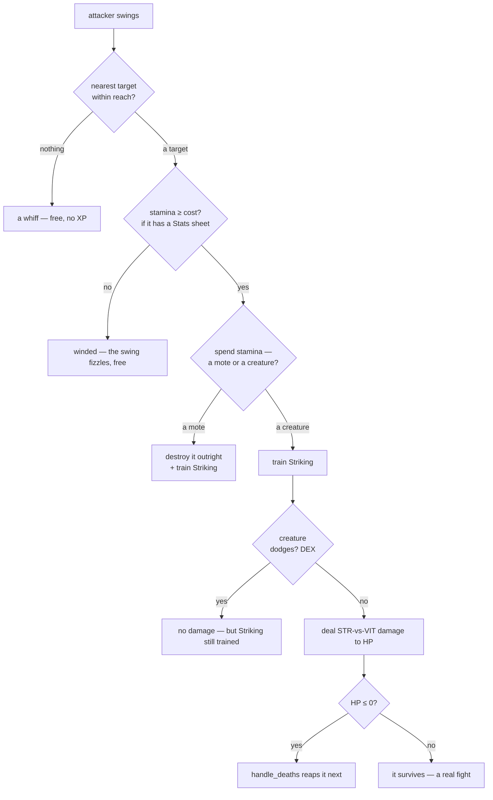

# Combat: fights that reward you

## What it is

The demo grew a real combat loop on top of the [progression](progression.md) system:
**hostile creatures hunt you, you strike back, and winning sustains you.** One shared
resolver decides every swing, damage is a *Strength-vs-VIT* contest, and a kill drops
loot. It's the concrete first slice of the master plan's combat — the same
`activity → skill → attribute → effect` shape, now with a target that fights back.

The moving parts, in one place:

| Piece | What it does |
|---|---|
| **`perform_attack`** | resolves one swing — find nearest target in reach, deal damage, train Striking |
| **`Enemy` creature** | HP + VIT + a swing cooldown; chases and hits the player |
| **`chase_prey`** | steers creatures toward the nearest person, player or NPC (the hostile mirror of `steer_npcs`) |
| **`resolve_creature_contacts`** | a creature's contact blow, softened by your VIT — or dodged by your DEX |
| **`dodge_chance`** | a DEX-driven roll to slip a blow entirely (trains Evasion) |
| **the spawners** | `spawn_creature_if_due` keeps creatures coming; `spawn_npc_if_due` refills the colony |
| **`Pickup`** | a health orb a slain swarmer drops — loot that keeps you fighting |
| **`Weapon` / `Armour` / `Equipped`** | dropped gear worn in two slots: a weapon (E: +Strength, −speed) or armour (E: +defence, −stamina regen); drop the weapon with Q |
| **`handle_deaths`** | permadeath for creatures/NPCs, respawn for the player |

## Why it matters

Combat is where Strength stops being a number and starts *mattering*: a stronger swing
kills faster, a tougher character shrugs off blows. It closes the loop — you fight to
grow, and growing makes you fight better — and it gives the world stakes. It's also the
seam the fuller design plugs into: today's `perform_attack` is the ancestor of the
multi-aspect action resolver, and today's `Pickup` is the simplest `Item`.

## How it works

### The attack resolver — `perform_attack`

One function resolves *every* swing, whoever throws it — the player's `Attack` command
(`J`) and the `npc_attack` system both call it, so a player and an NPC hit identically.



- **Reach** grows with Strength: `45 + (Strength − 1)·6` world units.
- **Stamina** — a **connecting** swing spends `kMeleeStaminaCost` (7, cheaper than the 15-cost throw
  since melee is the faster primary attack), and a fighter below the cost **can't land the blow** —
  the swing fizzles (no XP, no damage, no cost), the melee echo of the throw's stamina gate and the
  reason 0 stamina means *disengage and recover*, not stand and win. Only a swing that *connects*
  pays: a **targetless whiff is free** — load-bearing, because `npc_attack` polls `perform_attack`
  every tick for every NPC regardless of a target, so charging a whiff would drain every idle
  colonist. It bites only an attacker with a `Stats` sheet (a real fighter tires; a bare test dummy
  has no stamina and swings freely), and it gates the player and NPCs alike (both route through
  `perform_attack`).
- **Target** is the nearest *attackable* thing in reach — a `Hazard` mote **or** a
  hostile `Enemy`. A mote is fragile (one hit); a creature has HP and takes several.
- Any **connecting** swing trains **Striking → Strength**, whatever it hits — *even a
  strike the creature dodges* (you learn from a whiff; only the damage is skipped).
- **The dark branch:** when a **player** swings with *no hostile* in reach but a peaceful
  colonist beside them, the whiff becomes a **cruel strike** — the same damage, and a
  Cruelty deed that sinks their standing. Hostiles always win the target, so this only
  fires with nothing else to fight; it is the villain path, covered in
  [Morality](morality.md#how-it-works).
- **Power swings (hold CTRL)** — the offensive third of the held-stance trio (sprint = mobility,
  guard = defence, **power = offence**, each trading the stamina bar). While the power key is down the
  player carries a `PowerAttack` marker, and a marked swing hits `kPowerDamage` (**1.75×**) harder for
  `kPowerStaminaCost` (**18**, vs the base 7) — fewer, heavier blows that fell a brute in less swings,
  at the price of winding you faster. It self-gates on that dearer cost: with enough wind for a plain
  swing (≥ 7) but not a power one (< 18) the powered swing **fizzles** entirely, just as any swing
  does below its cost — so powering can leave you unable to strike when your bar is low. The multiplier
  rides `raw` alongside `berserk`/`need_eff`; an unmarked swing (every NPC, or a player not holding it)
  → 1.0 / the base cost → bit-identical. A power hit also **knocks the foe back** `kKnockback` (30
  world units, along the attacker→target line) *after* the damage lands — the one thing in melee that
  repositions a target, so a heavy blow makes room in a swarm or shunts a brute off a cornered ally.
  Same `powered` gate, so an ordinary swing shoves nothing (bit-identical); a foe standing exactly on
  you has no direction to push and stays put.

### The damage contest — Strength vs VIT

A hit against a creature isn't flat — it's a contest between the attacker's **Strength**
(how hard) and the target's **VIT** (how tough), through **ratio mitigation**:

```text
dealt = max( raw² / (raw + def),  0.1 × raw )
  raw = 12 + (Strength − 1)·4     def = (Endurance − 1)·3
```

!!! info "Softens forever, never negates"
    Defence makes each hit smaller but a **10% chip always lands** — so a tank is very
    hard to kill but never *un*-killable, and more Strength always helps. `def = 0`
    gives `raw²/raw = raw` (full damage). This is the master plan's mitigation formula
    in miniature; the same shape will carry magical (INT-vs-WIS) damage later.

An **empty belly saps the blow** before mitigation: `raw` is scaled by `need_efficiency` — `1.0`
while both hunger and water sit at or above a quarter-full (so a fed fighter is bit-identical), ramping
down to a **half** as the *worst* of the two needs empties. A starving or parched fighter hits
softer (a floor, never zero), and a **throw scales by the same factor** — no ranged loophole — so
keeping the colony fed and watered is a combat concern, not just a survival one. See
[the stats system](stats-system.md).

### Lucky strikes — crits (Luck)

On top of the STR-vs-VIT damage, a strike may **crit** for a burst of extra damage — the
offensive-fortune counterpart to a dodge. After the hit lands, `perform_attack` rolls
`crit_chance(attacker LCK)` — the *same* shape as `dodge_chance`, `min((LCK − 1)·0.03,
0.50)` — and on a crit **doubles** the blow. Level 1 is 0% (no head start, and the
`chance > 0` guard means an untrained attacker never even draws), capped at 50%.

**Luck grows by looting.** The fourth attribute, **LCK**, is fed by a **Scavenging** skill
that trains every time you `collect_pickups` an orb. So the health orbs you already grab
stop being pure sustain and become an *offensive build*: **grab orbs → Scavenging → Luck →
more crits → faster kills → more orbs.** Luck now pays *twice*: a higher LCK also makes each
orb **restore more health** (`1 + (LCK − 1)·0.1`, capped ×2 — the design's "richer finds"), so
the same loot loop sharpens your blade **and** deepens your mending. It's the first stat you grow
with your feet rather than your fists. (Creatures never collect loot, so their LCK stays 1 — they
never crit or mend from orbs, just as they never train.)

### Kill vigor — health on a kill

Felling a foe restores a little **health** to the killer (`kKillVigor`, 8 HP), so pressing the
attack is its own reward — a comeback tool in a swarm. Winning already sustained you *indirectly* —
but only a **swarmer** drops a health orb, only if you walk over it before it fades, so a brute or
spitter kill paid no health at all. Kill vigor is the **direct, universal** on-kill heal: every
kill, every killer, on the spot. It fires at the **same alive→dead transition** as the Valor credit,
both for a melee killing blow and a
killing throw (full player==NPC and melee==ranged parity), and it is **capped at max**, so a
full-health killer is unchanged. Crucially it's a *direct* heal — a kill's adrenaline — **not** the
passive mending `regenerate_vitals` blocks behind a full belly, so it lifts even a starving fighter:
a kill's rush overrides the mending-gate the [need debuff](stats-system.md) imposes (the health orb
heals un-gated too, but only a swarmer drops one). It stays a lifeline, not a heal-lock: one kill's 8
HP won't out-heal a real fight, so you still have to win the exchange.

(Not to be confused with the stamina **second wind** — `update_stamina`'s resting recovery, which
*is* blocked while starving. Vigor is health from a kill; second wind is stamina from rest.)

### The enemy — a creature that fights back

An `Enemy` is a real fight, not a throwaway mote. A handful of archetypes (from `make_creature`)
give waves texture:

| Kind | HP | Chase speed | Hit | Dodge | Feel |
|---|---|---|---|---|---|
| **Brute** (red) | 40 | 70 | 15 | 0% | slow, tanky, hits hard — wear it down, kite it |
| **Swarmer** (orange) | 15 | 130 | 8 | ~21% | fast, fragile (~one strike), weak, *slippery*, and **venomous** — corners you in numbers, and its bite lingers |
| **Spitter** (violet) | 25 | 55 | 4 | 0% | slow, fragile, feeble in melee — but **ranged** and **venomous**: plinks you with a homing spit that **envenoms** on hit, from beyond your reach, so you must close on it or throw back; drops a **venom fang** when felled |

The brute is **VIT-tanky** (soaks hits), the swarmer is **DEX-slippery** (slips ~1 strike in
5, its innate Dexterity) *and venomous*, and the spitter is **RANGED** *and venomous* — so they
threaten you for different reasons: the brute up front, the swarm on the retreat, the spitter's
envenoming spit from a distance you can't melee. (A slow, heavily-plated **sentinel** — 60 HP, VIT 5
— rounds out the reinforcement mix and drops armour.)

- **HP** (a `Stats` component) that strikes whittle down; **no regen**, so you can wear
  it down. **VIT** (an `Attributes` component) softens the blows it takes.
- **`chase_prey`** homes its velocity on the **nearest person** each tick — the player
  *or* an NPC — at the creature's own `chase_speed`, so a swarmer runs you down while a
  brute lumbers. It **skips anyone sheltering in a `Hearth`** (`in_a_hearth`, the same reach
  that speeds their heal): the fire breaks the **hunt**, so a beast bearing down on a colonist who
  reaches it gives up the chase and re-targets whoever is still in the open — a *ward*, not a full
  stop. It's chase-only, though: this is safe from being *hunted*, not blanket immunity — a
  `resolve_creature_contacts` beast already on top of you gets its last swings as it drifts off, and a
  `creature_spit` spitter still lobs venom from range (see the next two bullets), so the hearth buys
  space, not invulnerability. See [the stats system](stats-system.md) for its healing half.
- **`resolve_creature_contacts`** — on a cooldown (~0.8 s), a creature in contact deals
  its `attack_damage` to whoever it caught, *softened by that victim's VIT* (same
  `mitigate`), and trains their Toughness (via `train_on_damage`). Unlike a mote it is
  **not consumed** — it keeps swinging.
- **`creature_spit`** — the ranged mirror of that swing, and the **payoff of the `Projectile`
  primitive** (the player's *Throwing* section below): a **spitter** (any `Enemy` with
  `spit_range > 0`), off its own reload, launches a *homing* spit at the nearest person in range —
  the same `Projectile` your throw uses, so a ranged enemy needed no new movement/impact code, only
  the launch. The spit **carries the spitter's `poison_per_second`** on the `Projectile`, so it
  ENVENOMS on impact (the ranged echo of a swarmer's bite) — the player's plain throw carries `0`, so
  it's unchanged. A killing spit records **no** Valor (its target is a person, not a hostile;
  creatures have no morality). "Procs as data" again — a spitter is just a few `Enemy` knobs
  (`spit_range` / `spit_damage` / `spit_timer` / `poison_per_second`), not a new creature class.
- **Venom (`Poisoned` + `tick_poison`)** — a landed blow from a venomous archetype (a swarmer's
  bite, or a **spitter's ranged spit** — both `Enemy::poison_per_second > 0`, "procs as data"; the
  spit *carries* that venom on its `Projectile` and applies it on impact) also applies a `Poisoned`
  status that keeps chipping the victim's `health` for a few seconds *after* the attacker moves on — routed through
  the same `handle_deaths` path, so it can be lethal. Venom **suppresses healing** while it lasts
  (`regenerate_vitals` skips a poisoned entity), so the chip can't be cancelled by regen. What *does*
  blunt it is **hardiness**: `tick_poison` shaves the chip by the victim's **VIT** (5% per Endurance
  level past 1, capped at 75% — venom always bites at least a quarter), the DoT counterpart of how VIT
  softens a *blow* (`defence_of`) — so a tough constitution shrugs off both a hit and a poison, on top
  of its bigger HP **pool**. A fresh bite **refreshes** the clock but keeps the **worst potency** in the
  blood — `apply_venom` (shared by all three venom sources) takes the *max* dose, never overwriting,
  so a *weaker* second bite can't dilute a strong venom you're already carrying (a first bite still
  sets the dose from nothing). Reaped when it wears off, and cleared by a revive
  (no lethal status survives being hauled up). Any victim, player or NPC (parity); brutes/sentinels
  leave it `0`. And **enduring** venom *trains* you: each poison tick builds a **Resistance** skill →
  **Endurance** (see [progression](progression.md)), the poison twin of Toughness (a survived *blow* →
  Toughness). So a character that keeps shrugging off venom grows the very VIT that shaves it —
  **immunity through exposure** — closing the loop the way blocking builds Guarding.
- **Enrage** — worn below `kEnrageThreshold` (30%) of its *own* HP, a creature's blows hit
  `kEnrageDamage` (1.75×) harder: a cornered beast lashes out, so leaving a foe half-dead is
  dangerous and finishing it fast is the safe play. Pure sim (it reads the creature's own health),
  no new state. It mostly bites on the tanky brute/sentinel you wear down — a swarmer usually dies
  before it enrages.
- **Limp** — the *movement* half of that same sub-30% band: a wounded creature (below the same
  `kLimpThreshold` = 30% line) chases at `kLimpMoveScale` (0.6×), the creature-side mirror of the
  player's exhaustion crawl. So a cornered beast both **rages** (enrage, harder hits) *and*
  **struggles** (slower), turning "leave it half-dead" into a real choice: **commit to the finish**,
  or **kite the limping brute** — safe but slow, since it can't close on you. Pure sim off its own
  HP (`chase_prey`), no RNG; a full-HP creature is unchanged.
- **Execute** — the offensive *mirror* of enrage, keyed on the **same** 30% line
  (`kExecuteThreshold`): a strike on a creature already below it lands `kExecuteBonus` (1.5×)
  harder, so a worn-down foe **folds faster**. Together they turn the sub-30% band into a genuine
  risk/reward — the cornered beast both rages *and* is finishable, so you commit to the kill or you
  pay for dawdling. Also pure sim (reads the target's current HP fraction), no RNG, so a low
  creature just dies a touch sooner and replay stays bit-identical. Applies to the melee strike on
  hostiles (`perform_attack`), NPCs and player alike; a cruel strike on a colonist doesn't execute.
- **Backstab** — the *positional* twin of execute (execute reads the target's **HP**, this reads its
  **facing**): a strike on a creature moving **away** from you lands `kBackstabBonus` (1.4×) harder,
  because a beast fleeing or chasing *someone else* (its velocity aims at its own prey) never saw the
  blow. Pure geometry — the dot of the target's heading against the attacker→target line exceeds
  `kBackstabCosine` (within ~60° of straight away) — so **no RNG**, and it stacks on the execute
  finisher. It rewards **peeling** a beast off a cornered ally, and cuts both ways (a creature hunting
  your friend is exposed to *your* flank). A **stationary** foe, or one closing on you (facing you
  down), gets no bonus, so every still-foe combat test is bit-identical; player and NPC attackers both
  earn it through the shared `perform_attack`. And it cuts the **other way** through the *same*
  `backstab_multiplier` helper: a **creature** backstabs a victim fleeing **it**
  (`resolve_creature_contacts`) — **don't turn your back on a beast**, so a colonist the flee rung
  carries away from a hazard pays for the exposed back, and running is never a *free* escape. Both
  sides apply it **after** `mitigate` (a flank finds the vital spot, so armour/VIT don't blunt the
  bonus), keeping attacker and victim symmetric.
- **Berserk** — enrage turned *inward*: when the **attacker's own** HP falls below the same 30% line
  (`kBerserkThreshold`), its blows land `kBerserkDamage` (1.5×) harder — a cornered *fighter* is
  dangerous too, not just a cornered beast. It folds into `raw` beside the [need debuff](stats-system.md),
  so a starving *and* wounded fighter carries both, and it applies to every attacker through the shared
  `perform_attack` (player and NPC alike). Pure sim (reads the attacker's own HP), no RNG, and a
  full-HP fighter is unchanged — every existing combat test is bit-identical. It's the comeback twin
  of **kill vigor**: at low health you both hit harder *and* heal on the kill, a real last-stand — the
  symmetric mirror of the enrage you exploit in your foes.
- **Cleave** — a wide swing catches a **second** foe: after a melee hit lands on a creature, the
  nearest *other* `Enemy` within `kCleaveRadius` (40, a swing's width) of **where the blow landed**
  takes `kCleaveFraction` (½) of the blow, softened by *its* own VIT. (The struck spot is captured
  *before* a power swing's knockback shoves the primary, so a bystander in the arc is caught by where
  you hit — not spared because the primary was flung out of range.) This hands melee an **anti-swarm**
  answer — the close-range twin of the ranged throw — with no new input: one swing, two foes when they
  cluster.
  It's spillover, not an aimed blow, so it carries **no crit/execute/backstab/venom, and no Valor**
  (the same "spillover isn't a strike" call the [riposte](#raising-a-guard--active-block-k) makes); it still
  chips through `handle_deaths` and flashes so it reads. Pure sim, no RNG (the cleave draws none), so
  replay stays bit-identical *in the stream* — it only adds a second victim to the same swing.
- Motes are excluded from creatures (`entt::exclude<Enemy>` in `resolve_contacts`), so
  ambient hazards can't cheaply kill one and bypass its VIT.

!!! note "A real two-sided fight"
    Because `npc_attack` runs the shared `perform_attack`, any creature in an NPC's
    reach gets struck — free *allied* behaviour (opportunistic, not active hunting). And
    because `chase_prey` / `resolve_creature_contacts` treat every person as prey,
    creatures hunt and hurt NPCs too. So the two actually **war**: NPCs and creatures
    skirmish across the field, and an NPC caught in the open can be run down and killed
    for good (permadeath), not just the player. Same machinery for both — that's the
    player == NPC parity guardrail. The colony refills its losses over time (see
    [the spawners](#keeping-the-fight-alive-the-spawners)), so the war is self-sustaining.

### Slipping the blow — Evasion (Dexterity)

VIT softens a hit; **DEX skips it entirely.** Before a creature's blow lands,
`resolve_creature_contacts` rolls a dodge from the player's third attribute,
**Dexterity**: `dodge = min((DEX − 1) · 0.03, 0.50)`. Two deliberate ends:

- **Level 1 = 0%** — no head start, exactly like every other stat. Usefully, a world
  where nobody has trained DEX never *draws* from the RNG, so the seeded stream stays
  identical to before evasion existed until someone actually earns Dexterity.
- **Capped at 50%** — the defensive mirror of `mitigate`'s 10 % chip floor: evasion
  softens the *incoming* stream forever but never guarantees a miss. A stream of hits
  always gets through.

**How DEX grows — the bootstrap.** Dodging is chicken-and-egg (you can't dodge until
you have DEX, and DEX comes from dodging), so *facing* a swing trains **Evasion →
Dexterity** whether or not it lands — the mirror of Toughness training on the hit you
take. Read enough attacks and you start slipping them. The roll is a seeded draw, so a
replay dodges the same blows every time.

!!!note "Dodge cuts both ways"
    DEX is a two-sided stat. **You** dodge creature blows (above), and **creatures dodge
    your strikes**: `perform_attack` rolls the *same* `dodge_chance` against the target's
    DEX before applying damage, so a slippery swarmer slips ~1 strike in 5 while a brute
    (DEX 1) never does. The swing still trains your Striking — you learn from a whiff —
    only the damage is skipped. Creatures don't grow, so their DEX is a fixed archetype
    trait, not something they train.

### Raising a guard — active block (K)

Dodge and armour are *passive* (a roll, a stat); **guard is a choice you make in the moment.**
Hold **K** and you're `Blocking`: incoming creature blows are cut to `kBlockDamageFactor` (40%) —
and a *trained* guard cuts them further still (see the Guarding skill below), enough to *tank* a
swarm or hold through an enraged brute. The catch — and the reason it isn't free
upside — is that a raised guard **roots you** to `kGuardMoveScale` (35%) of your speed: you trade
mobility for mitigation. **Plant and tank, or move and dodge — not both.** It rides the per-tick
`MovePlayer` command (a held key, not an edge event), so the stance lasts exactly as long as you hold
it, and the softening system reads `Blocking` on *any* entity — so **NPCs guard too**: `npc_guard`
has a *hardened* colonist (a **bulwark** — trained Endurance past `kBulwarkLevel`) **plant and raise
a guard** when a creature is upon it, rooting in place to soak the softened blows, riposte, and
**train Guarding** — the first path for a colonist to reach that skill at all, and the player==NPC
parity the design guards. It plants only while **hale**, though: below half health it *doesn't* guard,
so the wounded-retreat rung carries it to a hearth to mend instead of rooting it beside the creature
to stand-and-die — the brave stand is a *healthy* veteran's choice. A *fresh* colonist (Endurance 1)
never qualifies, so the guard only emerges after one has toughened up over a long fight — which keeps
every existing steer test bit-identical.

And a guard **bites back**: a blow turned on a raised guard chips the attacker for a flat
`kRiposteDamage` (4) — a **riposte** — so planting your guard isn't purely defensive; it's a slow
offence, wearing an attacker down while you soak its (softened) blows. But a riposte is an
**exertion**: each one spends `kRiposteStaminaCost` (15) stamina, and — crucially — a **raised guard
gives no second wind** (`update_stamina` skips recovery while `Blocking`, the twin of the starvation
gate). So a guard-tank *bleeds* the stamina its ripostes spend and can't refill it until it lowers
the guard. That turns a would-be risk-free hold into a **rhythm**: turn blows until you're winded,
then drop the guard to catch your breath — exposed, taking full hits — and go again. A **winded**
guard still softens but can't riposte, so you can never simply stand in a corner and let a lone foe
kill itself. The riposte routes through the creature's own `Stats`, so if it lands the last hit the
creature dies through `handle_deaths` like any other — loot and all — though it credits **no Valor**
(Valor rewards a strike *you* throw; a riposte is the beast breaking itself on your shield).

And guarding, like every other combat action, **trains** you: a blow turned on a raised guard
builds the **Guarding** skill → **Endurance** (see [progression](progression.md#progression-skills-feed-attributes)),
**Toughness's active twin** — one grows Endurance by *surviving* a hit, the other by *blocking* it.
So a guard-tank grows genuinely tougher by tanking (Endurance buys bigger pools, softer blows, and
poison-resist), and blocking is no longer the one combat action that taught nothing. It trains on
*every* turned blow, winded or not (the grant isn't stamina-gated — only the riposte is).

And that training now **pays back into the block itself**: the Guarding level *eases* how much of a
blow gets through (`eased_bane(kBlockDamageFactor, level)` — the same half-floor helper the carry and
fatigue banes use), so a veteran guard turns away more than a novice. Level 1 or no skill → the flat
40% → bit-identical; the relief caps at half, so a master still takes a fifth of the blow (`0.4 →
0.2`) — a guard is *softened*, never a wall. The skill you earn by blocking makes you better at
blocking — a defensive build to sit beside the offensive STR/DEX/crit ones.
*ponytail:* `kRiposteDamage` / `kRiposteStaminaCost` stay flat knobs (scale them with the Guarding
skill or shield gear later); only the block *fraction* is skill-eased so far.

And the guard **reads on the field**: a `Blocking` entity's dot gets a steel-blue **ring** in
`draw_entities` (the same hue as the panel's "GUARDING" line), so you can see who has their guard up
mid-fight without glancing at the panel — the dot cue every other status already has (personality
tint, poison green, hit-flash white, standing size). Presentation-only; the sim never reads it.

### Throwing — the ranged option (F)

Every attack so far has been melee: you must close to within ~45 units. **Throwing** (press **F**)
is the player's first way to hit at a distance — `perform_throw` hurls at the nearest hostile within
`kThrowRange` (350, vastly further than a swing) and chips its HP. Its job is to **soften an
approaching swarm before it reaches you**, not to replace melee, and two rules keep it in that lane:

- **It costs stamina** — *more* than a swing does. Each connecting throw spends `kThrowStaminaCost`
  (15, versus melee's 7, a bigger wind-up). A *standing* character
  regenerates stamina (~20/s), so a patient, stationary plink lives off that regen — but it roots you
  in the swarm's path and, at low Dexterity, barely dents a brute. Throw *faster* than regen can
  refill, or throw *on the move* — kiting drains ~40/s, far more than regen — and the bar empties and
  drops you to the same exhausted crawl a sprint causes (`update_stamina`'s gate). So the cost is what
  keeps range honest: you can *soften* an approach, but you can't *burst* a swarm down or *kite* one
  forever for free. Out of stamina, the throw **fizzles** — nothing spent, no damage.
- **It's plain.** Unlike a swing, a throw draws **no RNG** — no dodge, no crit, no execute, no
  backstab — for a modest, *reliable* `kBaseThrowDamage` (8, less than melee's 12) plus your earned **Dexterity**,
  softened by the target's VIT. Ranged trades melee's burst potential (crits, execute) for range and
  certainty. It trains **Throwing → Dexterity** (a little Strength too) — the aim-led mirror of a
  swing's Striking → Strength; and a *killing* throw credits **Valor** just like a melee kill, so
  the morality ledger doesn't care which hand felled the foe.

It targets `Enemy` creatures only — never a peaceful colonist (villainy stays a deliberate melee
choice) nor a mote. Player-only for now: there is no `npc_throw`, so NPCs still only melee.

A throw doesn't hit *instantly* — it **launches a homing `Projectile`** (a small bright bolt) that
flies to the target and applies the blow on arrival (`advance_projectiles`). So a throw now has a
visible travel, and it's **wasted if the target dies first** (its shot despawns unhit) — the one
cost of the delay. **Dexterity speeds the bolt** — the design's DEX *Speed* aspect: a defter
thrower's shot flies faster (up to 2×), so it arrives sooner *and* is wasted less often on a foe that
dies mid-flight — a reliability edge distinct from the `+damage` DEX already gives the throw. The shot
*homes* rather than flying straight so it reliably catches an
approaching creature (a straight bolt aimed at where the foe *was* would overshoot as it closes on
you). The `Projectile` is the reusable seed of every ranged effect: the spitter's (venomous) spit
already rides it — a ranged *enemy* fell out of the same primitive — and arrows or bolts would too.
*ponytail:* it homes and can't miss its
target; a straight-line shot you must *lead* is a gameplay refinement, not a plumbing change.

### Keeping the fight alive — the spawners

Killing everything used to leave the world quiet. `spawn_creature_if_due` (end of
`step()`) tops the population up on a timer — every `kCreatureSpawnInterval` (6 s), if
under `kMaxCreatures` (5), it spawns a creature at a random **field edge** (so it
arrives from outside, never on top of you) — mostly swarmers with the occasional
brute, rolled from the seeded RNG. Deterministic.

Its mirror keeps the *colony* alive: `spawn_npc_if_due` wanders a fresh colonist in from
an edge on a **slower** timer (`kNpcSpawnInterval` 12 s, up to `kMaxNpcs` 6). Because
creatures now hunt NPCs too, without this the field would slowly empty of the very people
whose skirmishes make the world feel alive — so the two-sided war stays self-sustaining
(you come back to a populated field, not a graveyard). It's deliberately slower than the
creature timer, so the world stays net-hostile — reinforcements, not safety.

!!! note "A separate RNG stream"
    The NPC spawner draws from its **own** seeded generator (`npc_spawn_rng_`), not the one
    the creatures use. That keeps the spawner's *own* rolls (when/where a colonist arrives)
    off the creature stream, so they never directly shift the creature waves. (The NPCs it
    creates do still touch `rng_` later — their dodge rolls in combat — so raising the colony
    cap *does* change the creature sequence; the point is the spawner's placement/timing rolls
    don't.) Determinism holds regardless: a given seed always replays bit-identically.

### Winning pays — loot (each archetype drops its own reward)

A slain **swarmer** drops a **`Pickup`** (a cyan health orb) where it fell. Walk over it
(`collect_pickups`) to restore health, permanently raise your max HP a little, **and train
Scavenging → Luck** (see [crits](#lucky-strikes-crits-luck)) — so winning sustains you now,
hardens you for good, *and* makes you deadlier, and *skill* keeps you alive, not just
respawning. An uncollected orb **fades after 20 s** so drops from far-off kills don't pile
up.

The loot economy spans **four keyed drops** — sustain, raw offence, defence, and a poison build:

- a **swarmer** yields a **`Pickup`** (sustain, above);
- a **brute** yields a **`Weapon`** (a steel-grey dot) — the harder kill pays out raw *offence*;
- a **sentinel** — the slow, heavily-plated slate-blue tank — yields a piece of **`Armour`**
  (a bronze dot) — *defence*. This is armour's **renewable battlefield source**: before, armour
  only appeared as two static pieces in the opening scene, so it left the run once grabbed.
- a **spitter** yields a **venom fang** (a green venom `Weapon`) — closing on the ranged artillery
  arms you with the *poison build*, and gives the venom blade its own renewable source (it only
  seeded the opening scene before). The spitter is the rare ~15% spawn, so fangs stay scarce rather
  than flooding the field the way a swarmer drop would.

Which enemy you kill is a loot decision (sustain vs raw offence vs defence vs poison), and every
drop feeds the same equip loop — you or a foraging colonist ([`npc_equip`](npc-behaviour.md)) can
wear it. The split is keyed on the archetype (`Enemy::drop`, a `DropKind` enum set in
`make_brute`/`make_sentinel`/`make_spitter`), so it's deterministic — no roll on the seeded stream —
and the exhaustive `switch` in `handle_deaths` (no `default`) makes a new drop kind a compile error
until it's handled. The spawner mixes the archetypes from one seeded draw (a rare sentinel, a
spitter, the occasional brute, mostly swarmers).

### Gear — the first weapon (equip, with a bane)

Press **`E`** near a dropped weapon to **wield** it (the `Equip` command → `apply_command`).
Its bonuses fold once into a cached **`Equipped`** component on you (the design's *EquipMods*,
computed on equip, not per tick), and the item is consumed. `perform_attack` reads an
**effective Strength** = your trained level **+** the weapon's `strength_bonus`, feeding
*both* reach and damage — so a blade reaches further and hits harder. Bare-handed (no
`Equipped`) that's just your level, so nothing changes for anyone unarmed.

But **every item carries a bane** — the design's *"nothing rolls pure-upside"* pillar: the
weapon's `move_penalty` cuts your move speed (`MovePlayer` applies it, stacking with the
exhaustion crawl). Since kiting is how you survive a swarm, wielding the heavy sword is a
real choice — killing power vs. the speed you escape with. **Strength eases that heft** (the design's
**carry**): `carried_move_penalty` shrinks the move_penalty by your Strength level, up to a **half**
floor — so a strong wielder moves nearer its unarmed pace, but the bane *never* vanishes (the design's
*mastery shrinks a bane but never removes it*, see [progression](progression.md)). And it's not
player-only: the buff is read in the *shared* `perform_attack`, and **NPCs arm themselves too** — an
unarmed colonist steers to a dropped weapon ([`steer_npcs`](npc-behaviour.md)) and wields it
(`npc_equip`), hitting harder but moving slower, easing the heft with its own Strength exactly as you
do (both the buff and the carry relief bite both). So the player and NPCs now *race* for a fallen
brute's blade.

**And the blade wears out.** Beyond the heft, a weapon carries a `durability` (40 connecting hits on
a hostile), copied onto the wielder's `Equipped` at equip. Each such swing dulls it by one, and at 0
it **shatters** — the weapon slot clears (strength, heft, *and* venom all gone), and if nothing else
is worn the now-empty `Equipped` is **removed** (exactly as `Drop` does), so "unarmed" reads as
`gear == nullptr` everywhere. That last part is load-bearing for **NPCs**: `steer_npcs`' arm-up rung
and `npc_equip` both gate on `Equipped` *presence*, so removing the empty cache is what lets a
shattered colonist re-seek and re-grab a fresh blade — the player and NPCs re-arm alike (armour worn
alongside stays put; only the weapon pair clears). So the item's tradeoff isn't only *spatial*
(power vs. speed) but
**temporal**: a looted blade is a *consumable* you cycle through, not a permanent upgrade — the
design's *"durability now, repair later"*. And **repair** has now landed: durability no longer only
falls. A worn weapon (or plate) **mends** — slowly regaining durability — while its bearer rests in a
`Hearth`'s glow (`mend_gear`, capped at full, sharing the fire's `in_a_hearth` reach with its heal /
stamina / ward), so gear is a **managed** resource — fight until it's worn, fall back to the base to
mend it, or scavenge a fresh one from the next brute — not a one-way trip to breaking. (Reforge is
still a later ring.) Only a real hit on a hostile wears it — the same scope
`venom`/`execute`/`cleave` use — so swatting a mote (training) or the effect-less cruel strike don't,
and a bare hand never does. A fresh blade is bit-identical until it actually breaks.

And the choice is **reversible**: press **`Q`** to **drop** what you're wielding (the `Drop`
command, the inverse of `Equip`). It reconstructs the weapon on the ground where you stand —
via the same `spawn_weapon` a brute uses, so a dropped blade is indistinguishable from a
looted one — and removes your `Equipped`, so you reclaim full speed instantly. Wield to trade
blows, ditch to sprint clear of a swarm, then circle back and re-grab it (or let a colonist
beat you to it). Equip↔Drop is a closed loop: the heft bane is a decision you can un-make, not
a trap you're stuck in. A downed or bare-handed player can't drop (nothing to shed).

**A second weapon type — the venom blade.** A sickly-green **venom weapon** on the field is a
different *kind* of blade, not just a bigger one: its hits **envenom** the foe. If your `Equipped`
carries `weapon_venom` (folded from the blade's `Weapon::venom_per_second`), `perform_attack` also
applies a **`Poisoned`** to a struck creature — the *player-side* mirror of a swarmer's bite, reusing
the exact same `Poisoned` + `tick_poison` (and `kPoisonDuration`) as the venom that has been chasing
*you*. It's the design's *"gear grants a +aspect"* — and it pays for the proc: the venom blade is
lighter (**less `strength_bonus`**, so weaker raw hits) and nimbler (less heft) than the steel sword.
So the weapon choice is now a real build fork: the steel blade's **raw power** vs. the venom blade's
**lingering chip + mobility** (soften, then let the poison finish). And the poison build has its own
**renewable source**: a slain **spitter** drops a venom fang (`DropKind::VenomWeapon`, above), the
way a sentinel drops its armour — spawned through the one canonical `spawn_venom_weapon`, so a looted
fang is identical to the one seeded in the opening scene. *ponytail:* dropping a venom blade still
sheds a *plain* one (the drop reconstructs the default weapon, not the wielded instance's mods) —
carry the wielder's cached mods into `Drop` once more than one weapon def exists.

**A second slot — armour.** Gear is now a real offense-vs-defense *choice*, not just a weapon
on/off. A dull-bronze **`Armour`** piece wears in its own slot alongside the weapon: it adds
flat **defence** (folded into `defence_of`, so it softens *every* blow at both damage sites for
free) but carries a **distinct bane** — plate tires you, slowing your **stamina recovery** (a
weaker second wind, not the weapon's move-heft; banes must differ, never clone). **Endurance eases
that bane** (`borne_regen_penalty`, the armour twin of Strength's weapon [carry](progression.md)): a
hardy body **bears** armour better, so its VIT shrinks the stamina penalty up to a **half** floor —
the same *mastery shrinks a bane but never removes it* rule, now on both gear slots. (Endurance also
speeds base recovery, so a hardy fighter is resilient two ways: quicker second wind *and* less slowed
by plate.) So you can be a
fast glass fighter (weapon), a slow tank (armour), or grind to carry both. The two slots are
**independent**: `Equipped` is a flat pair-of-pairs and `equip_nearest_gear` writes only the
grabbed slot, so donning armour never disturbs a wielded weapon. `Drop` (`Q`) is the symmetric
twin — it sheds only the *weapon* pair and leaves your armour on (a blanket removal would strip
it); with only armour worn, `Q` is a no-op. NPCs grab armour through the same shared fold
(parity), though they only take the first piece they reach for now.

**And the plate wears too.** Armour carries its own `durability` (30 blows, fewer than a blade's 40 —
plate takes the brunt in a swarm), copied onto `Equipped` at equip. Every creature blow it *softens*
(`resolve_creature_contacts`) wears it by one, and at 0 it **shatters** — the armour slot clears and
the wearer is bare, the defensive twin of a blade shattering. So the "bane bites both" pillar is now
whole: **both** slots are consumables you cycle, offence *and* defence. The breaking blow still gets
full mitigation (wear is applied after), only a piece you're actually wearing wears (a bare or
weapon-only victim is bit-identical), and — like a shattered weapon — if nothing else is left the
now-empty `Equipped` is dropped (shared `remove_equipped_if_empty`, mirroring `Drop`) so an NPC
re-seeks fresh gear.

**Gear has a QUALITY tier.** Beyond the fixed boon/bane of a weapon or armour *kind*, each item
carries a `quality` multiplier on its **boon** — a finer blade folds in more `+Strength`, a finer
plate more `+defence` (`equip_nearest_gear` scales the boon at equip; the `int` `+Strength` truncates,
a named ceiling). The **bane stays full**: quality lifts the *upside* only, so *shrinking* the bane is
the ORTHOGONAL **mastery** track (Strength eases a weapon's heft, Endurance an armour's stamina bane —
`eased_bane`). Two independent axes — quality is *how good the item is*, mastery *how well you wield
it*. **Fine loot is now ROLLED**: a slain brute's steel and a sentinel's plate roll a `quality`
in `[kFineQualityMin, kFineQualityMax)` (1.1–1.4), so two tough kills yield subtly different gear and
looting stays interesting past the first drop — a finer plate is always better than the starting 6.0
defence, and steel is `+4`–`+5` Strength (the `int` truncation can round a modest roll back to the
baseline integer; armour's float defence shows every roll). The roll is drawn from a **dedicated**
`drop_rng_` stream, so it never perturbs the creature/combat waves — every dodge, spawn and wave is
bit-identical, *only* the dropped quality varies. What you *start* with, the venom fang, and a
player's dropped blade stay quality **1.0** (baseline). Deterministic (same seed → same rolls). And a
fine steel drop can rarely roll a **named TRAIT** — two so far, mutually exclusive: ~15% *venomous* (a
heavy poison blade that trades one notch of Strength for hits that **envenom**, reusing the shipped
venom → Poisoned path) and ~15% *keen* (a razor blade that trades the same notch of Strength for a
**crit-chance** bonus, reusing the Luck crit), each a paired +/- that is never pure-upside — the rest
plain. The trait decision is a *portable* raw `mt19937` draw (identical on every platform). Venom
needed no new field; the keen crit isn't expressible through an existing field, so `Weapon`/`Equipped`
each gained one `crit_bonus` (appended last, default 0 → bit-identical) — but still **no `traits[]`
list**: the variants never stack, so no list is needed until they must. And you can *see* quality: a
finer item **glints brighter** on the field (`quality_sheen`, a pure presentation helper the renderer
applies — baseline 1.0 renders unchanged), so a fine drop catches the eye without a numeric UI.

Armour gets its **first flavourful trait** too — the **warded** (spiked) plate, the defensive twin of
the venom/keen blade. Until now armour had only its flat defence + the stamina-regen bane; a warded
plate (a cold spiked-iron dot, `spawn_warded_armour`) trades a notch of that defence (`kWardedDefence`
4, below plain plate's 6) for **thorns**: every creature blow it absorbs reflects a flat
`kWardedThorns` (2.5) chip back onto the attacker (`resolve_creature_contacts`), routed through the
creature's own `Stats` exactly like the guard's [riposte](#raising-a-guard--active-block-k) — so a
thorns hit that lands the last blow reaps the creature via `handle_deaths` (loot still drops) and, like
the riposte, credits **no Valor** (the beast breaks itself on your spikes). Thorns and the riposte are
*independent*, so a **guarding** wearer in warded plate fires **both** on one turned blow — the
stamina-costed riposte (4) *and* the free thorns (2.5), 6.5 back — each still bounded by its own limit
(the riposte by your stamina, the thorns by the plate's 30-blow durability), so it's a bigger bite, not
an unbounded one. It reuses the whole shipped armour path: `Armour`/`Equipped` each gain one
`thorns_per_hit`/`armour_thorns` field (appended last, default 0 → bit-identical), the equip fold copies
it, and it clears when the plate shatters. A stand-and-tank build — soak a little less, punish the swarm
for swinging — never pure-upside.

!!! note "The minimal slice of P5, growing"
    Two slots as flat field-pairs (no `Slot` enum until a third slot earns it), hardcoded defs (plain
    steel, a venom fang, a plain and a *warded* armour, and two rolled steel variants — *venomous* and
    *keen*) each pairing a boon (`+Attribute`/`+defence`/`+venom`/`+crit`/`+thorns`) with a bane, so
    weapon and armour banes stay *distinct* even as the blades share a kind. Each archetype's kill
    already feeds this loop as *creature loot* (the four `DropKind`s). The rest of the design's
    Equipment — NPC armour-*seeking*, the `Item{def, quality, durability, traits[]}` model (`quality`
    scales the boon at equip AND rolls per fine drop; **three named traits** exist — venom via existing
    fields and keen via an added `crit_bonus` on the weapon, warded via a `thorns_per_hit` on the
    armour; the two *weapon* traits roll on a fine battlefield drop (`handle_deaths`) while *warded* is
    scene-spawned only for now — wiring a portable draw into the armour-drop branch, so a warded build
    is renewable like the venom one, is the natural next step; a `traits[]` *list* waits until two
    traits must STACK on one item, which the mutually-exclusive roll avoids), the `+skill/+aspect`
    bonuses (which ride the
    [SkillDef](progression.md) seam), and wear/repair — layer on top without reworking this plumbing.

### Dying — `handle_deaths` (Downed, then rescue or respawn)

The game's core rule, made concrete — and split by who died. An **NPC or creature at 0 HP
is destroyed for good** (permadeath). The **player does not die outright**: they go
**Downed** — crumpled *where they fell*, helpless (movement input ignored, self-heal
suspended), a `Downed{timer}` marker counting down. Two ways back up:

- **Rescue** — a living, non-downed person (an ally NPC, or another player in co-op) who
  comes within reach hauls you up *in place*, so you keep the ground you were fighting on.
- **Expiry** — no rescuer in time, and the timer runs out: you respawn whole at the field
  **centre** (the humane fallback so a solo player isn't stuck down).

This is the design's faithful death beat — *"player → Downed: ally-rescuable / expiry
respawns / (hardcore) permadeath"* — replacing the old instant teleport-to-safety-plus-heal,
which rewarded getting swarmed with a free escape. Either way back you return **whole** (all
vitals refilled, so a starved player doesn't revive still starving). And the rescue is
**deliberate**, not incidental: a safe colonist who spots a fallen ally within range
*sprints over* to haul them up ([`steer_npcs`](npc-behaviour.md) runs them there faster than
the timer expires) — the first NPC behaviour about another *person* rather than food or fear,
and the concrete seed of the design's PROTECT stance.

`handle_deaths` runs *before* `regenerate_vitals` (and a Downed player is excluded from
regen), so a just-killed thing can't heal back above 0 the same tick.

**A fallen colonist drops the kit it earned.** When a slain NPC was wielding a weapon or wearing
armour (a non-empty `Equipped` slot), that gear lands *where it fell* — a blade and plate you (or
another colonist, via `npc_equip`) can recover, so a hard-won kit **outlives its bearer** rather than
vanishing with the corpse. It's the equipment economy's death end, the twin of a slain brute paying
out a weapon. Recovered gear drops **plain** — baseline quality, no rolled trait, no RNG draw (the
finer, trait-rolled loot is reserved for a tough *kill*) — matching the `Drop` command's "a dropped
weapon is a plain one" simplification, so the drop stream stays bit-identical. A bare, unarmed
colonist leaves nothing.

!!! note "A Downed body is inert — one invariant across every people-facing system"
    Once you're `Downed` you're not a participant, in *any* direction: you don't self-heal
    (`regenerate_vitals`) or **mend your gear by the fire** (`mend_gear` — and that one *would*
    persist past the down window, since a revive resets vitals and needs but not durability), you
    can't grab loot (`collect_pickups`) or **act on input at all** — not just movement (`MovePlayer`)
    but *every* action command (swing / throw / cast / mend / equip / drop / harvest / plant) skips a
    Downed commander in `apply_command`, an ally rescues you rather than the reverse (`handle_deaths`)
    — **and the fight ignores you**. Creatures re-target the living instead of camping your corpse
    (`chase_prey`), and neither a creature swing (`resolve_creature_contacts`) nor an ambient
    mote (`resolve_contacts`) lands on you. That last part also closes a real exploit: without
    it, a helpless body still trained Evasion/Toughness/veteran XP from blows it couldn't
    react to — a risk-free grind (go down beside a swarm, farm attributes, revive to full).
    The *system*-side reads share one rule, spelled `entt::exclude<..., Downed>` on the view; the
    *command*-side ones skip a Downed commander in `apply_command`. Either way: *a crumpled person is
    not a valid target — nor an actor — until they're back up.* (The last "dying blow" as you cross 0
    still lands — `Downed` is stamped *after* the damage systems that tick.)

### Seeing the blows — the hit-flash

A fight you can't *see* landing feels dead: dots silently lose health and vanish. So
every blow now leaves a mark the eye catches. Wherever damage is applied —
`resolve_contacts` (a mote), `resolve_creature_contacts` (a creature's swing),
`perform_attack` (your or an NPC's strike), `advance_projectiles` (a thrown bolt or a
spitter's spit landing), and the `DamagePlayer` command (a hit dealt straight through the
funnel) — the struck entity is stamped with a **`HitFlash`**, a tiny countdown. They all
call the one shared `stamp_flash`, so every *discrete blow* blinks its victim. (The one
deliberate exception is the venom DoT, `tick_poison`: it chips health every second, and
pulsing white each tick would read as noise, not a hit — the lingering harm gets its own
steady cue instead, a **green poison tint**, below.) The renderer mixes that dot toward white in proportion
to the time left, so a fresh hit blinks bright and fades over ~9 ticks. `decay_flashes`
ages the timer each tick and drops it at zero.

`HitFlash` is **presentation only**, exactly like `RenderDot`: it lives on the sim side
so it stays deterministic and testable (stamped at a fixed point, decayed by the fixed
`dt`, drawing no RNG), but **no rule ever reads it** — the moment a system branches on a
hit-flash it stops being a visual and becomes gameplay, and that invariant is the whole
point. The stamp is unconditional on a landed hit (no roll), so the seeded streams stay
byte-for-byte identical to before it existed.

Its steady twin is **wounded dimming**: where the flash shows the *blow*, dimming shows the
accumulated *toll*. The renderer scales each dot's colour by `wounded_brightness(health)` — a
pure function that returns 1.0 at full health and fades toward a floor (`kWoundedFloor`, never
to black) as HP drops. It's applied to the base colour *before* the flash mix, so a fresh hit
on a near-dead dot still pops white and then settles back to its dimmed base. The whole field
becomes a legible health map: you can see which brute you've nearly worn down, which colonist is
one hit from Downed — and, now that a veteran hits harder, watch that edge play out on screen.
Like the flash it's read-only presentation (a renderer-side multiply on existing `Stats`); the
sim never consults it.

And a third colour cue, for the **venom** the DoT above deliberately doesn't flash: a `Poisoned` dot
is tinted toward a **bilious acid-green** by `poison_tint_strength(damage_per_second)` — a pure
function that greens the dot *more* the nastier the dose (a swarmer's 9/s over a spit's 5/s), capped
(`kPoisonTintCap`) so even a heavy dose stays legible. The green is deliberately a yellow-acid,
*distinct* from the friendly NPC green, so it reads on poisoned colonists — a prime venom victim —
and not just on the blue player. It's a **status overlay**: mixed in *over* the personality hue (an
active poison matters more than a personality tint) but *under* the hit-flash, so a fresh blow still
pops white — **and** the target green is dimmed by the same `wounded_brightness` factor, so poison
never re-brightens a near-dead dot: the health cue survives *under* the venom cue rather than fighting
it. Now the whole venom subsystem — bite, blade, and spit — reads on the field: you can see who's
envenomed and how badly, and watch the tint fade as the venom wears off (or deepen on a fresh bite).
Read-only, drawing no RNG, like every other cue here.

### Where it sits in the tick

Order is the definition of a tick (see [the tick and the systems](skeleton/tick-and-systems.md)):

```
steer_npcs → chase_prey → integrate_motion → npc_attack → … →
resolve_contacts → resolve_creature_contacts → handle_deaths → collect_pickups → … →
spawn_creature_if_due → spawn_npc_if_due
```

Chase/steer set velocities *before* movement; contacts resolve *after* (positions are
current); death is checked *after* damage; loot is dropped by death, then collected.

## What to expect

Run the demo: red creatures close in from the edges and go for whoever's nearest — you
*or* a green NPC — so you'll see NPCs and creatures skirmish across the field (and an
unlucky NPC get run down and killed for good, though fresh colonists wander in over time
to replace the fallen). Press `J` to fight (watch a weak Strength
take several hits, a grown one fewer); your health bar dips under their blows but you
steady it by grabbing the orbs they drop — though a hungry NPC may beat you to one, since
colonists now forage for food when they're not fleeing. The NPCs chip in. Keep moving — you outrun
every creature (your 320 vs a brute's 70, a swarmer's 130), so a swarm is survivable by
kiting. Stand and trade blows and you'll slowly train **Dexterity** — after a while some
hits simply whiff, dodged outright. Kill a **brute** and it drops a steel-grey **weapon**:
press `E` to wield it for a longer, harder swing — but you'll feel the weight slow you, so
weigh the extra reach against the speed a swarm makes you want. And now every blow *shows*:
struck dots blink white and fade, so you can read the whole skirmish at a glance — where
the fighting is, who's trading hits, which colonist is getting worn down.

## Key files

- `engine/sim/components.hpp` — `Enemy` (with `poison_per_second`), `Poisoned`, `Blocking` (the raised guard) and `Sprinting` (its offensive twin, the SHIFT dash), `Projectile` (a thrown bolt in flight), `Pickup`; `Hazard`.
- `engine/sim/systems.hpp` / `systems.cpp` — `perform_attack` (which crits, *executes* a worn-down foe for bonus damage, *backstabs* a foe whose back is turned, and *cleaves* a fraction of the blow into a second clustered foe), `perform_throw` (the stamina-costed ranged option — launches a `Projectile`), `advance_projectiles` (flies each bolt home and lands it), `creature_spit` (a ranged enemy launches a spit through the same `Projectile`), `chase_prey`, `resolve_creature_contacts` (which applies venom, enrages a worn-down foe, softens a `Blocking` victim's blow, and *backstabs* a fleeing victim via the shared `backstab_multiplier`), `tick_poison`, `collect_pickups`, and `handle_deaths` (which drops the loot via `spawn_pickup`); the `mitigate` / `defence_of` / `dodge_chance` / `crit_chance` helpers; `stamp_flash` (at the damage sites) and `decay_flashes` (ages the hit-flash). The guard itself is set by the `MovePlayer` command's `guard` flag (and the SHIFT sprint by its `sprint` flag) in `world.cpp`'s `apply_command`; the `Attack` (J), `Throw` (F), guard (K), and sprint (SHIFT) inputs come from `game/app/main.cpp`.
- `engine/sim/components.hpp` — `HitFlash`, the presentation-only hit-blink; `game/app/main.cpp` `draw_entities` whitens the dot by its remaining time.
- `engine/sim/world.cpp` — `make_creature` (+ the `make_brute` / `make_swarmer` / `make_spitter` / `make_sentinel` archetypes), `spawn_creature_if_due` / `spawn_npc_if_due` (each on its own seeded stream), and the system order in `step()`.
- `engine/sim/command.hpp` / `world.cpp` — the player's `Attack` (`J`), `Equip` (`E`), and `Drop` (`Q`) commands; `spawn_weapon` (shared by brute drops and `Drop`).
- `engine/sim/components.hpp` — `Weapon` and `Armour` (dropped gear) and `Equipped` (the two-slot mods cache); `engine/sim/systems.cpp` `equip_nearest_gear` (the non-clobbering fold), `spawn_armour`, and the `defence_of` / `update_stamina` hooks.
- `tests/sim/test_simulation.cpp` — STR-vs-VIT damage, VIT-softened blows, DEX dodge (both sides) + Evasion training, LCK crits + Scavenging training, creature spawn/cap, loot drop + collect + fade, weapon drop/wield/reach/damage/heft.

## Go deeper

- [Progression: skills feed attributes](progression.md) — Striking → Strength, the attribute the fight grows.
- [Deterministic numbers](deterministic-numbers.md) — why the sim's maths is replay-stable.
- [Stats system](stats-system.md) — the HP the fight spends.
