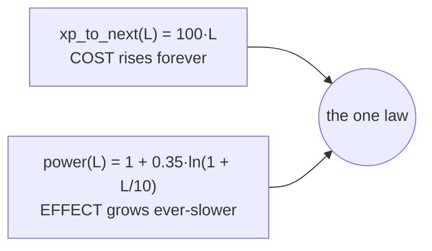

# Deterministic numbers: fixed-point & the curve

## What it is

Two small pieces of maths that everything else in the simulation is built on:

- **`Fixed`** — a **Q16.16 fixed-point** number (`engine/core/fixed.hpp`). A
  32-bit integer that *means* a fraction: the top 16 bits are the whole part, the
  bottom 16 the fractional part. Same arithmetic as a `float`, but the answer is
  **identical on every machine**.
- **The curve** — the one growth law, `power(level)` and `xp_to_next(level)`
  (`engine/sim/progression/curve.hpp`). One shape that every skill, attribute, and
  level obeys.

Together they are the numeric bedrock: skills, attributes, and (in time) combat
and economy all count in `Fixed` and grow along the curve.

## Why it matters

**Floats drift.** `a * b` in IEEE-754 can land one bit apart on two CPUs — a
different compiler, a different rounding mode, an FMA the optimiser fused. One bit
per tick, 60 ticks a second, and two machines running "the same" simulation have
visibly diverged in a minute.

That divergence is fatal to the three things the master plan wants:

- **Record & replay** — a saved input log must reproduce the *exact* run.
- **Lockstep multiplayer** — peers exchange inputs, not state, and must each
  compute the same world.
- **Reproducible tests** — a determinism test that passes on macOS must pass on
  Windows CI.

Integers don't drift. `Fixed` is integers wearing a fraction's clothes, so the sim
counts in it and the divergence problem disappears.

## How it works

### `Fixed` — a fraction stored as an integer

`kOne = 1 << 16 = 65536` *is* the value 1.0. So `from_int(3)` stores `3 * 65536`,
and `from_ratio(1, 3)` stores `65536 / 3`. Reading it back:

```cpp
Fixed third = Fixed::from_ratio(1, 3);   // 0.3333… held exactly as a raw int
third.to_double();                        // 0.33333 (for display / tests only)
```

Two rules keep it deterministic **and** crash-free:

- **Wide intermediates.** Multiply two Q16.16 values and the raw product needs 64
  bits before it's shifted back down — so every `* /` goes through `int64_t`. No
  silent overflow mid-calculation.
- **Saturating, never UB.** Signed overflow is undefined behaviour in C++ (the
  sanitisers in the `dev` build *will* trap it). `Fixed` clamps to the min/max
  instead, so a runaway value pins to the ceiling rather than wrapping to a
  negative — wrong, but *deterministically* wrong, and never a crash.

`from_float` exists for **loading and tests only** — never call it in the per-tick
sim, or you invite a float back into the deterministic path.

### The curve — "uncapped, ever-slower, never zero"

Two halves, kept deliberately apart:



- **`xp_to_next` — the cost.** Linear, so each level costs more than the last.
  Specialising never caps; it only ever-slows. Returns a whole `int64` (XP
  thresholds are integers; the *accrued* xp is a `Fixed` so it can gain a fraction
  each tick).
- **`power` — the effect.** A logarithm: it rises forever but by an
  ever-smaller step (`power(0)=1.0`, `power(50)≈1.63`, `power(100)≈1.84`). A master
  is clearly best — about 2×, not 10× — and nothing is ever unreachable for the
  determined.

`ln` is expensive and would be run thousands of times a tick, so `power` is **baked
once to a lookup table** at first use (a 256-entry array of `Fixed`). The hot loop
just indexes it; past the table it extends by the final step so it never plateaus.

## The determinism caveat

The table is built from `std::log`, and **`std::log` is not correctly rounded** —
at a half-step boundary two platforms' maths libraries can snap to raw values one
unit apart. That is fine for the current bar (per-platform replay) but would break
*cross-OS* lockstep. When that's gated, the fix is a generated constant table or a
fixed-point `ln`; it's tracked as a follow-up in the header.

`power(0)` itself needs no special-casing: `log(1)` is exactly `+0` by the C
standard, so `table[0] = from_float(1.0)` is exactly `1.0` on every platform — the
"no head start" invariant is free.

!!! warning "A Windows-only 'failure' that wasn't numeric at all"
    The `power(0)` test failed on Windows CI *only* — and it cost two commits of
    chasing a phantom fixed-point bug (a table anchor, then a function guard) before
    the actual runner log gave it away: `No test cases matched`. The cause was a
    single **em-dash in the test name**. CTest passes each test's name to the Catch2
    binary as a `--filter`; the Windows console codepage mangled the non-ASCII
    character, so Catch2 matched zero cases and CTest reported "Failed". macOS and
    Linux are UTF-8 clean end to end, so they passed. **Two rules fell out:** keep
    test names ASCII (CTest's name→filter round-trip is the portability boundary),
    and when a test fails on one platform only, *read the runner output* before
    theorising about the code — "Failed" is not the same as "assertion failed".

## Key files

- `engine/core/fixed.hpp` — the `Fixed` type; `tests/core/test_fixed.cpp` pins its
  behaviour (whole numbers exact, saturation, round-trips).
- `engine/sim/progression/curve.hpp` / `curve.cpp` — `power` + `xp_to_next`;
  `tests/sim/test_curve.cpp` asserts the law as *properties* (monotonic, uncapped,
  ever-slower) with tolerances, so rounding jitter can't make them flaky.

## Go deeper

- [Progression: skills feed attributes](progression.md) — the first system built on
  these numbers.
- [The fixed 60 Hz tick](architecture/adr-0002-fixed-60hz-tick.md) — the other half
  of determinism: fixed timestep, so the same inputs always produce the same motion.
