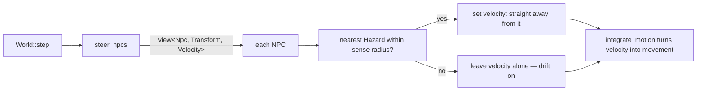

# NPC behaviour: the first steering

## What it is

The first thing an NPC does on its own. Until now NPCs were data that drifted;
the `steer_npcs` system gives each one a *decision* every tick — sense the nearest
hazard, and if it is close, flee it. Perception, then action, in about twenty
lines. It is the seed of the engine's NPC AI (the master plan's sensors,
blackboard, and behaviour trees).

- **`steer_npcs`** — a system that, for each NPC, finds the nearest `Hazard`
  within a sense radius and sets its velocity to run directly away from it.

## Why it matters

"NPCs are people, not units" is the game's first pillar. A unit follows a fixed
script; a person *reacts* to its world. This is the smallest honest version of
reacting: an NPC that notices danger and moves away from it. Everything richer —
seeking food, following orders, fighting — is the same shape with a different
decision at the centre.

## How it works

Each tick, **before anything moves**, `steer_npcs` runs over every NPC:

Two details carry the whole idea:

It is a **system, not a command** — the NPC's own behaviour, so it changes
velocity directly. The command funnel is only for intent from *outside* the sim
(the player's keys, later the network); an NPC's choices are the sim's own rules.

It **must run before `integrate_motion`**, because it sets the velocity that
integration turns into movement *this same tick*. As with death-before-heal, the
order of the calls in `step()` is load-bearing.

The ECS filter does the targeting for free: `view<Npc, Transform, Velocity>` skips
the player (no `Npc`) and the motes (no `Npc`) without a single `if`.

!!! info "Greedy and memoryless — on purpose"
    It flees the *single nearest* threat, with no memory. An NPC can dodge one
    mote straight into another. That is fine: real steering behaviours (Reynolds)
    blend many influences, and this is deliberately the one-decision version. Write
    the concrete thing first; add the blend on the second real need.

## What to expect

Spawn a mote (`Space`) near the green dots in the demo and watch them scatter. The
"NPCs alive" counter falls *slower* than it used to, because NPCs now actively
dodge — but motes wrap in from every edge, so some still get cornered and die
(permadeath). Fleeing buys time; it is not immortality.

## The tradeoffs

- **O(NPCs × hazards) per tick.** Fine for a handful; a crowd needs a spatial
  grid — the same upgrade `resolve_contacts` wants, done once for both.
- **Constants, not components.** Sense radius and flee speed are `constexpr`. When
  an NPC needs its own values — a scout that sees farther — they become fields on
  a component, and not before.

## Where it goes next

This is one hard-coded decision. The game needs many, chosen by situation — the
master plan's **behaviour trees** (C++ structural nodes, Luau leaves). `steer_npcs`
becomes one *leaf* ("flee threat") among many ("gather", "build", "guard"),
selected by a tree the NPC walks each tick. The perception half grows into a
**blackboard** — what an NPC knows — fed by sensors. The shape you see here, look
then act, is what stays.

## Key files

- `engine/sim/systems.hpp` / `systems.cpp` — `steer_npcs`.
- `engine/sim/world.cpp` — the `steer_npcs` line in `step()`, before `integrate_motion`.
- `tests/sim/test_simulation.cpp` — the flee-in-range and ignore-out-of-range tests.

## Go deeper

- [The tick and the systems](skeleton/tick-and-systems.md) — how `steer_npcs` is scheduled and why order matters.
- [Entities and components](skeleton/ecs.md) — why an NPC is a component set, and how the view targets them.
- [The stats system](stats-system.md) — the permadeath that fleeing tries to postpone.
