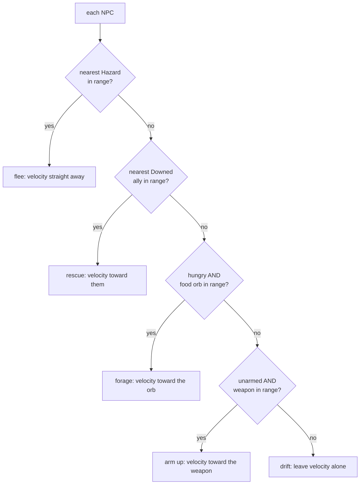

# NPC behaviour: the first steering

## What it is

The first thing an NPC does on its own. Until now NPCs were data that drifted;
the `steer_npcs` system gives each one a *decision* every tick. It started as one
choice — flee the nearest hazard — and has grown into a small **priority ladder** of
wants, still perception-then-action, still hard-coded leaves:

1. **Flee** the nearest `Hazard` (fear beats everything).
2. **Rescue** — run to the nearest **Downed** ally to haul them up (the first want about
   another *person*, added with the [Downed death beat](combat.md)).
3. **Forage** — if hungry, head for the nearest food orb (a `Pickup`).
4. **Arm up** — if unarmed, head for the nearest dropped `Weapon` (`npc_equip` wields it on
   reach), so colonists loot the battlefield and fight harder — the player==NPC gear parity.
5. Otherwise **drift**.

Every steer speed is scaled by `(1 - move_penalty)` when the NPC is **armed**, so a wielded
weapon's heft slows an NPC exactly as it slows the player — the item's bane bites both.

It is the seed of the engine's NPC AI (the master plan's sensors, blackboard, and
behaviour trees) — each rung is exactly the kind of leaf a behaviour tree will one day
select among.

- **`steer_npcs`** — a system that, for each NPC, senses the nearest target of each kind
  in priority order (hazard → downed ally → food) and sets its velocity accordingly.

## Why it matters

"NPCs are people, not units" is the game's first pillar. A unit follows a fixed
script; a person *reacts* to its world. This is the smallest honest version of
reacting: an NPC that notices danger and moves away from it. Everything richer —
seeking food, following orders, fighting — is the same shape with a different
decision at the centre.

## How it works

Each tick, **before anything moves**, `steer_npcs` runs over every NPC:

The first matching want wins and the NPC commits to it that tick (a `continue`), so a
fleeing NPC never also forages, and a rescuer drops its meal to save someone. One
load-bearing detail in the rescue rung: an NPC *already* within revive range holds
position rather than steering, so it doesn't nudge itself back out before
`handle_deaths` (later the same tick) hauls the ally up. And every steer speed is scaled
down while the NPC is armed — the weapon's heft slows it, so the buff it wields is paid
for exactly as the player pays (the item's bane bites both).

Two details carry the whole idea:

It is a **system, not a command** — the NPC's own behaviour, so it changes
velocity directly. The command funnel is only for intent from *outside* the sim
(the player's keys, later the network); an NPC's choices are the sim's own rules.

It **must run before `integrate_motion`**, because it sets the velocity that
integration turns into movement *this same tick*. As with death-before-heal, the
order of the calls in `step()` is load-bearing.

The ECS filter does the targeting for free: `view<Npc, Transform, Velocity>` skips
the player (no `Npc`) and the motes (no `Npc`) without a single `if`.

!!! info "Greedy and memoryless — on purpose"
    It flees the *single nearest* threat, with no memory. An NPC can dodge one
    mote straight into another. That is fine: real steering behaviours (Reynolds)
    blend many influences, and this is deliberately the one-decision version. Write
    the concrete thing first; add the blend on the second real need.

## What to expect

Spawn a mote (`Space`) near the green dots in the demo and watch them scatter — fleeing
still buys time, not immortality (some get cornered and die, permadeath). But there's more
life to watch now: a hungry colonist peels off to grab a dropped health orb; if *you* go
down, a nearby colonist breaks off and **runs to revive you** before your respawn timer
fires; and a slain **brute's dropped weapon** gets snapped up by whichever unarmed colonist
(or you) reaches it first — after which that NPC hits harder but moves a little slower. Four
wants, one ladder, chosen fresh each tick.

## The tradeoffs

- **O(NPCs × hazards) per tick.** Fine for a handful; a crowd needs a spatial
  grid — the same upgrade `resolve_contacts` wants, done once for both.
- **Constants, not components.** Sense radius and flee speed are `constexpr`. When
  an NPC needs its own values — a scout that sees farther — they become fields on
  a component, and not before.

## Where it goes next

This is one hard-coded decision. The game needs many, chosen by situation — the
master plan's **behaviour trees** (C++ structural nodes, Luau leaves). `steer_npcs`
becomes one *leaf* ("flee threat") among many ("gather", "build", "guard"),
selected by a tree the NPC walks each tick. The perception half grows into a
**blackboard** — what an NPC knows — fed by sensors. The shape you see here, look
then act, is what stays.

## Key files

- `engine/sim/systems.hpp` / `systems.cpp` — `steer_npcs` (the flee / rescue / forage / arm-up ladder, speeds scaled by the equip bane); `handle_deaths` does the revive at `kReviveDistance`; `npc_equip` + the shared `equip_nearest_weapon` do the wield-on-reach.
- `engine/sim/world.cpp` — the `steer_npcs` line in `step()` (before `integrate_motion`) and `npc_equip` (after it).
- `tests/sim/test_simulation.cpp` — flee / forage / rescue / revive-in-place, and steer-to-weapon / NPC-arms-itself / armed-NPC-flees-slower (the equip bane parity).

## Go deeper

- [The tick and the systems](skeleton/tick-and-systems.md) — how `steer_npcs` is scheduled and why order matters.
- [Entities and components](skeleton/ecs.md) — why an NPC is a component set, and how the view targets them.
- [The stats system](stats-system.md) — the permadeath that fleeing tries to postpone.
