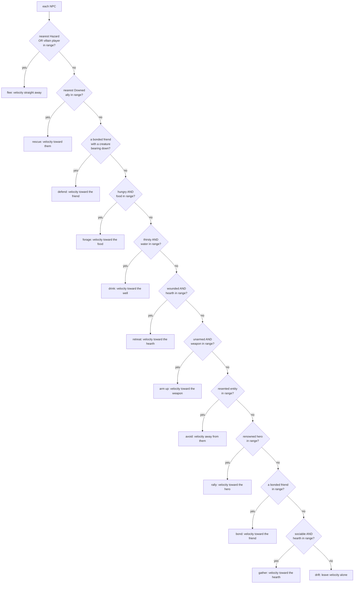

# NPC behaviour: the first steering

## What it is

The first thing an NPC does on its own. Until now NPCs were data that drifted;
the `steer_npcs` system gives each one a *decision* every tick. It started as one
choice — flee the nearest hazard — and has grown into a small **priority ladder** of
wants, still perception-then-action, still hard-coded leaves:

1. **Flee** the nearest `Hazard` (fear beats everything).
2. **Rescue** — run to the nearest **Downed** ally to haul them up (the first want about
   another *person*, added with the [Downed death beat](combat.md)).
3. **Forage** — if hungry, head for the nearest food orb (a `Pickup`).
4. **Arm up** — if unarmed, head for the nearest dropped `Weapon` (`npc_equip` wields it on
   reach), so colonists loot the battlefield and fight harder — the player==NPC gear parity.
5. Otherwise **drift**.

Every steer speed is scaled by `(1 - carried_move_penalty(move_penalty, attrs))` when the NPC is
**armed**, so a wielded weapon's heft slows an NPC exactly as it slows the player — the item's bane
bites both. Strength **eases** that heft (the carry mastery, see [progression](progression.md)): a
strong colonist shrugs off up to half the penalty, but the bane never fully lifts. At Strength 1 the
relief is zero, so an untrained colonist pays the full heft.

It is the seed of the engine's NPC AI (the master plan's sensors, blackboard, and
behaviour trees) — each rung is exactly the kind of leaf a behaviour tree will one day
select among.

- **`steer_npcs`** — a system that, for each NPC, senses the nearest target of each kind
  in priority order (hazard → downed ally → food) and sets its velocity accordingly.

## Why it matters

"NPCs are people, not units" is the game's first pillar. A unit follows a fixed
script; a person *reacts* to its world. This is the smallest honest version of
reacting: an NPC that notices danger and moves away from it. Everything richer —
seeking food, following orders, fighting — is the same shape with a different
decision at the centre.

## How it works

Each tick, **before anything moves**, `steer_npcs` runs over every NPC:

The first matching want wins and the NPC commits to it that tick (a `continue`), so a
fleeing NPC never also forages, and a rescuer drops its meal to save someone. Just below the
downed-rescue sits a **defend** rung — the active slice of the design's *PROTECT* stance: an idle
colonist **charges to a bonded friend** (often the player it fought beside, via
[camaraderie](relationships.md)) when a **creature is bearing down** on it, to stand and fight at its
side (`npc_attack` does the swinging once in reach). It reads the same bond as the gentle bond-pull
far below — but where bond-pull only *drifts* toward an idle friend, defend *rushes* to one in
danger and **outranks the colonist's own hunger**, exactly as the downed-rescue does (a friend in
peril beats a meal). Its reach scales with **bravery** — the courage to charge into danger for a
friend, the same growing radius the rescue rung uses — so, like every acting rung, it reads a trait.
The **two survival
needs** are the one exception to strict rung order: hunger is drawn above thirst, but they're
resolved by **urgency** — a colonist seeks whichever need is the *more depleted* (lower
`current/max`), so the hunger rung defers to thirst when the canteen is emptier than the belly (and
a well is actually in reach — an unreachable thirst never blocks a meal it *can* get to). Nobody
dies of thirst standing next to a well just because hunger is checked first. Just below the needs
sits a **retreat** rung: a *wounded* colonist (health below half) **or a *chilled* one** (warmth below
half — the temperature Need's seek want) falls back to the nearest
[`Hearth`](stats-system.md) to mend in its warmth *and re-warm by its fire*, then **holds** once inside
its radius — so the fire becomes a *used* landmark, wounded and cold colonists gathering to recover.
(A warm, unhurt colonist skips it exactly as before, so the chilled clause is dormant without a cold
zone — bit-identical.) And the retreat now *shakes
the hunt*: creatures won't chase prey into the hearth's glow (`chase_prey`, see [combat](combat.md)),
so a pursued colonist that reaches the fire loses its chaser — safe from being *hunted*, though a
spitter or an already-adjacent beast can still land a hit, so it's breathing room, not full cover. It ranks below the needs on
purpose (a starving colonist can't heal anyway, so it eats first) and above arming up (survive before
you gear). One load-bearing detail in the rescue rung, shared by this retreat hold: an NPC *already*
within range holds position rather than steering, so it doesn't nudge itself back out before
`handle_deaths` (later the same tick) hauls the ally up. And every steer speed is scaled
down while the NPC is armed — the weapon's heft slows it, so the buff it wields is paid
for exactly as the player pays (the item's bane bites both) — **and** by exhaustion: a colonist
that has drained its stamina to 0 by moving crawls at `kExhaustedMoveScale`, the same tireless-no-more
rule the player pays, since NPCs drain and recover stamina through the identical `update_stamina`.
**And** by STARVATION: a hungry or parched colonist trudges too — `need_efficiency` (the same debuff
that saps its swing, floored at half) scales the very same `move_scale`, so a weak body is sluggish on
every rung, even on its way to the food that would lift it (see [the stats system](stats-system.md)).
A tired, armed, starving colonist really trudges — all three factors stack into `move_scale`.

Two details carry the whole idea:

It is a **system, not a command** — the NPC's own behaviour, so it changes
velocity directly. The command funnel is only for intent from *outside* the sim
(the player's keys, later the network); an NPC's choices are the sim's own rules.

It **must run before `integrate_motion`**, because it sets the velocity that
integration turns into movement *this same tick*. As with death-before-heal, the
order of the calls in `step()` is load-bearing.

The ECS filter does the targeting for free: `view<Npc, Transform, Velocity>` skips
the player (no `Npc`) and the motes (no `Npc`) without a single `if`.

### Personality: bravery shapes the flee distance (the P7 seed)

The flee rung no longer treats every colonist alike. A new **`Personality`** component
carries the design's first **P7** axis — **`bravery`** (an `int8` in `[-100, +100]`) — and
`steer_npcs` reads it to scale the danger sense radius: `kSenseRadius × (1 − bravery/200)`. A
**coward** (−100) senses a hazard from 1.5× as far and **bolts early**; a **brave** colonist
(+100) shrinks its radius to half and **holds** until the hazard is nearly on top of it.
Neutral `0` — or no `Personality` at all — is the base radius exactly, so this is bit-identical
for anyone without a leaning. (The player carries a *neutral* `Personality` now, but it isn't an
`Npc`, so `steer_npcs` never reads it — this flee logic is untouched by the player either way.)
**Wisdom** widens that same
radius by a second, independent factor (`× (1 + (WIS−1)·0.05)`, capped at 2×, like the dodge/crit
clamps) — bravery is your *nerve* (how close
you let danger get), Wisdom is your *perception* (how far you see it coming), so a **wise coward** is
hyper-alert while a **wise but brave** colonist spots danger early yet holds; WIS 1 (untrained) is
×1, so it too is bit-identical until foraging trains it. A **third** factor is social — **courage in
numbers**: a *bonded friend* (affinity ≥ `kBondPull`) standing within `kCourageRadius` shrinks the
sense radius another `15%` each (capped at half), so a colonist **holds its ground** beside a friend
where it would bolt alone — the passive, positive mirror of grief (a friend's *death* shakes the
nerve; a friend's *presence* steadies it). No bond in range → factor `1.0` → bit-identical. The
opening four NPCs get
a fixed spread (two cowards, two brave) so you can watch the difference from the first frame;
reinforcements roll a coherent *archetype* (bravery among its axes) from the spawner's *own*
isolated RNG stream. And a colonist's axes aren't frozen for life: its own **deeds drift** them —
a fighter grows braver, a rescuer more compassionate — *and so does **loss**: a colonist whose
bonded friend is slain grieves, its bravery shaken down a step* (see [Morality](morality.md)).

Bravery reads a **second time** on the rescue rung, which is where it becomes a real character
trait rather than a flee tweak: it scales how far an NPC will *commit* to saving a downed ally.
A **brave** colonist crosses the field to reach one (`kRescueRadius × (1 + bravery/200)` grows);
a **coward** won't make the risky trek and only helps an ally close by (the radius shrinks). The
sign is deliberately **opposite** the flee radius — braver *shrinks* the flee radius (holds
ground) but *grows* the rescue radius (commits further) — so on both rungs "braver" is the
courageous choice. That two-behaviour payoff is what makes `Personality` earn its keep on its
second use, not a one-off. Layered *on top* of that personality radius, a **relationship** now
grades the same reach: the fallen's distance is discounted by the rescuer's `affinity` toward it,
so a **bonded** ally (one it has saved before) is worth a longer trek while a mild dislike shortens
it — down to the hard grudge cutoff where the resented are abandoned outright (see
[Relationships](relationships.md)). Bravery is *who* the colonist is; affinity is *who the fallen
is to them*. And **standing** grades the trek too, both ways: a fallen **villain** (`standing ≤ −kKnownAt`)
is abandoned by *everyone*, grudge or no — the [villain-veto](morality.md), checked here and again at
the actual haul-up in `handle_deaths` so a colonist never approaches one it would then refuse to lift —
while a fallen **hero** (`standing ≥ +kKnownAt`) is *discounted the other way* (`kHeroReachDiscount`),
so the colony rushes to a downed champion from farther, even a stranger. Fame reaches; infamy is left.

A **second axis, `greed`**, proves `Personality` bends to more than one *shape* of decision. It
reads the **forage** rung — not a radius but a **need threshold**: the effective "am I hungry?"
fraction is `kHungerSeekFraction × (1 + greed/200)`, so a **greedy** colonist (+greed) breaks off
to hoard an orb while still well-fed, and a **selfless** one (−greed) leaves food for others and
only forages when genuinely hungry. Because it scales a threshold rather than a distance, it
isn't a bravery reskin — it demonstrates the axes generalise across different mechanisms.

A **third axis, `compassion`**, reads the rescue rung again — but a *third* knob-shape: not a
radius or a threshold but the rescue **speed**. `velocity = … × kRescueSpeed × (1 +
compassion/200)`, so a **compassionate** colonist *sprints* to a fallen ally where a **callous**
one trudges — and at the low end physically can't beat the ~5s Downed timer, so the trait
decides not just *how* it moves but *whether the save lands*. The rescue rung is now a two-axis
decision: **bravery** = whether I'll cross the field to help, **compassion** = how urgently once
I've committed.

A **fourth axis, `industry`**, personalises the *last acting* rung — **arm up**. It scales the
weapon-seek radius exactly the way bravery scales the flee/rescue radii — `kWeaponSeekRadius × (1 +
industry/200)` — so an **industrious** colonist crosses the field to loot a dropped weapon and
better its kit, while an **idle** one only grabs a blade practically underfoot. It deliberately
*reuses* the radius mechanism rather than inventing a fourth one: the payoff isn't a novel knob but
the coherence it completes — every acting rung *then* read a trait (flee & rescue-radius = bravery,
rescue-speed = compassion, forage-threshold = greed, arm-up-radius = industry). Neutral 0 is the base
radius exactly (bit-identical).

A **fifth axis, `sociability`**, keeps that invariant true when the ladder grows. The morality
**rally** rung (see the Morality section below) added a *new* lowest-priority want — gather round a
renowned hero — that was at first trait-blind; sociability now scales *its* radius the same way,
`kRallyRadius × (1 + sociability/200)`, so a **sociable** colonist
crosses the field to join the throng while a **loner** stays put unless the champion is nearly
underfoot. Sociability reads a **second time** on the ladder's new *last* rung — **hearth gather**:
with no hero to rally to and no bonded friend to follow, a sociable colonist ambles to the nearest
[`Hearth`](stats-system.md) to gather round the fire — and **holds** there once inside (velocity
zeroed), the twin of the wounded-retreat rung's hold, so it doesn't coast straight through the fire
and out the far side (`steer_npcs` never damps velocity). So the hearth is a *peacetime* social hub,
not only the field hospital the wounded-retreat rung makes it. Here the radius is **proportional** to
sociability (`kHearthGatherRadius × sociability/100`), a deliberately different shape from the
base-plus-offset rally/bond radii: a neutral, solitary, or personality-less colonist has a
0-or-negative radius and so **never** seeks the fire — the indifferent keep to themselves, which is
also what keeps the pre-gather world bit-identical. So the rule holds again: **every acting rung of
the steer ladder reads a trait**. The
opening four NPCs get a fixed bravery/greed/compassion/industry/sociability/loyalty spread — with
sociability the *inverse* of industry (idle-socialites then keen-loners) and loyalty a reverse
alternation — each a distinct six-axis combo, so the personalities read from frame one.

Ongoing **reinforcements** don't get that hand-authored spread — they follow the design's *"NPCs
roll an **archetype** + jitter"*. Each arriving colonist picks one of a handful of coherent presets
(a dependable **Stalwart**, a self-serving **Rogue**, a caring **Kindler**, a tireless **Drudge**)
and wobbles each axis a little, so the colony stays as varied as the openers — and *coherent* (a
recognizable character), not a random stat-blob — instead of drifting toward neutral as the first
four die. The roll is deterministic (the spawner's own isolated RNG stream, draws sequenced) and now
spans **all six wired axes** (a **Rogue** is a greedy, fickle loner; a **Stalwart** a brave and
*loyal* backbone). The design's other archetypes (Schemer, Zealot, Loner, Firebrand) join once the
richer social layer gives more to tell them apart.

A **sixth axis, `loyalty`**, completes the set — the one the [relationships](relationships.md) seed
was built to unblock. It scales the bond-pull radius (the personal twin of the hero-rally) the same
way sociability scales the public one: `kBondRadius × (1 + loyalty/200)`, so a **loyal** colonist
crosses the field to stay near a bonded ally (one it rescued) while a **fickle** one follows only a
friend underfoot. So **all six personality axes now read a behaviour**, and every acting rung of the
steer ladder reads a trait — the smallest honest seed of the master plan's personality layer, now
whole.

And you can now *see* it: the renderer tints each colonist's dot by its **bravery** — the brave
warm toward yellow, the cowardly cool toward teal, green left untouched so a tinted NPC stays
green-dominant (never confused for an enemy or the player). It's a pure `personality_tint`
helper (the twin of `wounded_brightness`), a colour multiplier the sim never reads — so the
brave/coward spread `build_scene` seeds reads at a glance. (The warm/cool palette is a tuning
knob, eyeballed in the live renderer; greed is left untinted for now — a second-axis cue wants a
channel this one doesn't already use.)

### Morality: the colony fears a villain (standing's first gameplay reader)

The danger rung reads more than physical hazards now. A **player whose deeds have marked them a
villain** — `standing` at or below the *Suspect* line (`-kKnownAt`) — is folded into the same flee
check as a hazard, so colonists **run from a wrong'un** exactly as they run from a mote. This is the
first time `standing` changes the **simulation** rather than just the HUD: [morality](morality.md)
could raise or sink your repute, but until now nothing in the world *acted* on it. Cruelty finally
bites.

It reuses the machinery already there: the villain competes with hazards for the *nearest* threat,
and the same **bravery**-scaled radius applies — a brave colonist lets a villain get closer before
bolting. A downed villain is excluded from *this* rung (a helpless body is no threat, so fear yields)
— but it is no longer saved either: the **rescue** rung now reads standing and **abandons** a downed
villain (the [villain-veto](morality.md), above), so the colony neither flees nor lifts it. Three
deliberate limits keep the *fear* read honest, all noted in the
code: it is **player-only** (only a player can turn villain today, since Cruelty is player-gated), a
**binary** flee (the design's graded *perceive* — wariness scaling to flight by standing *and* the
onlooker's own might — is a later ring), and a threshold set at *Suspect* so a few cruel strikes
visibly turn the colony against you. A hero or an unproven player reads as no threat at all, so the
pre-cruelty world is bit-identical.

The **hero twin** completes the mirror: standing reads *both* ways now. Near the *bottom* of the
ladder — reached only by a colonist with nothing to flee, rescue, forage, drink, mend, arm toward, or
avoid — an **idle** colonist drifts *toward* a player whose deeds have earned **`standing ≥ +kKnownAt`**
(the *Known* line, the exact positive mirror of the *Suspect* villain it flees at the top). The colony
**gathers around its champion**. It is deliberately a **low** priority (fear is the highest, the
personal bond below it lower still): a
hungry or endangered colonist ignores the hero, so rallying never overrides a real need — it only
fills the idle moments a colonist would otherwise spend drifting. Same guards as fear: player-only,
and below the *Known* line (a neutral or villain player) it pulls nobody, so that world stays
bit-identical too. Villainy **repels**, heroism **attracts** — the two faces of one scalar.

Where the villain-fear reads *public* `standing`, a quieter rung reads *personal* affinity: a new
**avoid** rung (just above the gather rungs) steers an idle colonist **away** from anyone it holds a
grudge against — the active twin of the [relationships](relationships.md) bond-pull that draws it
*toward* a friend. So a player who strikes one colonist is shunned by *that* colonist — kept at
arm's length as well as [refused a rescue](relationships.md) — long before enough cruelty sinks their
`standing` and the *whole* colony flees. It reads **bravery** for its keep-away radius (a coward
recoils from further) and ignores a **downed** target (you don't flee a helpless body), so the
abandonment rung stays byte-identical. Personal grudge and public reputation now *both* push a cruel
player away, at two different ranges.

Just above the grudge-avoid sits an **avoid-the-cold** rung: an otherwise-idle colonist standing in a
[`ColdZone`](stats-system.md) drifts **out** of it — radially away from the zone, the shortest way to
its edge — so a wanderer doesn't linger in the chill and start freezing. It's the *prevention* half of
the temperature Need, the complement of the hearth-retreat's *recovery* (a colonist that has already
chilled outranks this and heads to the **fire**, not just out of the cold). With no `ColdZone` it's
dormant, so a world without cold steers exactly as before — bit-identical.

### Aspiration: a warrior goes looking for a fight (the first proactive rung)

Every rung so far is a **reaction** — flee a threat, rescue a friend, feed a need, mend a wound,
avoid a rival, step out of the cold. A new **`Aspiration`** component adds the ladder's first
**proactive** want: a *dream* the colonist pursues when nothing is pressing. The one kind wired today
is **`Warrior`** — a colonist that dreams of battle. Reaching the idle end of the ladder (nothing to
fear or need), it **goes looking for a fight**: it steers toward the nearest creature within
`kHuntRange` and **charges**. It doesn't do the fighting *here* — [`npc_attack`](combat.md) already
strikes the nearest creature in Strength-reach every tick, so once the charge closes the gap the blows
land on their own; this rung only supplies the *intent to close it*.

It sits **above** the idle rally/bond/gather rungs (a warrior seeks battle rather than loiter by the
fire) but **below** every need and fear — so the drive is **self-limiting**. A hungry, cold, or
wounded warrior tended that first on a rung above (a wounded one already retreated to a hearth to
heal), and only a **hale, content** one hunts. And because creatures aren't a flee threat for an
un-panicked colonist, a warrior that charges in **stands and trades blows** — glory or death, its
choice.

The gate that keeps every other colonist — and every existing scene — **bit-identical** is the
component itself: it is **default-absent**, so the hunt rung is a no-op for anyone without it. Nobody
in the opening scene, and no test colonist, carries one; only the **brave reinforcements** that wander
in over a long run are given the `Warrior` dream (keyed on the personality already rolled — no extra
RNG, so the spawner's stream is unchanged). So the world stays proactive-free until a bold newcomer
arrives to hunt.

!!! info "Greedy and memoryless — on purpose"
    It flees the *single nearest* threat, with no memory. An NPC can dodge one
    mote straight into another. That is fine: real steering behaviours (Reynolds)
    blend many influences, and this is deliberately the one-decision version. Write
    the concrete thing first; add the blend on the second real need.

### Terrain: a mire drags on whatever the ladder chose

The steer ladder decides a *direction and speed*; the **ground** then gets a say. A **`MireZone`** — a
boggy patch of mud — is the first piece of terrain that touches movement: `slow_in_mire` scales the
velocity of anyone standing in it by the mire's `slow_factor` (**0.4** = a crawl to ~40% speed). It is
**not a rung** — it doesn't decide *where* to go, it drags on the choice already made, so a colonist
fleeing, foraging, or charging across the mud all bog down the same way. It slows **player, NPC, and
creature alike** — mud doesn't care who you are, which makes it *tactical* from both sides: lead a
charging brute through it to gain ground, or get caught fleeing across it. The one exception is the
ambient **motes** (`Hazard` drifters): they're the one mover nothing re-drives each tick, so slowing
them *in place* would compound to a dead stop they never recover from — the mire is **agent** terrain
(things that re-choose their heading each frame), so a mote just drifts on through (`exclude<Hazard>`).

The **ordering is load-bearing**: `slow_in_mire` runs *after* every velocity-setter (the command
funnel, `steer_npcs`, `npc_guard`, `chase_prey`) and *just before* `integrate_motion`, so it scales the
*final* velocity — the one about to be applied. Those setters overwrite velocity fresh each tick, so
stepping off the mud restores full speed next frame with no drag to undo, and the slow composes
**multiplicatively** with the exhaustion crawl and the equip-heft that are already baked in (a tired,
armoured colonist in a bog is slower still). Overlapping mires don't stack — the **stickiest** (smallest
`slow_factor`) wins, applied once, so it stays deterministic. With **no `MireZone`** placed the slow
view is empty and every velocity is untouched — a world without mud moves exactly as before,
bit-identical.

## What to expect

Spawn a mote (`Space`) near the green dots in the demo and watch them scatter — fleeing
still buys time, not immortality (some get cornered and die, permadeath). But there's more
life to watch now: a hungry colonist peels off to grab a dropped health orb; if *you* go
down, a nearby colonist breaks off and **runs to revive you** before your respawn timer
fires; and a slain **brute's dropped weapon** gets snapped up by whichever unarmed colonist
(or you) reaches it first — after which that NPC hits harder but moves a little slower. Four
wants, one ladder, chosen fresh each tick.

## The tradeoffs

- **O(NPCs × hazards) per tick.** Fine for a handful; a crowd needs a spatial
  grid — the same upgrade `resolve_contacts` wants, done once for both.
- **Mostly constants, not components.** Flee speed is still `constexpr`; the sense
  radius has now taken the first step off that — it's personalised per-NPC by
  `Personality::bravery` (see above), the pattern a scout-that-sees-farther would extend.
  The rest stay constants until a behaviour actually needs to vary them.

## Where it goes next

This is one hard-coded decision. The game needs many, chosen by situation — the
master plan's **behaviour trees** (C++ structural nodes, Luau leaves). `steer_npcs`
becomes one *leaf* ("flee threat") among many ("gather", "build", "guard"),
selected by a tree the NPC walks each tick. The perception half grows into a
**blackboard** — what an NPC knows — fed by sensors. The shape you see here, look
then act, is what stays.

## Key files

- `engine/sim/systems.hpp` / `systems.cpp` — `steer_npcs` (the flee / rescue / defend / forage / drink / retreat-to-hearth-or-fire / arm-up / avoid-cold / avoid-grudge / **warrior-hunt** / rally / bond / hearth-gather ladder, speeds scaled by the equip bane; `Personality::bravery` scales the flee, rescue, defend, AND avoid radii (and `Attributes::wisdom` widens the flee sense radius too — awareness), `greed` the forage threshold, `compassion` the rescue speed, `industry` the arm-up radius, `sociability` the rally radius **and** (proportionally) the hearth-gather radius, `loyalty` the bond-follow radius; the flee rung also treats a **villain player** — `standing ≤ -kKnownAt` — as a threat, a **defend** rung (just below the downed-rescue) rushes an idle colonist toward a **bonded friend** a creature is bearing down on (`affinity ≥ kBondPull`, a creature within `kDefendThreatRadius`), an **avoid** rung pushes an idle colonist *away* from an entity it resents (`affinity ≤ kGrudgeThreshold`), a low-priority **rally** rung pulls an idle colonist toward a **hero player** — `standing ≥ +kKnownAt` — a **bond** rung (below rally) pulls it toward a bonded friend it likes, and a lowest **hearth-gather** rung ambles a sociable idle colonist to the nearest fire; the ladder's first **proactive** want, a **warrior-hunt** rung (just above rally), sends an idle colonist that carries an `Aspiration` of kind `Warrior` charging the nearest creature within `kHuntRange` (`npc_attack` lands the blows on arrival); `handle_deaths` does the revive at `kReviveDistance`; `npc_equip` + the shared `equip_nearest_gear` do the wield-on-reach.
- `engine/sim/systems.hpp` / `systems.cpp` — `slow_in_mire` (the terrain drag: scale the velocity of anyone standing in a `MireZone` by its `slow_factor`; runs *after* every velocity-setter and *before* `integrate_motion`; the stickiest overlapping mire wins, applied once; empty view when no mire → bit-identical).
- `engine/sim/components.hpp` — `Personality` (the P7 seed; all six axes wired: `bravery` + `greed` + `compassion` + `industry` + `sociability` + `loyalty`); `Aspiration` + `AspirationKind` (the first proactive drive, default-absent so it's dormant until seeded); `MireZone` (boggy terrain, default-absent scenery). `engine/sim/world.cpp` — `make_npc` sets `Personality` (hand-authored spread in `build_scene`; reinforcements roll `kArchetypes` + jitter via `roll_archetype`, and a *brave* one is given the `Warrior` `Aspiration`); `make_mire` places the bog (one west of centre in `build_scene`).
- `engine/sim/world.cpp` — the `steer_npcs` line in `step()` (before `integrate_motion`), `slow_in_mire` (between `chase_prey` and `integrate_motion`), and `npc_equip` (after it).
- `tests/sim/test_simulation.cpp` — flee / forage / rescue / revive-in-place, steer-to-weapon / NPC-arms-itself / armed-NPC-flees-slower (the equip bane parity), the villain-fear reader (a colonist flees a Suspect+ player; a downed villain is neither feared nor rescued — the villain-veto, in both steer and `handle_deaths`), and its rally twin (an idle colonist gathers to a Known+ hero, a real need overrides it, and below the line nobody is pulled), and `sociability` scaling how far an idle colonist travels to rally, the **warrior-hunt** (an idle `Warrior` charges the nearest creature; without the aspiration it stays put; and fear outranks the hunt), and the **mire** (velocity scales inside a bog but not outside; overlapping mires apply the stickiest factor once).

## Go deeper

- [The tick and the systems](skeleton/tick-and-systems.md) — how `steer_npcs` is scheduled and why order matters.
- [Entities and components](skeleton/ecs.md) — why an NPC is a component set, and how the view targets them.
- [The stats system](stats-system.md) — the permadeath that fleeing tries to postpone.
- [Morality](morality.md) — `standing` and the Cruelty deed that turns a player into the villain this flee rung now reads.
- [Relationships](relationships.md) — the directed bonds the bond-follow steer rung (below the hero-rally, above the hearth-gather) reads: an idle colonist drifts toward a friend it rescued.
