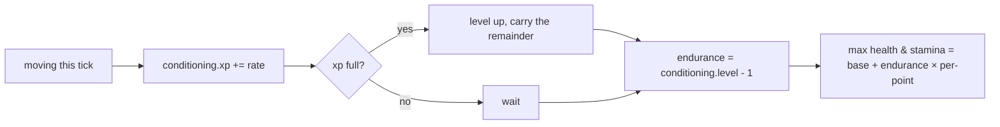

# Progression: skills feed attributes

## What it is

Characters grow by *doing*. A **skill** improves with the activity that trains it,
skills roll up into broad **attributes**, and attributes shape the **vitals** you
feel in play. The first slice wires one strand of that end to end: staying active
trains a **Conditioning** skill → which raises the **Endurance** attribute → which
grows your **max health and stamina**. The player and NPCs run the identical
machinery, so a long-lived NPC gets genuinely tougher — no special-casing.

## Why it matters

You asked for two things: the player should grow and *feel* stronger over time,
and NPCs should grow too. "Learn by doing" delivers both from one mechanism — the
activity *is* the training, so growth happens organically as the world is played,
for a person or an NPC alike. It is the same pillar as permadeath: NPCs are people,
and people change.

## How it works

One system, `advance_progression`, runs each tick over every entity that has
`Skills`, `Attributes`, `Stats`, and `Velocity` — four steps, top to bottom:

1. **Activity earns XP** — moving trains conditioning (the same "is it moving?"
   signal `update_stamina` reads). Standing still trains nothing.
2. **A full bar levels the skill** — a `while` loop, so one big grant can cross
   several levels and carries the remainder forward.
3. **Skills feed attributes** — `endurance` follows `conditioning.level` (level 1
   is zero bonus, so a fresh character is unchanged).
4. **Attributes shape derived stats** — more endurance means bigger pools. Only
   the **max** grows: you get a longer bar, not a free heal, and regen fills the
   new room over the next seconds.

Because the view targets `Skills + Attributes + Stats + Velocity`, it lands on the
player and the NPCs and skips the motes — one system, everyone who should grow.

!!! info "Learn by doing, not spend points"
    There is no XP pool to allocate and no level-up screen. Doing the thing levels
    the thing (Skyrim / UnReal World lineage). Attributes are *recomputed* from
    skills every tick, never set by hand, so a skill and its attribute can never
    drift out of sync.

## What to expect

Move around the demo and watch the panel: the conditioning bar fills, ticks over
to level 2, `endurance` becomes 1, and the health and stamina bars lengthen as the
bigger pools take hold. The NPCs are doing the same thing off to the side — one
that survives a while is measurably harder to kill than a fresh arrival.

## The balancing dial

You flagged NPC growth as something to tune, and this is built so tuning is a
*number*, not a rewrite:

- The whole curve is one constant (`xp_to_next` is linear in level). Right now NPCs
  train at the **same** rates as the player; a per-entity or per-faction multiplier
  is the knob that keeps their growth in check, and it slots into step 1.
- It is deliberately **one** skill → **one** attribute → **one** effect. Strength
  (→ attack damage), Agility (→ move speed), and more skills are more fields plus
  the activity that trains each — the same three-layer shape, widened.

## Where it goes next

More skills, each with an activity that trains it; more attributes, each shaped by
its skills and feeding a different derived stat or system. Then the balancing pass
for NPC growth against the player's. The shape you see here — activity → skill →
attribute → stat — is what stays as it widens into a full character sheet.

## Key files

- `engine/sim/components.hpp` — `Skill`, `Skills`, `Attributes`.
- `engine/sim/systems.hpp` / `systems.cpp` — `xp_to_next`, `advance_progression`.
- `engine/sim/world.cpp` — `Skills`/`Attributes` on the player and NPCs; the `advance_progression` line in `step()`.
- `game/app/main.cpp` — the endurance readout and conditioning XP bar in the panel.
- `tests/sim/test_simulation.cpp` — activity trains-and-grows, and idle trains nothing.

## Go deeper

- [The stats system](stats-system.md) — the vitals Endurance grows.
- [The tick and the systems](skeleton/tick-and-systems.md) — where `advance_progression` sits in the tick.
- [NPC behaviour](npc-behaviour.md) — the other thing NPCs now do on their own.
