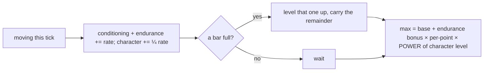

# Progression: skills feed attributes

## What it is

Characters grow by *doing*. A **skill** improves with the activity that trains it,
skills roll up into broad **attributes**, and attributes shape what you feel in play.
Fourteen strands are wired end to end so far, across all seven attributes:

- staying active trains **Conditioning**, **surviving damage** trains **Toughness**,
  **resting to recover** spent stamina trains **Recovery**, **turning a blow with a raised
  guard** trains **Guarding** (`resolve_creature_contacts`, Toughness's *active* twin — grow
  Endurance by *blocking* a hit rather than *surviving* it), and **enduring venom** trains
  **Resistance** (`tick_poison`, Toughness's *poison* twin — keep shrugging off venom and you grow
  the very VIT that shaves it, immunity through exposure) — all five raise
  **Endurance**, which grows your **max health and stamina**, speeds how fast
  stamina comes back, softens the venom you take, *and* lets you **bear armour** better (a hardy body
  shrugs off part of plate's stamina-recovery bane, `borne_regen_penalty` — the armour twin of
  Strength's weapon carry);
- **attacking** trains **Striking**, which mainly raises **Strength** (plus a little
  **Dexterity** — footwork), and Strength lengthens your
  **attack reach**, your **attack damage**, *and* how much of a wielded weapon's **heft** you
  shrug off (the design's **carry**) — against the hostile **creatures** (red
  dots with HP that hunt you), a higher Strength kills faster, while your Endurance
  (VIT) softens the blows they land. Damage is `Strength`-vs-`VIT` ratio mitigation. The **carry**
  effect is the design's *mastery shrinks a bane but never removes it* rule applied to equipment: a
  weapon slows you (`Equipped::move_penalty`), and each Strength level eases that heft
  (`carried_move_penalty`) up to a **half** floor — so a strong wielder moves nearer its unarmed pace
  but a weapon *always* costs some speed, on the player and NPCs alike;
- **facing a creature's swing** trains **Evasion**, and **sprinting** (a burst of speed) trains
  **Athletics** — both raise **Dexterity**, your
  chance to **dodge** a blow entirely (and creatures dodge yours — see
  [combat](combat.md#slipping-the-blow-evasion-dexterity)). Athletics is Conditioning's *burst* twin:
  steady movement builds Endurance, a **sprint** builds the agility (DEX) that sharpens dodge *and*
  throw-aim — so a kiter who dashes a lot becomes genuinely harder to hit (player-triggered, like
  Throwing, since only the player sprints);
- **collecting loot** trains **Scavenging**, which raises **Luck** — fortune with *two* effects: your
  chance to land a **critical hit** for doubled damage (see
  [combat](combat.md#lucky-strikes-crits-luck)) **and** how much **health a found orb restores** (the
  design's *richer finds / quality* — `collect_pickups` scales the orb's heal by `1 + (LCK − 1)·0.1`,
  capped ×2). So a lucky scavenger both crits harder *and* mends more from the same loot, and the
  loot→Scavenging→Luck loop feeds both;
- **landing a thrown hit** trains **Throwing**, which raises **Dexterity** (aim — plus a little
  **Strength** for hurl power), the ranged mirror of Striking (see [combat](combat.md));
- **grazing a food plot** trains **Foraging**, which raises **Wisdom**, the first *non-combat*
  attribute — each level lets you draw **more food per second** from a patch **and** sharpens
  **danger awareness** (a wider flee sense radius in `steer_npcs`, a distinct source from bravery's
  nerve). So the design's WIS = *nature + awareness*: a seasoned forager both gathers more and spots
  trouble sooner. It's the loot loop's survival twin (gather food → Foraging → Wisdom → forage faster
  *and* stay alert), and Wisdom doesn't grow the pools or a fighter build;
- **public heroism with allies watching — felling a foe *or* hauling up a downed ally** — trains
  **Leadership**, which raises **Charisma**, the second *non-combat* attribute (the design's **social**
  stat), with **two** effects — depth *and* reach. Each level deepens the **camaraderie** a witness
  feels toward you per heroic act (the shared
  `bond_witnesses` grant, at a kill *and* a rescue, see [relationships](relationships.md)), up to a ×2
  cap; **and** it widens the **reach** — how far a deed is witnessed and admired (`kCamaraderieRadius`
  scales with Charisma, up to ×1.5), so a charismatic champion's heroism inspires **more onlookers**,
  each **more deeply**. So Charisma **compounds** twice over: a champion who fights and saves beside
  its colony forges ever-deeper bonds with an ever-wider ring the more it leads (be seen being heroic →
  Leadership → Charisma → allies bond harder *and* from farther), the
  social mirror of a striker building Strength by hitting. Like Wisdom it grows neither the pools nor a
  fighter build — it grows the colony's *bonds*.
- **casting a spell** (a `magic_bolt`, the **C** command) trains **Spellcasting**, which raises
  **Intellect** — the **seventh** attribute, completing the set, and the design's **magic** stat. Each
  level sharpens a bolt's damage, the arcane mirror of Strength on a swing. Magic is *learned*: only a
  caster who carries the Spellcasting skill can cast at all (see [magic](magic.md)), so Intellect grows
  by casting the way Strength grows by striking — but from a power you earned the right to use.
- **teaching a nearby novice** (`teach`) trains **Teaching**, the **second** feeder of **Charisma**
  beside Leadership — *leading by instruction*. This one is different in kind: it's the first strand a
  colonist grows from **another person**, not its own toil. A colonist far ahead in a skill passes it
  to a much-lower one standing near — the student gains XP in that skill (learning it if new), the
  mentor grows Teaching → Charisma. So a craft **spreads** through the colony beside its master, not
  only by each hand's own doing. It needs a real skill **gap** to fire (a mentor at level ≥ 3, a
  student well behind), which can't exist at spawn — so it emerges only after a colony has veterans.

The player and NPCs run the identical machinery — progression *and* combat — so a
long-lived NPC that has moved, been hurt, and fought grows genuinely tougher and
stronger, no special-casing. The only difference is *how the swing is triggered*: the
player attacks on command (`J`), while NPCs attack through the `npc_attack` system
(strike the nearest threat in reach). Both run the same `perform_attack` resolver, so
both build Strength the same way.

## Why it matters

You asked for two things: the player should grow and *feel* stronger over time,
and NPCs should grow too. "Learn by doing" delivers both from one mechanism — the
activity *is* the training, so growth happens organically as the world is played,
for a person or an NPC alike. It is the same pillar as permadeath: NPCs are people,
and people change.

## How it works

One system, `advance_progression`, runs each tick over every entity that has
`Skills`, `Attributes`, `Stats`, `Velocity`, and `CharacterLevel` — four steps, top
to bottom (movement is shown; damage is a second feeder, see the note below):

1. **Activity earns XP for the skill *and* the attribute(s) it feeds** — every grant now
   flows through one funnel, `grant_skill_xp`, which reads a data-driven **`SkillDef`**
   table: it trains the skill, gives its **main** attribute the full share, and gives each
   **contributor** attribute a fraction. Moving trains `conditioning` → **`endurance`** (its
   main, no contributors). **Attacking** trains `striking` → **`strength`** (main) **and a
   quarter to `dexterity`** (contributor) — so a pure striker slowly picks up a little
   footwork, the design's "you are what you do" cross-training. Through that same funnel a
   **quarter-share** of *every* grant also feeds the global **`CharacterLevel`** — so **all**
   activity grows the veteran layer (moving, resting, striking, enduring blows, looting), not
   just walking. Standing still trains nothing.
2. **A full bar levels it up** — the same `while`-loop carry works on the skill,
   the attribute, and the character level; each has its own `{level, Fixed xp}` and
   climbs independently. (XP is a `Fixed` so 20/sec accrues cleanly as ~0.33 per
   60 Hz tick — an `int` would round every tick's gain to nothing.)
3. **The attribute's level shapes derived stats** — each Endurance level past the
   first adds to the pools, on top of each Vital's own `base`. Only the **max**
   grows: a longer bar, not a free heal, and regen fills the new room in.
4. **The character level compounds the earned bonus** — that pool bonus is scaled
   by `POWER(character level − 1)`, the same diminishing curve skills use. Level 1
   is `POWER(0)` = 1.0 (no head start); a veteran's earned toughness then compounds
   a little. It multiplies what you *earned*, never the base floor. The **same
   multiplier scales the earned Strength delta on combat damage** (`perform_attack`),
   so the veteran layer isn't just bigger bars — a seasoned fighter hits harder too.
   (Reach is left flat, so a veteran hits harder without changing which targets a
   swing can reach.)

!!! note "XP comes from many places; leveling happens in one"
    Step 1 grants **either** the *movement* XP (Conditioning) **or**, when idle with
    stamina to recover, the *resting* XP (Recovery) — both feed Endurance. Other
    activities feed skills from their own sites: **taking damage** feeds **Toughness**
    → Endurance (`train_on_damage`, wherever damage lands), and **attacking** feeds
    **Striking** → Strength (`perform_attack`, via the player's `Attack` command or the
    `npc_attack` system). Every one of those grants also drips a quarter into the
    **character level** (the funnel does it), so combat and looting build the veteran layer
    too — not just movement. Step 2's loop then levels *every* owned skill — plus both
    attributes and the character level — so those climb here too without `advance_progression`
    knowing where the XP came from. Many sources, one place they turn into levels.

Because the view targets `Skills + Attributes + Stats + Velocity + CharacterLevel`,
it lands on the player and the NPCs and skips the motes — one system, everyone who
should grow.

!!! info "Learn by doing, not spend points"
    There is no XP pool to allocate and no level-up screen. Doing the thing levels
    the thing (Skyrim / UnReal World lineage). Attributes are *recomputed* from
    skills every tick, never set by hand, so a skill and its attribute can never
    drift out of sync.

## What to expect

Move around the demo and watch the panel: the conditioning bar fills, ticks over
to level 2, `endurance` becomes 1, and the health and stamina bars lengthen as the
bigger pools take hold. The NPCs are doing the same thing off to the side — one
that survives a while is measurably harder to kill than a fresh arrival.

## The balancing dial

You flagged NPC growth as something to tune, and this is built so tuning is a
*number*, not a rewrite:

- The whole curve is one constant (`xp_to_next` is linear in level). Right now NPCs
  train at the **same** rates as the player; a per-entity or per-faction multiplier
  is the knob that keeps their growth in check, and it slots into step 1.
- Each strand is one skill → one attribute → one effect, and they compose freely:
  Endurance already has two feeders (Conditioning, Toughness), and Strength is the
  second attribute (via Striking → reach). More skills/attributes are more of the
  same fields plus the activity that trains each — the shape widens, it doesn't change.

## Where it goes next

More skills, each with an activity that trains it; more attributes, each shaped by
its skills and feeding a different derived stat or system. Then the balancing pass
for NPC growth against the player's. The shape you see here — activity → skill →
attribute → stat — is what stays as it widens into a full character sheet.

## Key files

- `engine/sim/components.hpp` — `Skill`, `Skills`, `Attributes` (Endurance, Strength, Dexterity, Luck, Wisdom, Charisma), the `AttrId` enum, `CharacterLevel`; the `SkillId` enum (`Conditioning`, `Toughness`, `Striking`, `Recovery`, `Evasion`, `Scavenging`, `Throwing`, `Foraging`, `Leadership`, `Guarding`, `Resistance`, `Athletics`, `Survivalist`).
- `engine/sim/systems.cpp` (anon namespace) — the `SkillDef` table, `attr_ref`, and `grant_skill_xp` (the one funnel every skill→attribute XP grant flows through: main + contributors).
- `engine/sim/systems.hpp` / `systems.cpp` — `xp_to_next`, `advance_progression` (movement→Conditioning / resting→Recovery), `update_stamina` (Endurance speeds recovery), `train_on_damage` (the damage → Toughness feeder), `perform_attack` (the shared swing resolver) and `npc_attack` (NPCs fight too).
- `engine/sim/command.hpp` / `world.cpp` — the `Attack` command (the striking feeder, computes reach from Strength); progression components on the player and NPCs.
- `game/app/main.cpp` — the endurance/strength/wisdom/charisma/character-level readout, each equipped item's remaining durability (hits/blows left), and the skill XP bars; the `J` = attack key.
- `engine/sim/systems.cpp` — `bond_witnesses` (the camaraderie grant, called at both a kill and a rescue): Charisma scales a witness's devotion, and a witnessed heroic act trains Leadership → Charisma (the compounding social loop).
- `tests/sim/test_simulation.cpp` — activity trains-and-grows, idle trains nothing, damage trains Toughness, attacking trains Striking → Strength, grazing trains Foraging → Wisdom (and a wiser forager yields more), collecting trains Scavenging → Luck (and a lucky scavenger mends more from an orb), leading trains Leadership → Charisma (and a charismatic champion is bonded harder AND witnessed from farther), blocking a blow trains Guarding → Endurance (but an open stance does not), enduring venom trains Resistance → Endurance (but an unpoisoned character does not), sprinting trains Athletics → Dexterity (but a plain walker does not), and Strength eases a weapon's heft up to a half floor (the carry mastery, on the player and NPCs alike), and Endurance eases an armour's stamina bane up to a half floor (the armour twin, isolated from its recovery boost by the armoured-to-bare ratio).

## Go deeper

- [The stats system](stats-system.md) — the vitals Endurance grows.
- [The tick and the systems](skeleton/tick-and-systems.md) — where `advance_progression` sits in the tick.
- [NPC behaviour](npc-behaviour.md) — the other thing NPCs now do on their own.
