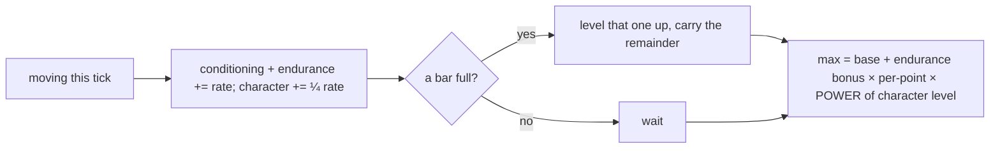

# Progression: skills feed attributes

## What it is

Characters grow by *doing*. A **skill** improves with the activity that trains it,
skills roll up into broad **attributes**, and attributes shape what you feel in play.
Three strands are wired end to end so far, across two attributes:

- staying active trains **Conditioning**, and **surviving damage** trains
  **Toughness** — *both* raise **Endurance**, which grows your **max health and stamina**;
- **attacking** trains **Striking**, which raises **Strength**, which lengthens your
  **attack reach**.

The player and NPCs run the identical machinery, so a long-lived NPC that has moved,
been hurt, *and* fought gets genuinely tougher and stronger — no special-casing.

## Why it matters

You asked for two things: the player should grow and *feel* stronger over time,
and NPCs should grow too. "Learn by doing" delivers both from one mechanism — the
activity *is* the training, so growth happens organically as the world is played,
for a person or an NPC alike. It is the same pillar as permadeath: NPCs are people,
and people change.

## How it works

One system, `advance_progression`, runs each tick over every entity that has
`Skills`, `Attributes`, `Stats`, `Velocity`, and `CharacterLevel` — four steps, top
to bottom (movement is shown; damage is a second feeder, see the note below):

1. **Activity earns XP for the skill *and* its main attribute** — moving trains
   the `conditioning` **skill** and, because Endurance is its main attribute, feeds
   **`endurance`** its own XP too. (A skill with several contributing attributes
   would split the share — the main a lot, the rest a little; conditioning has just
   the one, so it takes the whole share.) A **quarter-share** of the same activity
   also feeds the global **`CharacterLevel`**. Standing still trains nothing.
2. **A full bar levels it up** — the same `while`-loop carry works on the skill,
   the attribute, and the character level; each has its own `{level, Fixed xp}` and
   climbs independently. (XP is a `Fixed` so 20/sec accrues cleanly as ~0.33 per
   60 Hz tick — an `int` would round every tick's gain to nothing.)
3. **The attribute's level shapes derived stats** — each Endurance level past the
   first adds to the pools, on top of each Vital's own `base`. Only the **max**
   grows: a longer bar, not a free heal, and regen fills the new room in.
4. **The character level compounds the earned bonus** — that pool bonus is scaled
   by `POWER(character level − 1)`, the same diminishing curve skills use. Level 1
   is `POWER(0)` = 1.0 (no head start); a veteran's earned toughness then compounds
   a little. It multiplies what you *earned*, never the base floor.

!!! note "XP comes from many places; leveling happens in one"
    Step 1 grants only the *movement* XP. Other activities feed skills from their own
    sites: **taking damage** feeds **Toughness** → Endurance (`train_on_damage`, wherever
    damage lands), and **attacking** feeds **Striking** → Strength (the `Attack`
    command). Step 2's loop then levels *every* owned skill — plus both attributes —
    so those climb here too without `advance_progression` knowing where the XP came
    from. Many sources, one place they turn into levels: how the full model layers up.

Because the view targets `Skills + Attributes + Stats + Velocity + CharacterLevel`,
it lands on the player and the NPCs and skips the motes — one system, everyone who
should grow.

!!! info "Learn by doing, not spend points"
    There is no XP pool to allocate and no level-up screen. Doing the thing levels
    the thing (Skyrim / UnReal World lineage). Attributes are *recomputed* from
    skills every tick, never set by hand, so a skill and its attribute can never
    drift out of sync.

## What to expect

Move around the demo and watch the panel: the conditioning bar fills, ticks over
to level 2, `endurance` becomes 1, and the health and stamina bars lengthen as the
bigger pools take hold. The NPCs are doing the same thing off to the side — one
that survives a while is measurably harder to kill than a fresh arrival.

## The balancing dial

You flagged NPC growth as something to tune, and this is built so tuning is a
*number*, not a rewrite:

- The whole curve is one constant (`xp_to_next` is linear in level). Right now NPCs
  train at the **same** rates as the player; a per-entity or per-faction multiplier
  is the knob that keeps their growth in check, and it slots into step 1.
- Each strand is one skill → one attribute → one effect, and they compose freely:
  Endurance already has two feeders (Conditioning, Toughness), and Strength is the
  second attribute (via Striking → reach). More skills/attributes are more of the
  same fields plus the activity that trains each — the shape widens, it doesn't change.

## Where it goes next

More skills, each with an activity that trains it; more attributes, each shaped by
its skills and feeding a different derived stat or system. Then the balancing pass
for NPC growth against the player's. The shape you see here — activity → skill →
attribute → stat — is what stays as it widens into a full character sheet.

## Key files

- `engine/sim/components.hpp` — `Skill`, `Skills`, `Attributes` (Endurance + Strength), `CharacterLevel`; the `SkillId` enum (`Conditioning`, `Toughness`, `Striking`).
- `engine/sim/systems.hpp` / `systems.cpp` — `xp_to_next`, `advance_progression`, `train_on_damage` (the damage → Toughness feeder).
- `engine/sim/command.hpp` / `world.cpp` — the `Attack` command (the striking feeder, computes reach from Strength); progression components on the player and NPCs.
- `game/app/main.cpp` — the endurance/strength/character-level readout and the skill XP bars; the `J` = attack key.
- `tests/sim/test_simulation.cpp` — activity trains-and-grows, idle trains nothing, damage trains Toughness, attacking trains Striking → Strength.

## Go deeper

- [The stats system](stats-system.md) — the vitals Endurance grows.
- [The tick and the systems](skeleton/tick-and-systems.md) — where `advance_progression` sits in the tick.
- [NPC behaviour](npc-behaviour.md) — the other thing NPCs now do on their own.
