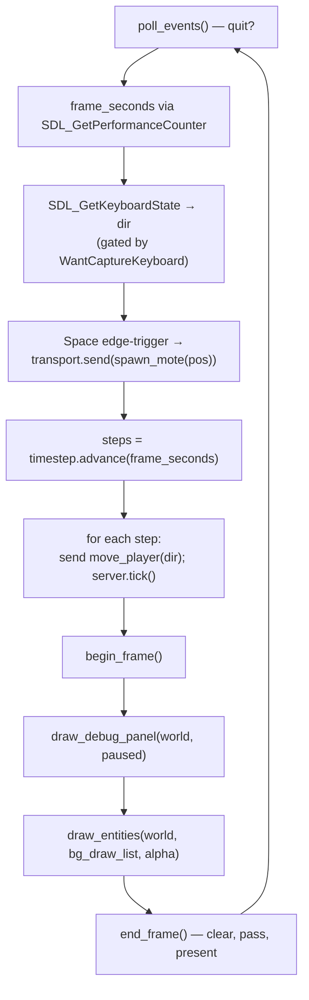

# The client and rendering

## What it is

The **client** is the top of the stack — `game/app/main.cpp` — and the **renderer** is the one module beneath it that is allowed to touch a graphics API. `eng::gpu::Renderer` (in `engine/gpu/renderer.hpp`) owns a window, an SDL_GPU device, and the Dear ImGui debug layer. Nothing above it ever sees an `SDL_GPUDevice`; the layers above deal in entities and pixel positions, and hand ImGui a list of things to draw.

`main()` wires the whole engine together and runs the frame loop: sample the keyboard, turn it into **Commands**, send them over the transport to the **Server** that owns the **World**, step the fixed-timestep simulation, then draw the world (interpolated) plus a debug panel.

!!! info "Needs a real display"
    `Renderer::create` returns `nullptr` on a headless machine (no window or no GPU). `main()` treats that as "there's no screen here" and exits cleanly — so this page's code does **not** run in CI. The simulation core is exercised headlessly instead; see `tests/sim/test_simulation.cpp`.

## Why it's built this way

The renderer is a **quarantine**. SDL_GPU is a C library with hand-managed resources and a strict call order; if those handles leaked upward, every future decision (swap to Vulkan directly, port the backend) would ripple through the whole engine. So all of it lives behind `Renderer`, and the header only forward-declares `SDL_Window`, `SDL_GPUDevice`, and `ImDrawList` — no SDL headers escape. See **[ADR-0009](../architecture/adr-0009-sdl-gpu-renderer.md)** for the GPU choice and **[ADR-0022](../architecture/adr-0022-imgui-slice-ui.md)** for the ImGui debug UI.

`Renderer` is an **RAII object**: `create()` is a static factory that acquires everything (or returns `nullptr` having logged why), and the destructor releases it in reverse order. It is non-copyable and non-movable — it lives inside a `std::unique_ptr`, so a caller cannot forget to destroy it or leak on an early return. This is the C++ idiom worth internalizing: ownership is the type.

## How it works

`Renderer::create` runs a fixed acquisition sequence, and each step bails out (cleaning up what it already built) if the machine can't provide it: `SDL_Init(SDL_INIT_VIDEO)` → `SDL_CreateWindow` → `SDL_CreateGPUDevice` → `SDL_ClaimWindowForGPUDevice` (wires the device's swapchain to the window) → ImGui context + the two backends `ImGui_ImplSDL3_InitForSDLGPU` (feeds it events) and `ImGui_ImplSDLGPU3_Init` (draws it). The destructor undoes it in the only safe order: `SDL_WaitForGPUIdle` **first** — releasing a resource the GPU is still using is undefined behaviour — then ImGui shutdown, then device, window, `SDL_Quit`.

Per frame the client calls three methods. `poll_events()` pumps OS events into ImGui and returns `false` when the window is closed. `begin_frame()` starts a new ImGui frame. `end_frame()` finalizes the UI (`ImGui::Render`), acquires a command buffer and the swapchain texture, and — **only if the swapchain is non-null** (it's null when minimized, which is not an error) — records one render pass that **clears** to dark blue-grey (`load_op = CLEAR`), draws, and **stores** the result; then `SDL_SubmitGPUCommandBuffer` presents it. World geometry would draw at the top of that pass; today only ImGui draws, and our entity dots ride along because they were added to ImGui's **background draw list** (`background_draw_list()` → `ImGui::GetBackgroundDrawList()`).

Here is one iteration of the `while (renderer->poll_events())` loop in `main.cpp`:

The timing is the load-bearing part. `frame_seconds` is real wall-clock elapsed time; `FixedTimestep::advance` converts it into an integer number of 60 Hz **steps** (0 when paused), and `timestep.alpha()` is the leftover fraction. Each step sends exactly one `move_player` Command per tick and calls `server.tick()` — the client's **only** way to mutate the world (see **[command-funnel.md](command-funnel.md)** and **[transport-and-server.md](transport-and-server.md)**). Rendering is decoupled: `draw_entities` interpolates each dot between its `PrevTransform` and `Transform` by `alpha` (`glm::mix`), so motion stays smooth between ticks — the render side of **[ADR-0002](../architecture/adr-0002-fixed-60hz-tick.md)** (**[tick-and-systems.md](tick-and-systems.md)**). It skips interpolation when a dot wrapped a field edge this tick, so it doesn't streak across the screen.

## Key files

- `engine/gpu/renderer.hpp` — the `Renderer` interface (RAII, forward-declared handles).
- `engine/gpu/renderer.cpp` — the entire graphics backend: `create`, the destructor, and the per-frame clear/pass/present.
- `game/app/main.cpp` — the client: wiring, the frame loop, `draw_entities`, `draw_debug_panel`, `world_to_screen`.

## Try it

To add a new debug readout, edit `draw_debug_panel` in `main.cpp` — it already reads `world.tick()`, the `Transform` storage size, and the player position, so add an `ImGui::Text(...)` line beside those.

To draw something new in the world, add to `draw_entities`: `renderer->background_draw_list()` is an `ImDrawList*`, so `dl->AddCircleFilled`, `AddLine`, `AddRectFilled` all work in screen pixels. Map world coordinates first with `world_to_screen`.

!!! tip "Where real 3D slots in"
    Scene geometry belongs inside the render pass in `end_frame()`, right after `SDL_BeginGPURenderPass` and **before** `ImGui_ImplSDLGPU3_RenderDrawData` — so the debug UI always draws on top. That comment marker is already in the code.

## Where it goes next

The renderer is deliberately the thinnest thing that shows the loop working: 2D dots on a draw list, no meshes, shaders, or camera. Roadmap **M1** adds real mesh/shader rendering as "draws inside the render pass, before ImGui"; the ImGui panel grows into the **M2** inspector. Nothing above `engine/gpu` has to change when that happens — that is the whole point of the quarantine. Start from **[index.md](index.md)** or **[extending.md](extending.md)** for the wider tour.
