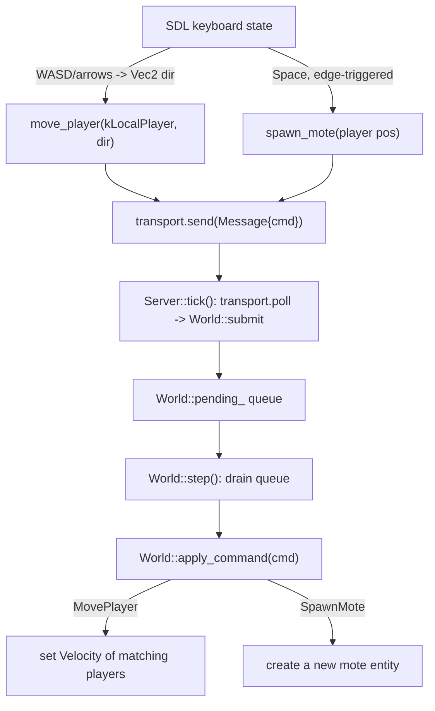

# The command funnel

## What it is

A **Command** is an *intent* to change the world — "player 1 wants to move left this tick", "spawn a mote here". It is plain data, never an action. The rule the whole engine is built around: **nothing mutates simulation state except by submitting a Command that a single function then applies.** Input handlers, the network, the debug UI, and (later) mods all produce Commands; **`eng::sim::World::apply_command`** in **`engine/sim/world.cpp`** is the only code that turns one into a state change.

Two command kinds exist in the skeleton, defined in **`engine/sim/command.hpp`**:

- **`CommandKind::MovePlayer`** — push a player's entity in a direction.
- **`CommandKind::SpawnMote`** — create a new drifting entity.

## Why it's built this way

One choke point for all mutation is what makes the hard features later *possible* rather than *retrofitted* — the reasoning is recorded in **[ADR-0004: one command funnel](../architecture/adr-0004-one-command-funnel.md)**.

- **Validation / anti-cheat.** Because every change carries a **`PlayerId`** and passes through one function, the server can authorize each command ("is player 1 allowed to do this right now?") before applying it. Clients can't cheat by writing state directly — there is no direct path.
- **Replay & determinism.** A recorded stream of Commands, fed to a fresh **`World`**, reproduces the whole game exactly (the `World` seeds its PRNG with a fixed value for this reason). That is the determinism test harness.
- **Networking.** That same Command stream is what a real transport serializes onto the wire. Single-player already sends Commands through **`ITransport`**; multiplayer swaps the implementation, not the funnel.
- **One breakpoint.** Every change to the world flows through `apply_command`. Put a log line or a breakpoint there and you see the whole game's mutation.

!!! info "Struct, not variant — for now"
    The skeleton models Commands as an `enum` plus a "tagged" struct rather than `std::variant`, to keep the code easy to read. As the command set grows, `std::variant` becomes the more type-safe choice — see the comment at the top of `command.hpp`.

## How it works

The `Command` struct is deliberately flat: a `kind`, a `player`, and one field per kind (`move_dir`, `spawn_pos`). Two convenience constructors let call sites read as intent instead of struct-filling:

```cpp
Command move_player(PlayerId player, Vec2 dir);  // kind = MovePlayer
Command spawn_mote(Vec2 pos);                     // kind = SpawnMote, player = kLocalPlayer
```

Follow one frame from keypress to state change (all in **`game/app/main.cpp`** unless noted):



1. **Input becomes data.** Each frame `main.cpp` samples the keyboard into a `Vec2 dir`. Space, edge-triggered, reads the player's current position and sends `spawn_mote(pos)`. Both are wrapped in an `eng::net::Message` and handed to `transport.send(...)`.
2. **One MovePlayer per tick.** Inside the fixed-timestep loop, the client sends `move_player(kLocalPlayer, dir)` then calls `server.tick()` — so movement intent is stamped one-per-tick, the unit replay and networking need.
3. **The server drains the transport.** `Server::tick` (in **`engine/net/server.hpp`**) polls every message received since the last tick and calls `world_.submit(msg.command)`, then steps the world once. The server is the only thing that steps.
4. **`World::submit`** just pushes the Command onto `pending_`, the funnel's queue. **`World::step`** drains that queue at the top of the tick, calling the private `apply_command` on each in order, before running any systems.
5. **`apply_command` routes by kind.** `MovePlayer` iterates the `view<PlayerControlled, Velocity>`, matches `pc.player`, and sets `Velocity = move_dir * pc.move_speed`. `SpawnMote` calls `make_mote` at `spawn_pos` with a random velocity. That `switch` is the entire mutation surface of the engine.

!!! warning "Commands set intent; systems do the work"
    `MovePlayer` doesn't move anything — it sets a **`Velocity`**. The `integrate_motion` system moves the entity later in the same `step()`. Commands express *what the player wants*; systems turn that into motion. Keeping the two separate is what keeps the simulation deterministic and testable — see **[Tick and systems](tick-and-systems.md)**.

## Key files

- **`engine/sim/command.hpp`** — the `Command` struct, `CommandKind`, and the `move_player` / `spawn_mote` helpers.
- **`engine/sim/world.cpp`** — `apply_command` (the router) and `World::step` (the drain), plus `make_mote`.
- **`engine/sim/world.hpp`** — `submit`, `step`, and the private `apply_command` declaration.
- **`engine/net/server.hpp`** — `Server::tick`, which pumps the transport into `submit`.
- **`game/app/main.cpp`** — where keyboard input is turned into Commands.

## Extend it

Add a third command kind end to end:

1. Add a value to `CommandKind` and any needed field to `Command` in `command.hpp`; write a `make_*` helper next to `move_player`.
2. Add a `case` to the `switch` in `apply_command` that reads your field and mutates the registry.
3. Emit it from `main.cpp` (a keypress) or a test, `transport.send(Message{...})`.

The test suite in **`tests/sim/test_simulation.cpp`** submits Commands to a headless `World` and asserts on the result — the fastest way to prove your new kind works, no window required.

## Where it goes next

The funnel is the seam multiplayer grows through: `apply_command` gains a validation/authorization step before it mutates, and the Command stream starts being serialized onto a real **[transport](transport-and-server.md)** instead of a same-process loopback. The shape you see here — submit, drain, apply — does not change. Start from **[the skeleton overview](index.md)** for how this fits the whole frame.
