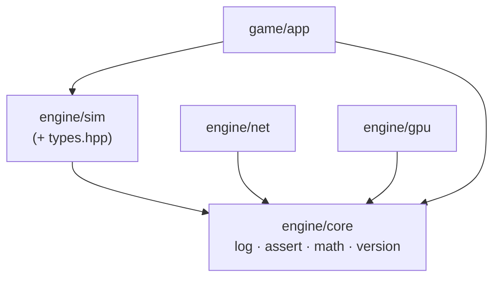

# The core layer

## What it is

The **core layer** (`engine/core`) is the bottom of the stack: four tiny headers every other target compiles against, and which depend on nothing above them. It hands the rest of the engine a logger (`eng::log`), a debug assert (`ENG_ASSERT`), the pinned math conventions (`engine/core/math.hpp`), and a version string (`engine/core/version.hpp`). No systems, no state, no `main` — just the vocabulary the whole engine speaks. Sitting right beside it, the simulation's foundational types (`engine/sim/types.hpp`: `PlayerId`, `Tick`, `kTicksPerSecond`) give the sim its shared units, so they are covered here too.

## Why it's built this way

Each of these files exists to kill one class of bug or churn before it starts:

- **Logging is `spdlog`, wrapped.** Call sites say `eng::log::info(...)` and never name the dependency directly, so swapping the backend later touches one header, not the codebase.
- **`ENG_ASSERT` is for programmer error only.** It logs and `std::abort()`s in dev builds and compiles to `((void)0)` when `NDEBUG` is set, per **[ADR-0017](../architecture/adr-0017-errors-expected-boundaries.md)**. Conditions that can happen in normal play are handled with `tl::expected`, never an assert.
- **`math.hpp` pins GLM's conventions once.** Handedness, up-axis, and depth range are the classic "why is everything mirrored / inside out" 3am bug; pinning them in one header everyone includes makes drift impossible.
- **`PlayerId` and `Tick` are named, not raw ints.** The day a `PlayerId` becomes a SteamID64, nothing that stores or compares one has to change.

## How it works

`eng::log::Init()` (in `engine/core/log.cpp`) is called once at startup. It installs an `"eng"` colour stdout logger, sets the `[time] [level] message` pattern, and — only in debug builds — lowers the level to `debug`. After that, `eng::log::debug/info/warn/error` are thin `using`-aliases of the matching spdlog free functions.

`math.hpp` `#define`s `GLM_FORCE_DEPTH_ZERO_TO_ONE` **before** including GLM, then declares `eng::Vec2` / `eng::Vec3` and writes the conventions down in a comment: right-handed, +Y up, clip depth 0..1. The skeleton is 2D so it mostly uses `Vec2`; the 3D conventions are declared now so the renderer doesn't have to retrofit them at M1.

`types.hpp` is pure declarations: `using PlayerId = std::uint32_t;`, `kLocalPlayer = 1` (the fixed single-player id), `using Tick = std::uint64_t;`, and `kTicksPerSecond = 60` with its derived `kSecondsPerTick`. The tick rate is a named constant so it lives in exactly one place; see **[Tick and systems](tick-and-systems.md)** for who reads it.

!!! warning "The `GLM_FORCE_DEPTH_ZERO_TO_ONE` order is load-bearing"
    The macro must be defined **before** `<glm/glm.hpp>` is included. That is the whole reason every layer includes `engine/core/math.hpp` instead of GLM directly — include the wrong one and the convention silently doesn't apply.

## Key files

- `engine/core/log.hpp` / `engine/core/log.cpp` — `eng::log::Init` and the log aliases.
- `engine/core/assert.hpp` — the `ENG_ASSERT(cond, msg)` macro.
- `engine/core/math.hpp` — pinned GLM conventions, `Vec2` / `Vec3`.
- `engine/core/version.hpp` — `kVersionString` (`"0.0.1"`) and the numeric parts.
- `engine/sim/types.hpp` — `PlayerId`, `Tick`, `kTicksPerSecond`.

## Extend it

Want a new shared alias or scalar for the whole engine? Add it to `engine/core/math.hpp` — for example `using Vec4 = glm::vec4;`. Because every target includes this header rather than GLM directly, it is available everywhere with no other change, and the conventions stay pinned. To trace a subsystem at startup, reach for `eng::log::debug(...)`: it is automatically silent in ship builds, so there is nothing to strip out later.

!!! info "`types.hpp` lives in `engine/sim`, not `engine/core`"
    `PlayerId` and `Tick` are simulation vocabulary, so they sit in the sim layer next to the code that stamps inputs with them (see **[The command funnel](command-funnel.md)**). Core stays gameplay-free; these are grouped here because they are the same kind of foundational plumbing.

## Where it goes next

The 3D conventions written into `math.hpp` go live when the renderer reaches 3D (roadmap M1). `PlayerId` becomes the real network/Steam identity at M3+. Neither changes shape — that is the entire point of naming them now. For the layer above, start with **[The ECS](ecs.md)**; for the whole picture, see the **[skeleton overview](index.md)**.
