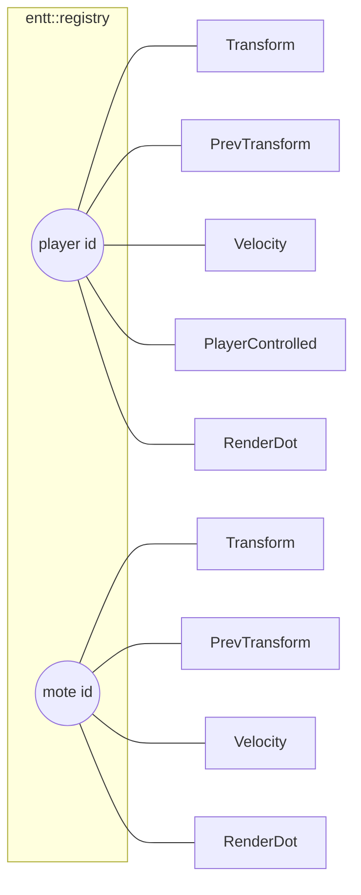

# Entities and components

## What it is

An entity in this engine is nothing but an id — a number handed out by `entt::registry::create()`. It holds no data and no behaviour of its own. The data lives in **components**: small, copyable structs defined in `engine/sim/components.hpp`. An entity "has" a component when the registry stores one for that id. A "kind of thing" — a player, a drifting mote — is not a class; it is a **combination** of components attached to one id.

The entire cast of this walking skeleton is five component types:

| Component | Fields | What it means |
| --- | --- | --- |
| `Transform` | `Vec2 position` | where the entity is, in world units |
| `PrevTransform` | `Vec2 position` | where it was last tick, for render interpolation |
| `Velocity` | `Vec2 value` | how fast it moves, in units per second |
| `PlayerControlled` | `PlayerId player`, `float move_speed` | this entity obeys a player's input |
| `RenderDot` | `Vec3 color`, `float radius` | presentation-only: how the client draws it |

That is all of them. No `Entity` base class, no `class Player : public Actor`.

## Why it's built this way

This is **composition over inheritance**, and in this codebase it is a rule, not a preference: **an entity is an id, and `class Enemy : public Character` never appears** (see [ADR-0019](../architecture/adr-0019-solid-seams-dod-core.md), rule 1). Three things fall out of it. Orthogonal capabilities combine freely — a mote moves and draws but takes no input, a player does all three, and neither has a field the other wastes. Adding a capability later is a **new component plus a system**, touching nothing that already exists. And EnTT stores each component type in its own tight array, which is exactly the substrate the render loop wants now and network snapshots will want later ([ADR-0010](../architecture/adr-0010-entt-ecs.md)).

!!! tip
    Designing new content, ask "**which components does it have?**" — never "what does it inherit from?". If the answer is an existing set with different numbers, you need zero new C++. The full case is in the handbook: [Composition over Inheritance](../../handbook/architecture/composition-over-inheritance.md).

## How it works

Composition shows up plainly in `build_scene()` (`engine/sim/world.cpp`), which builds the opening scene: one **player** and twelve **motes**. The player is created and given `Transform`, `PrevTransform`, `Velocity`, `PlayerControlled{kLocalPlayer, 320.0f}` and a blue `RenderDot`. Each mote comes from `make_mote()`, which emplaces `Transform`, `PrevTransform`, `Velocity` and a gold `RenderDot` — **the same set minus `PlayerControlled`**.

That one extra component is load-bearing. When a `MovePlayer` command arrives, `World::apply_command` does `registry_.view<PlayerControlled, Velocity>()` — a view iterates only entities that carry **both** — matches `pc.player` against the command, and writes `Velocity.value = cmd.move_dir * pc.move_speed`. Motes have no `PlayerControlled`, so the view skips them. There is no `if (isPlayer)` anywhere; membership in the component set *is* the branch.

!!! info
    `RenderDot` is the one component the simulation never reads. No system in `engine/sim/systems.hpp` touches it — it exists only so the client has something to draw. That keeps the split honest: the sim owns `Transform`/`Velocity`/`PlayerControlled`; the renderer reads `RenderDot`. See **[Client and rendering](client-and-rendering.md)**.

## Key files

- `engine/sim/components.hpp` — the five component structs, each with a comment on why it exists.
- `engine/sim/world.cpp` — `build_scene` and `make_mote` compose entities; `apply_command` reads them by component set.
- `engine/sim/world.hpp` — `World` owns the `entt::registry` and exposes it read-only to the renderer.
- `engine/sim/systems.hpp` — the systems (`snapshot_previous`, `integrate_motion`, `wrap_bounds`) that run over these components.

## Extend it

Give motes a lifespan, without editing a single existing type:

1. Add `struct Lifespan { float seconds = 5.0f; };` to `components.hpp`.
2. In `make_mote`, add `reg.emplace<Lifespan>(e);` — the player never gets one, so players never expire.
3. Add a system `expire(entt::registry&, float dt)` that iterates `view<Lifespan>()`, subtracts `dt`, and calls `reg.destroy(e)` at zero.
4. Add one line to `World::step()` to call it, in order.

Nothing else changes — that "touch nothing that exists" property is the point. The mechanics of steps 3–4 live in **[Ticks and systems](tick-and-systems.md)**; the command path in step 2's cousin lives in **[The command funnel](command-funnel.md)**.

## Where it goes next

Components stay small and copyable on purpose: the same flat arrays become the payload for saves and, later, network snapshots. Real content variation is meant to arrive as **data**, not subclasses — JSON `extends` composing component sets, per [ADR-0019](../architecture/adr-0019-solid-seams-dod-core.md). For the wider tour start at the **[skeleton overview](index.md)**; for adding whole features see **[Extending the engine](extending.md)**.
