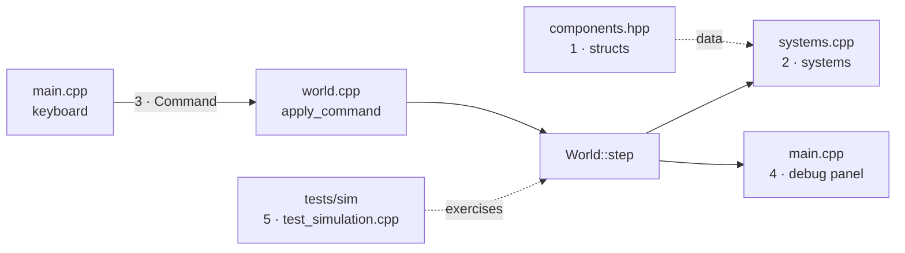

# Extending the skeleton

## What it is

The payoff page. You have read how the bones fit together — now here are five copy-paste recipes for bending them. Each is the smallest honest change that compiles and runs: **add a component**, **add a system**, **add a command**, **add a debug widget**, **add a test**. Open the named file beside each snippet; every one matches the code committed today.

The design pays off here. Because an entity is an id with a **combination** of components (see **[ecs.md](ecs.md)**, **[adr-0010-entt-ecs.md](../architecture/adr-0010-entt-ecs.md)**) and every mutation flows through one funnel (**[command-funnel.md](command-funnel.md)**, **[adr-0004-one-command-funnel.md](../architecture/adr-0004-one-command-funnel.md)**), a new capability is almost always **new code beside old code** — not a rewrite of it.

## How it works

Five extension points, five files. This map is worth more than any prose:



## Extend it

### 1. Add a component and give the player one

A component is a plain struct of data. Add it in `engine/sim/components.hpp`:

```cpp
// How much life an entity has left. Presentation-only for now.
struct Health {
  float value = 100.0f;
};
```

Then hand it to the player where the scene is built, in `engine/sim/world.cpp` (`build_scene`), right next to the other `emplace` calls:

```cpp
reg.emplace<Health>(player, 100.0f);
```

That is the whole change. Nothing that already existed had to move.

### 2. Add a system and slot it into `World::step`

A system is a free function over a component view. Declare it in `engine/sim/systems.hpp`:

```cpp
// Damp every entity's velocity a little each tick so motion coasts to a stop.
void apply_friction(entt::registry& reg, float dt);
```

Define it in `engine/sim/systems.cpp`, mirroring `integrate_motion`:

```cpp
void apply_friction(entt::registry& reg, float dt) {
  auto view = reg.view<Velocity>();
  for (const entt::entity e : view) {
    view.get<Velocity>(e).value *= 1.0f - 3.0f * dt;  // ~5% slower each tick
  }
}
```

Then add **one line** to `World::step` in `engine/sim/world.cpp`. The call order **is** the schedule — friction after the move, before the wrap:

```cpp
integrate_motion(registry_, dt);
apply_friction(registry_, dt);   // <- new
wrap_bounds(registry_, Vec2{kFieldWidth, kFieldHeight});
```

### 3. Add a command kind and fire it

A `Command` is an intent. Extend the enum and struct in `engine/sim/command.hpp`, then add a convenience constructor. Appending a field is safe — the existing constructors zero-init the trailing slot:

```cpp
enum class CommandKind {
  MovePlayer,
  SpawnMote,
  Teleport,   // <- new
};

struct Command {
  // ...existing fields...
  Vec2 teleport_to{0.0f, 0.0f};  // Teleport: where to jump the player
};

inline Command teleport(PlayerId player, Vec2 to) {
  return Command{CommandKind::Teleport, player, {}, {}, to};
}
```

Handle it in the **one** place the world mutates — `apply_command` in `engine/sim/world.cpp`:

```cpp
case CommandKind::Teleport: {
  auto view = registry_.view<PlayerControlled, Transform>();
  for (const entt::entity e : view) {
    if (view.get<PlayerControlled>(e).player != cmd.player) continue;
    view.get<Transform>(e).position = cmd.teleport_to;
  }
  break;
}
```

Fire it from input in `game/app/main.cpp`, the same way Space fires `spawn_mote` — wrap it in a `Message` and hand it to the transport:

```cpp
const eng::Vec2 center{eng::sim::kFieldWidth * 0.5f, eng::sim::kFieldHeight * 0.5f};
transport.send(eng::net::Message{
    eng::sim::teleport(eng::sim::kLocalPlayer, center)});
```

!!! info "Why the switch has no `default`"
    Leaving `apply_command`'s `switch` exhaustive means the compiler warns you the day you add a `CommandKind` and forget to handle it. Let it. That warning is a free to-do list.

### 4. Add a widget to the debug panel

The panel is plain Dear ImGui calls in `draw_debug_panel` (`game/app/main.cpp`). It gets a `const World&`, so read-only readouts drop straight in beside the existing `ImGui::Text` lines:

```cpp
const eng::Vec2 vel = world.registry().get<eng::sim::Velocity>(player).value;
ImGui::Text("speed: %.0f", static_cast<double>(glm::length(vel)));
```

!!! tip "Widgets that change the world"
    A button that mutates state must not poke the registry — it produces a **Command**, like every other input. The panel is `const` on purpose; fire the command from the frame loop in `main` (as recipe 3 does) so the funnel stays the only door in. See **[client-and-rendering.md](client-and-rendering.md)** and **[adr-0022-imgui-slice-ui.md](../architecture/adr-0022-imgui-slice-ui.md)**.

### 5. Add a headless test

The sim is pure logic, so it tests without a window. Add a `TEST_CASE` to `tests/sim/test_simulation.cpp` — this one pins the friction system from recipe 2:

```cpp
TEST_CASE("apply_friction slows a moving entity", "[sim]") {
  entt::registry reg;
  const entt::entity e = reg.create();
  reg.emplace<eng::sim::Velocity>(e, eng::Vec2{100.0f, 0.0f});

  eng::sim::apply_friction(reg, 1.0f / 60.0f);

  REQUIRE(reg.get<eng::sim::Velocity>(e).value.x < 100.0f);
}
```

Prefer testing a system or the funnel directly (as here and in the `MovePlayer` case) over driving the renderer — that split is **[adr-0018-testing-three-lanes.md](../architecture/adr-0018-testing-three-lanes.md)**.

## Build it

From the repo root:

```sh
cmake --preset dev          # configure: Debug + ASan/UBSan
cmake --build --preset dev  # build engine + game + tests
ctest --preset dev          # run the headless suite
./build/dev/game/app/game   # run the client (no-op with no display)
```

## Where it goes next

These five moves are the same ones the roadmap milestones are made of — a real component like `Health`, a real system like collision, a real command like "use item", a real inspector, a real test lane. Nothing above changes shape when the engine grows; there is just more of it. Start with **[index.md](index.md)** for the tour, or the sibling deep-dives on **[tick-and-systems.md](tick-and-systems.md)** and **[transport-and-server.md](transport-and-server.md)** for the pieces these recipes plug into.
