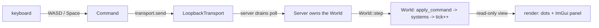

# The engine, right now

## What it is

A running **walking skeleton** of a C++ game engine, living in this repository. One loop
ties the whole thing together: keyboard input becomes a **Command**, that command travels
over a transport to a **Server** that owns the **World**, the World steps a fixed 60 Hz
simulation over an EnTT ECS, and the client draws the result — interpolated — plus a Dear
ImGui debug panel. Every load-bearing idea the full engine will need is present here in
miniature; almost none of the content is. This page is the map.

Honest scope: the world is a field of **2D dots**. There is no networking over the wire, no
3D meshes, no physics, scripting, or game yet — those are roadmap milestones, not hidden
code. This is the bones, built so the interesting parts have somewhere to plug in.

## How one frame flows



Read `game/app/main.cpp` top to bottom and you see exactly this. Each rendered frame samples
the keyboard into a movement `Vec2`, and **`FixedTimestep::advance`** turns real elapsed time
into a whole number of fixed steps. For each step the client sends one `move_player` Command
through the transport and calls `server.tick()`; the Server drains every queued `Message`
into `world.submit()` and calls **`World::step()`**. `step()` snapshots positions (for
interpolation), drains the command funnel through **`apply_command`**, runs the systems
(`integrate_motion`, then `wrap_bounds`) in one fixed order, and increments the tick. The
client then reads the world and draws each `RenderDot`, blended between its `PrevTransform`
and `Transform` by `timestep.alpha()`.

!!! info "Single-player already runs the multiplayer wiring"
    The client never reaches into the world — it sends input to a **Server** it only observes,
    over an **`ITransport`**. Swapping `LoopbackTransport` for a real network transport is the
    multiplayer work; the game code above the seam does not change. See
    [**adr-0003**](../architecture/adr-0003-single-player-is-a-listen-server.md) and
    [**adr-0004**](../architecture/adr-0004-one-command-funnel.md).

## The layers

Each layer is one CMake target. The `engine/*` targets are libraries with no game knowledge;
`game` is the executable. Load-bearing ideas link to their ADR; most layers link to a
sibling page.

- **`eng_core`** (`engine/core`) — foundation vocabulary: `log.hpp` (spdlog), `assert.hpp`
  (`ENG_ASSERT`), `math.hpp` (glm `Vec2`/`Vec3` + pinned conventions), `version.hpp`.
  See [**core.md**](core.md).
- **`eng_sim`** (`engine/sim`) — the simulation: `World`, the components, the systems,
  `FixedTimestep`, and the Command funnel. Entities are id + components, no inheritance
  ([**adr-0010**](../architecture/adr-0010-entt-ecs.md)); systems are plain functions in an
  explicit order ([**adr-0019**](../architecture/adr-0019-solid-seams-dod-core.md)); the tick
  is fixed with render interpolation
  ([**adr-0002**](../architecture/adr-0002-fixed-60hz-tick.md)). See [**ecs.md**](ecs.md),
  [**tick-and-systems.md**](tick-and-systems.md), [**command-funnel.md**](command-funnel.md).
- **`eng_net`** (`engine/net`) — header-only (a CMake `INTERFACE` library): `ITransport`,
  `LoopbackTransport`, `Server`. See [**transport-and-server.md**](transport-and-server.md).
- **`eng_gpu`** (`engine/gpu`) — `Renderer`: the one place SDL_GPU and ImGui calls are allowed
  to live, an RAII object ([**adr-0009**](../architecture/adr-0009-sdl-gpu-renderer.md)).
  Documented alongside the client in [**client-and-rendering.md**](client-and-rendering.md).
- **`game`** (`game/app`) — the client, `main.cpp`: input to Command to transport to Server to
  render. Links `eng_gpu` + `eng_net`. See [**client-and-rendering.md**](client-and-rendering.md).

## What is NOT here yet

Everything below is a named roadmap milestone, not a gap to hide. See [**roadmap.md**](../roadmap.md).

- Real rendering — triangles, textures, camera, glTF meshes. → **M1**
- JSON scenes, hot reload, a determinism/replay harness. → **M2**
- Networking over the wire — serialized commands, server-authoritative replication,
  prediction and reconciliation. → **M3, M5**
- Physics + a character controller (Jolt), and animation (ozz). → **M4**
- Scripting and modding (the Luau sandbox). → **M6**
- The actual game — NPCs, tasks, colony systems. → **M7+**

## Run it

```sh
cmake --preset dev            # configure: Debug + ASan/UBSan
cmake --build --preset dev
./build/dev/game/app/game     # run it
```

**WASD** / arrows move the bright blue dot. **Space** spawns a reddish mote at the player's
position. The **"Engine — debug"** panel shows FPS, the current tick, the entity count, the
player position, and a pause checkbox — every key you press becomes a Command sent to the
server.

!!! tip "No display? The core still runs"
    On a headless machine `Renderer::create` returns `nullptr` and `main` exits cleanly. The
    whole simulation core is exercised headless by the tests (`tests/sim/test_simulation.cpp`)
    — run `ctest --preset dev`.

## Read it

Open each file next to its sibling page, in this order:

1. `engine/sim/types.hpp` — `PlayerId`, `Tick`, `kSecondsPerTick`.
2. `engine/sim/components.hpp` — the data an entity is made of.
3. `engine/sim/world.hpp` + `world.cpp` — `submit` and `step`, the heart.
4. `engine/sim/systems.hpp` — the behaviour, as free functions.
5. `engine/sim/command.hpp` — the funnel and its two command kinds.
6. `engine/net/transport.hpp` — the `ITransport` seam.
7. `engine/net/server.hpp` + `loopback.hpp` — the authority and its queue.
8. `game/app/main.cpp` — one frame, top to bottom.

## Where it goes next

The map is done — now pick a thread. To add your own component and system, or a third command,
follow the recipe in [**extending.md**](extending.md). To go deep on any single piece, every
layer above links to its own page.
