# The tick and the systems

## What it is

The simulation runs as a **fixed-timestep loop**. `eng::sim::World::step()` advances the world by exactly one tick of `kSecondsPerTick` (1/60 s), no matter how fast the screen refreshes. `FixedTimestep` decides **how many** steps to run each rendered frame; `step()` defines **what a tick does**; the systems are the plain functions it calls in a fixed order. The renderer then draws somewhere between the last two ticks so motion looks smooth. The whole scheme is **[ADR-0002: fixed 60 Hz tick](../architecture/adr-0002-fixed-60hz-tick.md)**.

## Why it's built this way

If you stepped the world once per rendered frame, the game would run faster on a 144 Hz monitor than a 60 Hz one, and every frame's uneven real duration would jitter the physics. A fixed tick makes motion **deterministic**: the same command stream always produces the same world, which is what makes replay and (later) networking debuggable. The price is that real frames rarely land on tick boundaries, so we bank the leftover time and hand it to the renderer as an interpolation factor instead of stepping a ragged amount. This is Glenn Fiedler's "Fix Your Timestep", and `engine/sim/simulation.hpp` opens with the full reasoning.

## How it works

`FixedTimestep::advance(frame_seconds)` keeps a running `accumulator_` of real elapsed time. It first clamps `frame_seconds` to `max_frame_` (default **0.25 s**) so a debugger pause or a slept laptop can't queue thousands of catch-up steps — the "spiral of death". Then it drains the accumulator one `dt_` at a time, returning the number of steps to run. Whatever is left over becomes `alpha()` = `accumulator_ / dt_`, a value in 0..1.

`World::step()` (in `engine/sim/world.cpp`) runs one tick in a fixed, readable order:

```mermaid
flowchart TD
  A["snapshot_previous&#40;&#41; — copy Transform into PrevTransform"] --> B["drain pending_: apply_command&#40;&#41; per queued Command, then clear"]
  B --> C["integrate_motion&#40;dt&#41; — position += velocity * dt"]
  C --> D["wrap_bounds&#40;field_size&#41; — toroidal field wrap"]
  D --> E["++tick_"]
```

That call order **is** the definition of a tick. `snapshot_previous` runs first so `PrevTransform` records "where it was" before anything moves. Commands drain next — the **one place** the world mutates in response to outside input (see **[The command funnel](command-funnel.md)** and **[ADR-0004](../architecture/adr-0004-one-command-funnel.md)**). Then the systems move things; finally `++tick_`.

The systems (`engine/sim/systems.hpp` / `.cpp`) are **free functions**, not classes — no `ISystem`, no registration. Each takes an `entt::registry&` and iterates a `view` of exactly the components it needs: `integrate_motion` runs over `<Transform, Velocity>` and does Euler integration (`position += velocity * dt`); `wrap_bounds` runs over `<Transform>` and wraps each position inside the field. Any system that integrates over time takes the fixed `dt`, never a variable frame time — that is what makes the motion identical on every machine. (`snapshot_previous` and `wrap_bounds` carry no `dt`; only `integrate_motion` does.)

Rendering closes the loop. `game/app/main.cpp` calls `timestep.advance()` for the step count, runs `server.tick()` that many times, then draws with `timestep.alpha()`: `draw_entities` blends `glm::mix(prev, curr, alpha)` per entity — `PrevTransform` -> `Transform`. (It skips the blend when an entity wrapped a field edge this tick, so it doesn't streak across the screen.) See **[The client and rendering](client-and-rendering.md)**.

!!! info "alpha is presentation-only"
    The simulation never sees `alpha`. It is a hint the client uses to draw a
    frame **between** two committed ticks — the world state itself only ever
    changes in whole `dt` steps. Pause the sim and the dots still glide to a
    stop as `alpha` slides across the last interval.

!!! warning "Fixed dt, always"
    Never pass a variable frame time to a system. The clamp turns a huge stall
    into brief slow-motion rather than a freeze, but it only protects
    determinism if every system integrates against `kSecondsPerTick`. A system
    that reads wall-clock time breaks replay.

## Key files

- `engine/sim/simulation.hpp` — `FixedTimestep`: `advance`, the `max_frame` clamp, `alpha`.
- `engine/sim/world.cpp` — `World::step()`, the tick order, `apply_command`.
- `engine/sim/systems.hpp` / `engine/sim/systems.cpp` — `snapshot_previous`, `integrate_motion`, `wrap_bounds`.
- `game/app/main.cpp` — the real loop: `advance` -> `server.tick()` -> interpolate.
- `tests/sim/test_simulation.cpp` — headless proof of every claim above.

## Extend it

Add a system in three steps: write a free function `void apply_drag(entt::registry&, float dt)` in `engine/sim/systems.hpp` and `.cpp` that iterates a `view<Velocity>` and multiplies each `value` by, say, `0.99f`; add one line calling it in `World::step()` between `integrate_motion` and `wrap_bounds`; rebuild. No base class, no registration — the schedule **is** the list of calls in `step()`, so where you put that line is the whole scheduling decision. See **[Extending the engine](extending.md)** and, for the component side, **[Entities and components](ecs.md)**.

## Where it goes next

The tests in `tests/sim/test_simulation.cpp` already pin the contract: `advance(1.0/60.0)` returns 1; `advance(2.5/60.0)` returns 2 and leaves `alpha() == 0.5`; `advance(10.0)` clamps to 15 steps; `integrate_motion` moves an entity 30 units at velocity 60 over `dt` 0.5; a `move_player` command pushes the player right through the funnel. As the roadmap adds physics, staggered NPC think-scheduling, and network replication, they slot in as more systems and more command kinds — the shape (snapshot, drain, run systems, tick) stays fixed. Back to the **[skeleton overview](index.md)**.
