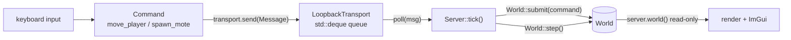

# Transport and the server

## What it is

`eng::net` is the thinnest layer in the engine — three header-only files, no `.cpp`. It holds the seam between "a client that produces input" and "a server that owns the simulation":

- **`ITransport`** (`engine/net/transport.hpp`) — a two-function interface: `send(const Message&)` on the client side and `poll(Message&)` on the server side. A **`Message`** just wraps a `sim::Command`.
- **`LoopbackTransport`** (`engine/net/loopback.hpp`) — the same-process implementation: `send` pushes onto a `std::deque`, `poll` pops the front.
- **`Server`** (`engine/net/server.hpp`) — owns the `eng::sim::World`, drains the transport into the world's command funnel, and steps the simulation.

Nothing in this layer knows about rendering, windows, or sockets. That is the point.

## Why it's built this way

The one big idea: **single-player is already a client and a server talking over a transport.** Open `game/app/main.cpp` — even offline, the client never touches the world to change it. It builds a `Command`, wraps it in a `Message`, and calls `transport.send(...)`. The `Server` on the other side of the queue is the only thing that mutates state.

Because the game logic only ever sees `ITransport`, swapping the same-process queue for real UDP is **changing one implementation, not rewriting the game.** That is what **[adr-0003](../architecture/adr-0003-single-player-is-a-listen-server.md)** means by "multiplayer is never retrofitted", and why `ITransport` exists from day one instead of being bolted on at M5.

The header calls this one of the engine's three load-bearing interfaces (the others are the **command funnel** and **serialization**). Code-design rule 5 is "no interface without two real implementations": `LoopbackTransport` is here now, and a GNS transport (**[adr-0014](../architecture/adr-0014-gns-transport.md)**) is a named milestone, so the abstraction earns its place rather than being speculative.

!!! info "Three wirings, one sim"
    The same `Server` class runs in all three modes the engine targets: **single-player** (one client over a loopback — this skeleton), **listen server** (the host's client plus remote clients), and **dedicated server** (a headless process, remote clients only). A headless `game/ded` target is "nearly free" because it is this class with no client attached — the client is a separate thing that reads the world to draw it.

## How it works

One frame of the input path, straight out of `main.cpp`:



`Server::tick()` is the whole contract:

```cpp
void tick() {
  Message msg;
  while (transport_.poll(msg)) world_.submit(msg.command);
  world_.step();
}
```

Drain every message received since the last tick into `World::submit` (the [command funnel](command-funnel.md)), then call `World::step()` once. **The server is the only thing that steps the world;** the client just sends input and reads `server.world()` to draw it (see [client and rendering](client-and-rendering.md)). In `main.cpp` the client sends one `eng::sim::move_player(kLocalPlayer, dir)` per fixed step, plus an edge-triggered `eng::sim::spawn_mote(pos)` on the spacebar — every mutation is a `Command` on the wire.

Delivery is in-order because `LoopbackTransport` uses a `std::deque` — a real transport can't always promise that, which is one of the things the networking milestones will teach.

## Key files

- `engine/net/transport.hpp` — `ITransport` and `Message`. Copy and move are deleted: a transport owns a live connection, so the rule of five says to declare that intent explicitly (deleting also prevents object slicing).
- `engine/net/loopback.hpp` — `LoopbackTransport`, the deque-backed same-process queue.
- `engine/net/server.hpp` — `Server`: `explicit Server(ITransport&)`, `tick()`, and read-only `const World& world()`.
- `game/app/main.cpp` — the single-player wiring: `LoopbackTransport transport; Server server(transport);`, then `transport.send(...)` / `server.tick()` inside the loop.

## Where it goes next

Two things change when messages cross a wire, and both slot into seams that already exist:

- **`Message` becomes bytes.** Today it carries a `sim::Command` directly because loopback is same-process and there is nothing to serialize. Over the wire it becomes a byte buffer, and the bitstream serializer — the M0 TDD kata (**[adr-0013](../architecture/adr-0013-json-authored-bitstream-wire.md)**) — turns Commands into those bytes right where `Message` holds one now.
- **`ITransport` gets a real implementation.** A GNS-backed transport (**[adr-0014](../architecture/adr-0014-gns-transport.md)**) joins `LoopbackTransport` behind the same two functions, with GNS types quarantined inside `engine/net/`. All implementations pass one shared test suite under simulated latency and loss.
- **`Server::world()` becomes a snapshot.** In-process the client reads the authoritative world directly; at M3 that read turns into "send a snapshot to the client".

!!! tip "Extend it"
    Want to feel the seam? Write a `LatencyTransport` that wraps another `ITransport` and holds each `Message` for N ticks before delivering it. Point `main.cpp` at it instead of `LoopbackTransport` — nothing else changes, and the blue dot will lag exactly the way a real connection would.
