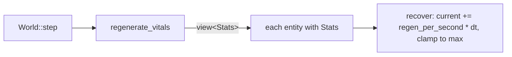

# The stats system

## What it is

The foundation for the numbers that describe a player or an NPC — health, stamina,
and the three survival needs (hunger, water, fatigue) today, with more attributes and skills as the
game grows. It is
deliberately small: two data types and a handful of small systems, built on the
engine skeleton's ECS. It is the worked example of
[extending the skeleton](skeleton/extending.md) applied to a real feature.

- **`Vital`** — a reusable "bar" stat: `current`, `max`, `regen_per_second`.
- **`Stats`** — one component per entity that holds its vitals (its character sheet).
- **`regenerate_vitals`** — a system that recovers each *passive* vital (health) toward its cap, faster the higher your Endurance (VIT) **and faster still within a `Hearth`'s warmth**, and **not at all while starving** (or dehydrated or poisoned).
- **`update_stamina`** — a system that spends stamina while moving and restores it while still — faster the higher your Endurance (VIT) **and faster still within a `Hearth`'s warmth**, but **not** while starving or dehydrated (an empty stomach or canteen gives no second wind, the stamina twin of the heal-gate).
- **`drain_hunger`** — a system that lowers the hunger Need over time (the first survival need); at empty it starves health.
- **`DamagePlayer`** — a command that subtracts from a player's health, applied
  through the funnel (the `H` key in the demo).
- **`handle_deaths`** — a system that respawns a player whose health reaches zero.
- **`Hazard` + `resolve_contacts`** — a component marking dangerous entities and a
  system that damages a player who touches one and then destroys it (the drifting
  motes are consumed on contact).

Honest scope: `health`, `stamina`, `hunger`, `water`, and `fatigue` exist. Health regenerates, drops from a
debug key and from touching a hazard, and reaching zero puts the player *Downed* (rescued
by an ally or respawned on a timer). Stamina is
spent by moving and recovers by resting; running it dry slows the player to a
crawl. Hunger only ever falls (you refill it by *eating*, not resting) and starves you at
empty; **water** is its twin — it falls too, you refill it by *drinking* at a pond, and empty it
dehydrates you. **Fatigue** is the odd third need — it falls as you *exert* and *recovers* as you
rest — and empty it **collapses** you (`Downed`, ally-rescuable, even at full health). Death is respawn for
the player and permadeath — destruction — for NPCs.

## Why it's built this way

Two design choices are worth understanding, because they shape how you extend it.

**`Vital` is one shared type, not a struct per stat.** Health, stamina, hunger,
and mana are all "a number that fills toward a cap over time." Giving them one
type means a new vital is a field, not a copy-pasted struct plus its own system.

**`Stats` is one bundled component, not a component per stat.** An entity has a
single `Stats` holding all its vitals, so the code that manages a character —
today the debug panel, later an NPC-management screen — reads *one* place, and
`regenerate_vitals` iterates `view<Stats>()` once.

!!! info "The tradeoff, stated plainly"
    A bundled `Stats` can't be filtered by individual stat — you can't ask the
    ECS for "everything with stamina" the way you could with a separate
    `Stamina` component. For a colony sim where players and NPCs share a stat
    set, that query isn't needed, so bundling wins. If it ever is needed, split
    that stat into its own component then — not before.

## How it works

Each fixed tick, `World::step()` calls `regenerate_vitals` alongside the other
systems. It runs over exactly the entities that have a `Stats` component (the
player here, not the drifting motes) and nudges each vital toward its `max`:

The player is created in `build_scene` with `emplace<Stats>(player, Vital{70,
100, 8})` — spawned a little worn so the regeneration is visible — and the debug
panel reads it back with `try_get<Stats>` (null-safe) to draw the health bar.

Health also *decreases* through the funnel: a `DamagePlayer` command (the `H`
key) is handled in `apply_command`, which subtracts from the matching player's
health and clamps it at zero. Because that runs on the server through the funnel,
a client can't fake damage — it can only ask for it.

When health reaches zero, the player doesn't die outright — `handle_deaths` puts them
**Downed** (a `Downed{timer}` marker): crumpled where they fell, helpless. On the field a downed
body wears a pale **beacon ring** (`draw_entities`) — the visual twin of the panel's *Downed!*
callout, so you can *see* who's crumpled and rush a rescuer to them (it never coincides with the
steel-blue guard ring — being downed strips the guard). A living ally
who reaches them revives them in place; otherwise the timer expires and they respawn at
the spawn point. Either way they come back *whole* — full health, and **refilled needs**
(hunger, water, and stamina reset to max). That last part matters: neither hunger nor water
self-recovers, so reviving a *starved* or *dehydrated* player with that need still empty would
drop them straight back down in a re-death loop — the revive clears all lethal state, not just the
zero HP. (Every Need added later must reset there for the same reason.) `handle_deaths`
runs **before** `regenerate_vitals` in `step()` on purpose (and a Downed player is
*excluded* from regen): the other order would let the same tick's regen nudge a 0-health
entity back above zero, and it would never die or stay down. The order of the system calls
in `step()` is the definition of the tick — here it is load-bearing.

There is a second load-bearing ordering, for the same reason. Endurance now *speeds* health
regen (VIT governs a resource's capacity **and** its regen — the design's Toughness+Recovery
pairing), which raises a subtle hazard: a hardy character's boosted regen could out-pace
starvation and make it un-lethal. The fix is structural, not a number: `regenerate_vitals`
**skips healing entirely while `hunger <= 0`**. Because `drain_hunger` runs first, hunger is
already this tick's value when the gate reads it — so a starving character *never* heals, and
starvation nets their health strictly downward at **any** regen rate. "You can't mend on an
empty stomach" replaces the old fragile "starvation-per-second must stay above the fastest
self-heal". (It does make starvation bite harder — a wounded starver no longer claws back the
regen — which is the intended, more honest survival pressure.)

Regen also has a **place**: a **`Hearth`** — a fixed, warm safe spot — multiplies the health
regen of anyone resting within its radius (`kHearthRegenBoost`, stacking on the VIT boost). It's
the design's **base-building recovery seed**: a reason to hold or fall back to a spot. The fire has a
**defensive** half as well as a healing one: **creatures won't hunt prey standing in its glow**
(`chase_prey` skips anyone `in_a_hearth` — the *same* reach that heals also **hides**, one predicate
so they can't drift apart), so a beast running you down gives up the chase at the fire, and the
wounded-retreat-to-fire rung becomes a real refuge rather than just a faster mend. It's the **hunt**
it breaks, not all harm: a spitter still lobs venom from range and a beast already on top of you gets
its parting swings (`creature_spit` / `resolve_creature_contacts` don't check the fire), so the hearth
buys *space*, not immunity. The trade is still there, only shifted:
it's a small *spot*, not a fortress — you can't forage, fight, or loot while camped in it, and needs
keep draining, so the fire buys you breathing room, not a place to win the game from. The heal boost
sits *after* the starvation/dehydration/poison gates, so the fire speeds a *healthy* recovery but
never lets a starving or envenomed colonist heal — you can't mend on an empty stomach even by the
warmest hearth. No hearth in reach → ×1 and nobody warded, so a hearthless world is bit-identical.

The fire warms your **second wind** too: `update_stamina` gives a resting character inside a hearth's
radius the same `kHearthStaminaBoost` (2×) on its stamina recovery, so the hearth is a place to
*fully* recover — mend **and** catch your breath — not just heal. It composes with the Endurance
boost and the armour bane (a plated rester still recovers faster by the fire than in the open), and
like the health boost it's `×1` with no hearth in reach, so a hearthless world is bit-identical.

The fire mends your **gear**, not just your body: `mend_gear` slowly restores the durability of a worn
weapon or plate while its bearer rests in the same glow (`in_a_hearth`, capped at full). So durability
no longer only falls toward a shatter — the base is where you **maintain your kit** (fight → it wears
→ fall back and mend), the equipment side of the hearth as a recovery hub. Only a *worn* slot mends
(a full one is capped, an empty one stays empty — the fire can't conjure gear), and with no hearth in
reach it's a no-op, so a hearthless world is bit-identical (see [combat](combat.md) for durability and the shatter it staves off).

The same discipline now covers your **second wind**: `update_stamina` skips its resting recovery
while `hunger <= 0` **or** `water <= 0`, so survival failure drains your stamina reserves too, not
just your health. Composed with the empty-bar crawl below, this is the design's *escalating
inefficiency* emerging from the sim's own systems rather than a bespoke debuff — a starver who keeps fleeing
spends stamina it can no longer recover, tires to a crawl, and can't shake it off until it eats or
drinks. (`update_stamina` runs just *before* `drain_hunger`/`drain_water`, so it reads last tick's
need — a one-frame lag that's immaterial for a Need that empties over minutes.)

Stamina isn't only *drained* by moving — it can be **spent for speed**. Hold **SHIFT** to **sprint**:
the `MovePlayer` command's `sprint` flag sets a `Sprinting` stance (the offensive twin of the `Blocking`
guard), which `apply_command` reads to *boost* move speed by `kSprintMoveScale` (1.6×) and
`update_stamina` reads to *burn* stamina `kSprintDrainBonus` faster (2× the base rate). So a sprint is
a **short dash** — close a gap, break a chase, reach a downed ally — that **ends in the exhaustion
crawl**, not a free faster pace. Gated two ways: an exhausted player (0 stamina) can't dash, and a
**raised guard wins** (you can't sprint with your guard up). No sprint flag → no `Sprinting` stance →
bit-identical, exactly like the guard.

A **third** consequence closes the loop into combat: `need_efficiency(stats)` saps how hard you
*hit*. It stays `1.0` while both needs sit at or above a quarter-full — so a fed colony (and every
full-fed combat test) fights bit-identically — then ramps **linearly to a half** as the *worst* of
hunger/water falls to empty, scaling both the swing's `raw` (`perform_attack`, shared across its
hostile/cruel/cleave branches) and the throw's own `raw` — no ranged loophole. A starving fighter is
weakened, never toothless (a floor, like `mitigate`'s 10%
chip); reading the *binding* need means topping off only one doesn't lift it — you must keep the
colony both **fed and watered** to keep its blows at full strength. So an empty Need now costs you a
third way (softer hits), alongside the stalled heal and the drained second wind — the design's
escalating inefficiency, all of it emergent from the shared `Vital`/`Stats` sheet.

A **fourth** reaches the *legs*: the same `need_efficiency` scales **move speed** — in `steer_npcs`
(folded into the shared `move_scale` every steer rung uses, beside the exhaustion crawl) and in the
player's `MovePlayer` (`world.cpp`), so a starving or parched character **trudges** toward whatever it
wants. It's applied *uniformly*, even on the way to the food or water that would lift it — a weak body
is sluggish everywhere — but the same `0.5` floor means it never freezes, so you can always limp to
the meal. Full needs → `1.0` → the colony moves exactly as before (bit-identical). So an empty Need
now bites **four** ways: two *threshold* gates that snap on at empty (a stalled heal in
`regenerate_vitals`, a drained second wind in `update_stamina`) and two *graded* penalties off the one
`need_efficiency` curve (a softer hit and, now, a heavier step).

And now it **shows**: `need_pallor(stats)` — a renderer-only cue *derived from* `need_efficiency`
(one source of truth, so the look can never drift from the penalty) — wastes a starving or parched
dot toward a **sallow grey**, by exactly how much the debuff is biting. A well-fed colonist draws
unchanged; one running on empty visibly gaunts, so you can read *who's about to fight weak* across
the field at a glance, not just off the HUD bars. Presentation only — the sim never reads it.

Health also drops from *gameplay*, and that shows the other half of the rule.
Touching a `Hazard` (a drifting mote) hurts whoever overlaps it — the player or an
NPC, anything with `Stats` — through the `resolve_contacts` **system**, which
changes health directly (no command) and then destroys the mote. It gathers the
hazards to remove and destroys them *after* the loop: calling `registry.destroy`
while iterating a view invalidates it (a classic ECS bug), so collect-then-destroy
is the safe pattern — the same one permadeath uses on dead NPCs.

!!! info "Command or system? The distinction that matters"
    A **command** carries intent from *outside* the simulation — a player pressing
    `H`, later a network client — so it is validated at the funnel before it can
    do anything. A **system** is the simulation's own rule playing out each tick;
    it already runs on the authoritative server, so it acts directly. Contact
    damage is a rule of the world, so it is a system, not a command.

Stamina shows that not every vital regenerates the same way. Health only ever
ticks back up, so it lives in `regenerate_vitals`. Stamina is *spent*: the
`update_stamina` system drains it while the player is moving (any entity with
`Stats` and a non-zero `Velocity`) and lets it recover only while still. That is
why stamina earns its own system instead of a line in `regenerate_vitals` — a
one-way "always recover" rule can't express "costs something to use."

The payoff is a gameplay coupling: `MovePlayer` reads stamina when it sets the
player's velocity, so an exhausted player (empty bar) moves at 40% speed — a
crawl, not a full stop, so you can always limp to safety. This is a command whose
*effect depends on simulation state*, which is exactly why the funnel resolves it
on the server rather than trusting the client's requested speed.

**Hunger** is the third vital and the first survival **Need** — the pivot from a combat
arena toward a colony sim. It reuses the exact `Vital` shape but breaks the mould in two
ways `drain_hunger` encodes:

- It has **`regen_per_second` = 0**: hunger never fills on its own. You refill it only by
  *eating* — today the health orbs that slain creatures drop are also food
  (`collect_pickups` tops hunger up), so the fight → orb → grab loop already feeds you.
- It **drains faster the harder you exert** — the design's "exertion drains needs" rule, in three
  tiers like stamina: **rest < walk < sprint**. Resting loses the base rate, moving adds an exertion
  step, and a **sprint** (holding SHIFT) adds another on top — so a dash across the map arrives both
  hungrier and thirstier than a walk. Water drains identically (`drain_water` is `drain_hunger`'s
  twin), so keeping the colony fed and watered is a cost of moving fast, not just of moving.

At empty, hunger **starves** you: it chips `health` each tick, so an unfed character dies
through the *same* `handle_deaths` path as any other zero-HP death (not through a special
case, and not buffered by Endurance — VIT stays pure combat defence). The starvation rate
is tuned to out-pace the fastest self-heal, or `regenerate_vitals` would undo it. Every
**person** gets hungry — the player and NPCs alike (`view<Stats>` excluding the `Enemy`
marker), the same "people, not monsters" set the creatures hunt; creatures themselves are
combat foes with no belly to fill.

NPCs **feed themselves**, too — the parity guardrail in full. A hungry colonist forages:
when it's safe (no hazard to flee) and its hunger drops below a threshold, `steer_npcs`
steers it toward the nearest food orb, and it eats on arrival through the same
`collect_pickups` — healing, growing, and refilling exactly as the player does. That is
the first *want-driven* NPC motion (until now they only ever fled), and it turns the loot
orbs into a shared resource the colony competes over.

!!! note "Three ways to feed now"
    Loot orbs — dropped by creature deaths — are the scattered, one-shot food, clustered where
    the fighting is. A fixed, regrowing `FoodSource` plot a hungry colonist walks to and **grazes**
    sits alongside them (see [Food plots](#food-plots-a-renewable-source) below), so a quiet corner
    *near a garden* no longer means starvation. And you can **harvest** a ripe plot into a portable
    **meal** that fills more than grazing it raw (see [Meals](#meals-harvest-dont-just-graze)) — the
    seam of a real food economy. The richer version — planted crops, farming, stored larders — grows
    from here. (The drain is also kept gentle so the 12 s colony spawner out-paces attrition
    regardless.)

**Water** is the fourth vital and the **second** Need — hunger's twin, and proof the Need shape
generalises. It is the *same* falling `Vital` (`drain_water` mirrors `drain_hunger`: gentle at rest,
faster while moving, never self-recovering), and at empty it **dehydrates** you — chipping `health`
through the same `handle_deaths` path. The heal-gate simply grew one clause: `regenerate_vitals`
skips healing while `hunger <= 0` **or** `water <= 0`, so the two needs compose and either one nets
your health strictly downward.

What makes Water *distinct* from hunger is how you refill it. Hunger rides on combat loot (eat an
orb). Water has a **fixed source** — a `WaterSource` pond you **`drink`** from by standing in it (it
is *not* consumed, so you return to it and many can share it). That is the design's spatial
"walk-to-the-well" loop, and NPCs run it too: a thirsty colonist (a new **thirst rung** in
`steer_npcs`, just below hunger) steers to the nearest pond and drinks on arrival — full player==NPC
parity. Because the source is a place rather than scattered orbs, a colonist is *less* likely to die
of thirst in a quiet corner than of hunger; it is the seed of the water economy (wells now, irrigated
crops later).

### Fatigue: the need that recovers

**Fatigue** is the fifth vital and the **third** Need, completing the design's survival triad
(Hunger + Water + Fatigue) — but it's the odd one out. Hunger and water only ever *fall*; you refill
them by eating and drinking. Fatigue **recovers on its own, with rest**. `tick_fatigue` spends it
while you exert — the same `rest < walk < sprint` tiers the other needs use, except here the base
tier is *recovery*: standing still **mends** fatigue, moving spends it, sprinting spends it fastest.
So the sprint you already pay for in stamina (seconds) now also costs in fatigue (minutes) — the "you
can't run forever" pressure, on a slow background timescale. It clamps to `[0, max]` (a rester never
overflows full).

And empty it **collapses** you — the design's *"empty → Downed"*. At 0 fatigue a player crumples
where they stand, **even at full health**, into the exact same `Downed` window a mortal blow opens:
`handle_deaths` reuses its whole rescue-or-respawn mechanic, and the revive that brings you back
resets fatigue along with the other vitals, so you don't drop straight back down. Exhaustion is thus
a *recoverable* fall (ally-rescuable, or a timed respawn), not a death — the great equalizer the
design wants. This is player-only for now, mirroring the `Downed` mechanic (an NPC's fatigue just
sits at 0).

Rest is **deepest by the fire**: resting in a `Hearth`'s warmth mends fatigue `kHearthFatigueBoost`
(2×) faster — the design's "sleep fast" tier realized through the *existing* safe rest spot rather
than a new sit/sleep stance, and the fatigue twin of the health and stamina hearth boosts (the fire
already speeds `regenerate_vitals` and `update_stamina`). So the hearth is now a **full** recovery
hub — health, stamina, gear, *and*
fatigue — a real reason to fall back to base when you're worn down. No hearth in reach → the base
recovery rate → bit-identical.

And you can **grow** the timer: the **Survivalist** skill *eases the fatigue drain* (via the same
`eased_bane` half-floor the STR carry / Endurance armour masteries use), so a seasoned survivor tires
slower and lasts longer before collapsing — never *removing* the timer, only lengthening it, the
design's "growth lengthens but never removes". It's the **one** thing that buffers a need, keeping
`Endurance`/VIT as pure combat defence. And you earn it the hard way — `advance_progression` trains
Survivalist only while you're **already exhausted** (fatigue below `kExhaustionLearnAt`): you learn to
endure by enduring, so a rested colony trains none of it (bit-identical) and only the truly worn-down
toughen. That completes the Fatigue triad-member: a bar that drains with exertion, recovers with rest
(fastest by the fire), collapses you at empty, and lengthens as you survive.

### Food plots: a renewable source

Water's fixed pond has a food counterpart, but with a twist that makes it the seed of a *production*
chain rather than a buffet. A **`FoodSource`** — a berry patch / garden — is a place a hungry
colonist walks to and **`graze`**s to refill hunger, and the **forage rung** now steers toward the
nearest food *plot* as well as the nearest loot orb (whichever is closer). Unlike the pond, a plot is
**finite**: its `stock` falls as colonists eat and **regrows** over time toward `max_stock`, so a
well-fed crowd picks a patch bare and it must recover before it feeds again — the design's
renewable-but-finite crop. It closes the "starve in a quiet corner with no orbs" gap (there is always
a plot to walk to) while adding a real resource dynamic: a small garden can't feed a big colony at
once. Full player==NPC parity, like every other Need.

A graze also *teaches*: a colonist that carries the progression pair trains **Foraging → Wisdom**
each tick it eats, the food-plot twin of a loot grab training Scavenging → Luck. **Wisdom** is the
first of the design's non-combat attributes, and its first payoff is right here — each level lifts
how much a forager draws per tick (nature knowledge), so a seasoned forager tops off faster at the
same patch. It doesn't grow the pools or a fighter build (`build_title` ignores it); it grows the
survival economy. See [progression](progression.md).

### Meals: harvest, don't just graze

Grazing eats a patch bite-by-bite. **Harvesting** turns it into *production*. Press **G** (a
`Harvest` command through the funnel) near a ripe plot and `harvest_nearest_crop` spends a chunk of
its `stock` to drop a single **meal** — a `Pickup` like a loot orb, but *prepared*: it refills more
hunger than that stock grazed raw, and being food rather than monster loot it grants none of the
orb's combat rewards (no heal, no permanent max-HP). So a plot is worth more worked than grubbed at.
The meal sits where it's cut — a discrete morsel any hungry colonist walks to and eats on contact,
exactly like a loot orb (carrying one to whoever's hungriest is a later slice, not this seam). A
patch too bare to bother (`stock` below the harvest cost) yields nothing — no half-meals.

Every `Pickup` now carries its own `food` value, so one `collect_pickups` feeds you whether it's an
orb (50, the old flat rate → bit-identical) or a meal (more). `harvest_nearest_crop` is
actor-agnostic — the same call an NPC farm behaviour will use later — so the player and the colony
will harvest identically, the parity every Need keeps. This is the seam of the food economy the three
needs pressure you toward: crop → harvest → meal, with planting, cooking and stored larders growing
from here.

## Extending it

Every one of these is a small, contained change — the system is made to grow
this way:

| To add… | You touch… |
|---|---|
| **A passive vital** (mana) | a `Vital mana;` field in `Stats`; one `recover(s.mana, dt);` line in `regenerate_vitals`; a bar in the panel |
| **A spent/draining vital** (hunger — now built) | a `Vital` field in `Stats` plus its own small system for *when* it drains — `drain_hunger`, the shape `update_stamina` follows |
| **Attributes** (strength, agility) | new fields in `Stats`; a system that reads them where they matter (e.g. movement) |
| **Skills & attributes** (now built) | see [Progression](progression.md) — `Skill`/`Skills`/`Attributes` components fed by the `advance_progression` system |
| **A new hazard or weapon** | a component marking it (like `Hazard`) plus a system that applies its effect (like `resolve_contacts`) |

## Where it goes next

Damage now comes from both a command (the `H` key) and gameplay (touching a
hazard). Further sources are the same two shapes: a projectile or trap is another
`Hazard`-like component handled by a system, and a healing item would be its own
system nudging `current` up.

Death now means two things, split by which entity died — the game's core rule made
concrete. The **player** goes *Downed* (rescued in place by an ally, or respawned on a
timer). An **NPC** is *destroyed*: **permadeath**,
using the same collect-then-destroy pattern `resolve_contacts` uses on the motes.
That is the `handle_deaths` branch this page kept pointing at; the first wandering
NPCs (the green dots) exercise it live — watch "NPCs alive" in the panel only ever
fall as they drift into motes.

Beyond that, characters *grow*: skills that level with activity feed attributes
that shape these vitals, for players and NPCs alike. That is now its own layer on
top of stats — see [Progression](progression.md), where staying active grows an
Endurance attribute that enlarges the very `health` and `stamina` pools defined
here.

## Key files

- `engine/sim/components.hpp` — `Vital`, `Stats` (health + stamina + hunger + water + fatigue), `need_efficiency` (the empty-Need debuff: softer hits *and* slower steps) and its presentation twin `need_pallor`, `WaterSource`, `FoodSource`, `Hearth`, `Hazard`, and the `Npc` marker.
- `engine/sim/systems.hpp` / `systems.cpp` — `regenerate_vitals` (heal-gated by both needs), `mend_gear` (the hearth repairs worn weapon/armour durability), `update_stamina`, `drain_hunger`, `drain_water` + `drink`, `tick_fatigue` (the third need — falls exerting, recovers resting), `graze` (the regrowing food plots), `handle_deaths` (respawn vs permadeath), and `resolve_contacts`.
- `engine/sim/world.cpp` — the player's `Stats`, the motes' `Hazard`, the wandering NPCs, the stamina-aware `MovePlayer`, and the lines scheduling the systems in `step()`.
- `game/app/main.cpp` — the health, stamina, hunger, water, and fatigue bars and the "NPCs alive" counter in the debug panel, plus the `need_pallor` sallow-dot cue in `draw_entities`; `world.cpp`'s `make_water_source` places the pond and `make_hearth` the hearth.
- `tests/sim/test_simulation.cpp` — the heal, damage, death, contact, stamina, hunger/starvation/eating, the `need_efficiency` debuff (a starving fighter hits softer *and* trudges slower) and its `need_pallor` visual twin, and permadeath tests.

## Go deeper

- [Entities and components](skeleton/ecs.md) — why stats are data, not a subclass.
- [The tick and the systems](skeleton/tick-and-systems.md) — how `regenerate_vitals` is scheduled.
- [The command funnel](skeleton/command-funnel.md) — the path a damage command would take.
- [Extending the skeleton](skeleton/extending.md) — the general recipes this system is built from.
