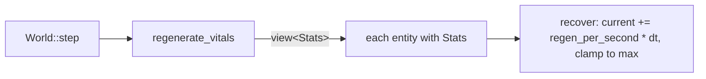

# The stats system

## What it is

The foundation for the numbers that describe a player or an NPC — health, stamina,
and hunger today, with more attributes and skills as the game grows. It is
deliberately small: two data types and a handful of small systems, built on the
engine skeleton's ECS. It is the worked example of
[extending the skeleton](skeleton/extending.md) applied to a real feature.

- **`Vital`** — a reusable "bar" stat: `current`, `max`, `regen_per_second`.
- **`Stats`** — one component per entity that holds its vitals (its character sheet).
- **`regenerate_vitals`** — a system that recovers each *passive* vital (health) toward its cap.
- **`update_stamina`** — a system that spends stamina while moving and restores it while still.
- **`drain_hunger`** — a system that lowers the hunger Need over time (the first survival need); at empty it starves health.
- **`DamagePlayer`** — a command that subtracts from a player's health, applied
  through the funnel (the `H` key in the demo).
- **`handle_deaths`** — a system that respawns a player whose health reaches zero.
- **`Hazard` + `resolve_contacts`** — a component marking dangerous entities and a
  system that damages a player who touches one and then destroys it (the drifting
  motes are consumed on contact).

Honest scope: `health`, `stamina`, and `hunger` exist. Health regenerates, drops from a
debug key and from touching a hazard, and reaching zero respawns the player. Stamina is
spent by moving and recovers by resting; running it dry slows the player to a
crawl. Hunger only ever falls (you refill it by *eating*, not resting) and starves you at
empty. Death is respawn for the player and permadeath — destruction — for NPCs.

## Why it's built this way

Two design choices are worth understanding, because they shape how you extend it.

**`Vital` is one shared type, not a struct per stat.** Health, stamina, hunger,
and mana are all "a number that fills toward a cap over time." Giving them one
type means a new vital is a field, not a copy-pasted struct plus its own system.

**`Stats` is one bundled component, not a component per stat.** An entity has a
single `Stats` holding all its vitals, so the code that manages a character —
today the debug panel, later an NPC-management screen — reads *one* place, and
`regenerate_vitals` iterates `view<Stats>()` once.

!!! info "The tradeoff, stated plainly"
    A bundled `Stats` can't be filtered by individual stat — you can't ask the
    ECS for "everything with stamina" the way you could with a separate
    `Stamina` component. For a colony sim where players and NPCs share a stat
    set, that query isn't needed, so bundling wins. If it ever is needed, split
    that stat into its own component then — not before.

## How it works

Each fixed tick, `World::step()` calls `regenerate_vitals` alongside the other
systems. It runs over exactly the entities that have a `Stats` component (the
player here, not the drifting motes) and nudges each vital toward its `max`:

The player is created in `build_scene` with `emplace<Stats>(player, Vital{70,
100, 8})` — spawned a little worn so the regeneration is visible — and the debug
panel reads it back with `try_get<Stats>` (null-safe) to draw the health bar.

Health also *decreases* through the funnel: a `DamagePlayer` command (the `H`
key) is handled in `apply_command`, which subtracts from the matching player's
health and clamps it at zero. Because that runs on the server through the funnel,
a client can't fake damage — it can only ask for it.

When health reaches zero, `handle_deaths` respawns the player at the spawn point and
restores them *whole* — full health, and **refilled needs** (hunger and stamina reset to
max). That last part matters: hunger doesn't self-recover, so respawning a *starved*
player with hunger still empty would drop them straight back into starving and a re-death
loop — respawn clears all lethal state, not just the zero HP. It runs **before**
`regenerate_vitals` in `step()` on purpose:
the other order would let the same tick's regen nudge a 0-health entity back
above zero, and it would never die. The order of the system calls in `step()` is
the definition of the tick — here it is load-bearing.

Health also drops from *gameplay*, and that shows the other half of the rule.
Touching a `Hazard` (a drifting mote) hurts whoever overlaps it — the player or an
NPC, anything with `Stats` — through the `resolve_contacts` **system**, which
changes health directly (no command) and then destroys the mote. It gathers the
hazards to remove and destroys them *after* the loop: calling `registry.destroy`
while iterating a view invalidates it (a classic ECS bug), so collect-then-destroy
is the safe pattern — the same one permadeath uses on dead NPCs.

!!! info "Command or system? The distinction that matters"
    A **command** carries intent from *outside* the simulation — a player pressing
    `H`, later a network client — so it is validated at the funnel before it can
    do anything. A **system** is the simulation's own rule playing out each tick;
    it already runs on the authoritative server, so it acts directly. Contact
    damage is a rule of the world, so it is a system, not a command.

Stamina shows that not every vital regenerates the same way. Health only ever
ticks back up, so it lives in `regenerate_vitals`. Stamina is *spent*: the
`update_stamina` system drains it while the player is moving (any entity with
`Stats` and a non-zero `Velocity`) and lets it recover only while still. That is
why stamina earns its own system instead of a line in `regenerate_vitals` — a
one-way "always recover" rule can't express "costs something to use."

The payoff is a gameplay coupling: `MovePlayer` reads stamina when it sets the
player's velocity, so an exhausted player (empty bar) moves at 40% speed — a
crawl, not a full stop, so you can always limp to safety. This is a command whose
*effect depends on simulation state*, which is exactly why the funnel resolves it
on the server rather than trusting the client's requested speed.

**Hunger** is the third vital and the first survival **Need** — the pivot from a combat
arena toward a colony sim. It reuses the exact `Vital` shape but breaks the mould in two
ways `drain_hunger` encodes:

- It has **`regen_per_second` = 0**: hunger never fills on its own. You refill it only by
  *eating* — today the health orbs that slain creatures drop are also food
  (`collect_pickups` tops hunger up), so the fight → orb → grab loop already feeds you.
- It **drains faster while exerting** (moving) than at rest — the design's "exertion drains
  needs" rule, the same moving/idle split `update_stamina` uses.

At empty, hunger **starves** you: it chips `health` each tick, so an unfed character dies
through the *same* `handle_deaths` path as any other zero-HP death (not through a special
case, and not buffered by Endurance — VIT stays pure combat defence). The starvation rate
is tuned to out-pace the fastest self-heal, or `regenerate_vitals` would undo it. Every
**person** gets hungry — the player and NPCs alike (`view<Stats>` excluding the `Enemy`
marker), the same "people, not monsters" set the creatures hunt; creatures themselves are
combat foes with no belly to fill.

NPCs **feed themselves**, too — the parity guardrail in full. A hungry colonist forages:
when it's safe (no hazard to flee) and its hunger drops below a threshold, `steer_npcs`
steers it toward the nearest food orb, and it eats on arrival through the same
`collect_pickups` — healing, growing, and refilling exactly as the player does. That is
the first *want-driven* NPC motion (until now they only ever fled), and it turns the loot
orbs into a shared resource the colony competes over.

!!! note "A known ceiling"
    The only food is still loot orbs — dropped by creature deaths, so finite and clustered
    where the fighting is. A colonist getting hungry in a quiet corner with no orbs nearby
    can still starve. The full fix is a real food economy — crops, farming, stored meals —
    a later survival slice; this is its seed. (The drain is also kept gentle so the 12 s
    colony spawner out-paces attrition regardless.)

## Extending it

Every one of these is a small, contained change — the system is made to grow
this way:

| To add… | You touch… |
|---|---|
| **A passive vital** (mana) | a `Vital mana;` field in `Stats`; one `recover(s.mana, dt);` line in `regenerate_vitals`; a bar in the panel |
| **A spent/draining vital** (hunger — now built) | a `Vital` field in `Stats` plus its own small system for *when* it drains — `drain_hunger`, the shape `update_stamina` follows |
| **Attributes** (strength, agility) | new fields in `Stats`; a system that reads them where they matter (e.g. movement) |
| **Skills & attributes** (now built) | see [Progression](progression.md) — `Skill`/`Skills`/`Attributes` components fed by the `advance_progression` system |
| **A new hazard or weapon** | a component marking it (like `Hazard`) plus a system that applies its effect (like `resolve_contacts`) |

## Where it goes next

Damage now comes from both a command (the `H` key) and gameplay (touching a
hazard). Further sources are the same two shapes: a projectile or trap is another
`Hazard`-like component handled by a system, and a healing item would be its own
system nudging `current` up.

Death now means two things, split by which entity died — the game's core rule made
concrete. The **player** respawns. An **NPC** is *destroyed*: **permadeath**,
using the same collect-then-destroy pattern `resolve_contacts` uses on the motes.
That is the `handle_deaths` branch this page kept pointing at; the first wandering
NPCs (the green dots) exercise it live — watch "NPCs alive" in the panel only ever
fall as they drift into motes.

Beyond that, characters *grow*: skills that level with activity feed attributes
that shape these vitals, for players and NPCs alike. That is now its own layer on
top of stats — see [Progression](progression.md), where staying active grows an
Endurance attribute that enlarges the very `health` and `stamina` pools defined
here.

## Key files

- `engine/sim/components.hpp` — `Vital`, `Stats` (health + stamina + hunger), `Hazard`, and the `Npc` marker.
- `engine/sim/systems.hpp` / `systems.cpp` — `regenerate_vitals`, `update_stamina`, `drain_hunger`, `handle_deaths` (respawn vs permadeath), and `resolve_contacts`.
- `engine/sim/world.cpp` — the player's `Stats`, the motes' `Hazard`, the wandering NPCs, the stamina-aware `MovePlayer`, and the lines scheduling the systems in `step()`.
- `game/app/main.cpp` — the health, stamina, and hunger bars and the "NPCs alive" counter in the debug panel.
- `tests/sim/test_simulation.cpp` — the heal, damage, death, contact, stamina, hunger/starvation/eating, and permadeath tests.

## Go deeper

- [Entities and components](skeleton/ecs.md) — why stats are data, not a subclass.
- [The tick and the systems](skeleton/tick-and-systems.md) — how `regenerate_vitals` is scheduled.
- [The command funnel](skeleton/command-funnel.md) — the path a damage command would take.
- [Extending the skeleton](skeleton/extending.md) — the general recipes this system is built from.
