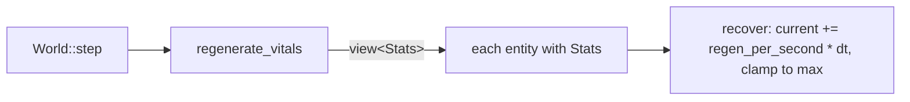

# The stats system

## What it is

The foundation for the numbers that describe a player or an NPC — health today,
and stamina, hunger, attributes, and skills as the game grows. It is deliberately
small: two data types and one system, built on the engine skeleton's ECS. It is
the worked example of [extending the skeleton](skeleton/extending.md) applied to
a real feature.

- **`Vital`** — a reusable "bar" stat: `current`, `max`, `regen_per_second`.
- **`Stats`** — one component per entity that holds its vitals (its character sheet).
- **`regenerate_vitals`** — a system that recovers each vital toward its cap.

Honest scope: only `health` exists so far, and it only regenerates — nothing
damages it yet. That (a damage command) is the natural next step, below.

## Why it's built this way

Two design choices are worth understanding, because they shape how you extend it.

**`Vital` is one shared type, not a struct per stat.** Health, stamina, hunger,
and mana are all "a number that fills toward a cap over time." Giving them one
type means a new vital is a field, not a copy-pasted struct plus its own system.

**`Stats` is one bundled component, not a component per stat.** An entity has a
single `Stats` holding all its vitals, so the code that manages a character —
today the debug panel, later an NPC-management screen — reads *one* place, and
`regenerate_vitals` iterates `view<Stats>()` once.

!!! info "The tradeoff, stated plainly"
    A bundled `Stats` can't be filtered by individual stat — you can't ask the
    ECS for "everything with stamina" the way you could with a separate
    `Stamina` component. For a colony sim where players and NPCs share a stat
    set, that query isn't needed, so bundling wins. If it ever is needed, split
    that stat into its own component then — not before.

## How it works

Each fixed tick, `World::step()` calls `regenerate_vitals` alongside the other
systems. It runs over exactly the entities that have a `Stats` component (the
player here, not the drifting motes) and nudges each vital toward its `max`:

The player is created in `build_scene` with `emplace<Stats>(player, Vital{70,
100, 8})` — spawned a little worn so the regeneration is visible — and the debug
panel reads it back with `try_get<Stats>` (null-safe) to draw the health bar.

## Extending it

Every one of these is a small, contained change — the system is made to grow
this way:

| To add… | You touch… |
|---|---|
| **A stamina vital** | a `Vital stamina;` field in `Stats`; one `recover(s.stamina, dt);` line in `regenerate_vitals`; a bar in the panel |
| **Attributes** (strength, agility) | new fields in `Stats`; a system that reads them where they matter (e.g. movement) |
| **Skills that level with use** | a `Skill {level, xp}` type and a set of them in `Stats`; a system that grants xp on activity |
| **Damage or healing from gameplay** | a new **command** through the funnel — the clean, cheat-proof path (see below) |

## Where it goes next

The most valuable next step is a **damage/heal command**. Right now nothing
changes health except passive regen. A `DamageEntity` command sent through the
[command funnel](skeleton/command-funnel.md) — rather than code reaching into the
world directly — is how a weapon, a trap, or a healing shrine would affect stats,
and it keeps the server as the single authority over them. That closes the loop:
**input → command → funnel → the `Stats` you built.**

Beyond that, the game's design calls for skills that level with activity for both
players and NPCs (see the master plan). Those slot into `Stats` as new fields with
their own systems, exactly like `Vital` did.

## Key files

- `engine/sim/components.hpp` — `Vital` and `Stats`.
- `engine/sim/systems.hpp` / `systems.cpp` — `regenerate_vitals` and its `recover` helper.
- `engine/sim/world.cpp` — the player's `Stats`, and the one line scheduling the system in `step()`.
- `game/app/main.cpp` — the health bar in the debug panel.
- `tests/sim/test_simulation.cpp` — the heal-and-cap test.

## Go deeper

- [Entities and components](skeleton/ecs.md) — why stats are data, not a subclass.
- [The tick and the systems](skeleton/tick-and-systems.md) — how `regenerate_vitals` is scheduled.
- [The command funnel](skeleton/command-funnel.md) — the path a damage command would take.
- [Extending the skeleton](skeleton/extending.md) — the general recipes this system is built from.
