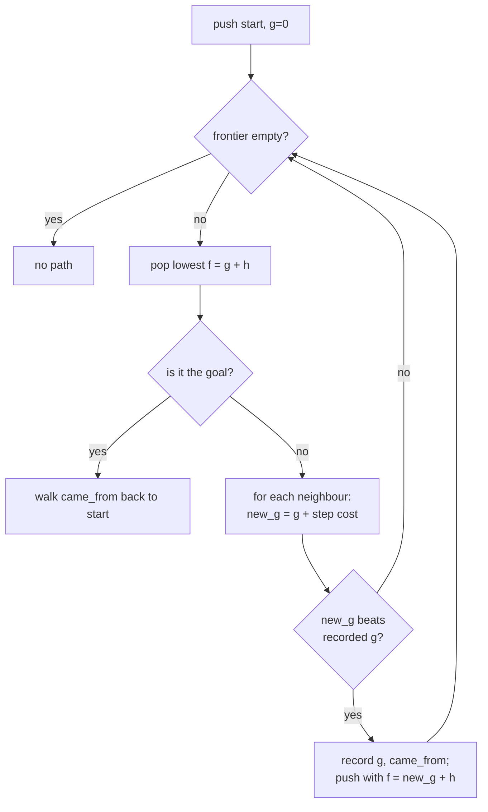

# A* Pathfinding

## What it is

**A\*** ("A-star") finds the cheapest route through a graph — a grid of tiles, a mesh of walkable polygons — from a start node to a goal. It is the last member of a family worth meeting in order:

- **Breadth-first search** floods outward one ring at a time. It finds the fewest-step path when every step costs the same.
- **Dijkstra** swaps the flood's plain queue for a priority queue keyed by **g**, the cost-so-far from the start. Now steps can cost differently — mud slower than road — and it still finds the true cheapest path. But it explores every direction equally.
- **Greedy best-first** ignores g and races toward the goal using **h**, a heuristic **guess** of remaining distance. Fast, but it blunders into dead ends and returns crooked paths.
- **A\*** adds them: it always expands the node with the lowest **f = g + h**. The g half keeps it honest; the h half aims it at the goal.

## Why you care

Every colonist walking to a workbench asks for a path. Serve that with Dijkstra and each request scans half the map; serve it greedily and colonists clip around corners. A* is the industry default because it is **optimal** yet explores only the wedge between start and goal.

In this engine the search will not be hand-rolled: Recast/Detour will run A* over navmesh polygons, server-side on the authoritative sim, from M7 ([master plan](../../design/master-plan.md)). The code below is the same search Detour runs — knowing it is how you read a path that came back wrong.

## Quick start

A grid A* you can compile and run:

```cpp
#include <array>
#include <cassert>
#include <cstdlib>
#include <functional>
#include <queue>
#include <unordered_map>
#include <vector>

struct Cell { int x, y; };

struct Grid {
    int w, h;
    std::vector<bool> blocked;                  // row-major; true = wall
    int id(Cell c) const { return c.y * w + c.x; }
    bool passable(Cell c) const {
        return c.x >= 0 && c.y >= 0 && c.x < w && c.y < h
               && !blocked[id(c)];
    }
    std::vector<Cell> neighbours(Cell c) const {
        static const std::array<Cell, 4> dirs{{{1,0},{-1,0},{0,1},{0,-1}}};
        std::vector<Cell> out;
        for (Cell d : dirs) {
            Cell n{c.x + d.x, c.y + d.y};
            if (passable(n)) out.push_back(n);
        }
        return out;
    }
};

int manhattan(Cell a, Cell b) {                 // admissible on a 4-way grid
    return std::abs(a.x - b.x) + std::abs(a.y - b.y);
}

// Cheapest path start..goal, goal-first; empty if unreachable.
std::vector<Cell> a_star(const Grid& g, Cell start, Cell goal) {
    using Node = std::pair<int, int>;           // (f = g + h, cell id)
    std::priority_queue<Node, std::vector<Node>, std::greater<>> frontier;
    std::unordered_map<int, int> came_from;     // id -> previous id
    std::unordered_map<int, int> cost;          // id -> best g so far

    frontier.push({0, g.id(start)});
    came_from[g.id(start)] = g.id(start);
    cost[g.id(start)] = 0;

    while (!frontier.empty()) {
        int cur = frontier.top().second;
        frontier.pop();
        if (cur == g.id(goal)) break;           // early exit: goal popped
        Cell here{cur % g.w, cur / g.w};
        for (Cell next : g.neighbours(here)) {
            int nid = g.id(next);
            int new_cost = cost[cur] + 1;        // uniform step cost
            auto it = cost.find(nid);
            if (it == cost.end() || new_cost < it->second) {
                cost[nid] = new_cost;
                frontier.push({new_cost + manhattan(next, goal), nid});
                came_from[nid] = cur;
            }
        }
    }

    std::vector<Cell> path;
    if (!came_from.count(g.id(goal))) return path;      // unreachable
    for (int at = g.id(goal); at != g.id(start); at = came_from[at])
        path.push_back({at % g.w, at / g.w});
    path.push_back(start);
    return path;
}

int main() {
    Grid g{5, 5, std::vector<bool>(25, false)};
    for (int y = 0; y < 4; ++y) g.blocked[g.id({2, y})] = true;  // wall, gap at y=4

    auto path = a_star(g, {0, 0}, {4, 0});
    assert(!path.empty());                       // reachable around the wall
    assert(path.front().x == 4);                 // goal-first
    assert(path.back().x == 0 && path.back().y == 0);
    assert(path.size() > 5);                      // detour beats the blocked line
    return 0;
}
```

## How it works

The engine of A* is one loop over a **frontier** — the priority queue. Each turn: pop the node with the smallest f; for every neighbour compute a tentative g; if that beats the neighbour's best recorded g, record it, set f = g + h, and push it. Stop when the goal is popped.

Admissibility is the rule you cannot break: **h must never overestimate** the true remaining cost. Underestimate (or nail it) and A* returns the optimal path; overestimate and it may hand back a shortcut that is not actually shortest. On a 4-way grid, **Manhattan distance** is admissible; straight-line distance is the admissible choice once diagonals are allowed.



The heuristic is a knob. Set h = 0 and A* collapses back into Dijkstra — correct but slow. Scale h **above** the true distance and the search runs faster and sloppier: a deliberate trade when "good enough, now" beats "optimal, later".

## Pros / Cons

| Pros | Cons |
|---|---|
| Optimal path whenever h is admissible | A wrong-unit heuristic silently breaks optimality |
| Explores far less ground than Dijkstra | Frontier + visited maps grow with the area searched |
| One knob (h) trades speed for accuracy | One search per request — not free at colony scale |
| Same algorithm on grids or navmesh polygons | Cost model is only as good as the numbers you feed it |

## What to expect

A path returns as a list of nodes, goal-first — reverse it, or walk it backwards. A* gives you the route only; it moves nothing. Following it smoothly is [steering](./steering.md)'s job, and **what** graph you search is [the navmesh](./navmesh.md)'s.

Expect one path request to be too costly to run for 200 NPCs inside a single 60 Hz tick. The engine will spread requests across ticks (planned — [staggered AI scheduling](./staggered-ai-scheduling.md)), and Detour can also slice one long search over several ticks ([Recast/Detour](./recast-detour-overview.md)). Budget for that from the start.

!!! warning
    A* is only as good as its costs and heuristic. If h is measured in different units than g — tiles versus metres — it overestimates and quietly returns non-optimal paths. Keep both in the same currency.

## Go deeper

- [Navmesh](./navmesh.md) — the polygon graph A* actually searches in this engine
- [Steering](./steering.md) — turning a path into smooth movement
- [Recast/Detour Overview](./recast-detour-overview.md) — the query API and sliced pathfinding
- [Staggered AI Scheduling](./staggered-ai-scheduling.md) — fitting path requests into the tick
- [Core Containers](../cpp/core-containers.md) — `std::priority_queue` and `unordered_map`, used above
- [Data-Oriented Design](../architecture/data-oriented-design.md) — why a flat-array frontier beats pointer-chasing
- [Fixed Timestep](../architecture/fixed-timestep.md) — the 60 Hz budget a search must fit
- [ADR-0016: Behavior Trees](../../engine/architecture/adr-0016-behavior-trees.md) — the BT decides **where** to go; A* gets there
- [ADR-0002: Fixed 60 Hz Tick](../../engine/architecture/adr-0002-fixed-60hz-tick.md) — the timeline pathfinding is scheduled against

### Sources

- Red Blob Games — Introduction to the A* Algorithm — https://www.redblobgames.com/pathfinding/a-star/introduction.html — accessed 2026-07-06
- Red Blob Games — Implementation of A* (includes C++) — https://www.redblobgames.com/pathfinding/a-star/implementation.html — accessed 2026-07-06

**Video:** [A* Pathfinding (E01: algorithm explanation) — Sebastian Lague](https://www.youtube.com/watch?v=-L-WgKMFuhE) (12 min). Watch after the "How it works" section — it animates the frontier expanding and shows f = g + h filling in cell by cell.
