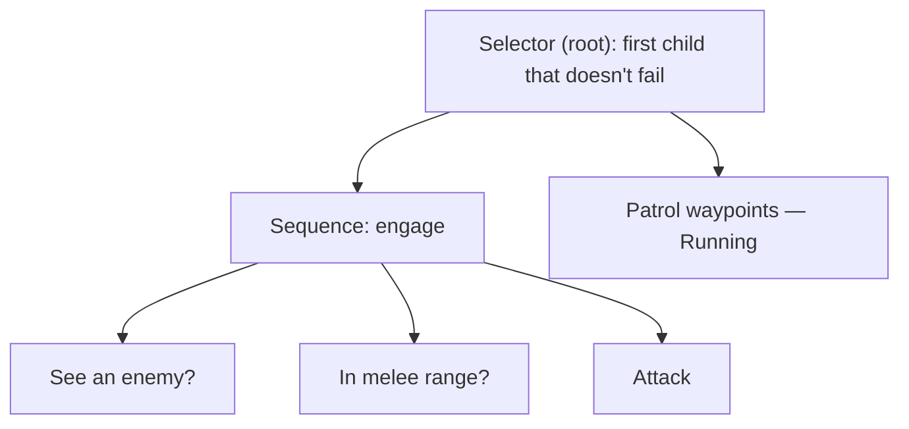

# Behavior Trees

## What it is

A behavior tree (BT) is a tree of nodes an NPC re-evaluates on every "think." Each node, when **ticked**, returns one of three statuses to its parent: `Success`, `Failure`, or `Running`. **Structural** nodes (selectors, sequences, decorators, parallels) hold children and route control by those statuses; **leaf** nodes do the actual work — an action ("walk to the door") or a condition check ("can I see the player?"). The tree reads top-to-bottom, left-to-right, so "what will this creature do?" is answered by reading it like a flowchart.

## Why you care

The decisive reason for a moddable colony sim is **inspectability**: "why did it do that?" has a visual answer a novice — or a 15-year-old modder — can find just by looking at the tree. The engine will use BTs for NPC decisions precisely for that debuggability ([ADR-0016](../../engine/architecture/adr-0016-behavior-trees.md)). Trees also **compose**: a "flee when hurt" subtree drops into any creature unchanged. Which model beats FSMs, utility, or GOAP — and why — is [Choosing an AI Model](./choosing-an-ai-model.md)'s job.

## Quick start

Read this guard from the top. The root is a **selector** — "do the first thing that works." It tries to engage; it only patrols when engaging isn't possible:



A **sequence** needs *every* child to succeed in order. The moment `See an enemy?` returns `Failure`, the sequence fails, and the selector falls through to `Patrol`. Next tick it re-checks from the root — spot an enemy and it flips to engaging on its own.

## How it works

Ticking starts at the root each think and walks down to wherever work is happening. The three-status contract is the whole engine:

| Node | Ticks its children | Succeeds when | Fails when |
|---|---|---|---|
| **Sequence** | left-to-right, stops on non-Success | all succeed | any child fails |
| **Selector** | left-to-right, stops on non-Failure | any child succeeds | all fail |
| **Decorator** | its one child | it transforms the child's status (invert, cooldown, repeat) | — |
| **Parallel** | all children each tick | a quota succeed | too many fail |

`Running` is what makes a BT more than a decision table: a leaf mid-path (walking a route, playing an animation) returns `Running`, its parents propagate `Running`, and the tick unwinds without touching later branches. Next tick resumes there.

A minimal interpreter is just an enum and a switch — roughly what the engine's C++ core will own (decorator and parallel follow the same pattern):

```cpp
#include <cassert>
#include <functional>
#include <vector>

enum class Status { Success, Failure, Running };
enum class Kind { Sequence, Selector, Leaf };

struct Node {
    Kind kind;
    std::vector<int> children;       // indices into the node pool
    std::function<Status()> action;  // leaves only
};

Status tick(const std::vector<Node>& tree, int i) {
    const Node& n = tree[i];
    switch (n.kind) {
        case Kind::Leaf:
            return n.action();
        case Kind::Sequence:  // every child must pass, in order
            for (int c : n.children) {
                Status s = tick(tree, c);
                if (s != Status::Success) return s;  // Failure/Running stops the run
            }
            return Status::Success;
        case Kind::Selector:  // first non-Failure child wins
            for (int c : n.children) {
                Status s = tick(tree, c);
                if (s != Status::Failure) return s;  // Success/Running is the pick
            }
            return Status::Failure;
    }
    return Status::Failure;  // unreachable; satisfies -Wreturn-type
}

int main() {
    std::vector<Node> tree;
    auto add = [&](Kind k, std::function<Status()> a = {}) {
        tree.push_back({k, {}, std::move(a)});
        return int(tree.size()) - 1;
    };
    int seeEnemy = add(Kind::Leaf, [] { return Status::Failure; });  // sight check
    int strike   = add(Kind::Leaf, [] { return Status::Success; });
    int patrol   = add(Kind::Leaf, [] { return Status::Running; });  // mid-walk
    int engage   = add(Kind::Sequence);
    tree[engage].children = {seeEnemy, strike};
    int root = add(Kind::Selector);
    tree[root].children = {engage, patrol};

    assert(tick(tree, root) == Status::Running);  // no target -> keep patrolling
}
```

In this engine (planned, [ADR-0016](../../engine/architecture/adr-0016-behavior-trees.md), milestone M7), C++ owns exactly that tick loop and the structural nodes; leaves are either built-in C++ actions or Luau functions ([ADR-0015](../../engine/architecture/adr-0015-luau-modding.md)). Trees are authored in **JSON**, and mods graft onto shipped trees with `extends` and `insert_before` instead of copying them — so a mod slips one node into the guard tree without forking it:

```json
// fragment — does not compile alone
{ "extends": "guard.bt", "insert_before": "Patrol", "node": { "leaf": "beg_for_food" } }
```

## Pros / Cons

| Pros | Cons |
|---|---|
| Reads visually — "why?" is answerable by looking | Deep trees re-tick from the root; wasted checks add up |
| Subtrees drop into any creature unchanged | The `Running`/resume contract is easy to get subtly wrong |
| Data-authored, so moddable without recompiling | No memory of its own — needs a blackboard for shared state |
| Structural nodes are generic; only leaves are game-specific | Reactive by default; planning is extra machinery |

## What to expect

Expect to spend your design effort on **leaves and tree shape**, not on the four structural node types — those are written once.

Two things this page deliberately skips. The shared memory leaves read and write — sensors, targets, paths — lives in a **blackboard** ([Blackboards](./blackboards.md)). How often each NPC's tree actually ticks — the ~5–10 Hz round-robin inside the 60 Hz tick, with the strategic layer ticking in seconds — is [Staggered AI Scheduling](./staggered-ai-scheduling.md)'s topic ([master plan](../../design/master-plan.md)).

!!! warning
    A leaf that loops internally until its job is done freezes the whole tick. Return `Running` and come back next tick instead ([ADR-0002](../../engine/architecture/adr-0002-fixed-60hz-tick.md)) — the interpreter is a poller, not a coroutine.

## Go deeper

- [Choosing an AI Model](./choosing-an-ai-model.md) — why BTs, and where FSM/utility/GOAP fit
- [Blackboards](./blackboards.md) — the shared state leaves read and write
- [NPC Perception](./npc-perception.md) — the sensors that feed condition leaves
- [Staggered AI Scheduling](./staggered-ai-scheduling.md) — how often a tree ticks
- [Data-Oriented Design](../architecture/data-oriented-design.md) — why the node pool is a flat array
- [Lambdas, `auto`, Range-For](../cpp/lambdas-auto-range-for.md) — the C++ the interpreter leans on
- [Fixed Timestep](../architecture/fixed-timestep.md) — the tick the `Running` contract respects
- [ADR-0016: Behavior Trees](../../engine/architecture/adr-0016-behavior-trees.md) — the accepted decision
- [ADR-0015: Luau Modding](../../engine/architecture/adr-0015-luau-modding.md) — how Luau leaves are sandboxed
- [ADR-0010: EnTT ECS](../../engine/architecture/adr-0010-entt-ecs.md) — identity tiers as component sets

Sources:

- Chris Simpson — Behavior trees for AI: How they work (Game Developer) — https://www.gamedeveloper.com/programming/behavior-trees-for-ai-how-they-work — accessed 2026-07-06
- Alex Champandard, Philip Dunstan — The Behavior Tree Starter Kit (Game AI Pro, ch. 6) — http://www.gameaipro.com/GameAIPro/GameAIPro_Chapter06_The_Behavior_Tree_Starter_Kit.pdf — accessed 2026-07-06
- Unreal Engine documentation — Behavior Tree Overview — https://dev.epicgames.com/documentation/en-us/unreal-engine/behavior-tree-in-unreal-engine---overview — accessed 2026-07-06

Video: [Behaviour Trees: The Cornerstone of Modern Game AI | AI 101 — AI and Games](https://www.youtube.com/watch?v=6VBCXvfNlCM) (10 min) — watch before building your first tree for the visual walkthrough of tick order and node types.
