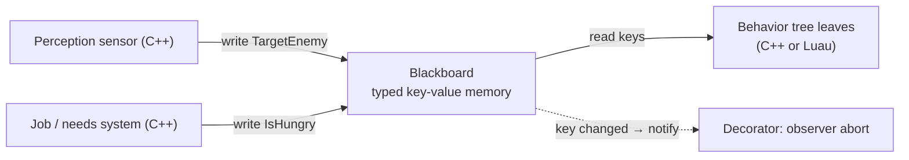

# Blackboards

## What it is

A **blackboard** is a typed key–value store: one small bag of named facts that
belongs to an NPC (or is shared across a squad). Systems that discover
knowledge — sensors, jobs, the perception pass — **write** keys onto it. The
decision logic **reads** them. It is the NPC's short-term working memory.

The point is decoupling. The perception code that discovers "enemy at (12, 4)"
writes `TargetEnemy` and stops caring. It never names the branch that will read
it, or how many will. This is deliberately the **simple** blackboard — a plain
typed dictionary — not the elaborate expert-system blackboard of classic AI
literature (Dawe, in Game AI Pro 2, uses exactly this simple form to stop
nearby characters twinning their animations).

## Why you care

Coming from an OOP language, your instinct is to put `target` as a field on an
NPC class and have perception call a method on the brain — or worse, have the
brain reach into the sensor. That couples the two: every new consumer needs a
new accessor, and the producer grows a dependency on all of them.

A blackboard is the seam that removes that coupling. The producer writes a key;
any number of consumers read it; neither side names the other. In this engine
that seam will also cross the mod boundary — C++ sensors write, Luau leaves read
through the mod API (planned, [ADR-0016](../../engine/architecture/adr-0016-behavior-trees.md)) — so a mod's
tree can consume an engine sensor it never compiled against.

## Quick start

A blackboard is small enough to build in one screen. Typed, and a wrong-type or
absent read returns "nothing" instead of crashing:

```cpp
#include <any>
#include <cassert>
#include <optional>
#include <string>
#include <unordered_map>

class Blackboard {
    std::unordered_map<std::string, std::any> entries_;
public:
    template <typename T>
    void set(const std::string& key, T value) { entries_[key] = std::move(value); }

    template <typename T>
    std::optional<T> get(const std::string& key) const {
        auto it = entries_.find(key);
        if (it == entries_.end()) return std::nullopt;      // absent
        if (const T* p = std::any_cast<T>(&it->second)) return *p;
        return std::nullopt;                                 // present, wrong type
    }
    bool has(const std::string& key) const { return entries_.contains(key); }
};

int main() {
    Blackboard bb;
    bb.set<float>("TargetDistance", 4.5f);         // a sensor writes
    if (auto d = bb.get<float>("TargetDistance"))  // a tree leaf reads
        assert(*d == 4.5f);
    assert(!bb.get<int>("TargetDistance"));        // wrong type -> empty, not UB
    assert(!bb.get<float>("NoSuchKey"));           // absent   -> empty
}
```

The whole API a brain touches is `set`, `get`, `has`. Everything else is
discipline about **what** goes on the board and **who** is allowed to write it.

## How it works

Producers write; consumers read; on a fixed cadence. There are two read models.
**Polling**: the tree re-reads its keys every think. **Event-driven**: a write
notifies observers, so a decorator watching `TargetEnemy` can abort its branch
the instant that key clears, without re-walking the tree. Unreal Engine is the
production example — its Blackboard asset stores the keys the tree "needs to
know about to make informed decisions," and the tree "passively listens for
'events'" instead of constantly re-checking conditions.



On this engine the cadence is staggered: each NPC will think at roughly 5–10 Hz
round-robin inside the 60 Hz tick, with the strategic layer ticking in seconds
(see [master-plan](../../design/master-plan.md)). So sensors write and the tree reads at think
rate, not once per frame.

!!! tip
    Keys are stringly-typed, which is a spelling-bug surface. Put your key names
    in one constants header (`constexpr char TargetEnemy[] = "TargetEnemy";`) and
    reference that, so a typo is a compile error, not a silent forever-empty read.

## Pros / Cons

| Pros | Cons |
| --- | --- |
| Producers and consumers never name each other — add a reader for free | Keys are strings; a typo reads as "absent" and fails quietly |
| Typed and inspectable: dump the board to answer "why did it do that?" | A shared squad board is shared mutable state — needs a write owner |
| One shared board coordinates a squad (reserve a key to stop twinning) | Wrong-type reads silently miss unless you assert on them |
| Event-driven observers abort stale branches without polling | Easy to abuse as a global dumping ground for anything |

## What to expect

Write discipline is the entire game. **Sensors and systems write; decision logic
only reads.** The moment a tree leaf writes a key that another leaf reads, you
have rebuilt the hidden coupling the board existed to prevent. Keys should be
**facts** — `TargetEnemy`, `LastKnownPos`, `IsHungry` — never **commands**.

On this engine the board will be C++-owned, with Luau leaves reading through
the mod API (planned,
[ADR-0016](../../engine/architecture/adr-0016-behavior-trees.md)). That makes the key namespace part of the public
mod-API surface, so name keys the way you would name public fields.

!!! warning
    A squad-shared board is shared mutable state across several thinking NPCs.
    Give each key a single writer (the sensor that owns it), or a reservation
    key needs a compare-and-set, not a bare write, or two guards will both claim
    the one "flanking" slot on the same think.

## Go deeper

- [behavior-trees](./behavior-trees.md) — the consumer: the tree structure that reads these keys
- [npc-perception](./npc-perception.md) — the producer: how sight and sound entries get written
- [choosing-an-ai-model](./choosing-an-ai-model.md) — why BTs plus a blackboard, over FSMs or utility AI
- [steering](./steering.md) — sibling motion layer that reads keys like `MoveTarget`
- [ecs-pattern](../architecture/ecs-pattern.md) — the board is naturally one component per NPC
- [data-oriented-design](../architecture/data-oriented-design.md) — why the board stays plain data, not an object graph
- [ADR-0016: Behavior trees](../../engine/architecture/adr-0016-behavior-trees.md) — C++ sensors and blackboard, Luau leaves
- [ADR-0015: Luau modding](../../engine/architecture/adr-0015-luau-modding.md) — which side of the mod boundary owns what
- [ADR-0010: EnTT is the ECS](../../engine/architecture/adr-0010-entt-ecs.md) — where a per-NPC board lives

**Sources**

- Unreal Engine documentation — Behavior Tree Overview (Blackboard asset role) — <https://dev.epicgames.com/documentation/en-us/unreal-engine/behavior-tree-in-unreal-engine---overview> — accessed 2026-07-06
- Michael Dawe — Preventing Animation Twinning Using a Simple Blackboard (Game AI Pro 2, ch. 6) — <http://www.gameaipro.com/GameAIPro2/GameAIPro2_Chapter06_Preventing_Animation_Twinning_Using_a_Simple_Blackboard.pdf> — accessed 2026-07-06
