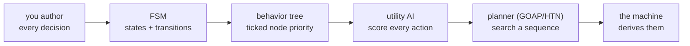

# Choosing an AI Decision Model

## What it is

Four architectures dominate per-agent decision-making — "what should this NPC do now?" Each answers differently:

- **Finite state machine (FSM):** named states (Patrol, Attack, Flee) wired by transitions; the agent is in exactly one at a time.
- **Behavior tree (BT):** selector/sequence/decorator nodes ticked root-to-leaf; leaves are actions, priority is tree order.
- **Utility AI:** score **every** action, pick the highest (or weighted-random among the top). Just math over the situation — no transitions.
- **Planner (GOAP/HTN):** goals plus actions with preconditions and effects; a search assembles a **sequence** to the goal.

This page compares them for the engine's choice. It covers one NPC's moment-to-moment decisions — not the Director pacing layer ([master plan](../../design/master-plan.md)).

## Why you care

You will build colonists, guards, raiders, and wildlife, and must pick a model before the first brain. The four differ on four axes a modding project lives or dies by: **authorability** (how fast can you express a behavior?), **debuggability** (answer "why did it do that?"), **scalability** (holds at hundreds of actions?), and **moddability** (can a teenager change it safely?).

The engine will use behavior trees for NPC decisions ([ADR-0016](../../engine/architecture/adr-0016-behavior-trees.md), planned for M7); the rest is the honest case for why — including where the alternatives win.

## Quick start

A utility "score every action, take the best" loop is small — this compiles as-is, and is the math inside one utility node:

```cpp
#include <array>
#include <string_view>
#include <cstdio>

// Utility AI in miniature: score every candidate action, take the highest.
struct Action { std::string_view name; float (*score)(float hunger, float threat); };

int main() {
    const float hunger = 0.8f, threat = 0.3f;
    constexpr std::array<Action, 3> actions{{
        {"eat",  [](float h, float)  { return h; }},     // want food
        {"flee", [](float, float t)  { return t; }},     // want safety
        {"idle", [](float, float)    { return 0.1f; }},  // baseline
    }};
    const Action* best = &actions[0];
    float bestScore = best->score(hunger, threat);
    for (const Action& a : actions) {
        const float s = a.score(hunger, threat);
        if (s > bestScore) { bestScore = s; best = &a; }
    }
    std::printf("chose %.*s (%.2f)\n",
                static_cast<int>(best->name.size()), best->name.data(), bestScore);
    return 0;
}
```

Rule of thumb: **few clear states → FSM; authored priorities → BT; many analog options → utility; long goal chains → planner.**

## How it works

They form a spectrum from hand-authored to machine-derived:



An **FSM** is explicit and trivially debuggable — one named state at a time — but transitions grow as states², so past ~six states it tangles and stops composing.

A **BT** keeps that clarity but swaps the graph for a tree re-evaluated from the root each tick. Subtrees are reusable and — decisively — the tree **is** the explanation: you watch which branch ran. Its weakness (Merrill): analog "gray-area" choices, where hand-coded Boolean logic gets messy.

**Utility AI** answers that gray area: every action gets a scalar score and the highest wins (Graham). It scales to huge action spaces — Dave Mark's Guild Wars 2 work scored dozens of actions per agent across hundreds of agent types — but the choice is a number nobody authored, so "why that action?" means reading a spreadsheet of curves.

A **planner** (GOAP, as in F.E.A.R.) goes furthest: F.E.A.R. ran a three-state FSM while an A* search over actions with preconditions and effects assembled the behavior. That bought real emergence — an agent that fails to open a held door re-plans and kicks it — but the plan is opaque, and more machinery than a colony sim needs.

!!! info
    These models are orthogonal to **when** an agent thinks. The engine will run NPC brains on a staggered ~5–10 Hz round-robin inside the 60 Hz tick, the strategic layer in seconds ([master plan](../../design/master-plan.md)). Any of the four fits that schedule.

## Pros / Cons

| Model | Authorability | Debuggability | Scales to | Moddable |
|---|---|---|---|---|
| FSM | easy, small | excellent | ~6 states | fragile grafts |
| BT | easy, composable | **visual** | large trees | graft subtrees |
| Utility | tuning-heavy | poor (curves) | huge action sets | opaque numbers |
| Planner | hard | poor (search) | complex goals | opaque plans |

## What to expect

The tiebreaker is the second column. The first-party rule ([ADR-0016](../../engine/architecture/adr-0016-behavior-trees.md)): "why did it do that?" must have a visual answer a 15-year-old modder can find in the tree — so BTs win even though utility and planners emerge richer behavior. The engine's trees will be C++ structural nodes with Luau or built-in leaves, in JSON that mods graft with `extends`/`insert_before` ([ADR-0015](../../engine/architecture/adr-0015-luau-modding.md)).

You need not choose **purely**. Utility survives inside a BT: a utility-selector node scores its children and runs the best — analog choice without losing inspectability (Merrill). Use it wherever Boolean priority feels too rigid.

!!! tip
    Reach for the tree first; add a utility node only where you feel the rigidity. Starting with utility or a planner because it is powerful is how you ship AI you can no longer debug at 2 a.m.

## Go deeper

- [Behavior trees](./behavior-trees.md) — node semantics of the chosen model.
- [Blackboards](./blackboards.md) — shared memory a BT reads and writes.
- [NPC perception](./npc-perception.md) — sensors feeding any model.
- [Staggered AI scheduling](./staggered-ai-scheduling.md) — the 5–10 Hz think budget brains run inside.
- [The ECS pattern](../architecture/ecs-pattern.md) — identity tiers as component sets.
- [Fixed timestep](../architecture/fixed-timestep.md) — the 60 Hz clock the scheduler subdivides.
- [ADR-0016: Behavior trees](../../engine/architecture/adr-0016-behavior-trees.md) — decision record and rejected alternatives.
- [ADR-0015: Luau modding](../../engine/architecture/adr-0015-luau-modding.md) — how leaves and grafts stay teen-safe.

**Sources**

- David Graham — An Introduction to Utility Theory (Game AI Pro, ch. 9) — http://www.gameaipro.com/GameAIPro/GameAIPro_Chapter09_An_Introduction_to_Utility_Theory.pdf — accessed 2026-07-06
- Bill Merrill — Building Utility Decisions into Your Existing Behavior Tree (Game AI Pro, ch. 10) — http://www.gameaipro.com/GameAIPro/GameAIPro_Chapter10_Building_Utility_Decisions_into_Your_Existing_Behavior_Tree.pdf — accessed 2026-07-06
- Jeff Orkin — Three States and a Plan: The A.I. of F.E.A.R. (GDC 2006) — https://www.gamedevs.org/uploads/three-states-plan-ai-of-fear.pdf — accessed 2026-07-06

**Video**: [Building a Better Centaur: AI at Massive Scale (GDC 2015, Dave Mark, Mike Lewis)](https://archive.org/details/GDC2015Mark) — 61 min. Watch after this page: utility AI at Guild Wars 2 scale, and its debuggability cost.
