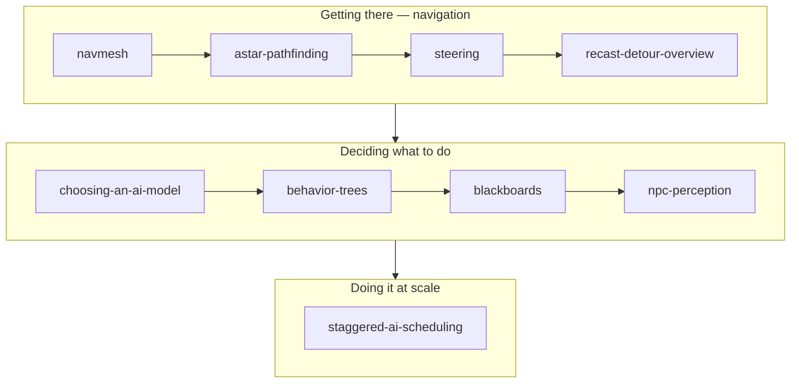

# AI & Navigation

## What it is

This track is the NPC brain, split into the two questions a colonist answers every tick: **where do I go** (navigation — navmesh, pathfinding, steering) and **what should I do** (decision — behavior trees, blackboards, perception). It ends on the question a colony sim can't dodge: running hundreds of these brains without blowing the 60 Hz tick. The engine's plumbing — an offline Recast bake, Detour queries, C++ behavior trees with Luau leaves — is planned for M7 ([master plan](../../design/master-plan.md), [ADR-0016](../../engine/architecture/adr-0016-behavior-trees.md)), so every engine claim here stays in planned tense.

## Why you care

You are an experienced programmer new to C++ and game dev, and in a colony sim the NPCs *are* the game. Get navigation wrong and colonists snag on walls; get decisions wrong and they do baffling things a player can't debug. The engine's non-negotiable is inspectability — "why did it do that?" must have a visual answer a teen modder can find (ADR-0016). This track teaches the concepts first, then how M7 will wire them together.

!!! tip
    If you only skim, read **Choosing an AI Decision Model** and **Behavior Trees** in full — they explain the one architectural bet the rest of the NPC stack leans on.

## How it works

Read in order. The first four pages get an agent moving, the next four make it decide, and the last one keeps every brain affordable.

| Page | What you'll learn |
|---|---|
| [Navigation Meshes](navmesh.md) | Walkable space as connected convex polygons vs grids and waypoints; the engine's Recast bake is planned for M7. |
| [A* Pathfinding](astar-pathfinding.md) | BFS → Dijkstra → A*: cost-so-far plus an admissible heuristic, with a compilable grid solver Detour will mirror over polygons. |
| [Steering Behaviors](steering.md) | Turning a path into this tick's velocity — seek, arrive, avoid — the layer planned to feed Jolt CharacterVirtual (ADR-0011). |
| [Recast/Detour Overview](recast-detour-overview.md) | The industry nav toolset: Recast bakes offline, Detour queries at runtime, dtTileCache handles construction changing walkability. |
| [Choosing an AI Decision Model](choosing-an-ai-model.md) | FSM vs BT vs utility vs planner on authorability and debuggability — and why the engine picked BTs (ADR-0016). |
| [Behavior Trees](behavior-trees.md) | Selector, sequence, decorator, the running/success/failure contract, and the planned JSON graft model mods extend. |
| [Blackboards](blackboards.md) | The typed per-NPC memory that decouples the sensors that write knowledge from the tree that reads it. |
| [NPC Perception](npc-perception.md) | Honest sensing — vision cones, line-of-sight raycasts, hearing, last-known position — written to the blackboard. |
| [Staggered AI Scheduling](staggered-ai-scheduling.md) | Why brains think at ~5–10 Hz round-robin inside the 60 Hz tick, with level-of-detail budgets per identity tier. |

## What to expect

About an evening per page. By the end you can path an agent across a navmesh, drive it with steering, author a behavior tree, wire perception into a blackboard, and budget thinking across ticks. Nothing here is built yet — the engine is pre-M1 — so you are learning the pieces M7 will assemble, not calling an API that exists.

## Go deeper

Start with [Choosing an AI Decision Model](choosing-an-ai-model.md) for the "why BTs" argument, or [Navigation Meshes](navmesh.md) to build movement bottom-up. Perception's raycasts build on [Spatial Queries](../physics/spatial-queries.md); the tick budget ties back to [Fixed timestep](../architecture/fixed-timestep.md); Luau leaves connect to [the Luau overview](../scripting/luau-overview.md). Engine claims trace to [the master plan](../../design/master-plan.md) and [ADR-0016](../../engine/architecture/adr-0016-behavior-trees.md).

Sources:

- Amit Patel (Red Blob Games) — "Introduction to A*" — https://www.redblobgames.com/pathfinding/a-star/introduction.html — accessed 2026-07-06
- Recast & Detour — navigation toolset repository and docs — https://github.com/recastnavigation/recastnavigation — accessed 2026-07-06
- Chris Simpson — "Behavior trees for AI: How they work" — https://www.gamedeveloper.com/programming/behavior-trees-for-ai-how-they-work — accessed 2026-07-06
- Video: Sebastian Lague — "A* Pathfinding (E01: algorithm explanation)" — ~10 min — watch before **A* Pathfinding** for a visual of frontier expansion.
