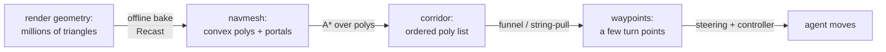

# Navigation Meshes

## What it is

A navigation mesh (navmesh) describes the **walkable floor** of a level as a set of connected **convex polygons** — as Amit Patel puts it, "the walkable areas [as] non-overlapping polygons." Each polygon is a patch of ground an agent crosses in a straight line without leaving walkable surface; a shared edge between two is a **portal**, proof you can step across.

Polygons-plus-portals is a graph: polygons are nodes, portals are links. Pathfinding runs over that graph, not over the triangles your GPU draws.

## Why you care

The mesh is deliberately separate from render geometry. A rendered level is millions of triangles chosen to look right — walls, props, the underside of a table. Almost none of it answers the only question an NPC asks: where may I stand, and how do I reach that spot? The navmesh drops the visuals and keeps reachable floor, simplified to as few polygons as cover it.

It is also the foundation the rest of this track stands on. Searching the mesh for a route is [A\* Pathfinding](./astar-pathfinding.md); moving a body along that route is [Steering](./steering.md); a behaviour tree can order "walk to the stockpile" only because the navmesh makes that a cheap graph query. Get the representation right and everything above it gets simpler.

## Quick start

The whole idea, as data — polygons that know their neighbours:

```cpp
// A navmesh polygon: convex, plus which polygon sits across each edge.
// (-1 = a wall; any other value = a portal you can walk through.)
#include <array>
#include <cassert>
#include <vector>

struct Poly {
    std::array<int, 3> verts;      // indices into a shared vertex array (triangles here)
    std::array<int, 3> neighbours; // poly across edge i, or -1 for a wall
};

// The "graph" a path search walks is just: where can I go from this poly?
std::vector<int> reachable(const Poly& p) {
    std::vector<int> out;
    for (int n : p.neighbours)
        if (n != -1) out.push_back(n);
    return out;
}

int main() {
    // Two triangles sharing edge 1 form a square room; the other edges are walls.
    std::vector<Poly> mesh{
        {{0, 1, 2}, {-1, 1, -1}},   // poly 0: portal on edge 1 -> poly 1
        {{2, 1, 3}, {-1, 0, -1}},   // poly 1: portal back to poly 0
    };
    assert(reachable(mesh[0]) == std::vector<int>{1});
    assert(reachable(mesh[1]) == std::vector<int>{0});
}
```

Real navmeshes use polygons of up to six vertices and store portals more compactly, but that is the shape of it: nodes with edge-indexed neighbours.

## How it works

There are three common ways to model walkable space, and the navmesh is the middle path:

| Representation | Nodes | Coverage | Path quality |
|---|---|---|---|
| Uniform grid | one cell per tile — many | exact but heavy | jagged; needs smoothing |
| Waypoint graph | a few placed points | gaps between links | only as good as placement |
| **Navmesh** | one poly per floor patch — few | the whole surface | recoverable straight paths |

Convexity is the trick. Inside one convex polygon, any two points join by a straight segment that never leaves the polygon. So once a search returns a sequence of adjacent polygons — a **corridor** — the shortest route through it is recovered by the **funnel algorithm** (string-pulling): pull the polyline taut against the portal edges and you get a few turn waypoints instead of a zig-zag through polygon centres.



The other half is **baked-in agent size**. The mesh is built for a body of a chosen radius, height, and climb limit: walkable area is shrunk from walls by the radius, and floor is cut where headroom or step height fails. A point on the mesh therefore already means "a body this size fits here" — no runtime clearance test.

!!! info
    The engine will get its navmesh from an **offline Recast bake**, with **`dtTileCache` stamping runtime obstacles from M7** (a newly built wall re-carves only the affected tiles), and full tiled navmesh streaming at R3 ([master plan](../../design/master-plan.md)). How Recast voxelises geometry into that mesh is [Recast/Detour Overview](./recast-detour-overview.md).

## Pros / Cons

| Pros | Cons |
|---|---|
| Few nodes: fast search, small memory | Building it needs real preprocessing (a bake step) |
| Covers the entire walkable surface, no gaps | Not automatic when geometry changes at runtime |
| Convex polys make straight paths recoverable | Baked for one agent size; other sizes want their own mesh |
| Agent radius/height baked in — no clearance checks | A polygon is walkability, not collision — two worlds |

## What to expect

Building the mesh is a **build-time** job; at runtime the game only queries a finished structure. Moving obstacles do not force a full rebuild — `dtTileCache` re-carves only the tiles a temporary obstacle touches, cheap enough to run during play.

Keep two worlds straight. The navmesh answers "is there a route?" — it moves nothing and resolves no collision. The body is moved by the engine's chosen controller, Jolt's `CharacterVirtual` (see [Character Controllers](../physics/character-controllers.md), [ADR-0011](../../engine/architecture/adr-0011-jolt-charactervirtual.md)); the raycasts that check line-of-sight live in the [physics query](../physics/spatial-queries.md) system, not here.

!!! warning
    A navmesh polygon is **not** a Jolt collision shape. An agent can stand on floor the navmesh omitted (a ledge nobody baked), and the mesh can claim floor a dynamic crate now blocks. Treat the navmesh as advice for planning; let the character controller have the final say on movement.

## Go deeper

- [A\* Pathfinding](./astar-pathfinding.md) — the search that turns polygons into a corridor
- [Steering](./steering.md) — following the waypoints the funnel produced
- [Recast/Detour Overview](./recast-detour-overview.md) — how the mesh is voxelised and baked, and the tile-cache API
- [Character Controllers](../physics/character-controllers.md) — the body that moves along the path
- [Spatial Queries](../physics/spatial-queries.md) — the raycasts navmesh planning does not do
- [Data-Oriented Design](../architecture/data-oriented-design.md) — why the mesh is flat arrays of polys, not a pointer tree
- [ADR-0016: Behaviour Trees](../../engine/architecture/adr-0016-behavior-trees.md) — the layer that issues "go here" orders
- [Master Plan](../../design/master-plan.md) — the M7 navmesh + tile-cache commitment

**Sources**

- Amit Patel — Map Representations (Amit's Game Programming Pages) — <https://theory.stanford.edu/~amitp/GameProgramming/MapRepresentations.html> — accessed 2026-07-06
- Nathan Sturtevant — Choosing a Search Space Representation (Game AI Pro, ch. 18) — <http://www.gameaipro.com/GameAIPro/GameAIPro_Chapter18_Choosing_a_Search_Space_Representation.pdf> — accessed 2026-07-06
- Recast Navigation documentation — <https://recastnav.com/> — accessed 2026-07-06
