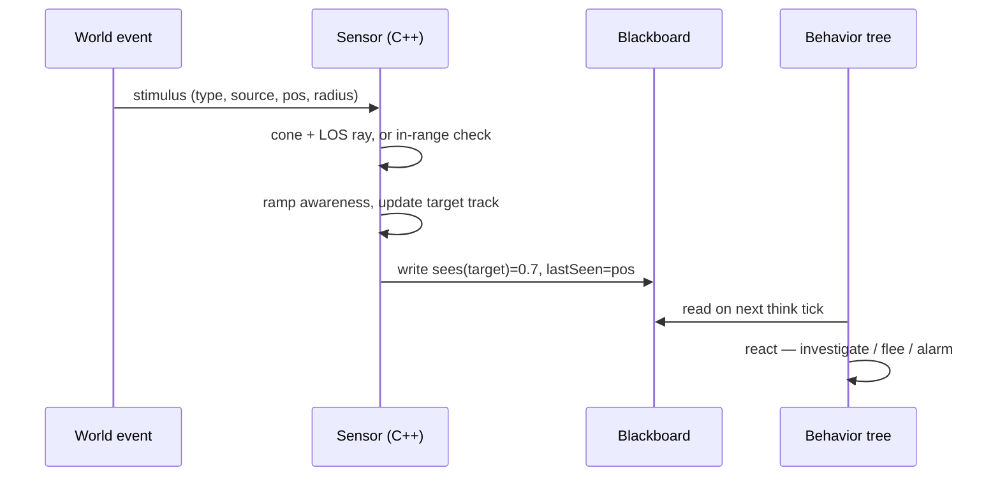

# NPC Perception

## What it is

Perception decides what an NPC knows about the world, limited to what a person in its boots could see and hear. The alternative — an AI reading your position from game state — is cheap to write, but once players notice, it reads as cheating. Crytek names that failure **artificial stupidity**: an omniscient agent feels less intelligent, not more.

An honest sensor gathers only what a human could: a **vision cone** plus a **line-of-sight raycast** for sight, **broadcast stimulus events** for hearing, an **awareness** value that ramps over time, not instantly, and a **target track** holding a last-known position after sight breaks. This engine plans perception as its own C++ **sensor layer** writing findings to the blackboard, read later by the behavior tree ([ADR-0016](../../engine/architecture/adr-0016-behavior-trees.md), M7).

## Why you care

Perception is where "server-authoritative" earns its keep: the engine will run sensing on the server ([master plan](../../design/master-plan.md)), so a modded client cannot make its colonist see through walls. It is also the seam every NPC behavior sits on — a guard noticing a raider, a colonist spotting a fire — each feeding one decision.

Get it wrong toward cheating and stealth dies; wrong toward deaf-and-blind and the colony feels lifeless. The honest middle is almost entirely tuning.

## Quick start

The cheapest sensor is a vision-cone gate: a dot product and a distance check, no physics.

```cpp
// Cheap gate before any raycast: is the target inside the vision cone?
#include <cassert>
#include <cmath>

struct Vec3 { float x, y, z; };

static float dot(Vec3 a, Vec3 b) { return a.x * b.x + a.y * b.y + a.z * b.z; }
static float length(Vec3 v)      { return std::sqrt(dot(v, v)); }

// forward must be unit length; halfAngle is the cone's half-width in radians.
bool inVisionCone(Vec3 eye, Vec3 forward, Vec3 target,
                  float range, float halfAngle) {
    Vec3 to{target.x - eye.x, target.y - eye.y, target.z - eye.z};
    float dist = length(to);
    if (dist == 0.0f || dist > range) return false;   // self, or too far
    float cosTo = dot(forward, to) / dist;            // forward is unit length
    return cosTo >= std::cos(halfAngle);              // inside the wedge?
}

int main() {
    Vec3 eye{0, 0, 0}, fwd{1, 0, 0};
    float range = 20.0f, half = 0.6f;                 // ~34 degree half-angle
    assert(inVisionCone(eye, fwd, Vec3{10, 1, 0}, range, half));   // ahead
    assert(!inVisionCone(eye, fwd, Vec3{0, 10, 0}, range, half));  // to the side
    assert(!inVisionCone(eye, fwd, Vec3{30, 0, 0}, range, half));  // too far
}
```

Only survivors earn a raycast. The eye-to-target ray and its footguns (it hits the NPC's own body first) belong to [Spatial Queries](../physics/spatial-queries.md), which plans those casts through Jolt's `NarrowPhaseQuery` — the engine's physics is Jolt ([ADR-0011](../../engine/architecture/adr-0011-jolt-charactervirtual.md)).

!!! tip
    Order sensors cheapest-first: cull by team and range, then the cone, then the raycast. Crytek cut 16 agents' visibility raycasts from 136 to 16 by only ray-testing hostiles.

## How it works

A stimulus is a small data record — type, source entity, position, and a perceivable radius. The sensor generates sight stims itself (cone plus a clear ray); sound stims are broadcast by whatever made the noise, and any sensor in range hears them. Both flow through one pipeline:



Awareness does not flip instantly. In Crytek's ADSR-envelope model, a stimulus ramps toward a peak while it keeps arriving, then bleeds off when it stops — lost sight is release, not delete. Splinter Cell shaped it as a distance-scaled detection timer; Rabin's survey puts the ramp at ~0.2 s minimum, since instant reactions feel robotic and unfair.

```cpp
// Awareness ramps up while sensed and bleeds off when the stimulus stops.
// Mirrors an ADSR envelope: attack while seen, release when not.
#include <algorithm>
#include <cassert>

struct Awareness {
    float value = 0.0f;   // 0 = oblivious, 1 = fully alerted
    void tick(float dt, bool sensed, float attackPerSec, float releasePerSec) {
        float rate = sensed ? attackPerSec : -releasePerSec;
        value = std::clamp(value + rate * dt, 0.0f, 1.0f);
    }
};

int main() {
    Awareness a;
    // Seen for 0.2 s at 2.0/s reaches 0.4 — past the ~0.2 s reaction floor.
    for (int i = 0; i < 12; ++i) a.tick(1.0f / 60.0f, true, 2.0f, 1.0f);
    assert(a.value > 0.39f && a.value < 0.41f);
    // Sight lost: awareness decays instead of snapping straight to zero.
    for (int i = 0; i < 30; ++i) a.tick(1.0f / 60.0f, false, 2.0f, 1.0f);
    assert(a.value == 0.0f);
}
```

When sight breaks, the target track keeps the **last-known position**, so the tree investigates where the raider was rather than forgetting it. Stimuli carry different weight — Crytek peaks footsteps at 25, a weapon at 50, a clear look at 100 — so a glimpsed enemy outranks a distant sound.

!!! warning
    Fairness is judged from the player's chair, not the simulation's. Splinter Cell halved hearing for off-screen NPCs — what matters is what the player believes the NPC could perceive, not what the raycast permits.

## Pros / Cons

| Pros | Cons |
|---|---|
| Honest senses read as intelligent, not cheating | Every raycast and stim costs CPU per NPC |
| Cones, ranges, ramps tune in data, no rebuild | "Fair" is subjective — playtesting, not a formula |
| Sensor writes the blackboard; the tree stays decoupled | Awareness bugs (stuck-alert, never-spot) hide easily |
| Last-known tracks give believable search behavior | Hearing through walls needs path distance, not Euclidean |

## What to expect

Perception is not free, so the engine plans to **stagger** it: each NPC thinks at ~5–10 Hz on a round-robin inside the 60 Hz tick ([master plan](../../design/master-plan.md); [Staggered AI Scheduling](./staggered-ai-scheduling.md)). Each re-checks sight every several ticks; a raid's worth spreads across the second.

The real work is tuning data — cone angle, view range, ramp rates, stim peaks, hearing falloff — exposed so a designer or modder iterates without a compile ([ADR-0015](../../engine/architecture/adr-0015-luau-modding.md)). And expect nothing yet: the engine is pre-M1, so treat every claim here as plan, landing at M7, not code you run today.

!!! info
    This page stops at what the NPC knows: the blackboard's shape belongs to [Blackboards](./blackboards.md), raycast internals to [Spatial Queries](../physics/spatial-queries.md), and what to do about a threat to [Behavior Trees](./behavior-trees.md).

## Go deeper

- [Behavior Trees](./behavior-trees.md) — reads what this sensor writes
- [Blackboards](./blackboards.md) — where perception publishes
- [Staggered AI Scheduling](./staggered-ai-scheduling.md) — fitting the think budget
- [Steering](./steering.md) — moving to a last-known spot
- [Choosing an AI Model](./choosing-an-ai-model.md) — where sensor-plus-tree fits
- [Spatial Queries](../physics/spatial-queries.md) — the Jolt raycasts sight uses
- [Fixed Timestep](../architecture/fixed-timestep.md) — the 60 Hz clock beneath
- [ADR-0016: Behavior Trees](../../engine/architecture/adr-0016-behavior-trees.md) — sensors and blackboard are C++
- [ADR-0011: Jolt CharacterVirtual](../../engine/architecture/adr-0011-jolt-charactervirtual.md) — the physics behind an LOS ray
- [ADR-0002: Fixed 60 Hz Tick](../../engine/architecture/adr-0002-fixed-60hz-tick.md) — the tick sensing staggers against

Sources:

- Crytek's Target Tracks Perception System (Game AI Pro, ch. 31) — http://www.gameaipro.com/GameAIPro/GameAIPro_Chapter31_Crytek's_Target_Tracks_Perception_System.pdf — accessed 2026-07-06
- Modeling Perception and Awareness in Tom Clancy's Splinter Cell Blacklist (Game AI Pro 2, ch. 28) — http://www.gameaipro.com/GameAIPro2/GameAIPro2_Chapter28_Modeling_Perception_and_Awareness_in_Tom_Clancy's_Splinter_Cell_Blacklist.pdf — accessed 2026-07-06
- Agent Reaction Time: How Fast Should an AI React? (Game AI Pro 2, ch. 5) — http://www.gameaipro.com/GameAIPro2/GameAIPro2_Chapter05_Agent_Reaction_Time_How_Fast_Should_An_AI_React.pdf — accessed 2026-07-06

Video: [Modeling AI Perception and Awareness in Splinter Cell: Blacklist](https://www.youtube.com/watch?v=RFWrKHM0vAg) (32 min) — GDC 2014, Martin Walsh; watch after this page for the coffin-shaped vision shapes and detection HUD.
