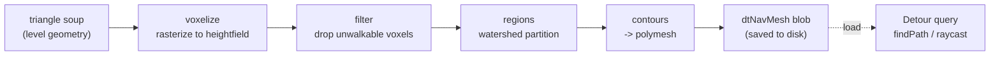

# Recast/Detour Overview

## What it is

Recast Navigation is the industry-standard C++ navigation toolset — it "powers AI navigation features in Unity, Unreal, Godot, O3DE and countless AAA and indie games." It is actually five small libraries with one job each. Earlier pages covered the ideas: [Navmesh](./navmesh.md) is the data structure, [A* pathfinding](./astar-pathfinding.md) is the search, [Steering](./steering.md) is local movement. This page is the toolset that ships all three as production code.

- **Recast** — navmesh **generation**. Turns raw level geometry into a navmesh. Offline.
- **Detour** — runtime loading, pathfinding, and queries against that mesh.
- **DetourCrowd** — agent movement, collision avoidance, crowd simulation.
- **DetourTileCache** — navmesh streaming and runtime obstacles for large, changing worlds.
- **DebugUtils** — drawing the nav data so you can see why an agent did **that**.

The split that matters: **Recast bakes, Detour queries.** Different libraries, different times.

## Why you care

You will not write a voxelizer. Recast is fifteen years of solved edge cases — turning arbitrary geometry into a clean walkable mesh is a swamp, and this is the reference implementation everyone else forked. It is zlib-licensed (permissive, like the engine's own MIT) and needs only a C++98 compiler, so it drops into a C++20 build without a fight.

The engine will adopt it in two planned stages ([master plan](../../design/master-plan.md)):

- **M7**: offline bake plus `dtTileCache` runtime obstacles — when a colonist builds a wall, construction changes walkability without a full rebake.
- **R3**: full tiled navmesh streaming, so regions page in and out as players explore.

That is one module per need: Recast at build time, DetourTileCache at runtime.

## Quick start

The offline half runs once, in a tool, never in the 60 Hz tick:

```cpp
// fragment — does not compile alone
rcHeightfield* hf = rcAllocHeightfield();
rcCreateHeightfield(ctx, *hf, w, h, bmin, bmax, cs, ch);   // build the voxel grid
rcRasterizeTriangles(ctx, verts, tris, ntris, areas, *hf); // triangle soup -> voxels
// ... filter walkable spans, compact heightfield, regions, contours ...
rcPolyMesh* pmesh = rcAllocPolyMesh();
rcBuildPolyMesh(ctx, *cset, maxVerts, *pmesh);             // the navmesh polygons
```

That output becomes a `dtNavMesh` blob you save to disk. The runtime half loads it and asks questions:

```cpp
// fragment — does not compile alone
dtNavMeshQuery query;
query.init(navMesh, /*maxNodes*/ 2048);
dtPolyRef path[256];
int pathCount = 0;
query.findPath(startRef, endRef, startPos, endPos, &filter,
               path, &pathCount, 256);   // Detour runs A* over the polygons here
```

`findPath` is where Detour runs A* — that search is [A* pathfinding](./astar-pathfinding.md)'s subject, not this page's.

!!! info
    Recast and Detour are separate libraries you link separately. A common beginner error is reaching for Recast at runtime — you don't. Recast produces bytes; Detour consumes them. Only DetourTileCache touches the mesh after the bake.

## How it works

Recast is a pipeline. Geometry goes in as "triangle soup" — an unstructured pile of triangles with no notion of floor or wall — and a queryable mesh comes out:



Four conceptual steps, per the docs: "Recast rasterizes the input triangle meshes into voxels"; voxels "where agents would not be able to move are filtered and removed"; walkable areas "are then divided into sets of polygonal regions"; those regions are "re-triangulat[ed]... into a navmesh." Why voxels first? Rasterizing to a grid makes the walkable-surface problem tractable for **any** input mesh — the alternative is fragile analysis of raw triangles.

At runtime **Detour** loads that blob and serves queries: nearest polygon, find path, raycast, random point. **DetourCrowd** sits on top, moving many agents along their paths while avoiding each other — the avoidance math is [Steering](./steering.md)'s topic. **DetourTileCache** is the dynamic layer: the mesh is cut into tiles, and you add or remove **temporary obstacles** that rebuild only the affected tiles — cheap enough to run inside the tick.

!!! warning
    The bake is expensive and offline on purpose — never call Recast during gameplay. Runtime change goes through `dtTileCache` obstacle add/remove, a per-tile rebuild, which is exactly why it is pulled forward into M7.

## Pros / Cons

| Pros | Cons |
|---|---|
| Reference implementation — Unreal, Unity, Godot, O3DE all build on it | C-style API: manual alloc/free, raw pointers, easy to leak |
| zlib license, C++98 — trivial to add to a C++20 build | Sparse docs; the demo app is the real manual |
| Bake/query split: heavy offline, cheap at runtime | Tuning agent radius/height/slope is fiddly and per-game |
| DetourTileCache adds runtime obstacles without a full rebake | Not deterministic across platforms (mostly moot: paths run server-side only) |

## What to expect

- Engine NPCs will "think" at ~5–10 Hz round-robin inside the 60 Hz tick ([master plan](../../design/master-plan.md)); a path query fits that budget without every agent querying every tick.
- Behavior trees ([ADR-0016](../../engine/architecture/adr-0016-behavior-trees.md)) will **request** paths as leaf actions; Detour is the service they call, not the decision-maker.
- Like Jolt, expect it quarantined behind a module boundary — the sim sees waypoints as data, never `dtPolyRef` handles.

## Go deeper

- [Navmesh](./navmesh.md) — the data structure Recast produces and Detour queries.
- [A* pathfinding](./astar-pathfinding.md) — the search inside `findPath`.
- [Steering](./steering.md) — the avoidance behind DetourCrowd.
- [Staggered AI scheduling](./staggered-ai-scheduling.md) — how path queries fit the tick budget.
- [Jolt Physics Overview](../physics/jolt-overview.md) — the same "quarantine a C++ library" pattern, for physics.
- [ADR-0016: Behavior trees](../../engine/architecture/adr-0016-behavior-trees.md) — the decisions that call Detour.

**Sources**

- Recast Navigation documentation — https://recastnav.com/ — accessed 2026-07-06
- recastnavigation/recastnavigation (GitHub) — https://github.com/recastnavigation/recastnavigation — accessed 2026-07-06
- Digesting Duck — Mikko Mononen's blog (Recast/Detour author) — https://digestingduck.blogspot.com/ — accessed 2026-07-06
