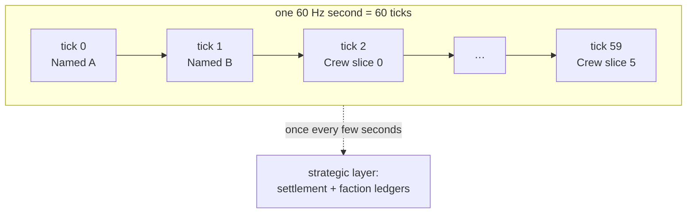

# Staggered AI Scheduling

## What it is

**Staggered scheduling** spreads NPC decision-making across ticks instead of running every brain every frame. Each NPC "thinks" — behavior tree, perception, maybe a path request — only on its assigned tick. The rest coast on their last decision while their bodies keep moving.

This is **level-of-detail for AI**: minor or far agents think rarely, the colonist beside you often — the idea graphics uses on distant objects.

The engine plans to run NPC think at **~5–10 Hz round-robin inside the fixed 60 Hz tick** ([master plan](../../design/master-plan.md), NPC-tier section; [ADR-0002](../../engine/architecture/adr-0002-fixed-60hz-tick.md)), with the off-screen **strategic layer ticking in seconds**, not frames.

## Why you care

A colony sim's whole promise is a bustling town — hundreds of agents. A behavior-tree tick plus a perception sweep plus the odd path query is not cheap; do that for 300 NPCs at 60 Hz and the tick blows its ~16.6 ms budget.

Sunshine-Hill puts it bluntly: the techniques we want "often aren't feasible to run on more than a small handful of NPCs at once, and a cluster of them can easily blow our CPU time budget." Staggering is the first line of defense.

The catch: an NPC thinking at 5 Hz still has to **feel** alert. That is where reaction-time data earns its keep (see How it works).

## Quick start

The whole mechanism is a modulo. Give each agent a fixed slot; it thinks when the tick lands on its slot.

```cpp
#include <cassert>
#include <cstddef>
#include <cstdint>
#include <vector>

// stride = 60 / think_hz. At 10 Hz an agent thinks every 6 ticks; at 5 Hz every 12.
constexpr bool thinks_this_tick(std::uint64_t tick, std::size_t index, std::size_t stride) {
    return tick % stride == index % stride;
}

int main() {
    constexpr std::size_t stride = 6;         // 60 Hz / 10 Hz
    std::vector<int> thoughts(300, 0);        // 300 NPCs
    for (std::uint64_t tick = 0; tick < stride; ++tick)
        for (std::size_t i = 0; i < thoughts.size(); ++i)
            if (thinks_this_tick(tick, i, stride))
                ++thoughts[i];
    // Even slots => flat load: exactly 300/stride = 50 agents think per tick.
    for (int t : thoughts) assert(t == 1);
    // Worst-case decision latency = stride ticks = 100 ms — inside the ~0.2 s
    // human simple-reaction floor (Rabin).
    static_assert(stride * 1000 / 60 <= 200);
    return 0;
}
```

At 300 NPCs and stride 6, ~50 think per tick instead of 300 — a 6× cut — and no agent waits over 100 ms.

!!! tip
    Derive the slot from a stable id (the entity index), not spawn order — else a promoted or despawned NPC reshuffles everyone's slots and stampedes a frame.

## How it works

Three layers, each on its own clock.

The engine's **round-robin dispatcher** will own the fast layer, each tick selecting the cohort whose slot equals `tick % stride` and ticking only their behavior trees ([ADR-0016](../../engine/architecture/adr-0016-behavior-trees.md), M7). Even slots keep per-tick load flat — no frame where everyone thinks at once.

**Identity tiers** will get different strides. Tiers will be ECS component sets ([ADR-0010](../../engine/architecture/adr-0010-entt-ecs.md)): Named colonists will carry a bigger think budget (say 10 Hz); Crew and ambient NPCs will run slower (5 Hz or less). Promotion will just add components, lifting an agent into the richer budget.

The **strategic layer** — settlements and factions as token ledgers — will tick in seconds, off the frame clock (master plan). Empty regions will never run a full brain.



Why this stays honest: reaction time. Rabin reports human **simple** reaction to a visual stimulus at ~0.2 s and **go/no-go** friend-or-foe recognition at ~0.4 s. A 10 Hz think reacts within 100 ms, a 5 Hz think within 200 ms — at or under that floor, so a player can't tell a colonist "thought late."

Expensive work amortizes too: a perception sweep or path query runs on the think tick and caches to the blackboard until the next.

!!! warning
    Staggering the **decision** is safe; staggering **movement** is not — bodies must integrate every tick or they stutter. Only the brain skips ticks; the [CharacterVirtual](../../engine/architecture/adr-0011-jolt-charactervirtual.md) body keeps stepping at 60 Hz.

## Pros / Cons

| Pros | Cons |
|---|---|
| Cuts per-tick AI cost by the stride (6× at 10 Hz, 12× at 5 Hz) | A stale decision can lag reality by up to one stride |
| Flat per-tick load — no spike when NPCs cluster | Fixed strides ignore **which** agent matters (the LOD Trader critique) |
| Rides the existing tick; no new threads | Cross-agent logic must tolerate neighbors on other ticks |
| Tiers map straight onto ECS component sets | Strides per tier are hand-tuned, not computed |

## What to expect

Expect to tune, not calculate, the strides — the right rate is "what feels right to the player" (Rabin's conclusion). This fixed-stride scheme is a floor: Sunshine-Hill's LOD Trader swaps distance-and-tier rules for a per-frame solver ranking each agent's importance to the player. The engine plans fixed tiers first (M7), richer budgets later.

Expect one recurring bug: logic that assumes every agent ran this tick. Averaging, voting, or "nearest enemy" scans must read cached state, not assume freshness — the discipline that keeps [spatial queries](../physics/spatial-queries.md) safe to stagger.

!!! info
    Staggering is orthogonal to threading: it cuts **how much** work each tick does; a job system changes **where** that work runs. Do the cheap one first.

## Go deeper

- [Behavior Trees](./behavior-trees.md) — what one "think" executes
- [NPC Perception](./npc-perception.md) — sweeps amortized onto the think tick
- [Blackboards](./blackboards.md) — where a cached decision lives
- [A* Pathfinding](./astar-pathfinding.md) — the query not to run every tick
- [Choosing an AI Model](./choosing-an-ai-model.md) — what the strategic layer runs
- [Fixed Timestep](../architecture/fixed-timestep.md) — the 60 Hz tick beneath this
- [ECS Pattern](../architecture/ecs-pattern.md) — iterating the cohort
- [Data-Oriented Design](../architecture/data-oriented-design.md) — why flat load is cache-friendly
- [Render Interpolation](../rendering/render-interpolation.md) — smooth bodies while brains skip
- [ADR-0016: Behavior Trees](../../engine/architecture/adr-0016-behavior-trees.md) · [ADR-0010: EnTT ECS](../../engine/architecture/adr-0010-entt-ecs.md) · [ADR-0002: Fixed 60 Hz Tick](../../engine/architecture/adr-0002-fixed-60hz-tick.md) · [ADR-0011: CharacterVirtual](../../engine/architecture/adr-0011-jolt-charactervirtual.md)

Sources:

- Steve Rabin — Agent Reaction Time: How Fast Should an AI React? — http://www.gameaipro.com/GameAIPro2/GameAIPro2_Chapter05_Agent_Reaction_Time_How_Fast_Should_An_AI_React.pdf — accessed 2026-07-06
- Ben Sunshine-Hill — Phenomenal AI Level-of-Detail Control with the LOD Trader — http://www.gameaipro.com/GameAIPro/GameAIPro_Chapter14_Phenomenal_AI_Level-of-Detail_Control_with_the_LOD_Trader.pdf — accessed 2026-07-06
