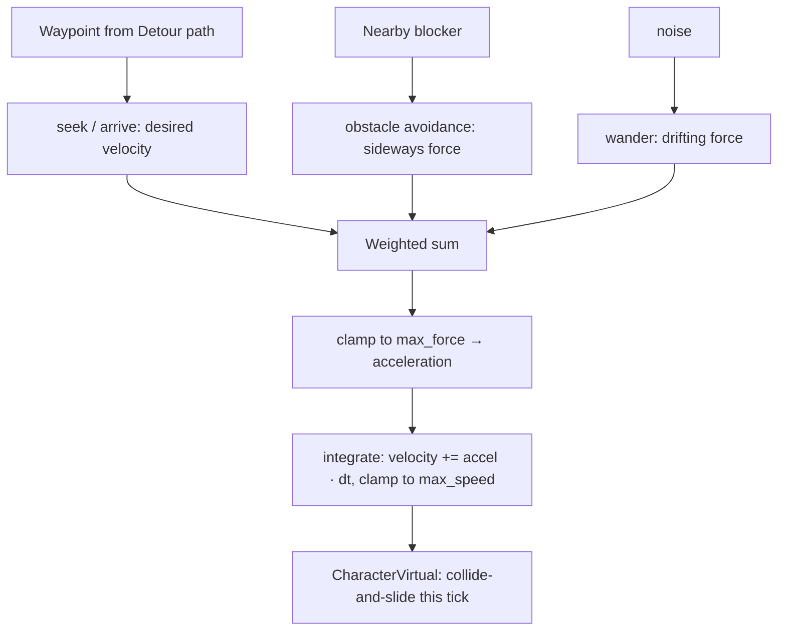

# Steering Behaviors

## What it is

A path says **where** to go; steering decides the **velocity this tick**. Given a target point, a steering behavior returns a force that nudges an agent's velocity toward "what I want" and away from "what I have". Craig Reynolds named the vocabulary in 1999: **seek** (drive at a point), **flee** (drive away), **arrive** (seek, but brake into a stop), **wander** (organic drift), and **obstacle avoidance** (a sideways shove around a blocker). Each is a few lines of vector math — no planning, no global map.

In this engine, steering is planned as the per-tick movement layer: it will consume a waypoint from Detour and emit a velocity for Jolt's `CharacterVirtual` to collide-and-slide with, once per fixed 60 Hz tick ([ADR-0011](../../engine/architecture/adr-0011-jolt-charactervirtual.md), [ADR-0002](../../engine/architecture/adr-0002-fixed-60hz-tick.md)). Computing the route is [A* Pathfinding](./astar-pathfinding.md)'s job; DetourCrowd's built-in avoidance belongs to [Recast/Detour Overview](./recast-detour-overview.md); **deciding** the destination is [Behavior Trees](./behavior-trees.md).

## Why you care

Without steering, an agent teleports from waypoint to waypoint: snap turns, robotic straight lines, no slowdown, bodies clipping through each other. Steering buys smooth acceleration, a graceful stop at the goal, idle wandering, and cheap dodging — the difference between a chess piece and a creature.

It is also the cheapest AI you own. One behavior is a subtraction and a normalize, run every tick for every moving NPC. Because the output is a pure `state → velocity`, it will drop onto the kinematic, re-simulable controller (ADR-0011) with nothing scripted on the path.

## Quick start

Seek and arrive on a bare `Vec2`. `arrive` is just `seek` that scales its desired speed down inside a slowing radius, so the agent coasts to rest.

```cpp
#include <cassert>
#include <cmath>
#include <cstdio>

struct Vec2 { float x = 0.0f, y = 0.0f; };
Vec2 operator+(Vec2 a, Vec2 b) { return {a.x + b.x, a.y + b.y}; }
Vec2 operator-(Vec2 a, Vec2 b) { return {a.x - b.x, a.y - b.y}; }
Vec2 operator*(Vec2 v, float s) { return {v.x * s, v.y * s}; }
float length(Vec2 v) { return std::sqrt(v.x * v.x + v.y * v.y); }
Vec2 clamp(Vec2 v, float max) {                 // cap a vector's magnitude
    float len = length(v);
    return (len > max && len > 0.0f) ? v * (max / len) : v;
}

struct Agent {
    Vec2  pos, vel;
    float max_speed = 4.0f;   // m/s
    float max_force = 8.0f;   // m/s^2 (mass = 1)
};

// steering = desired_velocity - current_velocity  (Reynolds, 1999)
Vec2 seek(const Agent& a, Vec2 target) {
    Vec2  to = target - a.pos;
    float d  = length(to);
    Vec2  desired = (d > 0.0f) ? to * (a.max_speed / d) : Vec2{};
    return desired - a.vel;
}
Vec2 arrive(const Agent& a, Vec2 target, float slow_radius) {
    Vec2  to = target - a.pos;
    float d  = length(to);
    if (d <= 0.0f) return a.vel * -1.0f;                       // already there: brake
    float speed = (d < slow_radius) ? a.max_speed * (d / slow_radius) : a.max_speed;
    return to * (speed / d) - a.vel;
}

void tick(Agent& a, Vec2 steering) {
    constexpr float dt = 1.0f / 60.0f;                         // one fixed tick
    a.vel = clamp(a.vel + clamp(steering, a.max_force) * dt, a.max_speed);
    a.pos = a.pos + a.vel * dt;   // in-engine: hand a.vel to CharacterVirtual instead
}

int main() {
    Agent a{.pos = {0.0f, 0.0f}, .vel = {0.0f, 0.0f}};
    for (int i = 0; i < 600; ++i)                              // 10 s at 60 Hz
        tick(a, arrive(a, {10.0f, 0.0f}, 2.0f));
    assert(length(Vec2{10.0f, 0.0f} - a.pos) < 0.1f && "arrive reaches the target");
    assert(length(a.vel) < 0.5f && "arrive slows to a near-stop");
    std::printf("pos %.2f  speed %.2f\n", a.pos.x, length(a.vel));
}
```

## How it works

Every behavior produces a **desired velocity**, and the steering force is the delta to get there. To act on several instincts at once, take a **weighted sum**, clamp it to `max_force` (that cap **is** turn radius and acceleration limit), apply as `steering / mass`, then clamp velocity to `max_speed`.



The weights are the tuning surface: heavy avoidance and light wander gives a cautious guard; the reverse gives a drunk. Forces **fight** — a naive sum can cancel two behaviors into standing still, which is why avoidance is often given priority (return early when a collision is imminent) rather than blended.

Two design lines matter here. Steering runs **every tick** for moving agents, but the decision of which waypoint to chase will be staggered NPC thinking at ~5–10 Hz round-robin ([Staggered AI Scheduling](./staggered-ai-scheduling.md), master plan) — cheap motion, occasional cognition. And once Detour's crowd system is in, its local avoidance may replace the hand-rolled separation force entirely ([Recast/Detour Overview](./recast-detour-overview.md)).

!!! tip
    Express force limits per **tick**, not per second, and integrate with the fixed `dt = 1/60`. A steering result computed against a wall-clock delta is neither replayable nor reconcilable; on the fixed tick (ADR-0002) it is both.

## Pros / Cons

| Pros | Cons |
| --- | --- |
| A behavior is a few lines of vector math; runs every tick, per agent, essentially free | Purely local — will walk an agent into a dead-end a path never would |
| Smooth, organic motion: acceleration, braking, wander, dodging | Blended forces fight and cancel; needs weight tuning or priority arbitration |
| Pure `state → velocity`, so it drops onto the predicted `CharacterVirtual` (ADR-0011) | Not a replacement for a path — steering follows waypoints, it does not find them |
| Weights are plain data: retune feel without recompiling | Tuning never announces "done"; jitter and orbiting hide in the constants |

## What to expect

In this engine steering arrives with the **M7** NPC work, when NPCs, the navmesh bake, and the C++ sensors/blackboard arrive together (master plan). The realistic build order: get Detour returning a corridor of waypoints, feed the current waypoint into `arrive`, hand the velocity to `CharacterVirtual`, and only then layer avoidance on top. Expect to spend real time on the weights; DetourCrowd will absorb the crowd-avoidance half, so you write less of it.

!!! warning
    Steering constants (`max_force`, weights, wander noise) are sim state on the predicted path. Keep them in data the same way movement feel is (ADR-0011) — a value tweaked live but not rolled into the tick will desync under reconciliation, a bug that only surfaces under packet loss.

## Go deeper

- [A* Pathfinding](./astar-pathfinding.md) — computes the waypoints steering follows
- [Navmesh](./navmesh.md) — the walkable surface the path lives on
- [Recast/Detour Overview](./recast-detour-overview.md) — DetourCrowd's built-in local avoidance
- [Behavior Trees](./behavior-trees.md) — decides the destination steering drives toward
- [Staggered AI Scheduling](./staggered-ai-scheduling.md) — why thinking is slow but steering is per-tick
- [Character Controllers](../physics/character-controllers.md) — the `CharacterVirtual` that consumes the velocity
- [Spatial Queries](../physics/spatial-queries.md) — how obstacle avoidance finds nearby blockers
- [Fixed Timestep](../architecture/fixed-timestep.md) / [Value Semantics](../cpp/value-semantics.md) — the `dt` and the `state → velocity` purity
- [ADR-0011](../../engine/architecture/adr-0011-jolt-charactervirtual.md) / [ADR-0002](../../engine/architecture/adr-0002-fixed-60hz-tick.md) / [ADR-0016](../../engine/architecture/adr-0016-behavior-trees.md) / [Master plan](../../design/master-plan.md)

**Sources**

- Craig Reynolds — Steering Behaviors For Autonomous Characters (GDC 1999 paper + demos) — https://www.red3d.com/cwr/steer/ — accessed 2026-07-06
- Fernando Bevilacqua — Understanding Steering Behaviors (Envato Tuts+ series) — https://code.tutsplus.com/series/understanding-steering-behaviors--gamedev-12732 — accessed 2026-07-06

**Video**: 5.1 Autonomous Steering Agents Introduction — The Nature of Code (The Coding Train) — https://www.youtube.com/watch?v=P_xJMH8VvAE — 10 min. Watch before writing your first behavior, for the desired-minus-current force intuition in motion.
