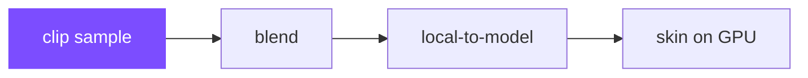
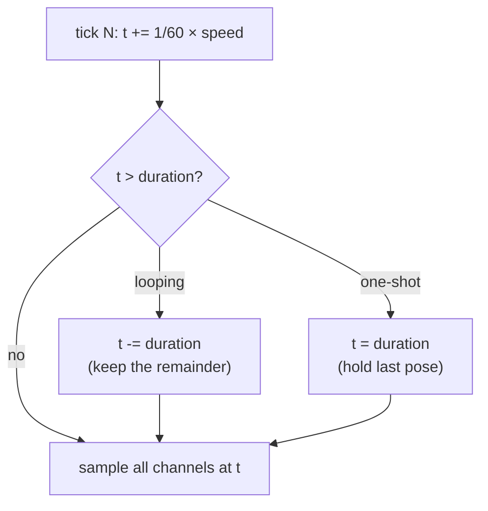

# Animation Clips

## What it is

A **clip** is a named block of keyframed animation — "walk", "chop", "sleep". For each animated joint it carries up to three **channels** (translation, rotation, scale), and each channel is a **sampler**: a list of keyframe times, a parallel list of values, and an interpolation mode. glTF — this engine's only asset format ([ADR-0012](../../engine/architecture/adr-0012-ozz-animation.md)) — defines three modes: **STEP** (hold the previous key's value), **LINEAR** (lerp between keys; **slerp** for rotation quaternions), and **CUBICSPLINE** (each key also stores in/out tangents).

**Sampling** a clip at time `t` evaluates every channel at `t` and writes one local translation/rotation/scale per joint — the local pose that [skinning](skinning.md) eventually turns into moved vertices.

## Why you care

Sampling is stage one of the animation pipeline; everything downstream consumes the pose it produces. Its bugs are all time bookkeeping — a hitch at the loop point, a snap when a one-shot clip ends — and they are cheap to prevent once you've written a sampler by hand.

In this engine, sampling will run inside the fixed 60 Hz tick ([ADR-0002](../../engine/architecture/adr-0002-fixed-60hz-tick.md), [fixed-timestep](../architecture/fixed-timestep.md)): clip time will advance a fixed 1/60 s per tick, so server and clients compute identical poses. The real sampler will be ozz-animation's (ADR-0012); the hand-rolled one below is the mental model, not the plan.

## Quick start

One joint, one channel, two keyframes: translation lerps, rotation slerps, time loops or clamps. Compiles as pasted.

```cpp
#include <cassert>
#include <cmath>

struct Vec3 { float x, y, z; };
struct Quat { float x, y, z, w; };

Vec3 lerp(Vec3 a, Vec3 b, float t) {
    return { a.x + (b.x - a.x) * t,
             a.y + (b.y - a.y) * t,
             a.z + (b.z - a.z) * t };
}

Quat slerp(Quat a, Quat b, float t) {
    float d = a.x * b.x + a.y * b.y + a.z * b.z + a.w * b.w;
    if (d < 0.0f) { b = { -b.x, -b.y, -b.z, -b.w }; d = -d; } // shorter arc
    if (d > 0.9995f) {                    // nearly equal: lerp, renormalize
        Quat q{ a.x + (b.x - a.x) * t, a.y + (b.y - a.y) * t,
                a.z + (b.z - a.z) * t, a.w + (b.w - a.w) * t };
        float n = std::sqrt(q.x * q.x + q.y * q.y + q.z * q.z + q.w * q.w);
        return { q.x / n, q.y / n, q.z / n, q.w / n };
    }
    float th = std::acos(d);
    float sa = std::sin((1.0f - t) * th) / std::sin(th);
    float sb = std::sin(t * th) / std::sin(th);
    return { a.x * sa + b.x * sb, a.y * sa + b.y * sb,
             a.z * sa + b.z * sb, a.w * sa + b.w * sb };
}

// One channel, two keyframes: joint rotation plus joint translation.
struct Channel {
    float t0, t1;      // keyframe times (seconds)
    Vec3  p0, p1;      // translation keys
    Quat  r0, r1;      // rotation keys
};

float loop_time(float t, float duration) {          // looping playback
    t = std::fmod(t, duration);
    return t < 0.0f ? t + duration : t;
}

struct JointPose { Vec3 translation; Quat rotation; };

JointPose sample(const Channel& c, float t) {
    if (t <= c.t0) return { c.p0, c.r0 };           // clamp before first key
    if (t >= c.t1) return { c.p1, c.r1 };           // clamp after last key
    float u = (t - c.t0) / (c.t1 - c.t0);           // 0..1 between the keys
    return { lerp(c.p0, c.p1, u), slerp(c.r0, c.r1, u) };
}

int main() {
    const float pi = 3.14159265f;
    Channel ch{ 0.0f, 0.5f,                          // half-second channel
                { 0.0f, 1.0f, 0.0f }, { 0.2f, 1.0f, 0.0f },
                { 0.0f, 0.0f, 0.0f, 1.0f },          // identity
                { 0.0f, std::sin(pi / 4.0f), 0.0f, std::cos(pi / 4.0f) } };

    JointPose p = sample(ch, 15.0f / 60.0f);         // tick 15 -> t = 0.25 s
    assert(std::abs(p.translation.x - 0.1f) < 1e-6f);          // halfway
    assert(std::abs(p.rotation.y - std::sin(pi / 8.0f)) < 1e-4f); // 45 deg
    assert(std::abs(p.rotation.w - std::cos(pi / 8.0f)) < 1e-4f);

    assert(std::abs(loop_time(0.75f, 0.5f) - 0.25f) < 1e-6f);  // wraps
    assert(sample(ch, 9.0f).translation.x == 0.2f);            // clamps
}
```

A STEP channel would return `r0` until `t1` exactly; CUBICSPLINE would evaluate a cubic through the keys' tangents. A real clip is just many of these channels sharing one clock.

## How it works

The recurring pipeline picture — this page is the first box:



**Finding the keys.** For each channel, find the two keyframes bracketing `t` (binary search, or a cached cursor since `t` only moves forward), compute `u = (t - t0) / (t1 - t0)`, interpolate. Outside the key range the spec clamps to the first/last value.

**Time bookkeeping.** Clip time lives in `[0, duration]`, where duration is the last key time. Each tick either **loops** (walk cycles — wrap the overshoot) or **clamps** (one-shots like a death — hold the last key):



**Normalized time** — `t / duration`, which ozz calls the time ratio — expresses playback as 0..1 regardless of clip length. It's how a 0.8 s walk and a 0.5 s run stay phase-locked when [blending](blending.md) between them (next page). Smoothing the 60 Hz poses between ticks is the renderer's job, not the sampler's — see [render-interpolation](../rendering/render-interpolation.md).

!!! warning
    The classic clip bug: looping with `t = 0` instead of `t -= duration`. A 0.5 s clip on a 60 Hz tick never lands exactly on `duration`, so resetting to zero silently discards the overshoot — the clip hitches every loop and slowly drifts out of phase with anything it should sync with (footstep sounds, a blended second clip).

!!! info
    ozz's `SamplingJob` will do this stage for real (ADR-0012), with a per-instance context that caches key cursors so nothing binary-searches every tick — see [ozz-overview](ozz-overview.md).

## Pros / Cons

Interpolation modes, since the exporter makes you choose:

| Mode | Pro | Con |
|---|---|---|
| STEP | cheapest; exact holds (blinks, teleports) | staircase motion if misused |
| LINEAR | compact; the sane default | visible corners at sparse keys; rotations need slerp |
| CUBICSPLINE | smooth with few keys | 3× the data per key (tangents); costlier to evaluate |

## What to expect

Sampling cost is linear in channel count and trivially cache-friendly; a 60-joint rig is ~180 channels of a few floats each. Expect exporters to bake: Blender commonly resamples curves to a key per frame, so real clips are dense and LINEAR — which is why compression matters later ([ozz-overview](ozz-overview.md)). The bugs you'll actually hit: the loop hitch above, a pose snap when a one-shot ends with no transition, and a joint spinning the long way around when the quaternion dot check is missing.

!!! tip
    Don't accumulate `t += dt` in a float forever — derive it: `t = (tick_now - tick_started) / 60.0`. No drift, and a clip's playback state serializes as one integer, which matters for saves on a server-authoritative engine.

## Go deeper

- [skinning](skinning.md) — the previous page; what the sampled pose ultimately drives
- [blending](blending.md) — next page: combining several clips into one pose
- [gltf-asset-pipeline](gltf-asset-pipeline.md) — how clips get authored, exported, imported
- [ozz-overview](ozz-overview.md) — the planned runtime: compression, SoA sampling
- [render-interpolation](../rendering/render-interpolation.md) — smoothing 60 Hz poses per frame
- [fixed-timestep](../architecture/fixed-timestep.md) — the tick that drives clip time
- [data-oriented-design](../architecture/data-oriented-design.md) — why flat key arrays sample fast
- [ADR-0012](../../engine/architecture/adr-0012-ozz-animation.md) — ozz-animation, glTF-only pipeline
- [ADR-0002](../../engine/architecture/adr-0002-fixed-60hz-tick.md) — the fixed 60 Hz tick

**Sources**

- glTF 2.0 Specification — Animations (3.11, Appendix C) — https://registry.khronos.org/glTF/specs/2.0/glTF-2.0.html#animations — accessed 2026-07-06
- glTF Tutorial — Animations — https://github.khronos.org/glTF-Tutorials/gltfTutorial/gltfTutorial_007_Animations.html — accessed 2026-07-06
- ozz-animation — Playback sample — https://guillaumeblanc.github.io/ozz-animation/samples/playback/ — accessed 2026-07-06
