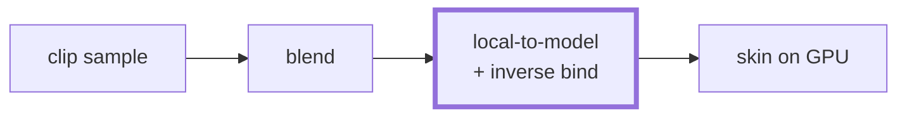
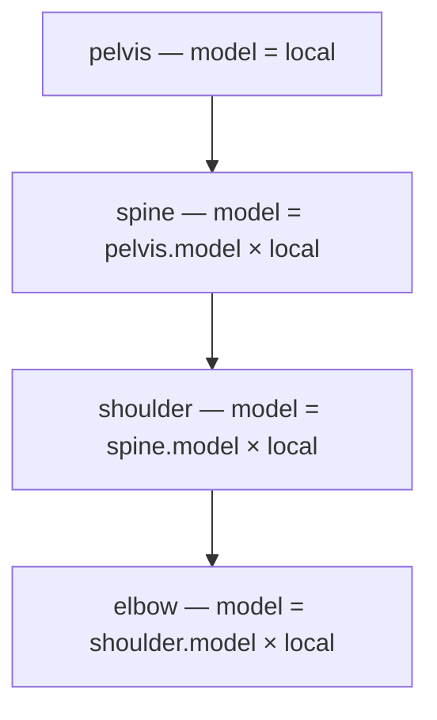

# The Bind Pose

## What it is

The **bind pose** is the exact pose the skeleton held when the mesh was attached — "bound" — to it in the modeling tool, usually a T-pose or A-pose. [Skeletal animation](./skeletal-animation.md) introduced the cast; this page is the transform chain underneath it: each joint stores a **local transform** relative to its parent, composing those down the hierarchy yields **model-space** transforms, and each joint also carries an **inverse bind matrix** that undoes the bind pose before the animated pose is applied.



In the track's recurring pipeline, this page is the highlighted box: turning blended local poses into the model-space matrices the GPU will eventually consume.

## Why you care

Nearly every skinning bug is a transform-space bug in this chain: a mesh crumpled into a knot at the origin, limbs orbiting the body, a character perfect in bind pose that explodes the moment a clip plays. The engine will not hand-roll the runtime — skeletal animation is named project-killer K2, and ozz-animation's local-to-model job will do this composition ([ADR-0012](../../engine/architecture/adr-0012-ozz-animation.md)) — but ozz cannot debug your content. Reading the chain is how you tell a bad export from a bad shader. glTF, the only asset format the pipeline will accept (ADR-0012), stores exactly the pieces walked here: per-node TRS local transforms plus a skin's `inverseBindMatrices` accessor (spec 3.7.3).

## Quick start

Three lines govern everything:

```text
model(j)       = model(parent(j)) × local(j)         // compose down the hierarchy
inverseBind(j) = inverse(bindModel(j))               // computed once, at bind time
skin(j)        = animatedModel(j) × inverseBind(j)   // per joint, what skinning consumes
```

The glTF tutorial states the last line verbatim: "jointMatrix(j) = globalTransformOfJointNode(j) * inverseBindMatrixForJoint(j)". Sanity anchor: when the animated pose equals the bind pose, every `skin(j)` is the identity and the mesh renders exactly as modeled. That is the first assert to write.

## How it works

**Local space** is a joint's transform relative to its parent — "1 unit along the upper arm, then rotate". Locals are what clips animate and what [blending](./blending.md) will interpolate; an elbow's local transform never changes just because the pelvis walked forward. **Model space** is relative to the character's origin and exists only by composition, parents first:



**The inverse bind matrix** exists because vertices are authored in model space, frozen in the bind pose. To make one follow the elbow, first drag it into the elbow's own space — multiply by the inverse of the elbow's model-space **bind** transform — then push it back out through the elbow's **animated** model-space transform. With column vectors, read right to left: `skin · v = animatedModel · (inverseBind · v)`.

!!! warning
    The classic bug: inverting the wrong space. The inverse bind matrix is the inverse of the joint's model-space (global) bind transform, never its local one — and the bind pose need not match the rest pose the node hierarchy happens to encode. The file's `inverseBindMatrices` are authoritative; recomputing them from node TRS "because they should match" is how meshes crumple at the origin.

The whole chain for one elbow, by hand — compiles as pasted:

```cpp
#include <array>
#include <cassert>
#include <cmath>
#include <cstdio>

struct Mat4 {
    float m[4][4]{};  // row-major; transforms column vectors: v' = M * v
    static Mat4 identity() {
        Mat4 r;
        for (int i = 0; i < 4; ++i) r.m[i][i] = 1.0f;
        return r;
    }
    static Mat4 translate(float x, float y, float z) {
        Mat4 r = identity();
        r.m[0][3] = x; r.m[1][3] = y; r.m[2][3] = z;
        return r;
    }
    static Mat4 rotateZ(float a) {
        Mat4 r = identity();
        r.m[0][0] = std::cos(a); r.m[0][1] = -std::sin(a);
        r.m[1][0] = std::sin(a); r.m[1][1] =  std::cos(a);
        return r;
    }
};

Mat4 operator*(const Mat4& a, const Mat4& b) {
    Mat4 r;
    for (int i = 0; i < 4; ++i)
        for (int j = 0; j < 4; ++j)
            for (int k = 0; k < 4; ++k) r.m[i][j] += a.m[i][k] * b.m[k][j];
    return r;
}

// Rigid transform [R|t] inverts cheaply: [transpose(R) | -transpose(R)*t].
Mat4 inverseRigid(const Mat4& t) {
    Mat4 r = Mat4::identity();
    for (int i = 0; i < 3; ++i)
        for (int j = 0; j < 3; ++j) r.m[i][j] = t.m[j][i];
    for (int i = 0; i < 3; ++i) {
        r.m[i][3] = 0.0f;
        for (int j = 0; j < 3; ++j) r.m[i][3] -= r.m[i][j] * t.m[j][3];
    }
    return r;
}

std::array<float, 3> apply(const Mat4& t, std::array<float, 3> p) {
    std::array<float, 3> r{};
    for (int i = 0; i < 3; ++i)
        r[i] = t.m[i][0] * p[0] + t.m[i][1] * p[1] + t.m[i][2] * p[2] + t.m[i][3];
    return r;
}

int main() {
    // Bind pose, local (parent-relative) transforms:
    const Mat4 shoulderLocalBind = Mat4::translate(0.0f, 1.5f, 0.0f);
    const Mat4 elbowLocalBind    = Mat4::translate(1.0f, 0.0f, 0.0f);

    // 1) Compose down the hierarchy: model = parent.model * local.
    const Mat4 shoulderBindModel = shoulderLocalBind;  // root joint: no parent
    const Mat4 elbowBindModel    = shoulderBindModel * elbowLocalBind;

    // 2) Inverse bind: undo the pose the mesh was modeled in. Once, ever.
    const Mat4 elbowInverseBind  = inverseRigid(elbowBindModel);

    // 3) Animate: bend the elbow 90 degrees, in its own LOCAL space.
    const float kPi = 3.14159265358979f;
    const Mat4 elbowLocalAnim = Mat4::translate(1.0f, 0.0f, 0.0f)
                              * Mat4::rotateZ(kPi / 2.0f);
    const Mat4 elbowAnimModel = shoulderBindModel * elbowLocalAnim;

    // 4) The skin matrix: animated model-space pose * inverse bind.
    const Mat4 skin = elbowAnimModel * elbowInverseBind;

    // Sanity anchor: animated pose == bind pose  =>  skin == identity.
    const Mat4 atRest = elbowBindModel * elbowInverseBind;
    for (int i = 0; i < 4; ++i)
        for (int j = 0; j < 4; ++j)
            assert(std::fabs(atRest.m[i][j] - (i == j ? 1.0f : 0.0f)) < 1e-5f);

    // The wrist joint sat at (2, 1.5, 0) in bind pose; the bend swings it up.
    const std::array<float, 3> wrist = apply(skin, {2.0f, 1.5f, 0.0f});
    std::printf("wrist: (%.1f, %.1f, %.1f)\n",  // prints (1.0, 2.5, 0.0)
                static_cast<double>(wrist[0]), static_cast<double>(wrist[1]),
                static_cast<double>(wrist[2]));
    return 0;
}
```

Step 4 is the handoff point: what happens when `skin` meets actual vertices — weights included — is the next page's job.

## Pros / Cons

Storing locals plus a composition pass, rather than storing model-space joints directly:

| Pros | Cons |
|---|---|
| A clip animates one joint without touching descendants; parent motion propagates for free | A full composition pass per evaluated pose, parents strictly first |
| Interpolation stays per-joint local — blending model-space poses is a classic bug ([Blending](./blending.md)) | One bad parent transform silently corrupts every descendant |
| Inverse bind matrices are computed once per mesh, never per frame | Two spaces to keep straight — most bugs are a matrix in the wrong one |

## What to expect

- [Skinning](./skinning.md) — applying `skin(j)` to weighted vertices, deliberately out of scope here.
- [glTF asset pipeline](./gltf-asset-pipeline.md) — where `inverseBindMatrices` actually come from in a real file.
- [Animation clips](./animation-clips.md) — the sampled curves that will drive `local(j)` on the fixed tick ([ADR-0002](../../engine/architecture/adr-0002-fixed-60hz-tick.md)).
- [ozz overview](./ozz-overview.md) — the maintained runtime whose local-to-model job will replace this page's toy loop (ADR-0012).

!!! info
    Store joints parent-before-child and composition becomes one linear array pass — no recursion, no lookups back up the tree. A small [data-oriented](../architecture/data-oriented-design.md) win that ozz's runtime skeleton format will bake in (ADR-0012).

## Go deeper

- [Skeletal animation](./skeletal-animation.md) — the track overview this page zooms into.
- [Cameras](../rendering/cameras.md) — general matrix, space-to-space background.
- [Meshes on the GPU](../rendering/meshes-on-the-gpu.md) — where those authored vertices live.
- [Jolt overview](../physics/jolt-overview.md) — the precedent page for "wrap a maintained library" (here: ozz, ADR-0012).
- [ADR-0012](../../engine/architecture/adr-0012-ozz-animation.md) — ozz-animation, glTF-only pipeline, the K2 defusal plan.

**Sources**

- glTF 2.0 Specification — Skins (3.7.3) — https://registry.khronos.org/glTF/specs/2.0/glTF-2.0.html#skins — accessed 2026-07-06
- glTF Tutorial — Skins — https://github.khronos.org/glTF-Tutorials/gltfTutorial/gltfTutorial_020_Skins.html — accessed 2026-07-06
- LearnOpenGL — Skeletal Animation — https://learnopengl.com/Guest-Articles/2020/Skeletal-Animation — accessed 2026-07-06

**Video**: Skeletal Animation — From Theory and Math to Code (FloatyMonkey) — https://www.youtube.com/watch?v=ZzMnu3v_MOw — 19 min. Watch after this page, before [Skinning](./skinning.md): it animates exactly this matrix chain end to end.
