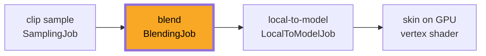

# Animation Blending

## What it is

Blending mixes several sampled poses into one pose. [Animation clips](./animation-clips.md) ended with a pose: one local-space translation/rotation/scale per joint at time `t`. Blending takes two or more such poses plus a weight per pose and computes the weighted average, joint by joint. Walk at 0.7, run at 0.3 gives legs swinging somewhere in between — walk becomes run without a pop.

One mechanism, four uses: **crossfades** (idle→walk, the new clip's weight slides 0→1 over ~0.2 s), **composition** (walk/jog/run mixed by a speed factor, permanently), **partial or masked blending** (per-joint weights: the upper body plays "wave", the legs keep walking), and **additive layers** (a flinch or breathing delta stacked on top of everything else).

## Why you care

A colonist switches activity constantly — idle, walk, haul, flee. Cutting from the last frame of one clip to the first frame of another teleports every joint for one frame: the pop players always notice. A short crossfade deletes it.

This track exists to defuse project-killer K2 ([skeletal animation](./skeletal-animation.md)), so the engine will not hand-roll this math: it will fill ozz's `BlendingJob` with layers and weights each 60 Hz tick ([ADR-0012](../../engine/architecture/adr-0012-ozz-animation.md), [ADR-0002](../../engine/architecture/adr-0002-fixed-60hz-tick.md)). Deciding those weights — locomotion states, behavior trees (ADR-0016) — is a future AI-track story. This page is strictly "weights in, pose out."

## Quick start

The core operation, compiling as pasted: translations lerp, rotations nlerp, per joint.

```cpp
#include <cassert>
#include <cmath>

struct Vec3 { float x, y, z; };
struct Quat { float x, y, z, w; };
struct JointPose { Vec3 t; Quat r; };  // local space: relative to the parent joint

Vec3 lerp(Vec3 a, Vec3 b, float w) {
    return { a.x + (b.x - a.x) * w, a.y + (b.y - a.y) * w, a.z + (b.z - a.z) * w };
}

// Normalized lerp: cheap, and fine for the small rotation gaps between poses.
Quat nlerp(Quat a, Quat b, float w) {
    float dot = a.x * b.x + a.y * b.y + a.z * b.z + a.w * b.w;
    float s = dot < 0.0f ? -1.0f : 1.0f;  // hemisphere check: take the short way
    Quat q{ a.x + (s * b.x - a.x) * w, a.y + (s * b.y - a.y) * w,
            a.z + (s * b.z - a.z) * w, a.w + (s * b.w - a.w) * w };
    float len = std::sqrt(q.x * q.x + q.y * q.y + q.z * q.z + q.w * q.w);
    return { q.x / len, q.y / len, q.z / len, q.w / len };
}

JointPose blend(JointPose a, JointPose b, float w) {  // w: 0 = all a, 1 = all b
    return { lerp(a.t, b.t, w), nlerp(a.r, b.r, w) };
}

int main() {
    // One thigh joint, halfway through a walk->run crossfade.
    JointPose walk{ {0.0f, 0.4f, 0.0f}, {0.259f, 0.0f, 0.0f, 0.966f} };  // ~30 deg
    JointPose run { {0.0f, 0.4f, 0.0f}, {0.500f, 0.0f, 0.0f, 0.866f} }; // ~60 deg
    JointPose out = blend(walk, run, 0.5f);

    assert(out.r.x > walk.r.x && out.r.x < run.r.x);  // swing lands in between
    float len = std::sqrt(out.r.x * out.r.x + out.r.y * out.r.y
                        + out.r.z * out.r.z + out.r.w * out.r.w);
    assert(std::abs(len - 1.0f) < 1e-5f);             // still unit length
    return 0;
}
```

A skeleton is just this repeated per joint, with weights shared across the whole layer.

## How it works

Blending is the second stage of the pipeline every page in this track walks through — after sampling, before the hierarchy walk:



**Layers.** `BlendingJob` takes an array of layers — each a buffer of local-space transforms (a `SamplingJob` output) plus a weight — and accumulates the weighted sum, normalizing by total weight. If total weight falls under a `threshold` input, the result falls back toward the skeleton's [bind pose](./bind-pose.md), so an unanimated joint never collapses to zero scale.

**Partial blending.** Each layer optionally carries per-joint weights; unspecified joints count as 1.0. A mask of 1.0 from the spine up and 0.0 below hands the arms to a "wave" clip while walk keeps the legs — full and partial layers mix in a single pass.

**Additive layers.** A second layer list is applied after the normal pass with a different equation: instead of interpolating toward a pose, it adds a delta on top, so the walk underneath is never diluted. Delta clips are authored offline by subtracting a reference pose (the clip's first frame) — ozz's `AdditiveAnimationBuilder`, or `gltf2ozz` with an additive config.

!!! warning
    Blend **local-space** poses, never model-space ones. In local space, halfway between two thigh rotations is a plausible thigh rotation. A model-space matrix already contains all its parents, so averaging two of them moves each joint independently of its parent — knees drift off thighs and the mesh smears. This is why blend sits before local-to-model in the diagram, not after.

!!! tip
    Composing locomotion clips only looks right if strides line up. ozz's blend sample scales each clip's playback speed by its weight so all durations match — footfalls stay in sync while the mix changes.

## Pros / Cons

| Pros | Cons |
|---|---|
| Kills transition pops for a few multiply-adds per joint | A blend of unrelated poses is mush — feet slide, arms clip |
| One mechanism covers crossfades, locomotion, masks, additive | Locomotion composition needs playback-speed syncing |
| SoA local transforms blend SIMD-wide ([data-oriented design](../architecture/data-oriented-design.md)) | Weights are extra per-entity tick state to store ([ECS pattern](../architecture/ecs-pattern.md)) |
| Additive layers add variety without authoring combined clips | Additive clips must be built as deltas offline |

## What to expect

On this engine, blend weights will live in components and be written by gameplay systems during the tick; the pose math itself will stay quarantined behind the animation module the way Jolt will be ([Jolt overview](../physics/jolt-overview.md)). The planned call looks like:

```cpp
// fragment — does not compile alone
ozz::animation::BlendingJob::Layer layers[2];
layers[0].transform = ozz::make_span(walk_locals);   // SamplingJob output
layers[0].weight    = 1.0f - blend_ratio;
layers[1].transform = ozz::make_span(run_locals);
layers[1].weight    = blend_ratio;
// layers[n].joint_weights: optional per-joint mask — the partial-blend hook

ozz::animation::BlendingJob job;
job.layers    = layers;                          // additive_layers is a second list
job.rest_pose = skeleton.joint_rest_poses();     // bind-pose fallback
job.threshold = 0.1f;
job.output    = ozz::make_span(blended_locals);  // still local space
if (!job.Run()) { /* a span too small, or an invalid weight */ }
```

The output is still a local-space pose: it flows into `LocalToModelJob` and then [skinning](./skinning.md). IK fixups after blending exist in ozz but are only named in [ozz overview](./ozz-overview.md). Note the renderer's [render interpolation](../rendering/render-interpolation.md) is the same lerp/nlerp trick again, applied between ticks instead of between clips.

## Go deeper

- [Animation clips](./animation-clips.md) — where the input poses come from.
- [Skinning](./skinning.md) — what happens to the blended pose next.
- [Bind pose](./bind-pose.md) — the fallback pose under the weight threshold.
- [Ozz overview](./ozz-overview.md) — the full job toolbox, IK included.
- [Fixed timestep](../architecture/fixed-timestep.md) — the tick that produces the weights.
- [ADR-0012](../../engine/architecture/adr-0012-ozz-animation.md) — why ozz owns this instead of hand-rolled code.

**Sources**

- ozz-animation — Animation runtime (BlendingJob) — https://guillaumeblanc.github.io/ozz-animation/documentation/animation_runtime/ — accessed 2026-07-06
- ozz-animation — Blending sample — https://guillaumeblanc.github.io/ozz-animation/samples/blend/ — accessed 2026-07-06
- ozz-animation — Additive blending sample — https://guillaumeblanc.github.io/ozz-animation/samples/additive/ — accessed 2026-07-06

**Video:** GDC 2014 — Animation Bootcamp: An Indie Approach to Procedural Animation (David Rosen) — https://www.youtube.com/watch?v=LNidsMesxSE — 30 min. Watch after this page: it shows how far a handful of poses plus exactly this interpolation math carried Overgrowth, with almost no authored clips.
