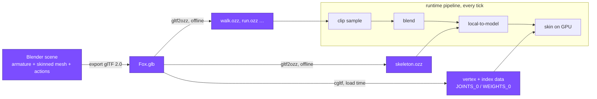

# The glTF Asset Pipeline

## What it is

The one road an animated asset will travel into this engine: model and rig in **Blender**, export **glTF 2.0**, then split the file between two consumers — **cgltf** will parse mesh data for the renderer, and **gltf2ozz** will bake the skeleton and clips into ozz's runtime format ([ADR-0012](../../engine/architecture/adr-0012-ozz-animation.md)). Earlier pages covered what the data means — [skeleton](./skeletal-animation.md), [bind pose](./bind-pose.md), [clips](./animation-clips.md). This page is the toolchain that gets it from an artist's scene onto disk in loadable form.

## Why you care

Skeletal animation is the roadmap's named project-killer **K2**, and the importer is a classic place for it to metastasize: every DCC format speaks its own dialect of units, axes, and bind poses. [ADR-0012](../../engine/architecture/adr-0012-ozz-animation.md) answers by refusing every format but one. glTF 2.0 is an open Khronos spec with one blessed Blender exporter, and Khronos publishes free rigged models — so the whole chain will be provable at M4 with zero original art.

!!! warning
    **The FBX temptation.** Some day a great free asset will exist only as FBX, and adding "just one" FBX path will look harmless. It is not: FBX means a proprietary SDK and per-exporter quirks — ADR-0012 calls refusing it "an entire category of bugs deleted by refusing the format." Convert the asset to glTF in Blender instead; the engine's importer surface stays one format wide.

## Quick start

No Blender required on day one. Download **Fox.glb** from [glTF-Sample-Assets](https://github.com/KhronosGroup/glTF-Sample-Assets) — a CC-licensed fox with three clips (Survey, Walk, Run) — and run ozz's importer:

```sh
gltf2ozz --file="Fox.glb"
```

With no config, gltf2ozz imports the skeleton plus every animation, writing `skeleton.ozz` and one `<clip>.ozz` per clip. A JSON config file customizes outputs (`*` is replaced by the clip name):

```json
{
  "skeleton": { "filename": "fox_skeleton.ozz" },
  "animations": [{ "clip": "*", "filename": "fox_*.ozz" }]
}
```

Pass it with `gltf2ozz --file="Fox.glb" --config_file="fox.json"`. Even smaller is **RiggedSimple** — its README says "Start with this to test skinning" — the minimal rig for a first end-to-end run.

## How it works

A skinned glTF is one container holding four kinds of data:

- **nodes** — the transform hierarchy; joints are ordinary nodes.
- **skin** — a `joints` array of node indices plus an `inverseBindMatrices` accessor (what those matrices mean is [bind pose](./bind-pose.md)'s job).
- **mesh primitives** — vertex attributes, including the per-vertex `JOINTS_0` / `WEIGHTS_0` pairs from [skinning](./skinning.md).
- **animations** — samplers (keyframe times mapped to values) plus channels binding each sampler to one node's translation, rotation, or scale.

Each consumer takes the half it cares about, feeding the same runtime pipeline every page in this track shares — here the highlighted stage is everything left of it:



Blender's exporter offers two variants; the engine will standardize on **glTF Binary (.glb)** — one file with mesh, textures, and animation packed in. The Separate variant (`.gltf` + `.bin` + textures) keeps the JSON human-readable, useful when debugging an export. The exporter also converts Blender's Z-up scenes to glTF's +Y-up convention, so every consumer sees one coordinate convention.

For meshes, the engine will use **cgltf** ([ADR-0012](../../engine/architecture/adr-0012-ozz-animation.md)): a single-header, MIT-licensed C loader used by Filament, bgfx, and raylib.

```cpp
// fragment — does not compile alone
#define CGLTF_IMPLEMENTATION
#include "cgltf.h"

cgltf_options options = {};
cgltf_data* data = nullptr;
if (cgltf_parse_file(&options, "Fox.glb", &data) == cgltf_result_success &&
    cgltf_load_buffers(&options, data, "Fox.glb") == cgltf_result_success) {
    cgltf_skin& skin = data->skins[0];    // joints + inverse bind matrices
    cgltf_mesh& mesh = data->meshes[0];   // primitives with JOINTS_0 / WEIGHTS_0
    // ... copy what the renderer needs, then:
    cgltf_free(data);
}
```

cgltf is C — raw pointers, manual `cgltf_free` — so like Jolt it will stay quarantined behind the asset module's edge, handing out plain structs ([ownership](../cpp/ownership-smart-pointers.md)).

## Pros / Cons

| Pros | Cons |
|---|---|
| One open format: one parser, one exporter to trust | Blender-only authoring; no Maya/Max FBX round trips |
| cgltf: single header, MIT, proven in Filament/bgfx/raylib | cgltf is C — no RAII; needs a wrapper at the module edge |
| gltf2ozz bakes offline; runtime never parses glTF for animation | One more offline step to rerun when an asset changes |
| Free Khronos rigs validate the chain before any art exists | Exporter settings (Y-up, sampled animation) must be pinned |

## What to expect

- Fox's three clips drive the same joints, so it will also be the free test rig for [blending](./blending.md) experiments.
- Fitting Mixamo library clips onto the game rig — [retargeting](./retargeting.md), the M4 prototype gate in ADR-0012.
- The runtime that loads `skeleton.ozz` and friends: [ozz overview](./ozz-overview.md).
- Getting the cgltf-parsed vertices onto the GPU: [meshes on the GPU](../rendering/meshes-on-the-gpu.md), [textures](../rendering/textures.md).

## Go deeper

- [Bind pose](./bind-pose.md) — what that `inverseBindMatrices` accessor encodes.
- [Animation clips](./animation-clips.md) — the sampler/channel data gltf2ozz bakes down.
- [Jolt overview](../physics/jolt-overview.md) — the same strategy in physics: wrap the maintained library, quarantine its types.
- [ADR-0012](../../engine/architecture/adr-0012-ozz-animation.md) — the decision record: glTF only, FBX refused, assimp rejected.

**Sources**

- Blender Manual — glTF 2.0 import/export — https://docs.blender.org/manual/en/latest/addons/import_export/scene_gltf2.html — accessed 2026-07-06
- ozz-animation — Toolset (gltf2ozz) — https://guillaumeblanc.github.io/ozz-animation/documentation/toolset/ — accessed 2026-07-06
- cgltf — single-header glTF loader — https://github.com/jkuhlmann/cgltf — accessed 2026-07-06
- Khronos glTF-Sample-Assets (RiggedSimple, Fox) — https://github.com/KhronosGroup/glTF-Sample-Assets — accessed 2026-07-06
