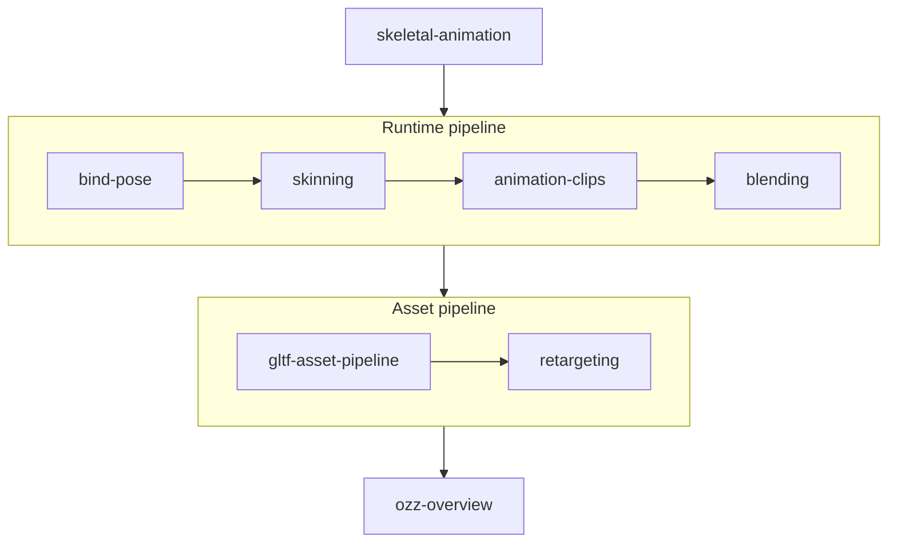

# Animation

## What it is

This track is character animation as this engine will actually do it: the pipeline that turns a keyframed clip into moved vertices — **sample** a clip to get a pose, **blend** poses together, convert **local-to-model** space by walking the joint hierarchy, then **skin** the mesh on the GPU. It covers the runtime math, the Blender→glTF asset road, and the library that will own the hard parts: **ozz-animation** ([ADR-0012](../../engine/architecture/adr-0012-ozz-animation.md)).

## Why you care

The roadmap names skeletal animation **project-killer K2** ([master plan](../../design/master-plan.md)): math-dense, hostile import pipelines, and failures that surface as stretched limbs with no error message. The pre-authorized answer is to wrap a maintained library rather than hand-roll — the same move [Jolt](../physics/jolt-overview.md) made for physics. These pages exist so that when limbs stretch, you can tell which stage broke, because ozz will not.

!!! tip
    If you only skim, read **Skeletal Animation** for the map and **The Bind Pose** in full — nearly every skinning bug traces back to that transform chain.

## How it works

Read in order. One page maps the territory, four walk the runtime pipeline, two build the asset road, and the last is the library itself.

| Page | What you'll learn |
|---|---|
| [Skeletal Animation](skeletal-animation.md) | The whole map: skeleton, joint, pose, and the sample→blend→local-to-model→skin pipeline — plus why the engine won't hand-roll K2. |
| [The Bind Pose](bind-pose.md) | The transform chain every skinning bug traces to: local vs model space, composing down the hierarchy, and the inverse bind matrix. |
| [Vertex Skinning](skinning.md) | Linear blend skinning: four weighted joints per vertex, the matrix palette, LBS artifacts, and the HLSL shader the renderer will run. |
| [Animation Clips](animation-clips.md) | Keyframed channels and samplers (STEP/LINEAR/CUBICSPLINE), loop/clamp time bookkeeping, and sampling on the fixed 60 Hz tick. |
| [Animation Blending](blending.md) | Weighted blending of local poses: crossfades, masked upper-body actions, additive layers — walk to run without a pop. |
| [The glTF Asset Pipeline](gltf-asset-pipeline.md) | The one road in: Blender→glTF only, FBX refused, cgltf and gltf2ozz, and Khronos sample rigs as free test content. |
| [Animation Retargeting](retargeting.md) | Playing one skeleton's clips on another: bone mapping, rest-pose mismatch, and Mixamo as the solo-dev content answer. |
| [ozz-animation Overview](ozz-overview.md) | The library K2 bets on: the offline/runtime split, the SamplingJob→BlendingJob→LocalToModelJob pipeline, and SoA on the tick. |

## What to expect

About an evening per page if you type the examples out. By the end you can read a skinned glTF, trace one vertex from bind pose to deformed position, sample and blend clips by hand, and explain exactly which work ozz does for you — and which the engine still writes itself.

## Go deeper

Start with [Skeletal Animation](skeletal-animation.md). This track leans on [Data-oriented design](../architecture/data-oriented-design.md) (ozz's SoA layout) and the [rendering](../rendering/index.md) track — the skinning shader runs on [SDL GPU](../rendering/hlsl-shader-basics.md); [ozz Overview](ozz-overview.md) mirrors [Jolt Overview](../physics/jolt-overview.md). Engine-specific claims trace to the [master plan](../../design/master-plan.md) and [ADR-0012](../../engine/architecture/adr-0012-ozz-animation.md).

Sources:

- ozz-animation — documentation and samples — https://guillaumeblanc.github.io/ozz-animation/ — accessed 2026-07-06
- glTF 2.0 specification (Khronos) — skins, animations, samplers — https://registry.khronos.org/glTF/specs/2.0/glTF-2.0.html — accessed 2026-07-06
- Video: "An Indie Approach to Procedural Animation" (GDC 2014, David Rosen) — ~30 min — watch after **Animation Blending** for how little authored motion a small team really needs.
