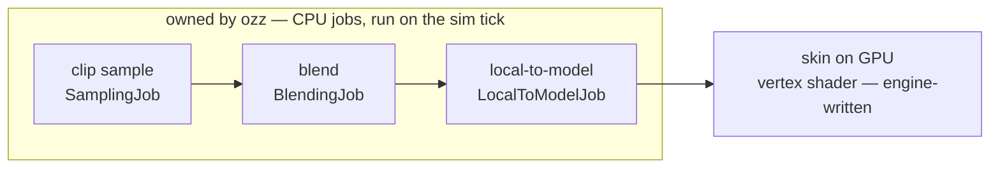

# ozz-animation Overview

## What it is

ozz-animation is an "open source c++ 3d skeletal animation library and toolset": MIT-licensed, engine-agnostic, and data-oriented, with a runtime that depends only on C++17 and the standard library. The previous pages covered the concepts — [Skeletal animation](./skeletal-animation.md), [Animation clips](./animation-clips.md), [Blending](./blending.md). This page is the library's shape: an offline/runtime split, three jobs run in a fixed order, and SoA data flowing between them.

## Why you care

Skeletal animation is roadmap project-killer K2, and [ADR-0012](../../engine/architecture/adr-0012-ozz-animation.md) defuses it the way [ADR-0011](../../engine/architecture/adr-0011-jolt-charactervirtual.md) defused physics: bet on a maintained, MIT, engine-agnostic library instead of a multi-year hand-rolled detour. ozz will own sampling, blending, and hierarchy composition. The engine will still write the glTF import step ([glTF asset pipeline](./gltf-asset-pipeline.md)), the skinning shader ([HLSL shader basics](../rendering/hlsl-shader-basics.md)), and the EnTT components that carry poses ([ECS pattern](../architecture/ecs-pattern.md)). Per the [roadmap](../../engine/roadmap.md), ozz will land at M4, gated on the Mixamo retargeting prototype ([ADR-0012](../../engine/architecture/adr-0012-ozz-animation.md)) — the riskiest link in the content chain.

## Quick start

The offline tools bake `.ozz` files ahead of time — [glTF asset pipeline](./gltf-asset-pipeline.md) covers that. Runtime playback is two jobs and three buffers:

```cpp
// fragment — does not compile alone
#include "ozz/animation/runtime/animation.h"
#include "ozz/animation/runtime/local_to_model_job.h"
#include "ozz/animation/runtime/sampling_job.h"
#include "ozz/animation/runtime/skeleton.h"

ozz::animation::Skeleton skeleton;  // baked offline, loaded read-only
ozz::animation::Animation clip;     // compressed keyframes, one per skeleton

ozz::animation::SamplingJob::Context context(skeleton.num_joints());
std::vector<ozz::math::SoaTransform> locals(skeleton.num_soa_joints());
std::vector<ozz::math::Float4x4> models(skeleton.num_joints());

ozz::animation::SamplingJob sample;
sample.animation = &clip;
sample.context = &context;
sample.ratio = time / clip.duration();  // 0..1 through the clip
sample.output = ozz::make_span(locals);
bool ok = sample.Run();                 // false = invalid inputs

ozz::animation::LocalToModelJob ltm;
ltm.skeleton = &skeleton;
ltm.input = ozz::make_span(locals);
ltm.output = ozz::make_span(models);    // feed these to the skinning shader
ok = ok && ltm.Run();
```

Every job follows the same contract: fill the input/output pointers yourself, call `Run()`, check the returned bool. A `BlendingJob` slots between the two when an entity plays more than one clip.

## How it works

The track's shared pipeline picture, with the stages ozz owns grouped on the left:



**Offline/runtime split.** Builders (`SkeletonBuilder`, `AnimationBuilder`) convert mutable "raw" structures into compressed, immutable runtime ones — "all data accessors are const". Translations bake to half floats and quaternions quantize to three 16-bit integers, so parsing, validation, and compression bugs all live in the build step, never in a frame.

**Jobs, not a scene graph.** A job processes caller-owned inputs and fills caller-owned outputs, and jobs "never access any memory outside of these inputs and outputs, making them intrinsically thread safe". No globals, no callbacks — which also makes each stage trivially unit-testable.

**SoA in the middle, AoS at the end.** Local-space poses are `SoaTransform` arrays — translation, rotation, scale packed four joints wide for SIMD — because sampling and blending touch every joint identically. `LocalToModelJob` unpacks to plain `Float4x4` matrices for rendering. This is [Data-oriented design](../architecture/data-oriented-design.md) shipping in the wild: memory layout follows the loop that consumes it.

**On the tick.** The engine will run one animation system per 60 Hz tick ([ADR-0010](../../engine/architecture/adr-0010-entt-ecs.md), [ADR-0002](../../engine/architecture/adr-0002-fixed-60hz-tick.md)), with the renderer smoothing between ticks ([Render interpolation](../rendering/render-interpolation.md)):

```cpp
// fragment — does not compile alone
// Planned shape (ADR-0010, ADR-0012): one system, once per 60 Hz tick.
for (auto [entity, player, pose] : registry.view<AnimPlayer, ModelPose>().each()) {
    player.time = std::fmod(player.time + kTickDt, player.clip->duration());
    runSampleBlendLocalToModel(player, pose);  // the three jobs above
}
```

!!! warning
    Jobs return `false` instead of throwing when inputs fail validation. The classic bug: sizing the locals buffer with `num_joints()` instead of `num_soa_joints()` — `Run()` quietly returns `false`, nothing is written, and the character T-poses with no error message. Always check the bool; assert on it in debug builds.

## Pros / Cons

| Pros | Cons |
|---|---|
| Defuses K2 with maintained MIT code; runtime needs only C++17 plus the stdlib | Smaller community than engine-built animation — Unity/Unreal answers don't transfer |
| Offline compression: half-float keys, quantized quaternions, keyframe reduction | The offline bake is mandatory — no loading a glTF straight into the runtime |
| Stateless jobs: thread-safe, testable, composable in any order you need | You assemble the pipeline yourself — buffers, contexts, and ordering are your code |
| SoA math delivers the data-oriented promises measurably | Its math types differ from GLM — convert at the module edge |

## What to expect

- One `SamplingJob::Context` per animated entity: it caches decompressed keys and a per-clip cursor, so sharing one across characters thrashes it.
- The plan mirrors [master plan](../../design/master-plan.md) rule 6 as applied to Jolt: ozz types will stay inside the animation module, and the sim will see only EnTT components.
- Advanced ozz — two-bone IK, look-at, motion extraction, the multithreading demo — is named here, not taught: each has an official sample under `samples/` in the repository.

!!! tip
    Like ADR-0011's Jolt fallback, ozz's samples are the ground truth. The playback, blending, and skinning samples together contain the entire integration this track describes — copy them before inventing.

## Go deeper

- [Skeletal animation](./skeletal-animation.md) — why K2 kills projects, and this pipeline in concept form.
- [Animation clips](./animation-clips.md), [Blending](./blending.md) — the math SamplingJob and BlendingJob implement.
- [glTF asset pipeline](./gltf-asset-pipeline.md) — running the offline tools this page assumes.
- [Jolt Physics Overview](../physics/jolt-overview.md) — the same wrap-a-maintained-library playbook, for physics.
- [Data-oriented design](../architecture/data-oriented-design.md) — the theory behind the SoA layout.
- [ADR-0012](../../engine/architecture/adr-0012-ozz-animation.md) — the decision, the rejections (hand-rolled, FBX, assimp), and the M4 gate.

**Sources**

- ozz-animation — documentation home — https://guillaumeblanc.github.io/ozz-animation/ — accessed 2026-07-06
- ozz-animation — Animation runtime — https://guillaumeblanc.github.io/ozz-animation/documentation/animation_runtime/ — accessed 2026-07-06
- ozz-animation — GitHub repository — https://github.com/guillaumeblanc/ozz-animation — accessed 2026-07-06
