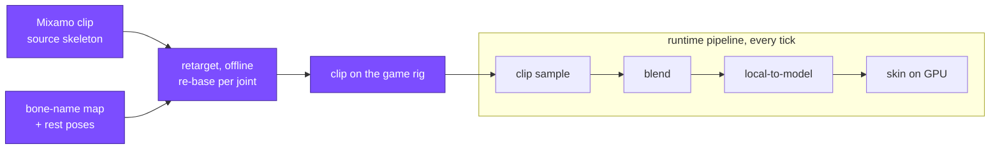

# Animation Retargeting

## What it is

**Retargeting** is playing a clip authored for one skeleton on a **different** one — same motion, new bones. Adobe's free **Mixamo** library animates a standard humanoid rig; you want its hundreds of walks, chops, and idles on your own character. Two things never line up between the rigs: the **bone names** (Mixamo prefixes every joint `mixamorig:`) and the **rest pose** each joint sits in — a source T-pose versus your A-pose, plus different bone lengths. Retargeting reconciles both offline, emitting a clip on your rig for the engine's planned [clip-sample pipeline](./animation-clips.md) (ADR-0012).

## Why you care

This is the content strategy's whole answer to "a solo dev cannot animate." The [master plan](../../design/master-plan.md) says do not plan to learn rigging — a separate multi-month craft — so authored motion will come from Mixamo retargeted onto the game rig. It is also the **riskiest** link in project-killer **K2**: if retargeting yields twisted limbs, every downstream animation page is worthless. That is why [ADR-0012](../../engine/architecture/adr-0012-ozz-animation.md) gates it — the retarget pipeline will be **prototyped at M4 with one rig** before any content leans on it, the roadmap's "prove the risky thing first" discipline.

## Quick start

You cannot copy a source joint's local rotation onto the target: the two rigs rest in different poses, so a raw copy bakes in that **difference** and twists the limb. Instead transfer the joint's swing away from its own rest, replayed in the target's rest frame. One joint, pure quaternions, compiles as pasted:

```cpp
#include <cassert>
#include <cmath>
#include <cstdio>

struct Quat { float x, y, z, w; };

// Hamilton product: the rotation "first b, then a" (column-vector convention).
Quat mul(Quat a, Quat b) {
    return { a.w*b.x + a.x*b.w + a.y*b.z - a.z*b.y,
             a.w*b.y - a.x*b.z + a.y*b.w + a.z*b.x,
             a.w*b.z + a.x*b.y - a.y*b.x + a.z*b.w,
             a.w*b.w - a.x*b.x - a.y*b.y - a.z*b.z };
}

Quat inv(Quat q) { return { -q.x, -q.y, -q.z, q.w }; }  // unit inverse == conjugate

Quat aboutZ(float deg) {
    float r = deg * 3.14159265f / 180.0f;
    return { 0.0f, 0.0f, std::sin(r / 2.0f), std::cos(r / 2.0f) };
}

// Retarget one joint's local rotation from source rig to target rig.
// Transfer the swing AWAY from the source rest, re-based onto the target
// rest — never a raw copy of the source local rotation.
Quat retarget(Quat sourceRest, Quat targetRest, Quat sourceAnim) {
    Quat delta = mul(inv(sourceRest), sourceAnim);  // rest -> animated
    return mul(targetRest, delta);                  // replay in target's rest
}

int main() {
    Quat sourceRest = aboutZ(0.0f);    // source arm: T-pose, straight out
    Quat targetRest = aboutZ(30.0f);   // target arm: A-pose, 30 deg down
    Quat sourceAnim = aboutZ(90.0f);   // clip swings the source arm to 90 deg

    Quat out = retarget(sourceRest, targetRest, sourceAnim);
    // 30 deg rest + 90 deg swing = 120 deg in the target's own local frame.
    std::printf("retargeted swing: %.1f deg\n",  // 120.0
                2.0f * std::acos(out.w) * 180.0f / 3.14159265f);
    assert(std::fabs(out.w - std::cos(60.0f * 3.14159265f / 180.0f)) < 1e-4f);

    // Matching rest poses => retarget collapses to a plain copy.
    Quat same = retarget(sourceRest, sourceRest, sourceAnim);
    assert(std::fabs(same.z - sourceAnim.z) < 1e-6f);
    return 0;
}
```

Apply that per mapped joint and the target moves like the source, keeping its own proportions.

## How it works

Retargeting is an offline transform sitting **before** the pipeline every other page shares — it manufactures a clip on your rig, which then samples, blends, and skins normally:



Three reconciliations, in order:

- **Name mapping.** A lookup table pairs each source joint (`mixamorig:LeftArm`) with the target's (`arm_L`). An unmapped joint is never driven — it holds its rest pose, a stiff limb not a crash.
- **Rest-pose rebasing.** The Quick-start math, per joint: express the source motion as a delta from the source rest, then re-anchor it on the target rest. This is why matching rest poses makes retargeting nearly free.
- **Proportion and root motion.** Bone lengths differ, so you transfer **rotations only** and keep the target's own translations — a longer target arm reaches further. The one translation that matters is the hips, which carry locomotion (**root motion**): Mixamo's **In Place** toggle strips it; otherwise you extract it and hand it to the [server-authoritative movement tick](../architecture/fixed-timestep.md), scaled by the height ratio.

!!! warning
    The classic retargeting bug: copying source local rotations straight onto a target with a different rest pose. Nothing errors — the clip plays, but every limb rests pre-bent, elbows hyperextend, the spine leans. Always rebase through each rig's own rest pose (Quick start). If the character looks broken in every frame equally, this is why.

Mixamo exports **FBX**, not glTF — and the engine refuses FBX ([ADR-0012](../../engine/architecture/adr-0012-ozz-animation.md)). So the retarget will run in Blender, which bakes the motion onto the game rig and exports glTF for [gltf2ozz](./gltf-asset-pipeline.md); ozz ships no retargeter.

## Pros / Cons

| Pros | Cons |
|---|---|
| Hundreds of free Mixamo clips become usable on one rig | Rest-pose and proportion mismatches need per-rig tuning |
| No rigging or keyframing skill required of a solo dev | Mixamo exports FBX only — convert in Blender first |
| Rotation-only transfer preserves the target's proportions | Foot sliding and interpenetration often need IK cleanup |
| One game rig reused across the whole clip library | Riskiest K2 link — why ADR-0012 gates it at M4 |

## What to expect

The M4 prototype will prove **one** rig end to end — Mixamo clip, Blender retarget, glTF, gltf2ozz, played on the game character — before M8's content push depends on it. Expect the first pass to look promising but not right: the Rokoko guide notes adjustments are almost always needed — feet aligned under the hips, foot slide cleaned up. Pin the toolchain once it works; a changed export setting silently reintroduces the rest-pose bug.

!!! tip
    Retarget against the **same** free rig ozz's samples use before touching a bespoke character. Debugging retargeting and a brand-new rig at once is how the M4 gate quietly turns into a month.

## Go deeper

- [glTF asset pipeline](./gltf-asset-pipeline.md) — the Blender-to-glTF road the retargeted clip travels.
- [Animation clips](./animation-clips.md) — what the retargeted clip becomes on your rig.
- [Bind pose](./bind-pose.md) — the rest pose and local/model spaces this page rebases through.
- [ozz overview](./ozz-overview.md) — the runtime that plays the result, and ships no retargeter.
- [Skeletal animation](./skeletal-animation.md) — the K2 framing this track defuses.
- [Jolt overview](../physics/jolt-overview.md) — the same "wrap a maintained library" precedent.
- [ADR-0012](../../engine/architecture/adr-0012-ozz-animation.md) — ozz, glTF-only, FBX refused, the M4 retarget gate.

**Sources**

- Adobe — Mixamo FAQ — https://helpx.adobe.com/creative-cloud/faq/mixamo-faq.html — accessed 2026-07-06
- Rokoko — Retargeting in Blender workflow guide — https://www.rokoko.com/insights/ace-retargeting-in-blender-with-this-simple-workflow-i-the-ultimate-retargeting-guide — accessed 2026-07-06
- ozz-animation — Toolset (gltf2ozz skeleton import) — https://guillaumeblanc.github.io/ozz-animation/documentation/toolset/ — accessed 2026-07-06

**Video:** How to Retarget Animation in Blender from Mixamo — https://www.youtube.com/watch?v=hHWQlDTn4zc — 9 min. Watch after this page: it performs the name-map-plus-rest-pose reconciliation visually — the exact M4 prototype in miniature.
