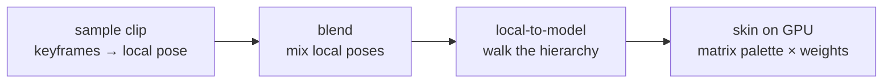

# Skeletal Animation

## What it is

Skeletal animation moves a character by moving an invisible **skeleton** — a hierarchy of **joints** where each joint stores one transform (translation, rotation, scale) relative to its parent — and letting the mesh follow. One transform per joint, taken together, is a **pose**. An animation is nothing more mysterious than a pipeline run every tick: **sample** a clip to get a pose, **blend** poses together, convert **local-to-model** space by walking the hierarchy, then **skin** the vertices on the GPU. This page is the map; each page after it zooms into one stage.

## Why you care

The roadmap names skeletal animation **project-killer K2** ([roadmap](../../design/designs-roadmap-curriculum.md)): it kills at M4 because it is math-dense, import pipelines are hostile, and a broken result is "a horrifying mess of stretched limbs with no error message." The pre-authorized answer ([ADR-0012](../../engine/architecture/adr-0012-ozz-animation.md)) is that the engine **will not hand-roll this**: it will use **ozz-animation** with a Blender→glTF-only asset pipeline, the same "wrap a maintained library" move as [Jolt](../physics/jolt-overview.md). This track exists so you understand what ozz does for you — because when limbs stretch, the library will not tell you which stage you broke.

## Quick start

The heart of the whole system is one loop: a child's model-space transform is its parent's model-space transform times its own local one. Here is a 2-D three-joint arm bending its elbow — pure forward kinematics, no libraries:

```cpp
#include <cmath>
#include <cstdio>
#include <vector>

// One joint of a 2-D arm: a rotation plus a fixed offset along its parent.
struct Joint { int parent; float angle, length; };
struct Xform { float c, s, x, y; };  // 2-D rotation (cos/sin) + translation

// model[j] = model[parent] * local[j] — the entire "local-to-model" stage.
Xform concat(const Xform& p, const Xform& l) {
    return { p.c * l.c - p.s * l.s,      p.s * l.c + p.c * l.s,
             p.c * l.x - p.s * l.y + p.x, p.s * l.x + p.c * l.y + p.y };
}

int main() {
    // shoulder -> elbow -> wrist; parents always listed before children
    std::vector<Joint> skeleton = { {-1, 0.f, 0.f}, {0, 0.f, 1.f}, {1, 0.f, 1.f} };
    std::vector<Xform> model(skeleton.size());

    skeleton[1].angle = 3.14159265f / 2.f;  // a "pose": bend the elbow 90 degrees

    for (std::size_t j = 0; j < skeleton.size(); ++j) {
        Xform local = { std::cos(skeleton[j].angle), std::sin(skeleton[j].angle),
                        skeleton[j].length, 0.f };
        model[j] = skeleton[j].parent < 0
                 ? local
                 : concat(model[static_cast<std::size_t>(skeleton[j].parent)], local);
    }
    std::printf("wrist at (%.2f, %.2f)\n", model[2].x, model[2].y);  // (1.00, 1.00)
}
```

Rotate the shoulder instead and the elbow, wrist, and every finger follow for free — that is the entire point of a hierarchy.

## How it works

Every animated character, in every engine, runs this pipeline. The pages ahead each highlight one box; keep this picture:



- **Sample.** A clip stores keyframes per joint; sampling interpolates between them — lerp for translation, slerp for rotation — producing a **local-space pose** (each joint relative to its parent).
- **Blend.** Mixing walk with run is a per-joint weighted interpolation of local poses. Local space is what makes this cheap and correct.
- **Local-to-model.** The loop from Quick start: multiply down the hierarchy to get every joint relative to the character's root.
- **Skin.** Each vertex follows a few joints with weights; the GPU applies the resulting matrix palette in the vertex shader ([meshes on the GPU](../rendering/meshes-on-the-gpu.md)).

On this engine's planned architecture, stages one to three will run on the CPU at the fixed 60 Hz tick ([fixed timestep](../architecture/fixed-timestep.md), ADR-0002), poses will live as data in [EnTT](../architecture/ecs-pattern.md) components (ADR-0010), and skinning will happen in an SDL GPU vertex shader (ADR-0009) with [render interpolation](../rendering/render-interpolation.md) smoothing between ticks.

!!! warning
    The classic map-level bug is deciding to build this yourself. Sampling looks like a weekend; then come compression, blending masks, additive layers, retargeting — ozz's feature list is a decade of releases. Hand-rolling K2 is exactly the K5 engine-astronautics trap the [master plan](../../design/master-plan.md) pre-forbids.

## Pros / Cons

| Pros | Cons |
|---|---|
| One rig animates any mesh skinned to it — clips are reusable content | Math-dense: quaternions, inverse bind matrices, space conversions |
| Compact: keyframes per joint, not per vertex | Import pipelines are hostile — the reason ADR-0012 is glTF-only |
| Poses blend, layer, and retarget | Failures are visual, silent, and grotesque |

## What to expect

The track follows the pipeline in order, each page assuming the last:

- [Bind pose](./bind-pose.md) — rest pose, inverse bind matrices, the space bookkeeping.
- [Skinning](./skinning.md) — weights, matrix palettes, the vertex shader.
- [Animation clips](./animation-clips.md) — keyframes, samplers, lerp/slerp.
- [Blending](./blending.md) — how clips combine.
- [glTF asset pipeline](./gltf-asset-pipeline.md) — Blender export, cgltf, gltf2ozz.
- [Retargeting](./retargeting.md) — Mixamo clips on your rig.
- [ozz overview](./ozz-overview.md) — the library that will do all of it (ADR-0012).

## Go deeper

- [Bind pose](./bind-pose.md) — the next stop: what "rest" means mathematically.
- [Meshes on the GPU](../rendering/meshes-on-the-gpu.md) — the vertex data skinning deforms.
- [Data-oriented design](../architecture/data-oriented-design.md) — why ozz stores poses as SoA arrays.
- [Jolt overview](../physics/jolt-overview.md) — the precedent page for wrapping a maintained library.
- [ADR-0012](../../engine/architecture/adr-0012-ozz-animation.md) — the decision: ozz, glTF-only, FBX refused.

**Sources**

- LearnOpenGL — Skeletal Animation — https://learnopengl.com/Guest-Articles/2020/Skeletal-Animation — accessed 2026-07-06
- ozz-animation — Features — https://guillaumeblanc.github.io/ozz-animation/documentation/features/ — accessed 2026-07-06
- glTF Tutorial — A Simple Skin — https://github.khronos.org/glTF-Tutorials/gltfTutorial/gltfTutorial_019_SimpleSkin.html — accessed 2026-07-06

**Video:** OpenGL Skeletal Animation Tutorial #1 (ThinMatrix) — https://www.youtube.com/watch?v=f3Cr8Yx3GGA — 14 min. Watch after this page: it walks the same hierarchy-of-joints picture visually before any code.
