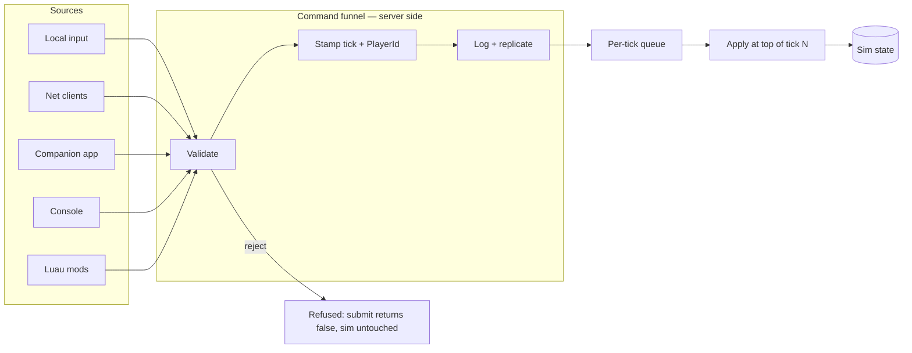

# The Command Funnel

## What it is

Every mutation of sim state that comes from outside the simulation — a player reassigning a hauler, a networked client rezoning a stockpile, the companion app queueing a task, the console spawning a raid, a Luau mod requesting anything — enters through one gate as a [command](../../engine/architecture/adr-0004-one-command-funnel.md): a validated, [tick](./fixed-timestep.md)-stamped, PlayerId-tagged request. PlayerId is opaque (a GUID now, SteamID64 later); no code peeks inside it. Nothing mutates sim state around the funnel — that is code-design rule 3 in the [master plan](../../design/master-plan.md).

## Why you care

Game Programming Patterns calls a command a **reified method call**: a function call turned into plain data you can queue, inspect, ship, and record. Route **all** outside mutation through one such gate and a single mechanism becomes four things at once:

| Role | What it buys |
| --- | --- |
| **Trust boundary** | Gaffer's rule — the server is authoritative; clients send requests, never facts. One place to validate means one place to attack, fuzz, and test. |
| **Replication unit** | The wire carries commands, not scattered RPCs. Networking a feature = making its command serializable. |
| **Replay format** | Record the stream, replay it, get identical per-tick state hashes — the determinism harness. |
| **Mod-safety choke point** | A Luau mod can only **ask**. The funnel decides, so a mod cannot corrupt a co-op session any harder than a player can. |

Per-subsystem paths would mean N trust boundaries, N replication schemes, and no replay. The funnel is the [seam](./solid-at-the-seams.md) that makes SRP-for-state real: exactly one place writes into the sim from outside.

## Quick start

Commands are plain [value types](../cpp/value-semantics.md) — copyable structs, no virtuals:

```cpp
#include <cassert>
#include <cstdint>
#include <deque>
#include <variant>

struct PlayerId { std::uint64_t opaque{}; };  // GUID now, SteamID64 later

struct HaulToStockpile { std::uint32_t item{}, stockpile{}; };
struct SetZonePriority { std::uint32_t zone{}; int priority{}; };
using Payload = std::variant<HaulToStockpile, SetZonePriority>;

struct Command { PlayerId issuer; std::uint64_t tick{}; Payload payload; };

struct Funnel {
    std::deque<Command> queue;

    bool submit(PlayerId who, std::uint64_t now, Payload p) {  // the ONLY way in
        if (auto* z = std::get_if<SetZonePriority>(&p)) {
            if (z->priority < 0 || z->priority > 9) return false;  // reject, never crash
        }
        queue.push_back({who, now + 1, p});  // stamped for a future tick; logged for replay
        return true;
    }
};

int main() {
    Funnel funnel;
    PlayerId host{42};
    bool ok  = funnel.submit(host, 100, SetZonePriority{7, 3});
    bool bad = funnel.submit(host, 100, SetZonePriority{7, 99});  // a mod can only ask
    assert(ok && !bad);
    assert(funnel.queue.size() == 1 && funnel.queue.front().tick == 101);
}
```

How keyboards and gamepads become [InputCommands](./input-as-data.md) is the action-mapping layer's job, and how commands become bits on the wire belongs to [serialization](./serialization-basics.md) — this page is only about the gate itself.

## How it works



Submission and application are decoupled. A source submits; the funnel validates (well-formed payload, permitted issuer, legal by game rules), stamps it for a future tick, logs it, and replicates it. At the top of each tick, that tick's commands are applied in a deterministic order — same stream in, same colony out — before any [system](./ecs-pattern.md) runs.

Inside the tick, systems still write the components they own; the funnel guards the border of the sim, not every line within it. That is why replaying a command stream reproduces every hauler decision and raid outcome: the staggered 5–10 Hz NPC thinking consumes only sim state plus applied commands, so it is deterministic for free.

!!! warning
    The funnel dies by a thousand shortcuts: a debug panel that pokes a component, a console cheat that calls into the sim "just this once", a mod hook returning a mutable reference. Each one is invisible to replay, netcode, and validation. The PR self-review checklist asks it outright: **new mutation path outside the funnel?**

## Pros / Cons

**Pros**: one trust boundary instead of N; replay and determinism testing nearly free; networking a feature is defining one struct; mods are sandboxed by construction; every mutation is auditable with an issuer attached.

**Cons**: one tick (~16 ms) of extra latency between submit and apply; every new player-facing verb needs a command type plus validation; the ceremony feels heavy for a quick hack — which is the point.

## What to expect

The funnel is one of the few strictly TDD parts of the codebase — validation, rejection, and ordering tests come before implementation, because it is the trust boundary (see [hardening principles](../../design/hardening-principles.md)). It lands in M2 with the replay harness and becomes the M3 client/server exit criterion: input → serialized commands → server apply.

!!! info
    Single-player pays the same toll. Because [single-player is a listen server](../../engine/architecture/adr-0003-single-player-is-a-listen-server.md), the funnel is always the hot path — never a rarely-tested "multiplayer mode".

!!! tip
    Bug at tick 48,112? Replay the recorded command stream to tick 48,100 and step forward. The funnel is a time machine you get for free.

## Go deeper

- [Input as data](./input-as-data.md) — how devices produce the InputCommands that feed the funnel.
- [Serialization basics](./serialization-basics.md) — how commands become bytes on the wire.
- [Fixed timestep](./fixed-timestep.md) — the tick timeline commands are stamped against.
- [Engine layering](./engine-layering.md) — where the funnel sits between platform and sim core.
- [Ownership](../cpp/ownership-smart-pointers.md) — why plain value commands need no pointers at all.

**Sources**

- ADR-0004: One command funnel for all sim mutation — [../../engine/architecture/adr-0004-one-command-funnel.md](../../engine/architecture/adr-0004-one-command-funnel.md) — accessed 2026-07-06
- Game Programming Patterns — Command — <https://gameprogrammingpatterns.com/command.html> — accessed 2026-07-06
- Gaffer On Games — What Every Programmer Needs To Know About Game Networking — <https://gafferongames.com/post/what_every_programmer_needs_to_know_about_game_networking/> — accessed 2026-07-06
