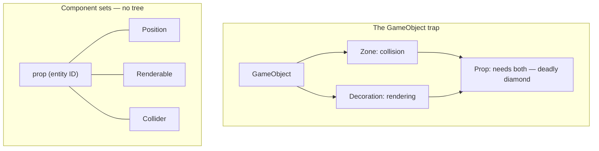

# Composition over Inheritance

## What it is

Composition over inheritance means an entity gains capabilities by **having** parts, not by **being** a subtype. A hauler is not `class Hauler : public Colonist : public Character`; it is an entity ID carrying a set of [components](./ecs-pattern.md) — `Position`, `Inventory`, `HaulJob` — and a system hauls for every entity that has that set. This engine makes it code-design rule 1 in [hardening principles](../../design/hardening-principles.md): **an entity is an ID, and the words `class Enemy : public Character` never appear in this codebase**.

## Why you care

Every OOP-trained programmer builds the same first design: a `GameObject` base class, subclassed per thing in the world. [Nystrom's Component chapter](https://gameprogrammingpatterns.com/component.html) shows exactly where it dies. `Zone` adds collision, `Decoration` adds rendering — then `Prop` needs both. Single inheritance cannot say it, multiple inheritance hits the deadly diamond, and folding everything into `GameObject` gives every banner a pathfinding state it never uses.



The colony sim is made of orthogonal capabilities: a turret attacks but never moves, a raid beast does both, a ghost renders without colliding, a stockpile is a zone that also stores items. No single tree orders those. Worse, the moddability promise makes hierarchies fatal: a modder can declare a component set in JSON plus Luau, but can never add a C++ subclass. Composition is what keeps **new enemy = data + script, zero recompile** true.

## Quick start

The whole idea fits in plain C++ — capabilities as value structs, an entity as whichever ones are present:

```cpp
#include <iostream>
#include <optional>
#include <string>

// Capabilities are plain data — no base class, no virtual functions.
struct Position   { float x, y; };
struct Renderable { std::string sprite; };
struct Collider   { float radius; };

// Toy entity: one struct, optional per capability. The real engine keeps
// each component type in its own EnTT array — see ecs-pattern.
struct Entity {
    std::optional<Position>   position;
    std::optional<Renderable> renderable;
    std::optional<Collider>   collider;
};

int main() {
    Entity banner{Position{3.0f, 4.0f}, Renderable{"banner"}, std::nullopt};
    Entity pasture{Position{0.0f, 0.0f}, std::nullopt, Collider{2.5f}};
    Entity crate{Position{1.0f, 2.0f}, Renderable{"crate"}, Collider{0.5f}};

    // A "render system": acts on whoever has the part. No casts, no diamond.
    for (const Entity* e : {&banner, &pasture, &crate}) {
        if (e->renderable) std::cout << e->renderable->sprite << '\n';
    }
}
```

`crate` has both rendering **and** collision without inheriting from anything. Adding a fourth capability touches no existing type.

!!! tip
    Designing new content, ask "**which components does it have?**" — never "what does it inherit from?". If the answer is an existing set with different numbers, you need zero new C++.

## How it works

In this engine, variation an inheritance tree would carry is split across three axes, and none of them is a subclass:

| You want to vary | Where it lives | Colony-sim example |
| --- | --- | --- |
| What it **can do** | Component set on the entity | Turret = `Position` + `Attack`, no `Mover` |
| Its **numbers** | JSON with `extends` | `raider_elite` extends `raider`, overrides hp + loot |
| How it **decides** | Luau + behavior-tree grafts | Ambush logic grafted into the raid BT, thinking staggered at 5–10 Hz |

Inheritance survives in exactly one place: **data**. JSON `extends` is single-parent field override — `raider_elite` restates only what differs. That is safe where class inheritance is not, because a data record has no invariants or virtual methods for a child to break; the [master plan](../../design/master-plan.md) uses the same `extends` mechanism for behavior-tree JSON. Behavior variation stays in Luau on the authoring surface, so the sim core never grows a type per enemy.

!!! info
    Godot argues the [other side](https://godotengine.org/article/why-isnt-godot-ecs-based-game-engine/): an inheritance-shaped node tree as its user-facing API — while admitting ECS-style linear component data brings "huge performance improvements" and hiding data-oriented servers underneath. Same lesson, different split: every serious engine separates a friendly authoring surface from a data-driven core. Ours draws that line at JSON + Luau over EnTT.

## Pros / Cons

| Pros | Cons |
| --- | --- |
| Orthogonal capabilities combine freely — no diamond, no dead fields | "What is this entity?" has no one class to read; the answer is a runtime component set (build an inspector) |
| Content extends via JSON + Luau, zero recompile — the moddability promise | Interactions between components are less discoverable than a method override |
| Capabilities toggle at runtime: an injured hauler just loses its `HaulJob` component | Overkill for small fixed casts — the three transports behind ITransport do fine with an interface |

## What to expect

The reflex to unlearn: two things share fields, so extract a base class. Here the answer is always a shared component — `Health` on haulers, walls, and raid beasts alike, one damage system over all three. Expect the pull toward subclassing to be strongest exactly where Nystrom predicts: the third entity type that wants half of each of the first two.

!!! warning
    Do not wrap entity IDs in an `Entity` class with methods, "just for convenience." That class becomes the `GameObject` — it will accrue members, then virtuals, then children. The [seams](./solid-at-the-seams.md) are the only place interface-shaped design belongs.

## Go deeper

- [ECS pattern](./ecs-pattern.md) — how EnTT actually stores component sets and how systems are scheduled
- [Data-oriented design](./data-oriented-design.md) — the performance case for flat component data
- [SOLID at the seams](./solid-at-the-seams.md) — the cold paths where interfaces **are** the right tool
- [Value semantics](../cpp/value-semantics.md) — why components are plain copyable values
- [Hardening principles](../../design/hardening-principles.md) — the canonical code-design rules charter

**Sources**

- Game Programming Patterns — Component — https://gameprogrammingpatterns.com/component.html — accessed 2026-07-06
- Godot — Why isn't Godot an ECS-based game engine? — https://godotengine.org/article/why-isnt-godot-ecs-based-game-engine/ — accessed 2026-07-06

**Video**: The Flaws of Inheritance (CodeAesthetic) — https://www.youtube.com/watch?v=hxGOiiR9ZKg — 10 min. Watch after this page if the deadly diamond still feels avoidable with enough discipline — it walks the same trap language-agnostically.
