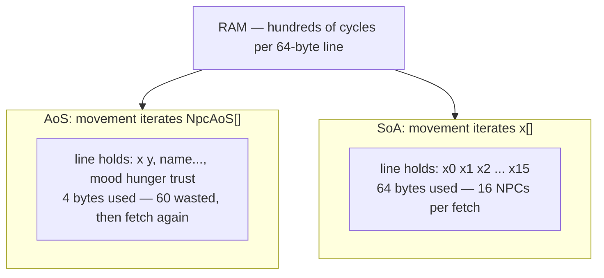

# Data-Oriented Design

## What it is

Data-oriented design (DOD) starts from one claim: **a program exists to transform data**, and the cost of a transform is set by how that data sits in memory, not by how the code reads. Where OOP asks "what is this thing and what can it do?", DOD asks "what data, how much, and what is the common transform?" Design for the **many-case** — 150 Crew NPCs moved every tick — never the one-case of a single, richly modeled hauler.

This engine already committed: a [component](./ecs-pattern.md) is plain data on an entity ID, and a system is a plain function over EnTT views in one ordered schedule ([ADR-0010](../../engine/architecture/adr-0010-entt-ecs.md)). This page is the hardware reasoning underneath: cache lines, AoS vs SoA, existence-based processing.

## Why you care

The sim core gets 16.6 ms per tick, and the [master plan](../../design/master-plan.md) fills it: ~10–30 Named plus 50–150 Crew NPCs per settlement, stockpiles, hauling jobs, a raid's worth of projectiles — with NPC thinking staggered at 5–10 Hz because the budget is real. Casey Muratori benchmarked the textbook-OOP shape — one heap object per instance, a virtual method call each — against data-oriented rewrites of the same transform:

| Version | Relative speed |
| --- | --- |
| Virtual dispatch per object ("clean code") | 1x baseline (~35 cycles/item) |
| `switch` over a type enum | 1.5x faster |
| Table-driven (data describes per-type variation) | 10–15x faster |
| SIMD over flat arrays | 20–25x faster |

Same output, same machine. The gap is memory layout plus dispatch the compiler cannot see through — and per-entity `virtual` in the 60 Hz tick puts that 10–25x tax in your hottest loop, forever:

```cpp
// fragment — does not compile alone
for (Npc* npc : world.npcs)  // scattered heap objects: a cache miss each
    npc->update(dt);         // vtable load; nothing inlines across the call
```

## Quick start

Three habits buy most of DOD:

1. Components are plain structs holding only what one transform reads — [value semantics](../cpp/value-semantics.md), no virtuals, no back-pointers.
2. Same-typed data lives in contiguous arrays (`std::vector`, per [core containers](../cpp/core-containers.md)) and is iterated linearly — never a pointer chase per element.
3. State is component **presence**, not a flag: a hauler is an entity that **has** a `HaulJob`.

```cpp
#include <cstdint>
#include <iostream>
#include <vector>

// AoS: the layout "class Npc" naturally produces — hot and cold data interleaved
struct NpcAoS {
    float x{}, y{};                          // hot: movement reads these every tick
    char  name[32]{};                        // cold: read when the player inspects
    std::int32_t mood{}, hunger{}, trust{};  // cold at 60 Hz: thinking runs at 5-10 Hz
};

// SoA: one array per field — each system iterates only what it transforms
struct Npcs {
    std::vector<float> x, y;
    std::vector<std::int32_t> mood, hunger, trust;
};

void move_aos(std::vector<NpcAoS>& npcs, float dx) {
    for (auto& n : npcs) n.x += dx;  // 4 useful bytes per 52-byte stride
}

void move_soa(Npcs& npcs, float dx) {
    for (auto& x : npcs.x) x += dx;  // every fetched byte is an x
}

int main() {
    std::vector<NpcAoS> aos(150);    // a settlement's worth of Crew
    Npcs soa;
    soa.x.resize(150);
    move_aos(aos, 0.25f);
    move_soa(soa, 0.25f);
    std::cout << sizeof(NpcAoS) << '\n';  // 52: one cache line holds barely one NPC
}
```

## How it works

**Cache lines.** The CPU never fetches one byte; it fetches 64-byte lines. A line already in cache costs a few cycles; a trip to RAM costs hundreds — Nystrom measured a **50x** swing on identical logic from layout alone. The question per system: of each 64-byte fetch, how many bytes does this transform actually use?



**AoS vs SoA.** Array-of-Structs keeps each NPC's fields together — right for code that reads a whole NPC at once (the inspect panel). Struct-of-Arrays keeps each **field** together — right for a system that sweeps one field across everyone, which is what the tick does. EnTT stores each component type in its own dense array: SoA at component granularity, no hand-rolled `Npcs` struct needed.

**Existence-based processing.** Richard Fabian's rule: replace "does this apply?" branches with membership in a collection, so a loop only visits items it applies to. Hauling as a `bool is_hauling` means testing 150 NPCs per tick to find 9 haulers — 141 wasted fetches. Hauling as a `HaulJob` component means the haulers **are** the collection:

```cpp
// fragment — does not compile alone
// Only entities that currently have both components are visited.
for (auto [e, job, pos] : registry.view<HaulJob, Position>().each())
    step_toward(pos, registry.get<Stockpile>(job.target));
```

An EnTT view gives you this for free; dropping `HaulJob` ends the behavior. API details: [ecs-pattern](./ecs-pattern.md).

## Pros / Cons

| Pros | Cons |
| --- | --- |
| 10–25x headroom in the tick — "hundreds of NPCs" instead of "dozens" | Feels backwards after class-first languages — an unlearning cost |
| Existence-based processing deletes flag-checking branches **and** their bugs | Cross-entity logic (hauler ↔ stockpile) needs explicit lookups instead of member access |
| Plain data serializes, snapshots, and replicates trivially — the server-authoritative model depends on this | Layout tuning is wasted on cold paths — the inspect panel does not care |

!!! warning
    DOD earns its keep in per-tick loops over many entities; applied to one-off UI code it is obfuscation. Profile before restructuring anything that runs less than once per tick.

## What to expect

Muratori's numbers come from a hot loop over thousands of homogeneous items; on 150 mixed-workload NPCs the win is smaller but the same shape. Expect the "make a class hierarchy" reflex to fire for months — when it does, ask "what is the many-case transform?" first. This is not a ban on interfaces: virtual dispatch at a **seam** (ITransport, once per packet batch) costs nothing that matters; per-entity dispatch at 60 Hz bleeds. Where that line sits is [solid-at-the-seams](./solid-at-the-seams.md); the structural (non-performance) case for components is [composition-over-inheritance](./composition-over-inheritance.md).

## Go deeper

- [ecs-pattern](./ecs-pattern.md) — the EnTT mechanics this page justifies
- [composition-over-inheritance](./composition-over-inheritance.md) — the structural argument
- [solid-at-the-seams](./solid-at-the-seams.md) — where interfaces are still right
- [fixed-timestep](./fixed-timestep.md) — the 16.6 ms budget's origin
- [value-semantics](../cpp/value-semantics.md), [core-containers](../cpp/core-containers.md) — the C++ underpinnings
- [master plan](../../design/master-plan.md) — canonical NPC counts and tick budget

**Sources**

- Richard Fabian — Data-Oriented Design (online book) — <https://www.dataorienteddesign.com/dodbook/> — accessed 2026-07-06
- Game Programming Patterns — Data Locality — <https://gameprogrammingpatterns.com/data-locality.html> — accessed 2026-07-06
- Casey Muratori — "Clean" Code, Horrible Performance — <https://www.computerenhance.com/p/clean-code-horrible-performance> — accessed 2026-07-06

Video: CppCon 2014: Mike Acton — Data-Oriented Design and C++ — <https://www.youtube.com/watch?v=rX0ItVEVjHc> — 88 min — watch once this page sinks in; the talk that popularized "the hardware is the platform".
