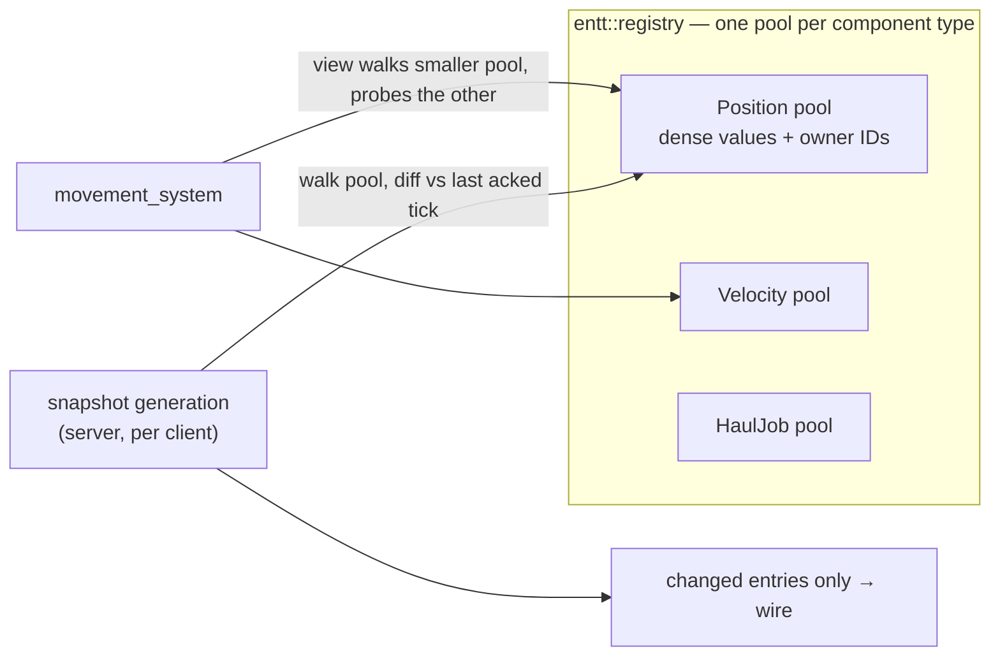

# The ECS Pattern

## What it is

An Entity Component System splits the simulation into three ideas. An **entity** is an ID and nothing else — `entt::entity` is an integer handle returned by `registry.create()`. A **component** is plain data attached to that ID: a struct with public fields and no behavior, obeying ordinary [value semantics](../cpp/value-semantics.md). A **system** is a plain function over an EnTT view, called from one explicit ordered schedule inside the [tick](./fixed-timestep.md) — never an object with a virtual `Update()`.

The world is an `entt::registry` living behind `engine/ecs/`, per [ADR-0010](../../engine/architecture/adr-0010-entt-ecs.md). There is no entity class hierarchy anywhere in the sim core.

## Why you care

Coming from a class-based language you would model a hauler as `class Hauler : public Npc`. Here a hauler is any entity that currently has a `HaulJob` component; when the crate reaches the stockpile, the system removes the component and the entity is just a colonist again. NPC identity tiers (Ambient/Crew/Named) are component sets, so promoting a colonist who survives a raid is one `emplace` call — no class change, no data migration.

The second reason is specific to a server-authoritative engine: EnTT stores each component type in its own **sparse-set pool**, a dense array you can walk end to end. Snapshot generation is exactly that walk — "what changed in the `Position` pool since the tick this client last acknowledged?" The simulation's data model and the replication substrate are the same structure ([ADR-0010](../../engine/architecture/adr-0010-entt-ecs.md) chose EnTT for precisely this).

## Quick start

```cpp
// fragment — does not compile alone (needs EnTT)
#include <entt/entt.hpp>

struct Position { float x{}, y{}; };
struct Velocity { float dx{}, dy{}; };
struct HaulJob  { entt::entity crate{entt::null}; entt::entity stockpile{entt::null}; };

entt::entity spawn_hauler(entt::registry& world, float x, float y) {
    const entt::entity e = world.create();       // an entity is just an ID
    world.emplace<Position>(e, x, y);
    world.emplace<Velocity>(e);
    return e;
}

// A system: a plain function over a view. No base class, no virtual Update().
void movement_system(entt::registry& world) {
    constexpr float dt = 1.0f / 60.0f;           // fixed tick, always
    world.view<Position, const Velocity>().each(
        [](Position& p, const Velocity& v) { p.x += v.dx * dt; p.y += v.dy * dt; });
}

void tick_sim(entt::registry& world) {           // the one explicit ordered schedule
    movement_system(world);
    // hauling_system(world); think_system(world); ...
}
```

That is the API surface you will live on for months: `create`, `emplace`, `view().each`, plus `get`, `remove`, and `destroy` as needed.

!!! tip
    `entt::entity` is a cheap integer handle — pass it by value and store it inside components, as `HaulJob` stores its crate. Never store a pointer or reference to a component; store the entity and look the component up when you need it.

## How it works

Each component type gets its own pool: a dense array of component values, a parallel array of owning entity IDs, and a sparse index mapping entity to dense slot. Add, remove, and "does this entity have X" are O(1); iteration is a linear walk of the dense array. A multi-type view walks the smallest pool involved and probes the others per entity.



Two engine mechanisms fall out of this shape. Staggered NPC thinking: the think system's view covers every NPC brain, but each tick it processes only the bucket whose timer is due, giving each NPC a 5–10 Hz think rate inside the 60 Hz tick with no scheduler framework (see [master-plan](../../design/master-plan.md)). And snapshots: the server walks a pool, diffs values against the last state each client acknowledged, and only changed entries reach the wire — the mechanics continue in [serialization-basics](./serialization-basics.md).

!!! warning
    Component references survive `emplace` — pools are paged, so growth never moves existing elements — but they do **not** survive deletion: `remove` and `destroy` swap-and-pop the pool, so a held `Position&` can silently point at a different entity's data after any delete (unless the type opts into `entt::in_place_delete`). Store entity IDs, never references, as the tip above says. Also, `get<T>` on an entity that lacks `T` is undefined behavior (an assert in debug builds) — check with `all_of` or use `try_get`.

## Pros / Cons

| Pros | Cons |
| --- | --- |
| Any capability mix without a class hierarchy; tier promotion and Luau-defined jobs are just component sets | "What does a hauler do?" is answered by several systems, not one class — you grep the schedule |
| Pools are the natural replication substrate | Cross-entity references are IDs you must validate — the crate may be destroyed mid-haul |
| Systems are plain functions; tick order is one readable list | EnTT template errors are long; component types must be understood by the compiler up front |

## What to expect

The first week has predictable friction. `entt::entity` is an opaque enum class, so printing one requires a cast. You will look for "the entity class" and there is not one — an entity's behavior is the set of systems whose views match it, and the authoritative statement of tick order is the schedule function, so grep that first. Per [hardening-principles](../../design/hardening-principles.md), systems never write another system's state directly; mutations enter through the [command funnel](./command-funnel.md).

!!! info
    EnTT is used bare in sim code, not wrapped. It is a vocabulary library; wrapping it would add a layer with no second implementation. `engine/ecs/` owns only world lifetime, scheduling glue, and serialization hooks.

## Go deeper

- [composition-over-inheritance](./composition-over-inheritance.md) — the full argument for why this beats class hierarchies
- [data-oriented-design](./data-oriented-design.md) — the cache-line reasoning behind dense pools
- [solid-at-the-seams](./solid-at-the-seams.md) — where interfaces still belong
- [ADR-0010: EnTT is the ECS](../../engine/architecture/adr-0010-entt-ecs.md) — the decision record and rejected alternatives

**Sources**

- EnTT wiki — Entity Component System crash course — <https://github.com/skypjack/entt/wiki/Entity-Component-System> — accessed 2026-07-06
- Game Programming Patterns — Component — <https://gameprogrammingpatterns.com/component.html> — accessed 2026-07-06

**Video**: [Overwatch Gameplay Architecture and Netcode (GDC 2017, Timothy Ford)](https://www.youtube.com/watch?v=W3aieHjyNvw) — 64 min. Watch after this page and [command-funnel](./command-funnel.md): a shipped game built on exactly this shape — components as data, systems in one fixed update order — and what that bought its netcode.
