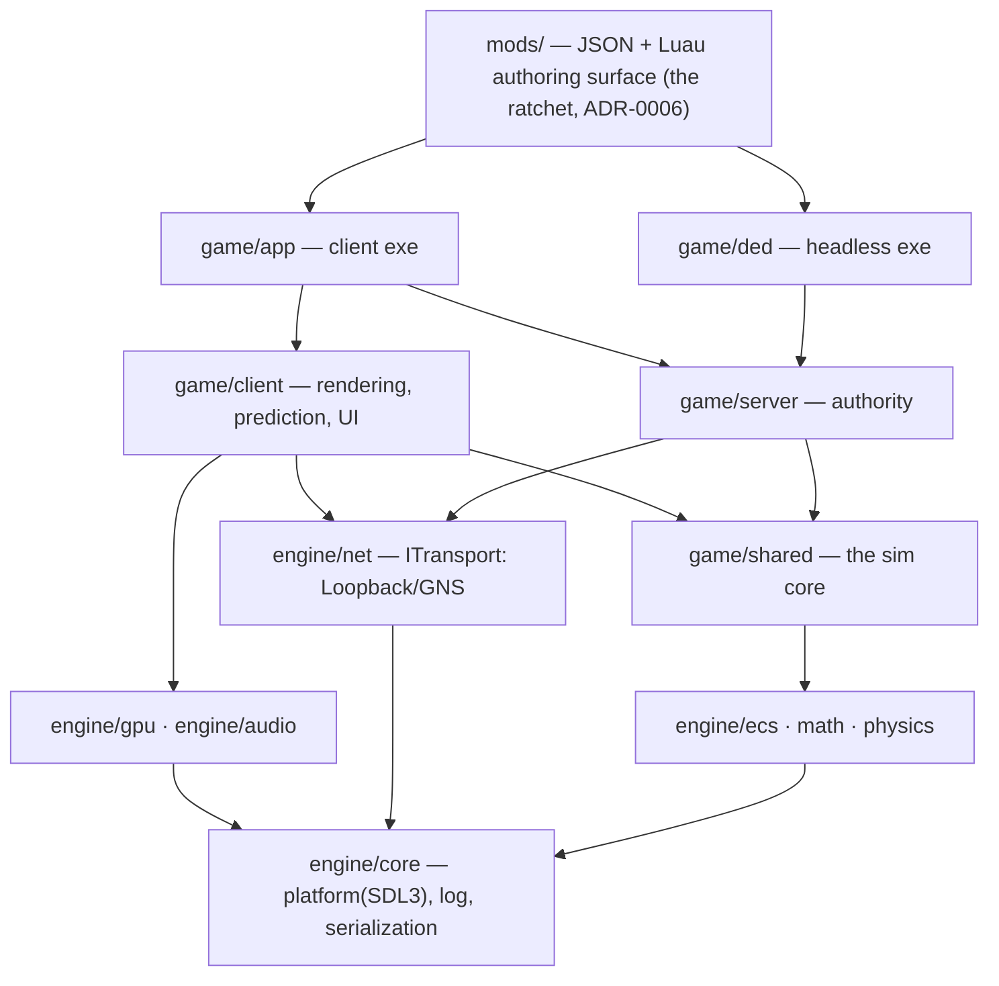

# Engine Layering

## What it is

Layering is the rule that module dependencies point one way — down. Every engine and game module is a CMake static library: `engine/` libs (core, ecs, math, gpu, physics, net) know nothing about the game; `game/shared` — the [sim core](../../design/master-plan.md) — links engine libs but never sees `game/client` or `game/server` headers, and never includes `engine/gpu` or platform code. Two executables sit on top: `game/app` (client plus embedded server) and `game/ded` (headless dedicated server).



Arrows only ever point down. Nothing points up, and nothing points sideways across the client/server split.

## Why you care

The dedicated server is a Linux binary with no GPU, no window, no audio device. It runs haulers, stockpiles, raids, and staggered NPC thinking (5–10 Hz round-robin inside the 60 Hz [tick](./fixed-timestep.md)) exactly as the client-hosted game does. That binary can only exist if the sim never touches rendering — layering is not tidiness, it is the **precondition for the headless server**, for deterministic replay tests in CI, and for Luau mods scripting against a surface that contains no client-only state.

## Quick start

You do not enforce layering by reading diffs. You enforce it by what a target is allowed to see:

```cmake
# game/shared/CMakeLists.txt
add_library(game_shared STATIC hauling.cpp stockpiles.cpp raids.cpp)
target_link_libraries(game_shared
    PUBLIC  engine_ecs engine_math   # vocabulary libs: EnTT/GLM appear in shared headers
    PRIVATE engine_physics)          # quarantined: Jolt types never leave engine/physics
# Note what is absent: engine_gpu, engine_platform.
# A hauler system that tries #include <engine/gpu/renderer.hpp>
# fails to compile — the header is not on the include path.
```

Target and `PRIVATE`/`PUBLIC` mechanics are covered in [CMake minimum](../cpp/cmake-minimum.md); why include paths are the natural enforcement point is [Headers in practice](../cpp/headers-in-practice.md).

## How it works

**Mechanical enforcement, not discipline.** Each module is a CMake target with PRIVATE includes, so a forbidden include is a compile error, not a code-review comment. The backstop is CI: a Linux job builds `game_ded` on every push. If a rendering include sneaks into the sim, the headless link breaks and the push goes red. The [architecture doc](../../design/designs-architecture.md) calls this out directly: layering is "a CI job, not a promise."

**What may cross a boundary: quarantine vs vocabulary.** Third-party types do not cross module boundaries — with a deliberate exception, from [hardening principles](../../design/hardening-principles.md):

| Kind | Rule | Libraries |
|---|---|---|
| Quarantined | Types never leave their module; the boundary exposes plain data or a [seam](./solid-at-the-seams.md) | Jolt (`engine/physics`), GNS (behind `ITransport`), miniaudio |
| Vocabulary | Used bare everywhere; wrapping them is astronautics | GLM, EnTT, spdlog |

```cpp
// fragment — does not compile alone
// engine/physics/character.hpp — all the sim ever sees of Jolt
struct MoveResult { glm::vec3 position; bool grounded; };  // GLM: vocabulary, used bare
MoveResult StepCharacter(glm::vec3 pos, glm::vec3 vel, float dt);
// JPH::CharacterVirtual appears only inside character.cpp — Jolt is quarantined
```

**The top layer is the mod API.** Per [ADR-0006](../../engine/architecture/adr-0006-first-party-as-a-mod-ratchet.md), the authoring surface (JSON + Luau) is a ratchet: from the first milestone where the API exists, each milestone migrates at least one shipped first-party feature onto the same public surface mods use. The diagram's top box grows over time; if the base game's crops or storytellers can't be built up there, neither can mods.

!!! warning
    The classic violation: "this hauler system just needs to draw its path for debugging." The fix is never to include gpu — the sim emits data (a debug-line component or event) and the client draws it. Same shape as everything else crossing layers: state flows down as data, requests flow in as [commands](./command-funnel.md).

## Pros / Cons

| Pros | Cons |
|---|---|
| Headless server and deterministic CI fall out for free | Quick hacks get friction — data must route across the boundary properly |
| Violations are compile errors, caught in seconds | More CMake targets to declare and maintain |
| Quarantine gives swap-safety with zero wrapper tax | Quarantine-vs-vocabulary calls take judgment |
| First-party features and mods build on one public API (the ADR-0006 ratchet) | Engine can never "reach up" for a game-specific shortcut |

## What to expect

Your first violation will look like `fatal error: 'engine/gpu/renderer.hpp' file not found` — that is the system working. Expect to redesign a feature or two around it early; each redesign leaves the sim purer and the headless soak tests (150 crew members assigning jobs, no GPU, on CI) more valuable.

!!! tip
    Unsure which side of a boundary code belongs on? Ask: "does the dedicated server need this?" No → it lives in `game/client`.

## Go deeper

- [SOLID at the seams](./solid-at-the-seams.md) — how the interfaces at these boundaries are designed.
- [Command funnel](./command-funnel.md) — the single mutation path that crosses the layers.
- [Serialization basics](./serialization-basics.md) — `Serialize(Stream&)`, the seam that state crosses on.
- [Data-oriented design](./data-oriented-design.md) — why the sim core is plain data in the first place.
- [CMake minimum](../cpp/cmake-minimum.md) — the target mechanics this page leans on.

**Sources**

- Repository layout, mechanical layering enforcement (architecture design doc) — ../../design/designs-architecture.md — accessed 2026-07-06
- ADR-0006: First-party-as-a-mod is a ratchet — ../../engine/architecture/adr-0006-first-party-as-a-mod-ratchet.md — accessed 2026-07-06
- Jason Gregory — Game Engine Architecture (book site) — https://www.gameenginebook.com/ — accessed 2026-07-06
