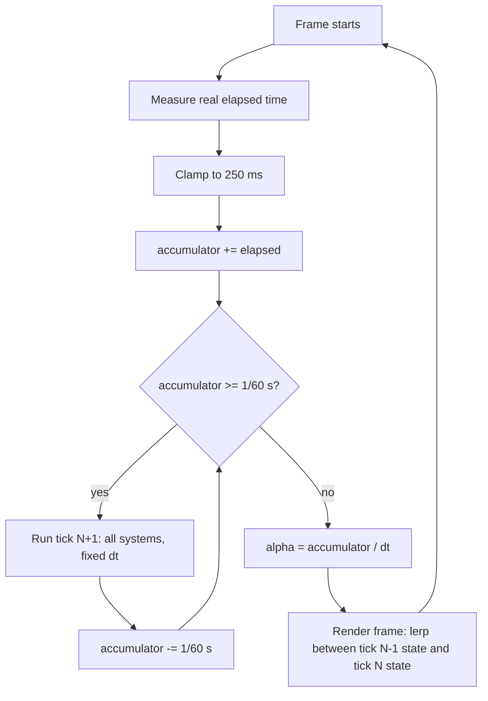

# Fixed Timestep at 60 Hz

## What it is

The accumulator pattern: each pass through the [game loop](./game-loop.md) you measure real elapsed time, pour it into an accumulator, and drain that accumulator in fixed 1/60 s slices — each slice is one **tick** of the simulation. Rendering (each pass is a **frame**) runs at whatever rate the display manages and interpolates between the last two sim states. [ADR-0002](../../engine/architecture/adr-0002-fixed-60hz-tick.md) makes this the law for this engine: the renderer produces time, the sim consumes it in tick-sized bites.

## Why you care

A variable timestep feeds a different `dt` into the sim every frame, so identical inputs produce different floating-point results on every run and every machine. That quietly kills three things this engine is built on:

- **Determinism**: the replay harness re-runs a recorded [InputCommand](./input-as-data.md) stream and demands identical per-tick state hashes. "Tick 4217" only names the same moment on every machine if every tick is the same width.
- **Client prediction**: your client simulates your character ahead of the server, then reconciles when the server's result for that tick arrives. Prediction is "re-run ticks N..M" — impossible without integer-addressable ticks.
- **Staggered NPC thinking**: colonists think at ~5–10 Hz round-robin **inside** the 60 Hz tick (roughly "haulers whose `id % 8 == tick % 8` re-plan now"). That schedule is modular arithmetic on a tick counter, not wall time.

## Quick start

```cpp
#include <chrono>
#include <cstdint>
#include <cstdio>

struct SimState {          // stand-in for the EnTT registry
    double x = 0.0;        // hauler position along a corridor, metres
    double v = 1.5;        // walking speed, m/s
};

SimState Integrate(SimState s, double dt) {
    s.x += s.v * dt;       // the real engine runs every system here
    return s;
}

SimState Lerp(const SimState& a, const SimState& b, double alpha) {
    return {a.x + (b.x - a.x) * alpha, b.v};
}

int main() {
    using Clock = std::chrono::steady_clock;
    constexpr double kDt = 1.0 / 60.0;   // one tick
    constexpr double kMaxFrame = 0.25;   // clamp: a debugger pause is not 40,000 ticks

    SimState prev, curr;
    std::uint64_t tick = 0, printed = 0;
    double accumulator = 0.0;
    auto last = Clock::now();

    while (tick < 120) {                 // ~2 s; the real loop runs until quit
        auto now = Clock::now();
        double frame = std::chrono::duration<double>(now - last).count();
        last = now;
        if (frame > kMaxFrame) frame = kMaxFrame;
        accumulator += frame;

        while (accumulator >= kDt) {
            prev = curr;                 // keep last state for interpolation
            curr = Integrate(curr, kDt);
            ++tick;
            accumulator -= kDt;
        }

        double alpha = accumulator / kDt;          // 0..1 between prev and curr
        SimState visual = Lerp(prev, curr, alpha); // what this frame draws
        if (tick != printed) {  // demo only: unthrottled, this loop spins
            std::printf("tick %llu draw x=%.3f\n", // millions of frames; real
                        static_cast<unsigned long long>(tick), visual.x);
            printed = tick;     // loops pace via vsync/present
        }
    }
}
```

`prev = curr` is a plain copy — cheap [value semantics](../cpp/value-semantics.md) here; the real engine snapshots only the components the renderer interpolates (transforms), not the whole registry.

## How it works



Three pieces carry the weight:

**The clamp.** Without it, pausing in the debugger for 60 s hands the loop 3,600 ticks of debt; if simulating them takes longer than real time, more debt accrues — the spiral of death. Clamping elapsed time at ~250 ms caps the debt at 15 ticks per frame. The cost: under sustained overload the sim runs slower than real time.

**The interpolation.** After draining whole ticks, the accumulator holds a leftover fraction of a tick. `alpha = accumulator / kDt` says how far the visible moment sits between the last two sim states, so a 144 Hz display gets smooth motion from a 60 Hz sim instead of stutter.

**The tick counter.** A `uint64_t` that only ever increments by one. It stamps every command entering the [command funnel](./command-funnel.md), addresses replay hashes, and drives the NPC think round-robin.

!!! warning
    Never let a system read the wall clock. "Raid spawns after 30 s" must be "raid spawns at `start_tick + 1800`" — a wall-clock read is nondeterministic input smuggled past the funnel, and the replay hash test will catch it at the worst possible time.

!!! tip
    Derive every gameplay timer from the tick counter (ticks-remaining fields, deadline ticks). They serialize trivially, survive replays, and cost one integer compare.

!!! info
    Interpolation means the player always sees the sim one tick in the past — at most ~16.7 ms. Nobody notices; every major engine that decouples sim from render does this.

## Pros / Cons

| Pros | Cons |
| --- | --- |
| Same InputCommand stream ⇒ same hashes: replay, prediction, desync detection all work | Rendered state lags one tick (~16.7 ms) behind the sim |
| Sim cost is independent of display rate (60 Hz sim, 144 Hz frames) | Must snapshot interpolated components each tick (small copy cost) |
| Integer tick timeline: stamping, scheduling, save timestamps are trivial | Clamp means heavy overload slows game time rather than dropping work |
| Physics (Jolt) sees a constant dt — stable, tunable behaviour | Slightly more loop code than "multiply everything by dt" |

## What to expect

First run feels anticlimactic: the loop is ~20 lines and just works. The discipline around it is the actual work — no wall-clock reads in systems, no per-frame mutation of sim state, all timers in ticks. On a listen server the clamp is even the right co-op semantics: if the host hitches, the shared world slows for everyone instead of desyncing. Expect the determinism test (same inputs twice ⇒ identical per-tick hashes, per [hardening-principles](../../design/hardening-principles.md)) to be the thing that keeps this honest, not the loop itself.

## Go deeper

- [Game loop](./game-loop.md) — the surrounding loop skeleton this pattern lives in
- [Input as data](./input-as-data.md) — how InputCommands get their tick stamps
- [Command funnel](./command-funnel.md) — record/replay of the command stream
- [Value semantics](../cpp/value-semantics.md) — why `prev = curr` is a copy, and why that is fine
- [Master plan](../../design/master-plan.md) — M2 lists fixed timestep + interpolation as the first engine-core deliverable

**Sources**

- Gaffer On Games — Fix Your Timestep! — https://gafferongames.com/post/fix_your_timestep/ — accessed 2026-07-06
- ADR-0002: Fixed 60 Hz simulation tick — [../../engine/architecture/adr-0002-fixed-60hz-tick.md](../../engine/architecture/adr-0002-fixed-60hz-tick.md) — accessed 2026-07-06
- Game Programming Patterns — Game Loop — https://gameprogrammingpatterns.com/game-loop.html — accessed 2026-07-06

**Video**: Dear Game Developers, Stop Messing This Up! (Jonas Tyroller) — https://www.youtube.com/watch?v=yGhfUcPjXuE — 22 min. Watch after implementing the loop, to see the delta-time bugs you just avoided.
