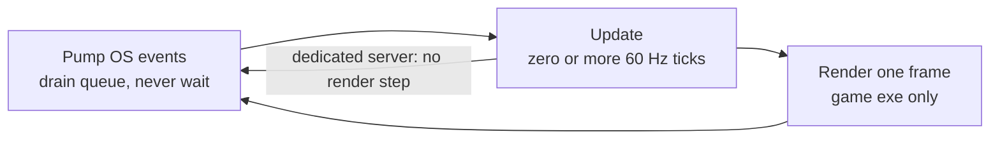

# The Game Loop

## What it is

The game loop is the engine's heartbeat: one `while` loop that repeats three steps until the player quits — **pump OS events**, **update the simulation**, **render a frame**. Everything else in this engine — the EnTT systems, Jolt physics, the Luau mod callbacks — is code one of those three steps calls.

Two words this handbook never uses interchangeably: a **tick** is one fixed 60 Hz simulation step, integer-addressable — tick 4517 names the same instant on every machine in a co-op session ([ADR-0002](../../engine/architecture/adr-0002-fixed-60hz-tick.md)). A **frame** is one render pass, produced at whatever rate the GPU allows. Update advances ticks; render produces frames; the two rates are deliberately decoupled — [Fixed timestep](./fixed-timestep.md) derives how.

The loop lives in two executables built from one source ([master plan](../../design/master-plan.md)): the game exe runs all three steps; the dedicated server runs the same loop **headless** — pump (network packets instead of keyboard), update, and no render step at all. That is why sim code must never assume a window exists.

## Why you care

Most software you have written is event-driven: a web server or GUI app sleeps until input arrives, handles it, sleeps again. A colony sim cannot sleep. Haulers keep carrying crates to stockpiles, a raid keeps marching on your walls, and your co-op partner keeps issuing orders whether or not **you** touch the keyboard. Game Programming Patterns states the job precisely: decouple "the progression of game time from user input and processor speed."

That is also why **no step may block**:

| Step | Rule | If it blocks |
|---|---|---|
| Pump | Drain the OS event queue, return immediately | Window freezes; OS marks the game "not responding" |
| Update | Finish the tick inside its slice of the 16.6 ms budget | On a listen server, every connected friend's world stalls too |
| Render | Draw the latest sim state, return | Ticks pile up; input feels laggy |

!!! warning
    Blocking is contagious in a server-authoritative game: a synchronous autosave inside update stalls the authoritative sim your co-op partners are playing on. Slow work (saves, mod loading, asset IO) runs off-thread or split across ticks, never inline.

## Quick start

The entire engine, reduced to its skeleton — this compiles and runs as pasted:

```cpp
#include <cstdint>
#include <cstdio>

struct World {
    std::uint64_t tick = 0;  // integer-addressable sim time
    int crates_hauled = 0;
};

bool pump_events(World&) { return true; }     // false = user quit
void update(World& w) {                       // one tick
    ++w.tick;
    if (w.tick % 60 == 0) ++w.crates_hauled;  // a hauler finishes a job each sim-second
}
void render(const World& w) {                 // one frame
    std::printf("tick %llu: %d crates in the stockpile\n",
                static_cast<unsigned long long>(w.tick), w.crates_hauled);
}

int main() {
    World world;
    bool running = true;
    while (running && world.tick < 180) {  // demo: 3 sim-seconds, then exit
        running = pump_events(world);      // 1. never waits
        update(world);                     // 2. advance the sim
        render(world);                     // 3. draw what update produced
    }
}
```

!!! tip
    This skeleton runs one tick per frame, so haulers on a 144 Hz monitor would work 2.4x faster. The accumulator that fixes this — and the dt clamp that survives a debugger pause — is the whole subject of [Fixed timestep](./fixed-timestep.md).

## How it works



**Pump** empties the OS event queue every pass — SDL requires this on the main thread; stop pumping and the OS marks the game unresponsive — beach-ball on macOS, "Not Responding" on Windows. Raw events are not acted on here; an action-mapping layer turns them into tick-stamped [InputCommands](./input-as-data.md) for the sim.

**Update** advances the world by whole ticks. What runs inside a tick — the ordered schedule of systems over EnTT views — is [ECS pattern](./ecs-pattern.md)'s subject. It is one schedule of plain functions, not the virtual `update()` per object that Game Programming Patterns' Update Method chapter describes and this engine's [hardening principles](../../design/hardening-principles.md) ban in hot loops.

**Render** draws the latest sim state through the SDL3 GPU API and returns. On the dedicated server this step does not exist — the headless Linux CI job proves the server links without the gpu module.

## Pros / Cons

**Pros**

- Game time is decoupled from input and CPU speed — a loaded machine slows frames, not the colony.
- One loop owns time, so ticks are countable — the foundation for determinism, replays, and server authority.
- Headless server is a subtraction (skip render), not a rewrite.

**Cons**

- The loop consumes CPU continuously; a game is never a polite background app.
- All logic becomes per-tick slices: "walk to the stockpile" turns into resumable state carried between ticks, not straight-line code.
- One thread owns the loop, so long work must be split or moved off it.

## What to expect

The loop is the engine's performance contract: the master plan's frame ledger splits the 16.6 ms budget across the steps, and any >20 ms frame in normal play is a filed defect. Update is the busiest step, but not every entity works every tick — NPC thinking staggers round-robin at 5–10 Hz inside the 60 Hz tick, so 200 colonists never all plan at once.

!!! info
    60 ticks per second does not mean 60 frames per second: a 144 Hz monitor gets 144 interpolated frames per 60 ticks; a struggling laptop gets 40 while the sim still advances exactly 60. Save files, replays, and the network protocol all speak in ticks, never frames.

## Go deeper

- [Fixed timestep](./fixed-timestep.md) — accumulator, dt clamping, render interpolation.
- [Input as data](./input-as-data.md) — how pumped SDL events become tick-stamped InputCommands.
- [ECS pattern](./ecs-pattern.md) — what the update step actually runs.
- [Command funnel](./command-funnel.md) — the single gate through which commands mutate the sim.
- [RAII](../cpp/raii.md) — how the loop's window and GPU device clean themselves up.

**Sources**

- Game Programming Patterns — Game Loop — https://gameprogrammingpatterns.com/game-loop.html — accessed 2026-07-06
- Game Programming Patterns — Update Method — https://gameprogrammingpatterns.com/update-method.html — accessed 2026-07-06
