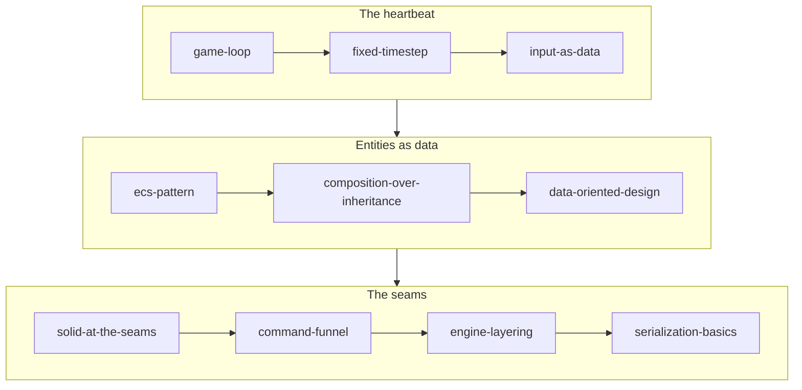

# Engine Architecture

## What it is

This track is the shape of the engine before any subsystem detail: the fixed 60 Hz loop everything hangs off, entities as plain data in EnTT, and the seams — one command funnel, one-way module layering, one serialize function — that make a moddable, server-authoritative co-op colony sim possible. Rendering, physics, and networking get their own tracks; this one is the skeleton they bolt onto.

## Why you care

You finished [C++ for Game Devs](../cpp/index.md) and can read the code. What you cannot yet see is why it is arranged this way: why `engine/sim` never includes GPU headers, why a Luau mod can only **ask** for a mutation, why `class Enemy : public Character` never appears. These choices are load-bearing — the headless dedicated server, replay, determinism CI, and mod safety all fall out of the ten pages below.

!!! info
    Engine-specific claims trace to the [master plan](../../design/master-plan.md), the [hardening principles](../../design/hardening-principles.md), and the numbered [ADRs](../../engine/architecture/index.md); each page cites the ADR where a decision is recorded.

## How it works

Read in order: three pages on the heartbeat, three on entities as data, four on the seams that keep everything modular.

| Page | What you'll learn |
|---|---|
| [The Game Loop](game-loop.md) | Pump, update, render — the tick/frame vocabulary, and how the dedicated server runs the same loop headless. |
| [Fixed Timestep at 60 Hz](fixed-timestep.md) | The accumulator pattern: fixed 60 Hz slices, the ~250 ms dt clamp, and interpolated rendering between sim states. |
| [Input as Data](input-as-data.md) | SDL3 events become tick-stamped `InputCommand` values, so bots, the console, and Luau mods drive the sim like a keyboard. |
| [The ECS Pattern](ecs-pattern.md) | Entity = ID, component = plain data, system = a function over an EnTT view, run from one explicit ordered schedule. |
| [Composition over Inheritance](composition-over-inheritance.md) | Why the GameObject class tree collapses, and how component sets plus JSON `extends` plus Luau behavior replace it. |
| [Data-Oriented Design](data-oriented-design.md) | Cache lines, AoS vs SoA, existence-based processing — and the 10–25x cost of per-entity virtual dispatch in the tick. |
| [SOLID at the Seams](solid-at-the-seams.md) | SOLID as module-boundary discipline: where virtual calls are free, where they are banned, and the 12-rule charter. |
| [The Command Funnel](command-funnel.md) | Every sim mutation enters as one validated, PlayerId-tagged command — trust boundary, replication unit, replay format. |
| [Engine Layering](engine-layering.md) | One-way module dependencies, enforced by CMake and CI, that make the headless server and deterministic tests possible. |
| [Serialization Basics](serialization-basics.md) | One `Serialize` template serves read and write; the same bitstream powers wire traffic, saves, and determinism hashes. |

## What to expect

About an evening per page. By the end you can trace a keypress from SDL3 to a tick-stamped command, through the funnel, into a system over an EnTT view — and say which module each step belongs in. Nothing here needs the rendering or physics tracks first.

## Go deeper

Start with [The Game Loop](game-loop.md). All ten pages are linked in the table above; the [ADR index](../../engine/architecture/index.md) holds the decision records they cite.

Sources:

- Game Programming Patterns — Robert Nystrom — https://gameprogrammingpatterns.com/ — accessed 2026-07-06
- Fix Your Timestep! — Glenn Fiedler, Gaffer On Games — https://gafferongames.com/post/fix_your_timestep/ — accessed 2026-07-06
- Data-Oriented Design — Richard Fabian — https://www.dataorienteddesign.com/dodbook/ — accessed 2026-07-06
- Video: "Data-Oriented Design and C++" (CppCon 2014, Mike Acton) — 1h 27m — watch after [Data-Oriented Design](data-oriented-design.md) if the many-case mindset has not clicked yet.
