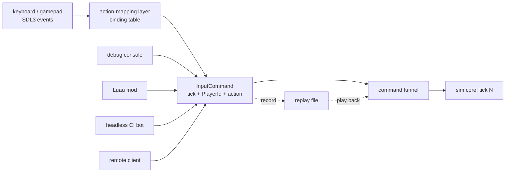

# Input as Data

## What it is

A keypress is a hardware fact. "Place a stockpile here" is a game intent. This page is about the layer that keeps them apart: raw SDL3 events (`SDL_EVENT_KEY_DOWN`, `SDL_EVENT_GAMEPAD_BUTTON_DOWN`) enter an **action-mapping layer** that translates them into **InputCommand** values — plain, copyable structs stamped with the tick they apply to and the opaque PlayerId that issued them. The sim core consumes only those values; no system ever polls a device.

This is the classic Command pattern — "a reified method call": instead of *calling* `place_stockpile()` when W is pressed, you *create a piece of data that says so*, and the data can be stored, copied, queued, sent over the network, and replayed. It is a locked decision in [ADR-0002](../../engine/architecture/adr-0002-fixed-60hz-tick.md): input is data, never direct polling inside sim code.

## Why you care

One layer of indirection buys four things at once:

| Payoff | How input-as-data delivers it |
| --- | --- |
| **Rebindable controls** | The binding table is data. Remapping keys is editing a table (eventually JSON on the authoring surface), not recompiling. |
| **Replay** | Record the InputCommand stream, feed it back in: same inputs, same ticks, identical per-tick state hashes. This is the determinism harness from the [master plan](../../design/master-plan.md). |
| **Network replication** | Tick-stamped commands are the replication unit. A remote player's keypress arrives as the same struct your keyboard produces. |
| **Every actor speaks one language** | Bots in the headless CI smoke test, the debug console, and Luau mods all issue the exact same commands a keyboard does. |

Concretely: bumping a hauler's job priority from the keyboard, from the console during a raid, or from a Luau mod's auto-triage script produces byte-identical `InputCommand` values. The sim cannot tell them apart — which is precisely why replay and server authority work.

## Quick start

The whole mechanism is two value types and a lookup:

```cpp
#include <cassert>
#include <cstdint>
#include <optional>
#include <unordered_map>
#include <vector>

// Opaque identity (GUID now, SteamID64 later) — sim never inspects it.
struct PlayerId { std::uint64_t value{}; };

enum class Action : std::uint8_t { MoveNorth, PlaceStockpile, HaulPriorityUp };

// The InputCommand: plain, copyable, tick-stamped data. All the sim sees.
struct InputCommand {
    std::uint64_t tick{};
    PlayerId      player{};
    Action        action{};
};

using Scancode = std::uint32_t; // device-space: whatever the platform reports

// The action map is data: rebinding W edits this table, not the code.
struct ActionMap {
    std::unordered_map<Scancode, Action> bindings;

    std::optional<InputCommand> translate(Scancode key, std::uint64_t tick,
                                          PlayerId who) const {
        auto it = bindings.find(key);
        if (it == bindings.end()) return std::nullopt; // unbound: no command
        return InputCommand{tick, who, it->second};
    }
};

int main() {
    ActionMap map{{{26u, Action::MoveNorth}, {19u, Action::PlaceStockpile}}};
    PlayerId local{42};

    std::vector<InputCommand> queue;
    if (auto cmd = map.translate(19u, 3600, local)) queue.push_back(*cmd);
    if (auto cmd = map.translate(999u, 3600, local)) queue.push_back(*cmd);

    assert(queue.size() == 1); // unbound key produced nothing
    assert(queue[0].action == Action::PlaceStockpile);
    assert(queue[0].tick == 3600);
}
```

Note the types: `InputCommand` is a [value type](../cpp/value-semantics.md) — no pointers, no virtual `execute()` method. Behavior lives in the sim's systems; the command only carries intent.

## How it works

Each frame, the [game loop](./game-loop.md) pumps the SDL3 event queue (that pumping is its job, not this page's). Each event is looked up in the binding table; hits become `InputCommand` values stamped with the **next tick to be simulated** — commands address the integer timeline from [fixed timestep](./fixed-timestep.md), never wall-clock time. The queue then drains into the [command funnel](./command-funnel.md) alongside commands from every other source; the funnel may re-stamp late-arriving commands for a future tick.



The seam between device-space (scancodes, axis values) and action-space (`HaulPriorityUp`) is what SDL code looks like on the device side:

```cpp
// fragment — does not compile alone
void pump_input(const ActionMap& map, std::uint64_t next_tick,
                PlayerId local, std::vector<InputCommand>& out) {
    SDL_Event ev;
    while (SDL_PollEvent(&ev)) {
        if (ev.type == SDL_EVENT_KEY_DOWN && !ev.key.repeat) {
            if (auto cmd = map.translate(ev.key.scancode, next_tick, local))
                out.push_back(*cmd);
        }
        // SDL_EVENT_GAMEPAD_BUTTON_DOWN needs a {device, code} key or its
        // own table: scancodes and gamepad button values share small ints
        // (SDL_SCANCODE_W == 26 collides with gamepad button 26).
    }
    // out drains into the command funnel — never straight into sim state
}
```

!!! info
    A held key is **state**, not an event. For continuous intents (walking a colonist north), the action layer samples held state once per tick and emits one move command per tick. Frames are variable-rate; commands must be per-tick, or fast machines would walk faster.

!!! warning
    The footgun this design exists to prevent: a system calling `SDL_GetKeyboardState` mid-tick. It works on your machine — and silently breaks replay, headless servers, and bot tests, because the device read never appears in the command stream. Devices live outside the sim core, full stop.

## Pros / Cons

| Pros | Cons |
| --- | --- |
| Replay, replication, and rebinding fall out of one mechanism | One more hop between keypress and effect — indirection to learn |
| Bots, console, mods, and net clients are first-class input sources | Continuous input (mouse aim, axes) needs deliberate per-tick sampling |
| Input is loggable and diffable — "what did the player press?" is a file | Command types become a protocol: adding one touches mapping, funnel, replay |

## What to expect

This page stops where the command leaves the mapper. What happens next — validation, trust boundaries, rejecting a modded client's forged `PlayerId` — belongs to the [command funnel](./command-funnel.md). How commands become bytes for the wire and for save files is [serialization basics](./serialization-basics.md). And the entities those commands ultimately steer — haulers, stockpiles, raiders thinking at 5–10 Hz — are the subject of the next page, the [ECS pattern](./ecs-pattern.md).

!!! tip
    When you add a debug console (early!), route it through `translate`-style command creation from day one. You get a free test harness: every gameplay feature becomes scriptable the moment it exists.

## Go deeper

- [Game loop](./game-loop.md) — where the event pump actually runs
- [Fixed timestep](./fixed-timestep.md) — the integer timeline commands are stamped against
- [Command funnel](./command-funnel.md) — validation and trust, the other half of this story
- [Serialization basics](./serialization-basics.md) — commands as bytes
- [Value semantics](../cpp/value-semantics.md) — why `InputCommand` is a plain copyable struct
- [ADR-0002: fixed 60 Hz tick](../../engine/architecture/adr-0002-fixed-60hz-tick.md), [ADR-0004: one command funnel](../../engine/architecture/adr-0004-one-command-funnel.md) and [hardening principles](../../design/hardening-principles.md) — the engine-wide rules this page instantiates

**Sources**

- Game Programming Patterns — Command — <https://gameprogrammingpatterns.com/command.html> — accessed 2026-07-06
- SDL3 wiki — CategoryEvents — <https://wiki.libsdl.org/SDL3/CategoryEvents> — accessed 2026-07-06
