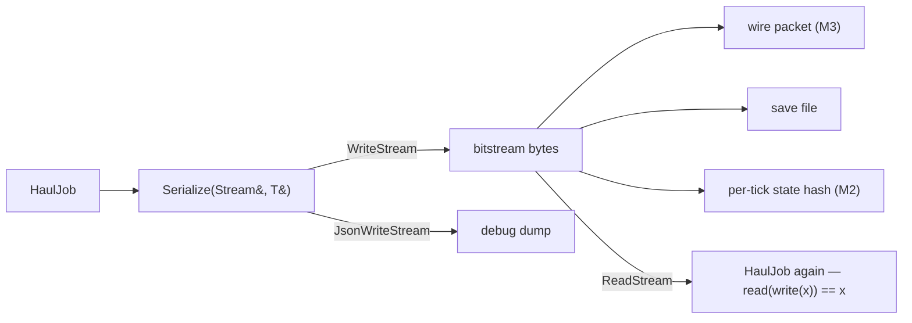

# Serialization Basics

## What it is

Serialization turns in-memory structs — components, commands, world snapshots — into bytes, and bytes back into structs. This engine has exactly one way to do it for machine data: a single `Serialize(Stream&, T&)` template per type that performs **both** read and write, chosen by the stream you pass in ([ADR-0013](../../engine/architecture/adr-0013-json-authored-bitstream-wire.md)). Hand-authored content (scenes, recipes, mod manifests) stays JSON, with a `version` field in scene files from file #1. The bitstream is for everything machines exchange: wire traffic, saves, and determinism state hashes.

## Why you care

C# or Java would reflect over your fields at runtime. C++ has no runtime reflection, so engines write the field-to-bytes mapping by hand — and hand-written **separate** Read and Write functions drift: someone adds a field to Write, forgets Read, and a stockpile deserializes as garbage three weeks later on someone else's machine. One shared function makes that bug structurally impossible.

It also pays three times from one code path:

| Consumer | Milestone | What it does |
|---|---|---|
| Determinism harness | M2 | Hashes sim state per tick via the serializer; same inputs must give identical hashes |
| Wire traffic | M3 | Every command up and every snapshot down is this bitstream |
| Saves | M2+ | Saving is serializing the world; loading reuses the exact read path the network uses |

And it is personal: the bitstream serializer is the **M0 TDD kata** — the C++ graduation exam in [master-plan.md](../../design/master-plan.md). The property under test is `read(write(x)) == x`.

## Quick start

One function serializes a hauling job in both directions:

```cpp
#include <cassert>
#include <cstdint>
#include <vector>

struct WriteStream {
    static constexpr bool IsWriting = true;
    std::vector<std::uint8_t> bytes;

    bool SerializeU32(std::uint32_t& value, std::uint32_t max) {
        if (value > max) return false;                // catch our own bugs early
        for (int shift = 0; shift < 32; shift += 8)
            bytes.push_back(static_cast<std::uint8_t>(value >> shift));
        return true;
    }
};

struct ReadStream {
    static constexpr bool IsWriting = false;
    const std::vector<std::uint8_t>& bytes;
    std::size_t cursor = 0;

    bool SerializeU32(std::uint32_t& value, std::uint32_t max) {
        if (cursor + 4 > bytes.size()) return false;  // truncated packet: abort
        value = 0;
        for (int shift = 0; shift < 32; shift += 8)
            value |= std::uint32_t{bytes[cursor++]} << shift;
        return value <= max;                          // hostile value: abort
    }
};

struct HaulJob {
    std::uint32_t haulerId = 0;
    std::uint32_t stockpileId = 0;
    std::uint32_t amount = 0;
};

// The only serialization code HaulJob will ever have.
template <typename Stream>
bool Serialize(Stream& s, HaulJob& job) {
    if (!s.SerializeU32(job.haulerId, 100000)) return false;
    if (!s.SerializeU32(job.stockpileId, 100000)) return false;
    if (!s.SerializeU32(job.amount, 999)) return false;
    return true;
}

int main() {
    HaulJob before{42, 7, 250};
    WriteStream w;
    // assert bodies vanish under -DNDEBUG, so never put the call inside one
    bool wrote = Serialize(w, before);
    assert(wrote); (void)wrote;

    ReadStream r{w.bytes};
    HaulJob after;
    bool read = Serialize(r, after);
    assert(read); (void)read;
    assert(after.haulerId == before.haulerId);
    assert(after.stockpileId == before.stockpileId);
    assert(after.amount == before.amount);            // read(write(x)) == x
}
```

!!! info
    The real engine stream is a **bitpacker**: it writes bits, not bytes, so a bool costs 1 bit and `amount` with max 999 costs 10 bits. This example uses whole bytes so the mechanism stays visible.

## How it works

The compiler instantiates `Serialize` twice — once with `WriteStream`, once with `ReadStream` — from one source of truth. Where a field needs direction-specific logic, you branch on `if constexpr (Stream::IsWriting)` and the dead branch is deleted at compile time.

Every call site states the field's legal range. On write that assert-checks your sim; on read it validates input **automatically** — the server is a trust boundary, and a hostile packet claiming a raid of four billion enemies gets its read aborted instead of allocating four billion entities. The bounds live in one place, so read and write can never disagree about them.



`Serialize(Stream&)` is one of the engine's three sanctioned seams (see [solid-at-the-seams](./solid-at-the-seams.md)); like ITransport, every implementation passes one shared test suite, per [hardening-principles.md](../../design/hardening-principles.md).

!!! warning
    Never `memcpy` a struct onto the wire, however tempting. Endianness, compiler-inserted padding, and pointer-holding fields all differ across machines — and raw bytes from the network arrive with zero validation.

!!! tip
    `JsonWriteStream` implements the same stream interface, so any serializable type dumps to readable JSON for free. When a save looks corrupt, dump it before reaching for a hex editor.

## Pros / Cons

| Pros | Cons |
|---|---|
| Read/write drift is impossible — one definition per type | Template errors are ugly when a type lacks `Serialize` (see [compilation-model](../cpp/compilation-model.md)) |
| Reads validate bounds automatically at the trust boundary | You must state a max per field; a wrong bound rejects legal values |
| Bit packing keeps snapshots small at 60 Hz | Binary output is opaque without the `JsonWriteStream` escape hatch |
| Wire, saves, and state hash share tested code | Format evolution is manual — hence the `version` field from file #1 |

## What to expect

The M0 kata is test-first: write the round-trip property test, watch it fail, build the bitpacker, then fuzz it with malformed bytes under ASan and UBSan ([debugging-with-sanitizers](../cpp/debugging-with-sanitizers.md)). It will feel slow — that is the point of a graduation exam. Expect the fuzz loop to find at least one out-of-bounds read you were sure could not happen. **Which** state gets replicated, and when, is not this page's concern — that is command scheduling, owned by the funnel.

## Go deeper

- [command-funnel](./command-funnel.md) — what gets replicated and when; commands as tick-stamped data
- [composition-over-inheritance](./composition-over-inheritance.md) — JSON `extends` inheritance for authored content
- [fixed-timestep](./fixed-timestep.md) — why per-tick state hashing is even possible
- [value-semantics](../cpp/value-semantics.md) — commands and components as plain copyable, serializable values
- [ADR-0013](../../engine/architecture/adr-0013-json-authored-bitstream-wire.md) — the canonical decision, including why protobuf was rejected

Sources:

- Gaffer On Games — Serialization Strategies — https://gafferongames.com/post/serialization_strategies/ — accessed 2026-07-06
- Gaffer On Games — Reading and Writing Packets — https://gafferongames.com/post/reading_and_writing_packets/ — accessed 2026-07-06
