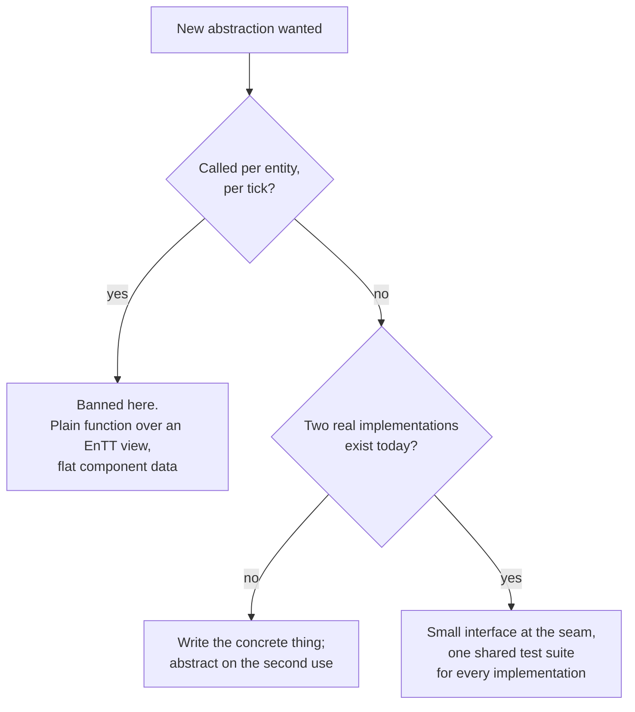

# SOLID at the Seams

## What it is

SOLID survives in this engine as **module-boundary discipline**, not class-design dogma. Interface-shaped code — abstract base classes, virtual dispatch — is allowed only at **seams**: `ITransport`, the [command funnel](./command-funnel.md), and `Serialize(Stream&)`. In the sim core an entity is an ID, a component is plain data, and a system is a plain function over [EnTT views](./ecs-pattern.md). [ADR-0019](../../engine/architecture/adr-0019-solid-seams-dod-core.md) locks the position; [hardening principles](../../design/hardening-principles.md) is the canonical long form.

!!! info
    The whole engine has about three seams, each with multiple real implementations. An interface with one implementation is ceremony, not architecture.

## Why you care

Mainstream OOP advice says: reach for an interface whenever two things might vary. Casey Muratori measured that habit in a hot loop — shape-area code ran up to **20–25x faster** once virtual dispatch per object became a table over flat data. Your hottest loop is the 60 Hz tick: 150 haulers stepping toward stockpiles, guards meeting a raid, NPC brains thinking staggered at 5–10 Hz. A virtual `Update()` per entity per tick is that benchmark, live.

The same measurement absolves the seams. The Martin–Muratori discussion converges on one sentence: **dispatch cost matters where call count is high and per-call work is small; it is noise at boundaries crossed a few dozen times per tick.** `ITransport::Send` does real work per call, dozens of times per tick — its virtual call is unmeasurable. That sentence is this entire page.

!!! warning
    Published advice will contradict this handbook. When a book says "prefer polymorphism to switch statements", remember one side was measured. In this repo, the charter below wins.

## Quick start

Each SOLID letter maps onto a structure the engine already has:

| Principle | Class dogma (reject) | This engine (keep) |
|---|---|---|
| **SRP** | Tiny one-job classes | One subsystem, one reason to change; the funnel is SRP for **state** |
| **OCP** | Virtual hook methods | New raider = JSON `extends` + Luau, zero recompile |
| **LSP** | Every override | Loopback, GNS, Steam must behave identically — one shared test suite proves it |
| **ISP** | Fat `IEngine` interfaces | Transport is six functions; serialization is one signature |
| **DIP** | Wrap everything | Jolt types never leave `engine/physics`; vocabulary libs (GLM, EnTT, spdlog) used bare |

## How it works

Tempted to write an interface? Run this:



Both outcomes:

```cpp
#include <cstddef>
#include <cstdint>
#include <vector>

// Seam: crossed a few dozen times per tick. Virtual dispatch is noise here.
struct ITransport {
    virtual ~ITransport() = default;
    virtual bool Send(const std::uint8_t* data, std::size_t len) = 0;
};

struct LoopbackTransport final : ITransport {
    std::vector<std::uint8_t> inbox;
    bool Send(const std::uint8_t* data, std::size_t len) override {
        inbox.insert(inbox.end(), data, data + len);
        return true;
    }
};

// Core: plain data, plain function, runs per hauler per tick. Zero dispatch.
struct Carry { std::uint32_t item_id; int steps_remaining; };

void TickHaulers(std::vector<Carry>& hauls) {
    for (auto& h : hauls) {
        if (h.steps_remaining > 0) { --h.steps_remaining; }  // toward the stockpile
    }
}

int main() {
    LoopbackTransport net;
    const std::uint8_t snapshot[] = {42};
    std::vector<Carry> hauls{{7, 3}};
    TickHaulers(hauls);
    return net.Send(snapshot, sizeof snapshot) && hauls[0].steps_remaining == 2 ? 0 : 1;
}
```

And the banned pattern:

```cpp
// fragment — does not compile alone
// BANNED (rule 4): virtual dispatch per entity per tick — the 20-25x benchmark, live.
for (auto entity : registry.view<Actor>()) {
    registry.get<Actor>(entity).Update(dt);   // never appears in this codebase
}

// ALLOWED (rule 11): a system is a plain function in the explicit ordered schedule.
void HaulSystem(entt::registry& r) {
    for (auto [entity, carry] : r.view<Carry>().each()) {
        step_toward_stockpile(carry);
    }
}
```

### The 12-rule charter

The daily short form — the hardening doc gives each rule its why:

| # | Rule |
|---|---|
| 1 | An entity is an ID; capabilities are components, never subclasses |
| 2 | Variation lives in JSON + Luau, not new C++ types |
| 3 | All sim mutation goes through the command funnel |
| 4 | Hot loops are dispatch-free: no virtuals, allocation, strings, or exceptions per entity per tick |
| 5 | No interface without two real implementations, today |
| 6 | Quarantine replaceable libs (Jolt, GNS, miniaudio); use vocabulary libs bare |
| 7 | Every resource is [RAII](../cpp/raii.md) |
| 8 | Prefer values; `unique_ptr` for [ownership](../cpp/ownership-smart-pointers.md); `shared_ptr` needs a justifying comment |
| 9 | Module dependencies point one way — sim never includes gpu or platform |
| 10 | Seam implementations pass one shared test suite |
| 11 | Systems are plain functions in one explicit ordered schedule |
| 12 | Write the concrete thing first; abstract on the second use |

!!! tip
    Rules 5 and 12 are one reflex: a second **real** implementation earns an interface; a hunch ("we might swap Jolt") earns nothing. Rule 6 gives swap-safety without the wrapper tax.

## Pros / Cons

| | SOLID at the seams | SOLID as class dogma |
|---|---|---|
| Tick cost | Zero dispatch in per-entity code | Measured 10–25x in the hottest loop |
| Abstraction count | ~3 seams, each with real substitutes | Interface + factory per concept |
| Debuggability | Tick order greppable in one schedule | DI containers, self-registering magic |
| Moddability | OCP via data + scripts, no recompile | OCP via recompiled subclasses |

Honest cost: a concrete class sometimes earns a seam later, forcing a refactor — cheaper than a wrong abstraction — and several rules are judgment calls no tool checks.

## What to expect

- **Withdrawal symptoms.** Coming from Java or C#, three interfaces total feels naked. That is the design working.
- **Self-review carries the load.** The PR checklist asks: new interface — where is the second implementation? Virtual or allocation in a tick loop?
- **Siblings own the mechanics.** Cache behavior behind rule 4: [data-oriented design](./data-oriented-design.md); the case for rule 1: [composition over inheritance](./composition-over-inheritance.md); enforcing rule 9: [engine layering](./engine-layering.md).

## Go deeper

- [Command funnel](./command-funnel.md) — the SRP-for-state seam.
- [Serialization basics](./serialization-basics.md) — the `Serialize(Stream&)` seam.
- [Value semantics](../cpp/value-semantics.md) — why "prefer values".
- [Hardening principles](../../design/hardening-principles.md) — the canonical synthesis.
- [ADR-0019](../../engine/architecture/adr-0019-solid-seams-dod-core.md) — the locked decision.

**Sources**

- Casey Muratori — "Clean" Code, Horrible Performance — https://www.computerenhance.com/p/clean-code-horrible-performance — accessed 2026-07-06
- Martin–Muratori clean-code discussion — https://github.com/unclebob/cmuratori-discussion/blob/main/cleancodeqa.md — accessed 2026-07-06

**Video**: "Clean" Code, Horrible Performance (Molly Rocket) — https://www.youtube.com/watch?v=tD5NrevFtbU — 23 min — watch after this page; the measurements behind rule 4 indict dispatch in tight loops, not naming or small functions.
